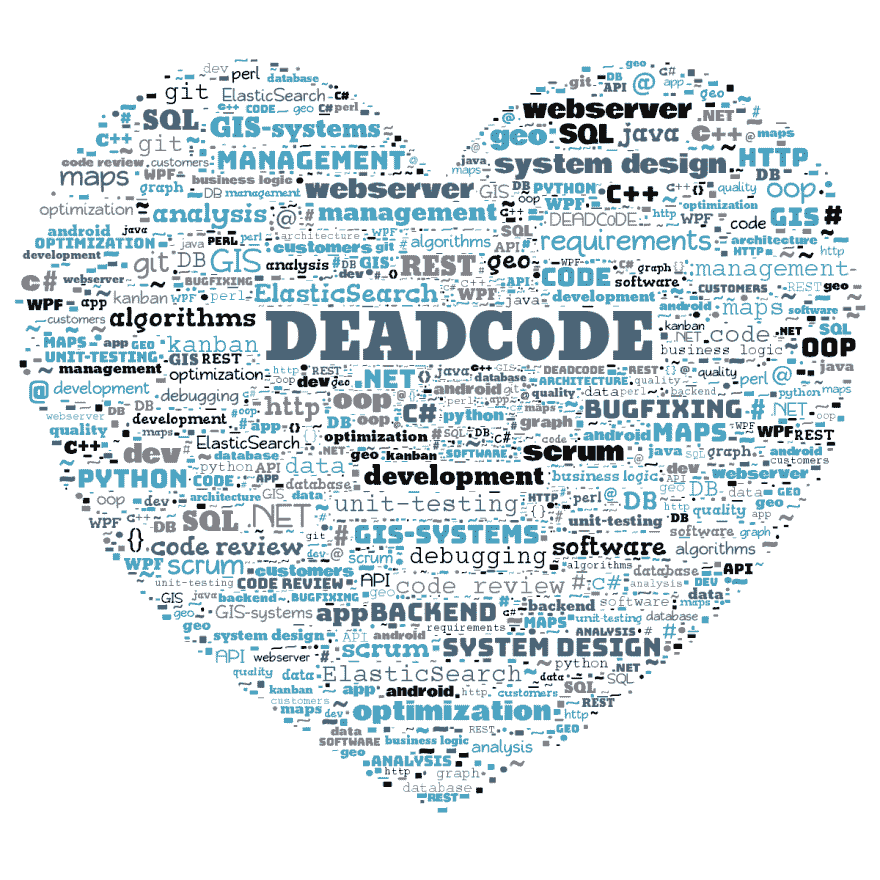

# 完美主义者的优先顺序，或者:我如何学会停止担忧，爱上不完美

> 原文：<https://dev.to/ice_lenor/prioritization-for-perfectionists-or-how-i-learned-to-stop-worrying-and-love-the-non-perfection-661>

你是一个完美主义者吗？那种永远不会说“我做完了”、“准备好了”或“我们出货吧”的人？那个除非打磨完美否则不能发布新功能的人？

我也是。我似乎停不下来。当我处理个人项目时，积压的工作似乎每分钟都在增加。

```
"Refactor this!"

"Improve that!"

"Make that button align with other buttons on another screen!"

"Improve drawing speed by refactoring X!"

"Write more comments to that algorithm!"

"Write tests for Y and Z cases!"

"Optimize this algorithm!"
```

甚至:

```
"Redraw this icon", "change the color of this button", and "move this one pixel to the left".
```

我甚至不能在我的博客上发表一篇文章而不重读许多遍并重写几篇。

我甚至不能在不删除和转发的情况下发微博。

猜猜我改变了下面的标题多少次，只是把其中的单词来回交换？:)

## 冰与火

是的，这个标题。

### 很冷

我的职业生涯始于一家非常重视代码质量的公司。这非常符合我完美主义的天性。我可以在把一个四小时的任务交给代码审查之前，再花几个小时完成它。我总是想给一个复杂的业务逻辑模块增加几个测试。

公司没有足够的开发人员，也没有足够的资金来雇佣更多的人，但是我们的用户要求很高，有很多复杂的业务需求，他们的工作非常依赖于我们的产品及其质量。所以代码质量非常重要。正因为如此，bug 被及时彻底地修复了，随着系统的增长，开发人员没有花费太多时间来添加新的特性。

这很有效:通过在开始时投入更多的时间，通过放慢速度，我们可以在以后节省更多的时间。有多少次，我看着一张新票，心想:很好，我们已经在一个月前重构了那个地方！现在实现这项新任务要容易得多。

一段时间过去了，我发现自己在一家完全相反的公司。

### Hot lava

在这家公司，交货速度被看得比什么都重要。发布完全混乱的代码是可以的，但是你应该按时完成。而且不允许任何人重构。没时间了。船的特点，船快！

这种方法有其优点。如果你不准时，你就失败了，不管你的代码有多好。也不要在意你的代码有多糟糕，如果它是准时的并且(至少部分地)工作的话。业务是最重要的，时间就是金钱，产品是重要的，代码是次要的，可以随意使用。

也没有人太在意虫子。嗯，有时候会失败，有时候会显示无效数据，但是没有时间去修复小东西。也没有测试。新功能更重要。

但有多少次，我看着一项已完成的任务，心想:如果我像以前那样全面地完成它，我只需要花一半的时间。有时感觉像是在偷懒，我必须承认，但它比以前的公司快得多，也更有商业效益。

这种方法对我来说是非常新的，我花了一些时间来消化它，但我终于找到了中间地带。

### 我的中间立场

在第二家公司刚开始不久的冬天，我也开始了一个宠物项目——[一个叫字云](http://smartpuffin.com/wordcloud)的安卓小 app，做出来的字云好看又有色彩。

[T2】](https://res.cloudinary.com/practicaldev/image/fetch/s--8_MzKMwr--/c_limit%2Cf_auto%2Cfl_progressive%2Cq_auto%2Cw_880/http://smartpuffin.com/wp-content/uploads/2017/10/words-0036.png)

我可以明显地比较我的方法是多么的不同，当我刚刚开始的时候。我花时间重构代码只是因为我不喜欢它。我花时间为完美的按钮尺寸和最好的图标烦恼。我想应用所有最好的编码实践。

这项积极的工作花了一个月，也许两个月，在晚上和周末相当轻松的编码。到了初春，我手中已经有了一个完成的项目，随时可以使用。

尽管如此，我还是花了半年时间才把它寄出去。

在那半年里，我没有积极地添加新功能。

我脑子里有个内部阻塞，就是发不出来。我非常担心用户会发现我的按钮和图标并不完美。我对代码中的循环依赖感到不舒服。令我尴尬的是，我的代码中有一个相当大的类，我应该把它分成更小的部分。我为另一个单身阶级感到羞耻。我讨厌我比绝对必要的更频繁地阅读设置文件。我感到沮丧的是，我只做了一点小小的改动就复制并粘贴了那段五行代码。我有一个班级，名字起得很糟糕。

你能想象吗？在我修复了该死的单例、该死的循环依赖和可恶的命名之前，我不能发布成品。

所以有半年的时间我基本上是在拖延。我重构了一些小东西，添加了注释，重新命名了一些东西，但是没有做任何大的改变或者添加新的特性。在发布应用程序之前，我纯粹是在改进我的代码。

然后，在去年十月的一个美好的夜晚，我振作起来，按下了按钮。(又拉又推。真是一语双关！这个应用是实时的。没有什么不好的事情发生。用户下载了这个应用程序，他们说了很多关于它的好话，他们要求更多的功能，总体来说进展顺利。

这让我大吃一惊。用户没有注意到我的 singleton 和我的大量命名不当的类！他们真的不在乎我有一个 if T1 而不是 T2 开关 T3。他们没有注意到文件中缺少注释。*用户不关心我的代码。*

第二个版本花费的时间要少得多。第三个，更少。我故意决定不重构一些困扰我的东西。当我过于关注琐碎的修补和改进时，我会严格限制自己。我学会了什么时候对自己说:“别说了，已经做好了，我们出货吧”和“已经好了，不用太担心”。

这就像教我自己走路，但我却在教自己停下来。第一步(在我的例子中是停止)很难，第二步比较容易，以此类推。

从那以后，我的发布基本上不依赖于我的完美主义，而是依赖于特性的准备程度。我说的“准备好”并不是指“完美”，我的意思是“足够好，也许比平均水平更好，但不完美，如果需要太多时间的话”。

我仍然可以深入研究重构，但是现在必须以即将出现的特性或者我试图修复的 bug 为理由。不再“只是因为不喜欢”。不再有预防性重构。

## 代码质量怎么样？

我的代码并没有因此变得更差。

在重视代码质量的公司工作多年，教会了我如何从一开始就编写可读的代码，如何按照明确定义的职责将代码分成块，以及在哪里放置注释以使其更加清晰。

但在重视速度和产品的公司工作多年，让我学会了重视产品。

我学会了做出正确的取舍。

我的代码并不完美。但是已经好到可以成为一个产品了。

## 而不是士气

你的用户不知道你所有的挣扎。产品不会停止吸引他们，因为在你的代码中有一个接受 11 个参数的方法。是的，把它们做成一个可配置的对象是很好的，但是你现在没有时间，这不应该阻止你发货。

用户不会嘲笑你，因为你有可怕的单例助手，却没有勇气制造一个对象，并把它传递到你需要它的任何地方。是的，总有一天你会做到的，但是你不应该等到你最终成功的时候。

你不应该等到你最终修复了世界上的一切，你的代码像钻石一样闪闪发光。你应该出货。用户关心的是产品，而不是小瑕疵。