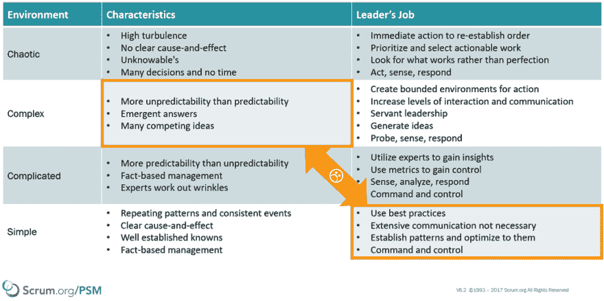

# 专业 Scrum 适用于组织中的每个人

> 原文：<https://dev.to/nkdagility/professional-scrum-is-for-everyone-in-your-organisation-3m5c>

最近，我在丹佛和一个新客户一起工作，帮助他们在软件开发中走向更大程度的 Scrum。Scrum 适用于组织中的每个人，这是一种新的想法，但它反映了现代人对工作方式的理解，以及对泰勒主义、命令和控制的拒绝。你不能使用别人的方法来获得敏捷，但是你可以从中学习。

Healthgrades 已经做了大约 8 年的 Scrum，但是已经意识到他们正在努力组织工作软件的交付。像所有其他公司一样，一旦你有像软件这样复杂的东西要做，并且需要知识工人去做，[20 世纪的旧管理方式](https://dev.to/nkdagility/professional-organisational-change-at-the-ghana-police-service-3i3i)就像在火上浇油…

[T2】](https://res.cloudinary.com/practicaldev/image/fetch/s--87MC5ny3--/c_limit%2Cf_auto%2Cfl_progressive%2Cq_auto%2Cw_880/https://nkdagility.com/wp-content/uploads/2018/01/image.png)

这是我在[专业 Scrum Master (PSM)](https://nkdagility.com/training/courses/professional-scrum-foundations/) 课程中训练 Scrum Masters 回答的一个常见问题，但是对为什么这是错误的基本理解需要基于实际经验的实践和理论知识。这就是为什么专业的 Scrum 基础(PSF)课程[要求学生以团队的方式工作来构建工作软件](https://dev.to/nkdagility/professional-scrum-training-for-the-ghana-police-service-431c)。

实施敏捷的真正斗争在于旧的方式、泰勒主义、命令和控制的幻觉以及对魔法的信仰。

## 职业 Scrum 是为你组织中的每个人准备的

有了之前和 Scrum.org、 [PSF](https://nkdagility.com/training/courses/professional-scrum-foundations/) 级以及我的合作经验；首席信息官 CJ·辛格要求我在我们可以利用的时间内尽可能多地培训人员。结果是看起来有 147 个人来自工程部门，我们玩得很开心。虽然他们一直在朝着更大程度的价值交付前进，但是在过去的 8 年里，对 Scrum 有很多误解……这些误解创造了一个玻璃天花板，阻碍了价值向业务的流动。

这是我第二次与 CJ 合作，他再次擅长帮助他的团队理解，是制造商把事情做好。他们是[提供企业所需价值的独创性](https://dev.to/nkdagility/if-your-backlog-is-not-refined-then-you-are-doing-it-wrong-3cic)，他们是需要培养的人。没有创客的创意，就没有公司，也就没有创意；没有积压。

我以前在犹他州的穷乡僻壤和 CJ 一起工作，在那里我培训了公司的每个人。我仍然收到来自穷乡僻壤的人们的电子邮件，甚至在 5 年后，许多人认为经历过 [PSF](https://nkdagility.com/training/courses/professional-scrum-foundations/) 职业对他们来说是“游戏改变者”。

PSF 课程的目的不仅仅是让 Scrum 上的每个人都达到一个水平，而是让他们真正理解需要什么才能从中获得巨大的价值。如果像在 Backcountry(犹他州)、Healthgrades(科罗拉多州)、Fraedom(英国)、Teleplan(挪威)和 HESA 一样，我可以让组织中的每个人都参与进来，那么有趣的事情就会发生。有足够的催化剂，一个引爆点，开始滚动变化的雪球。

## 谈话和讨论才是重点

在为期两天的课程中发生的对话通常不会发生，所有的[专业 Scrum](https://nkdagility.com/training/scrum-training/) 课程都旨在让人们谈论他们的问题，以及哪些实验可能有助于找到正确的方法。

在穷乡僻壤，从首席技术官到仓库里开叉车的人，我都有。没错，每个人…包括首席执行官的助理…因为你组织中的每个人都有好的想法，许多人是直接的利益相关者。让他们觉得他们有权提出建议和想法是敏捷的一部分。让首席执行官听到所有的问题和讨论，围绕为什么事情没有像他们应该的那样顺利进行，以及需要改变什么来实现这一点，这是非常宝贵的。让涉众理解构建软件需要什么，让他们看到他们需要参与到过程中。让开发人员再次听到制造压力的商业现实改变了对话。除非每个人都在船上并朝着同一个方向前进，否则你怎么可能希望改变你的组织？

正如所有培训所有人的课程一样，通常会有许多反对者。人们不想在那里，因为他们认为他们知道一切，或者他们只是不认为这是有价值的。David 属于“我们已经在做 Scrum 了，为什么要这么麻烦”这一类，但是仅仅上了 4 个小时的课，他就意识到他对核心 Scrum 的理解已经偏离了多少。对 Scrum 如何实现经验主义的基本理解不仅是我们需要知道的，而且每隔一段时间重置一下也很好，这样我们就能记住原因。

## 为变化创造一个有界限的环境

我在世界各地工作过的许多团队忘记了，或者根本不知道，为什么我们要使用 Scrum。他们忘记了我们需要工作软件的增量所提供的过去的透明性。他们忘记了，没有产品待办事项列表，我们就不知道下一步要做什么，没有 Sprint 待办事项列表，我们就不知道现在在做什么。他们忘记了，没有这种透明度，就不可能对每一个事件中发生的事情进行有意义的检查，也不可能对事情发生的方式进行有意义的改变。

在我为之工作的所有公司中，许多参加专业 Scrum 基础课程的人，不管他们现有的知识水平如何，都会对 Scrum、其人工制品、其事件和其卷有新的认识。即使像凯瑟琳这样有经验的 Scrum 大师也有东西要学，并在重置中找到价值。人们很容易对“这里的做事方式”即组织功能失调感到自满。我与 Katherine 密切合作，以确保我们举办的 6 个班级中的每一个都顺利进行，并促进了正确的讨论。

就像 Scrum 创造了一个有边界的环境，这样我们就可以在工作中朝着同一个方向前进，所以专业的 Scrum 类创造了一个有指导的环境来进行讨论和揭示。

## 反复定制训练不内容

PSF 课程的每一个实例都让我学到了关于组织、员工以及如何运作的新东西，这帮助我引导班级更好地理解 Scrum。我使用的材料和世界上所有其他 Scrum.org 认证培训师的一样，而且我量身定制了路线。我知道了哪些事情我们可以跳过，哪些事情我们需要一头扎进去。一些经历是创伤性的，讨论也很激烈，到最后，在那些参加课程的人中，没有一个贬低敏捷或 Scrum 的人。

Healthgrades 现在有 147 名先锋、传道者和变革推动者，他们现在觉得自己有能力做出有意义的改变。

专业 Scrum 基金会的成果之一，伴随着新的知识和兴奋，是组织变革的积压。一个由那些正在工作并且理解工作的限制和挑战的人创建的。希望管理层然后使用[基于证据管理的敏捷性指南](https://www.scrum.org/resources/agility-guide-evidence-based-change)来促进组织中的变化，以消除那些不受团队控制的讨厌的价值交付障碍。

为了促进有意义的改变，Healthgrades 现在有很多事情需要改变。

有了这两样东西，敏捷的火炬手们感到被赋予了力量，还有一系列的改变，我希望 Healthgrades 可以改变他们的组织，提高他们利用市场机会的能力，并轻松战胜他们的竞争对手。细化待办事项促进有意义的变更。

职业 Scrum 这个帖子是为你组织中的每个人准备的最早出现在[马丁·辛舍尔伍德-裸体敏捷有限公司](https://nkdagility.com)上。