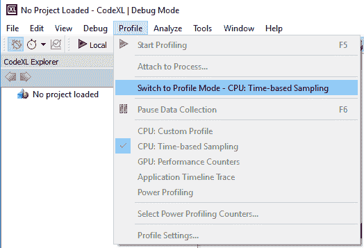
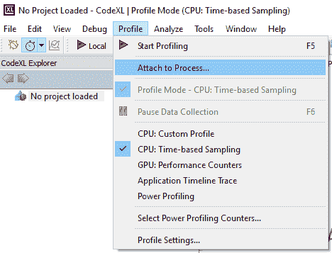
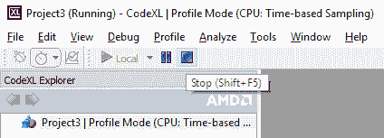
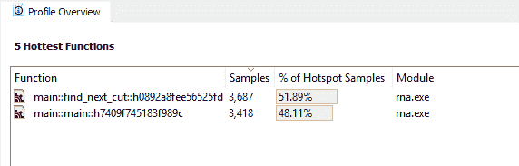
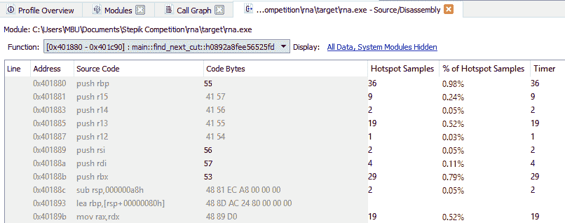
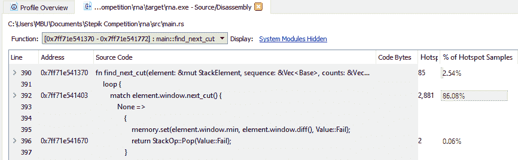
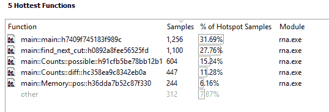

# 使用 CodeXL 分析 Windows 上的 Rust 代码

> 原文：<https://dev.to/martinmodrak/profiling-rust-code-on-windows-using-codexl>

我喜欢[锈语](https://www.rust-lang.org)。然而，在 Windows 上用 Rust 开发目前有很多粗糙的边缘。我正在努力解决的一个问题是如何在 Windows 上分析 Rust 代码。
最后，我发现最适合这项工作的工具是 CodeXL(以前叫做 AMD CodeXL)。这里有一个如何做的一步一步的教程。
该教程是在装有 Rust 1.14.0 的 Windows 10 上测试的。

# 关于调试和目标的说明

为了能够调试代码，我使用了`x86_64-pc-windows-gnu`目标(与 Windows 默认的`x86_64-pc-windows-msvc`相对)。
然而，MSVC 目标的侧写体验更好。因此，最好的方法可能是使用 rustup 根据您当前的需求在目标之间切换:

```
> rustup default stable-x86_64-pc-windows-msvc
> rustup default stable-x86_64-pc-windows-gnu 
```

Enter fullscreen mode Exit fullscreen mode

在 Windows 上调试的一个旁注。如果你想在 Windows 上设置 Rust 调试环境，我推荐
的 [Sherry Ummen 的教程](https://sherryummen.in/2016/09/02/debugging-rust-on-windows-using-visual-studio-code/)设置 Rust + Visual Studio 代码(需要 GNU 目标)。
我听说过一些关于 Sublime 和 Atom 支持 Rust 的好消息，但我还没有亲自测试过。
~~AFAIK[Visual Studio 2015 扩展](https://marketplace.visualstudio.com/items?itemName=vosen.VisualRust)中的调试支持相当有限，也需要 GNU 目标。~~

**更新:**理论上，你应该能够使用 Visual Studio 的标准调试器和分析器(带有 C++工具集)来分析用 MSVC 目标编译的代码。我尝试将 Visual Studio 调试器附加到一个正在运行的 Rust 进程(用调试信息编译)，它工作得很好！然而，我无法让剖析器与完全相同的程序一起工作。想通了再写教程。

# 剖析

我们需要做的第一件事是编译程序优化(否则剖析没有意义)，但有调试信息:

`

> rna.exe 乡村音乐..\ src \ main . RS
> ` 0

如果您通过 Cargo 编译，您应该能够通过修改`Cargo.toml`文件的`[profile.release]`部分来设置必要的选项。详见[文件](http://doc.crates.io/manifest.html)。

现在打开 [CodeXL](https://github.com/GPUOpen-Tools/CodeXL) 。我已经测试了 1.9 和 2.2 版本，但我相信其他版本也可以。

首先，您切换到个人资料模式(`Profile -> Switch to Profile Mode`):

[T2】](https://res.cloudinary.com/practicaldev/image/fetch/s--dbmf-XRH--/c_limit%2Cf_auto%2Cfl_progressive%2Cq_auto%2Cw_880/http://popelka.ms.mff.cuni.cz/%257Ecerny/rust-profile-img/switch_to_profile.png)

我的应用程序运行了很长时间，所以我选择了简单的方法，从命令行启动应用程序并使用`Profile -> Attach to process`。

[T2】](https://res.cloudinary.com/practicaldev/image/fetch/s--2E6R59Wx--/c_limit%2Cf_auto%2Cfl_progressive%2Cq_auto%2Cw_880/http://popelka.ms.mff.cuni.cz/%257Ecerny/rust-profile-img/attach_to_process.png)

让 CodeXL 为你启动应用程序应该是可能的，但我没有费心。

然后，单击 stop 按钮结束分析。

[T2】](https://res.cloudinary.com/practicaldev/image/fetch/s--Sh9pAOzz--/c_limit%2Cf_auto%2Cfl_progressive%2Cq_auto%2Cw_880/http://popelka.ms.mff.cuni.cz/%257Ecerny/rust-profile-img/stop_profiling.png)

你得到的输出是:

[T2】](https://res.cloudinary.com/practicaldev/image/fetch/s--YLwUYk0K--/c_limit%2Cf_auto%2Cfl_progressive%2Cq_auto%2Cw_880/http://popelka.ms.mff.cuni.cz/%257Ecerny/rust-profile-img/results-inlined.png)

正如您所注意到的，在分析输出中只有两个函数。这不是因为我的应用程序没有功能，而是因为 Rust 内嵌了所有其他功能。

这就是 GNU 目标咬你的时刻。如果您编译到 GNU target，双击一个函数会显示单个处理器指令花费的实际时间，但是我没有找到简单的方法将这些指令与 Rust 代码(和内联函数)匹配起来。

[T2】](https://res.cloudinary.com/practicaldev/image/fetch/s--lhYmsvjA--/c_limit%2Cf_auto%2Cfl_progressive%2Cq_auto%2Cw_880/http://popelka.ms.mff.cuni.cz/%257Ecerny/rust-profile-img/results-function-detail.png)

另一方面，如果您使用 MSVC 目标，您会看到实际的源代码！

[T2】](https://res.cloudinary.com/practicaldev/image/fetch/s--XQjc1iYi--/c_limit%2Cf_auto%2Cfl_progressive%2Cq_auto%2Cw_880/http://popelka.ms.mff.cuni.cz/%257Ecerny/rust-profile-img/results-function-detail-msvc.png)

然而，即使使用 MSVC，所有归属于内联函数的样本都与调用该函数的行相关联，所以您仍然可以看到很少的细节。
举个例子:是`next_cut()`函数真的消耗了这么多样本，还是`match`语句有责任？

所以我做了一点小技巧，这给了我更多的信息，但可能会增加计时的噪声。我强迫编译器不要内联任何东西:

`

> rustc -g -O -C 内联阈值= 0-O rna.exe..\ src \ main . RS
> ` 0

这给出了一个更有用的结果:

[T2】](https://res.cloudinary.com/practicaldev/image/fetch/s--wC_RGGrH--/c_limit%2Cf_auto%2Cfl_progressive%2Cq_auto%2Cw_880/http://popelka.ms.mff.cuni.cz/%257Ecerny/rust-profile-img/results-no-inline.png)

我现在可以很自信地说，大部分时间花在了`main`和`find_next_cut`的实际主体上，而不是内联函数上。

我还尝试了[非常困倦的分析器](https://github.com/VerySleepy/verysleepy)，它似乎有点工作，
，但是我不能让它显示任何调试信息(尤其是函数名)。

希望这对你有帮助！