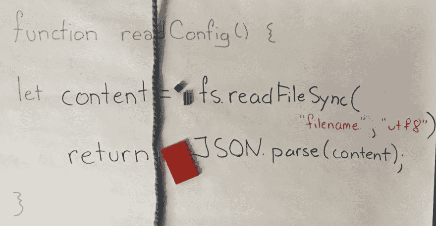
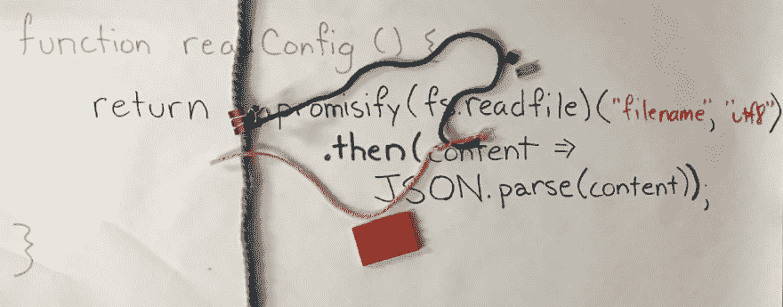
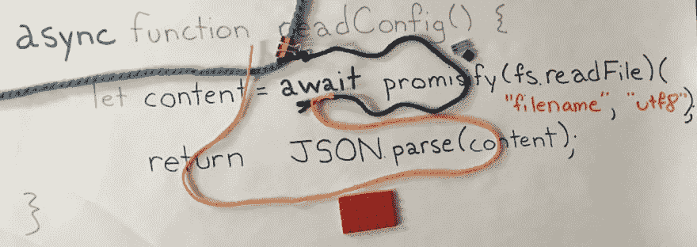

# JavaScript 中的承诺(用纱线和乐高积木)

> 原文：<https://dev.to/jessitron/promises-in-javascript-with-yarn-and-legos-3ob>

> **TL；DR** :创建一个承诺会分离出另一条执行路径，而承诺对象代表了这条路径的终点。打电话。然后将代码添加到该路径的末尾。

你可以把程序的执行想象成跟随一根纱线。这个视频说明了[一个同步程序](https://github.com/jessitron/promises-blog/blob/synchronous/bin/cleanup.ts)和[同一个程序使用承诺](https://github.com/jessitron/promises-blog/blob/with-promises/bin/cleanup.ts)的区别:

[https://www.youtube.com/embed/h2CsiEum0CU](https://www.youtube.com/embed/h2CsiEum0CU)

承诺让你清楚地知道在什么之后需要做什么，同时比“这些事情按照这个顺序一次发生一件”(简单同步程序的默认流程)给你更多的灵活性。

不利的一面是，当您想要指定“在承诺之后做这件事”时，您必须将代码打包并传递给。然后()。Promise 对象持有代表其执行路径的纱线末端；。然后()将更多的代码绑定到结尾，并返回新的结尾。

请参见 readConfig 函数，该函数读取文件并解析其内容。同步版本在程序通常的执行路径上执行:readFileSync 检索一些位，然后 JSON.parse 将它们转换成有用的对象。

<figure> 

<figcaption>同步:一根纱线顺码直下。</figcaption>

</figure>

在有承诺的版本中，readConfig 立即返回，但它返回的是一段字符串的结尾。它是一段包含 readFile 的字符串，readFile 获取一些位；被...系住。然后()是 JSON.parse，它将这些位转换成有用的对象。

<figure> 

<figcaption>承诺:返回一个字符串的结尾，一个橙色的块绑在一个深蓝色的块上</figcaption>

</figure>

这个有用的对象将在橙色字符串的末尾提供给后来绑定到它上面的任何代码。

承诺在这方面胜过回调:当你启动异步任务时，你不需要提供所有需要在它之后执行的代码。您可以在以后添加更多，只要您抓住字符串的末尾。

不要丢失线的末端！如果您不需要它来添加更多的代码，就用。catch()——否则错误可能会从迷途的一端出来，搞乱你的程序。(我可以再做一个关于这个的视频。)

承诺并不能打败回调，因为你仍然需要将后续代码封装到一个函数中。当你有了。then()在内调用。然后()调用。但是等等！不要气馁！

在 TypeScript 和 ES_2018 中？_，我们可以使用 async 和 await 以相同的简单格式编写异步代码。虽然[代码](https://github.com/jessitron/promises-blog/blob/with-promises-async/bin/cleanup.ts#L28)看起来和[的同步版本](https://github.com/jessitron/promises-blog/blob/synchronous/bin/cleanup.ts#L26)几乎一样，但是执行的路径更像[的承诺之一](https://github.com/jessitron/promises-blog/blob/with-promises/bin/cleanup.ts#L28)。

<figure> 

<figcaption>异步功能:和承诺的一样多的纱线，没有调用。然后()</figcaption>

</figure>

异步函数立即返回——不要被结尾的返回语句所迷惑。它会分出一条执行路径，这条路径会一直工作(这里是读取文件)，直到它命中 wait 关键字。剩下的代码(解析)变成了另一段字符串。等待将字符串连接在一起，就像。then()(除了漂亮得多)。异步函数的末尾是一个 return 语句，它提供了字符串末尾的值。Anasync 函数总是返回一个承诺。

承诺给了你更多的控制，所以也给了你更多的思考。这意味着它们总是比同步代码更复杂。有了 async 和 await，我们可以同时获得控制和清晰性:Avdi 称之为“直线代码，只要它被卡住，就会自动进入工作队列。”不要害怕承诺，一定要使用 TypeScript，一定要把握住你的底线。