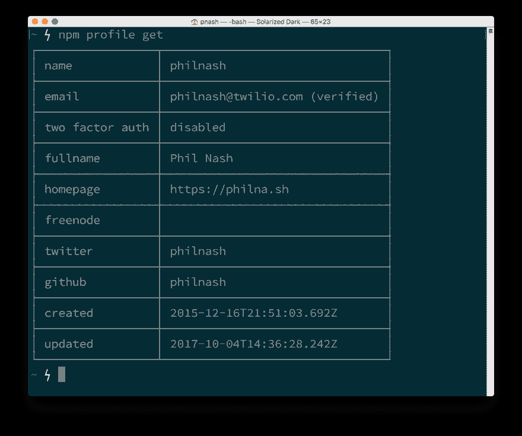
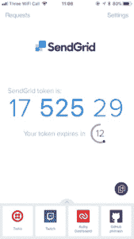
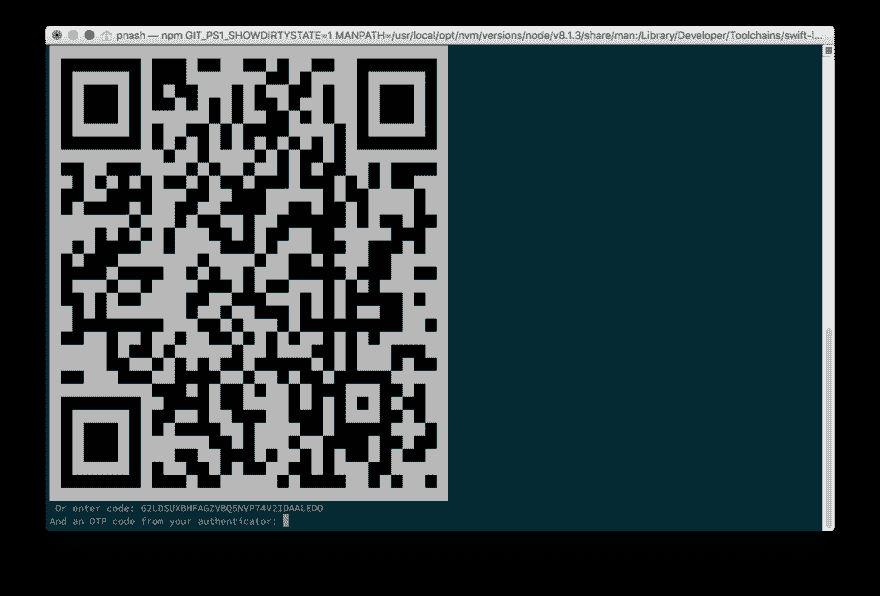
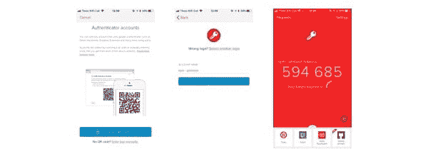
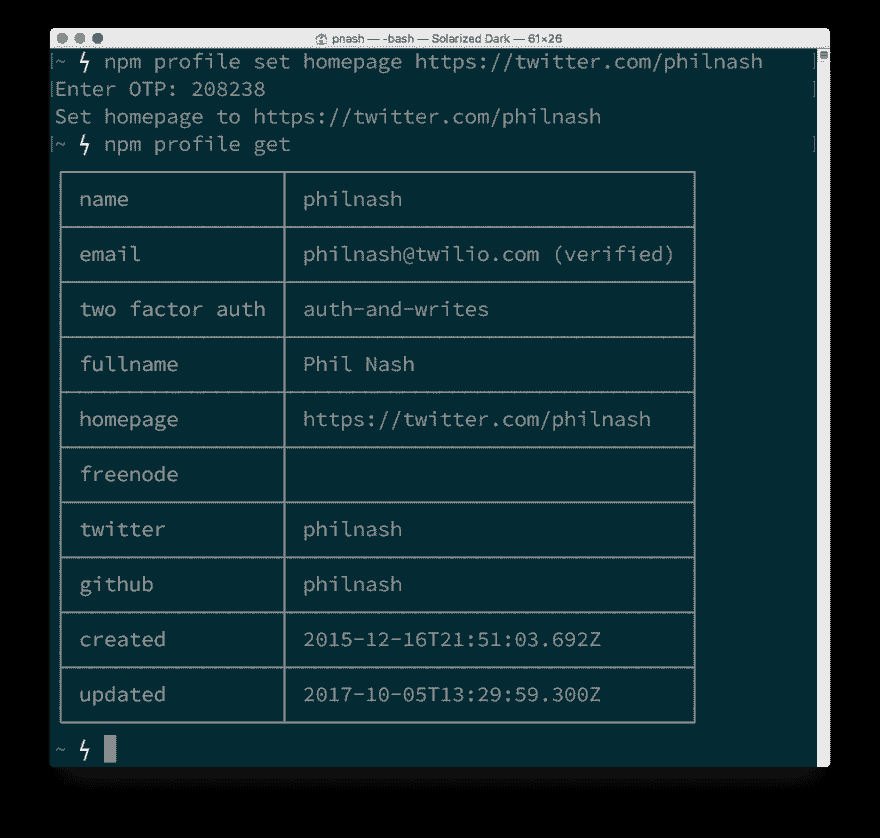

# 使用 2FA 和 Authy 保护您的 npm 帐户

> 原文：<https://dev.to/twilio/protect-your-npm-account-with-2fa-and-authy-62a>

> 从未发生过因泄露 npm 凭据而导致的重大安全事故，但我们的安全工作永无止境。

这不是 npm 最近宣布支持双因素认证时的头条，但这是一句让我印象深刻的话。看到 web 开发基础设施的这些关键部分认真对待安全性，真是太棒了。

但这只是战斗的一半，现在也是我们所有人保护我们在 2FA 的账户的时候了。一旦设置了 2FA，您将需要密码和设备来生成一次性代码，以便通过 npm 进行身份验证。这使得任何人都很难接管你的账户，更重要的是你的 npm 包。

事不宜迟，下面是如何用 2FA 和 [Authy](https://authy.com) 来保护你的 npm 账户。

## 获得最新消息

为了利用这种额外的安全性，您需要安装最新的 npm 版本 5.5.0。转到命令行并运行:

```
npm install -g npm@^5.5 
```

Enter fullscreen mode Exit fullscreen mode

确保您也登录到您的 npm 帐户。尝试运行新的`profile`命令来查看。

```
npm profile get 
```

Enter fullscreen mode Exit fullscreen mode

如果您已登录，将会看到您的个人资料信息。否则，你会得到一个错误，你应该运行:

```
npm login 
```

Enter fullscreen mode Exit fullscreen mode

并填写您的详细信息以验证您的客户。登录后，您可以使用`npm profile get`检查您的帐户。

[T2】](https://res.cloudinary.com/practicaldev/image/fetch/s--uZvmQKki--/c_limit%2Cf_auto%2Cfl_progressive%2Cq_auto%2Cw_880/https://twilioinc.wpengine.com/wp-content/uploads/2017/10/NHsIpbbZXqaRAkT4AzSLzG3rqc6XwpxY3JHwJWLg40dI_e40hztZ026cDZhnr3eYmwLvdb5ddu7li4Kug8SPkj9V5TsT5UT9gxdXWqLTiLmT30BdkO0E2IHO9Qgjrynh-wyEPrY.png)

如您所见，在此阶段，我没有启用双因素身份验证。让我们解决这个问题。

## Authy app

[T2】](https://res.cloudinary.com/practicaldev/image/fetch/s--xFvwdMSB--/c_limit%2Cf_auto%2Cfl_progressive%2Cq_auto%2Cw_880/https://twilioinc.wpengine.com/wp-content/uploads/2017/10/VSWQt3m_2wfZ0B8MtKtOT4I7iAAb0lDQ96zlml-gT3AeItbAPBaTeo4HbesFRmNlynk_aBG_ebtMCyAB_Lp0d3rw6_shvtLfyrzl8RTIkB0xAKqH-IjF4ZFy0ukglE0qAgJLw3I-169x300.png)

我将使用 [Authy app](https://authy.com/) 设置我的 2FA。它有一系列的功能，使它有别于其他认证应用，如多设备支持，移动和桌面应用，以及加密和备份你的 2FA 码的能力。如果你还没有 Authy 应用，你可以[在 Authy 网站](https://authy.com/download/)上找到所有的下载。

## 启用双因素认证

我们登录到我们的 npm 档案，我们已经准备好了验证应用程序。让我们启用 2FA。

回到命令行，您有两个选项来启用双因素身份验证。当在`auth-only`模式下启用时，您将始终需要第二个因素来验证 npm。如果您选择`auth-and-writes`，您在更新帐户或发布包时也将需要它。第二个选项是最安全的，也是默认的，所以我们将使用它。

```
npm profile enable-tfa 
```

Enter fullscreen mode Exit fullscreen mode

如果您只想启用 2FA 进行身份验证，只需运行:

```
npm profile enable-tfa auth-only 
```

Enter fullscreen mode Exit fullscreen mode

您将被要求输入您的 npm 帐户密码，当您正确输入时，您将获得一个 QR 码。

[T2】](https://res.cloudinary.com/practicaldev/image/fetch/s--4FKOTgAF--/c_limit%2Cf_auto%2Cfl_progressive%2Cq_auto%2Cw_880/https://twilioinc.wpengine.com/wp-content/uploads/2017/10/PX4xfDYk361F5C9hVXK51gR6fJPSFKzpXfDr79TwtUwpwh5IHo48grQudyQMZWTywiyFkellYMdp6L3Cj3FF6QFZeIBrwUaLEXCszLzlrExsoxi9UugYLhg6nqBweDARx8mQVJM.png)

是的，命令行上的一个二维码，现在我已经到处看到它们了！还有，不行，你不能用那个二维码进入我的账户，我已经把它撤销了。

使用您的 Authy 应用程序，添加新帐户并扫描条形码。

[T2】](https://res.cloudinary.com/practicaldev/image/fetch/s--Z7EFm37B--/c_limit%2Cf_auto%2Cfl_progressive%2Cq_auto%2Cw_880/https://twilioinc.wpengine.com/wp-content/uploads/2017/10/2xZApZV3nxXxlx4H-Lj_kZWZaYH6_Ba6FRPawFi1O8G-Ul9BvIUe_Pl5Wv82ORifHJsqhdbKpsTOYWivGuKBjVnFwQZ_1oUEF_iOKHz6fXalKtBp5YRM7aWJk6nEDUQhQ5V1Ags.png)

然后输入代码以确认您已正确设置了应用程序。如果成功，您将看到屏幕上打印了四个备份代码，您应该保存这些代码，以防您丢失身份验证设备。这些都很重要，但 Authy 没有那么重要，因为你可以设置应用程序来加密和备份你的代码，这样只要你登录到你的 Authy 帐户，你就可以随时找到它们。

## 您的 npm 帐户和包是安全的

如果您成功地完成了这些步骤，下次您尝试发布软件包或更新您的个人资料时，将会要求您输入您的 OTP 代码。再次打开 Authy 应用程序，找到应用程序并复制代码，您的操作将成功完成。

[T2】](https://res.cloudinary.com/practicaldev/image/fetch/s--Czv26ool--/c_limit%2Cf_auto%2Cfl_progressive%2Cq_auto%2Cw_880/https://twilioinc.wpengine.com/wp-content/uploads/2017/10/4H23JQJ1zJUpT9PwgXMIsLQYfvpFUXcSbC6wrCwYo-XWkqyLBjuz7f0dzI3JvGhRoHohDaUEU5sPlV75nBhyqTMIQ_B9K_fPdv7GSkPg2bwABkZVmiExtKEpSxCscymGXsgCGVY.png)

这是我更新我的配置文件，并显示双因素身份验证启用了身份验证和写入。

## 保护您的个人资料和包的安全

我要感谢 npm，是他们让所有他们照看的包裹变得安全。如果您刚刚为您的个人资料设置了双因素身份验证，那么我也要感谢您让 Node.js 生态系统变得更加安全。

如果您希望为自己的应用程序实现双因素身份验证，那么请查看一下 [Twilio 2FA API](https://www.twilio.com/docs/api/authy#authy-api) 。您可以创建一个普通的 2FA 流，既有基于 SMS 和令牌的代码，也有像 [OneTouch](https://www.twilio.com/docs/api/authy/authy-onetouch-api) 这样的高级功能，可以将 2FA 从复制代码变成简单的[批准或拒绝交互](https://www.twilio.com/two-factor-authentication/features/onetouch)。

如果你很高兴看到 npm 采用 2FA [的话，在 Twitter 上和他们击掌吧](https://twitter.com/npmjs)！

[T2】](https://res.cloudinary.com/practicaldev/image/fetch/s--X_L8Wv6r--/c_limit%2Cf_auto%2Cfl_progressive%2Cq_auto%2Cw_880/https://twilioinc.wpengine.com/wp-content/uploads/2017/10/dklKUMbUhJVGXAp6HAPuEdw2ufHoY3rQLzyhEyV_i_nzSB8C6RKyLhtGPCggCMZKC5ZXFu1vIIHcRciHRWSZLhijmg8o7fMZsyBc0fYiqpL_lFymO9Qfj_WpDjjN4WKBMd41E-M.png)

* * *

*[用 2FA 和 Authy 保护你的 npm 账号](https://www.twilio.com/blog/2017/10/protect-your-npm-account-with-2fa-and-authy.html)原载于 [Twilio 博客](https://www.twilio.com/blog/)2017 年 10 月 5 日*