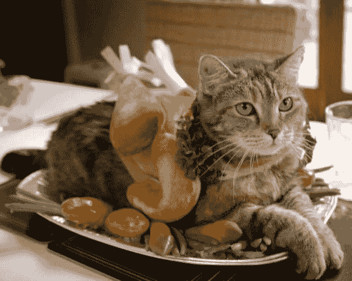
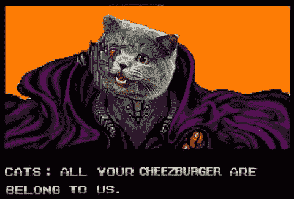
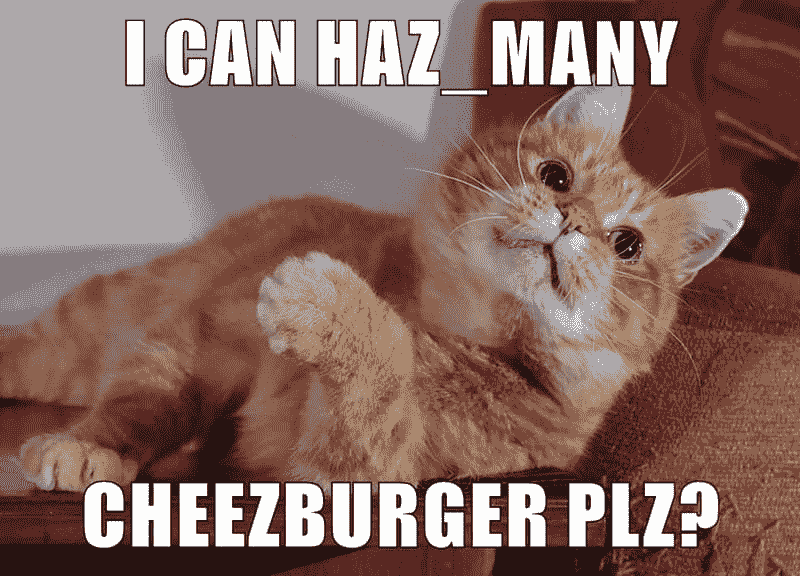

# 生成与 Rails 的关联

> 原文：<https://dev.to/yechielk/rails-generate-association>

前几天，我偶然发现了 Rails 中一个很酷的特性，这完全是偶然的。因为我没有看到太多的讨论，所以我想在这里分享一下。

为了那些不太熟悉这些概念的人，我将从解释什么是“Rails 中的关联”开始。你可能会觉得这部分很无聊；如果你已经熟悉了，可以直接跳到“抓住要点”一节。

## 属于并拥有许多

首先，我们需要理解 Rails 中的关联以及它们是如何工作的。

假设我开发了一个应用程序，跟踪我的猫喜欢什么零食。我的应用程序需要跟踪 2 个概念，猫和零食。

[T2】](https://res.cloudinary.com/practicaldev/image/fetch/s--bHBm6-PG--/c_limit%2Cf_auto%2Cfl_progressive%2Cq_auto%2Cw_880/https://cdn-images-1.medium.com/max/600/1%2A3b7SyMMYmjFfnYTuA7E-AQ.jpeg)

###### 或者是零食的猫…

所以我的应用程序有一个`Cat`模型和一个`Snack`模型，但只记录猫和零食对我来说不是很有用，我想知道哪只猫喜欢哪种零食。因此，除了记录我的猫和零食，我的应用程序还必须记录特定猫和特定零食之间的联系。

在 Rails 中，我们将这些连接称为“关联”，这些关联有两种类型:

一方面，每个零食都必须与一只猫相关联，我必须能够问零食“你属于哪只猫？而且零食还得能回答“我属于猫 X”。在 rails 中，这被称为“属于”关联，其中每个零食都是一只猫。

[T2】](https://res.cloudinary.com/practicaldev/image/fetch/s--h1JRPFsx--/c_limit%2Cf_auto%2Cfl_progressive%2Cq_auto%2Cw_880/https://cdn-images-1.medium.com/max/800/1%2ApI6MVPfZR5oFdYPoRBIfEA.jpeg)

然后我们有关联的另一面，每只猫拥有它所有的零食，所以如果你问一只猫“哪些零食是你的？它就能回答“零食 X，Y，Z 是我的”。这种联想叫做“has_many association ”,在这里每只猫都有`has_many`零食。
[](https://res.cloudinary.com/practicaldev/image/fetch/s--RYWshHWB--/c_limit%2Cf_auto%2Cfl_progressive%2Cq_auto%2Cw_880/https://cdn-images-1.medium.com/max/800/1%2ApD412d_4gLtOzVI60j6IkQ.jpeg)

总而言之，我们这里有一个双向关联，每只猫`has_many`吃零食，每只零食`belongs_to`吃一只猫。

## 外键

我的应用程序如何跟踪这些关联？简单。我的应用程序中的每只猫都有一个唯一的 ID，我现在要做的就是设置我的零食模型，使它们有一个名为`cat_id`的属性，所以当我问零食“你属于哪只猫？它所要做的就是查找它的`cat_id`，说“我属于 42 号猫”。同样，如果我问一只猫“你喜欢哪些零食？这只猫所要做的就是浏览零食列表，找到所有在`cat_id`栏中有其 ID 的零食。

## 显示代码

直到现在，我一直说得很高。让我们稍微深入一下代码的本质。

下面是我们的猫模型的样子:

```
class Cat < ApplicationRecord
  has_many :snacks
end 
```

Enter fullscreen mode Exit fullscreen mode

这就是我们的零食模型的样子:

```
class Snack < ApplicationRecord
  belongs_to :cat
end 
```

Enter fullscreen mode Exit fullscreen mode

现在，为了让这些零食和猫持久化，我们需要将它们添加到一个包含猫表和零食表的数据库中。

在 Rails 中，我们通过设置以下两个 ActiveRecord 迁移来实现这一点:

```
class CreateCats < ActiveRecord::Migration
  def change

    create_table :cats do |t|
      t.string :name
    end

  end
end 
```

Enter fullscreen mode Exit fullscreen mode

```
class CreateSnacks < ActiveRecord::Migration
  def change

    create_table :snacks do |t|
      t.string :name
      t.integer :cat_id
    end

  end
end 
```

Enter fullscreen mode Exit fullscreen mode

您会注意到，`cats`表和`snacks`表都有一个接受字符串的名称列，然后`snacks`表有另一个接受整数作为`Cat``Snack``belongs_to`ID 的列`cat_id`。

当然，多亏了 Rails Generators，我不必手动输入所有内容，我能够使用 Rails 的模型生成器来生成模型，并使用命令`rails generate model Cat name:string`和`rails generate model Snack name:string cat_id:integer`进行迁移。这生成了基本的模型和迁移，我需要填写的只是模型中的`has_many`和`belongs_to`关联。

## 言归正传

以上都是非常基本的 Rails，以下是我发现的特性:

前几天，我在[熨斗学校](https://flatironschool.com/)上一节课，课上讨论了一个基本的博客应用程序，用户可以在那里评论帖子。在这个应用中，每个评论都是一个用户和一篇文章。实验室有显示模型和迁移代码的片段，通常，我只是浏览它们，然后进入实际的课程，这一次一些东西引起了我的注意:

```
class CreateComments < ActiveRecord::Migration

   def change

      create_table :comments do |t|

         t.string :content

         t.belongs_to :user

         t.belongs_to :post

         t.timestamps null: false

      end

    end

end 
```

Enter fullscreen mode Exit fullscreen mode

等一下；我知道`string`是一个有效的属性数据类型，我也知道`timestamps`是一个有效的数据类型(当创建一个新的评论时，它会创建一个日期/时间戳，每次更新时，它会创建另一个日期/时间戳)，但是什么是`belongs_to`数据类型呢？难道我不需要放入一个`user_id`就可以制作一个表格列`t.belongs_to`吗？

我试了一下，我把我的零食数据库改成了下面的:

```
class CreateSnacks < ActiveRecord::Migration[5.0]
  def change

    create_table :snacks do |t|
      t.string :name
      t.belongs_to :cat
    end

  end
end 
```

Enter fullscreen mode Exit fullscreen mode

我跑了迁移，你瞧！我的零食知道它们属于哪只猫！显然，将一个`belongs_to`列作为一个参数放入您的迁移中会添加一个`<model_name>_id`列。

## 但是它会生成吗？

下一步是看看我是否能把它用于 Rails 的生成器。所以我运行了`rails generate model Snack name:string cat:belongs_to`,当我检查迁移结果时，我发现了:

```
class CreateSnacks < ActiveRecord::Migration[5.0]
  def change
    create_table :snacks do |t|
      t.string :name
      t.belongs_to :cat, foreign_key: true
      t.timestamps
    end
  end
end 
```

Enter fullscreen mode Exit fullscreen mode

那根柱子就在那里。

但这还不是全部。当我查看生成的实际模型时，我也发现了一个惊喜:

```
class Snack < ApplicationRecord
  belongs_to :cat
end 
```

Enter fullscreen mode Exit fullscreen mode

关联就在那里，不用我手动输入！当我在我的零食迁移中生成一个`belongs_to`属性时，Rails 发现我的零食属于一只猫，并为我将这个关联放在那里。

## 逆序？

自然地，我现在很好奇，想看看它是否能反过来工作，Rails 能产生一个`has_many`关联吗？

我跑了`rails generate model Cat name:string snacks:has_many`。运气不好。

迁移确实有一个 has_many 列:

```
class CreateCats < ActiveRecord::Migration[5.0]
  def change
    create_table :cats do |t|
      t.string :name
      t.has_many :snacks
      t.timestamps
    end
  end
end 
```

Enter fullscreen mode Exit fullscreen mode

但据我所知，这个专栏毫无意义。

模型看起来像:

```
class Cat < ApplicationRecord
end 
```

Enter fullscreen mode Exit fullscreen mode

也没有自动的关联。

发现了这一切，我非常激动。我开始四处搜索，肯定会发现有人在讨论它，但我没有找到太多关于它的信息，而且肯定没有任何关于可以使用标准 Rails 生成器生成关联的信息。我觉得这很奇怪，但我肯定我不是唯一感兴趣的人，所以我希望这篇文章能帮助其他人。

编码快乐！

* * *

这篇文章是从我的博客 [Rabbi On Rails](https://blog.yechiel.me/generating-belongs-to-associations-in-rails-be7b7fdea96c)
交叉发布的，你可以在那里阅读更多关于我的编码之旅，或者在 Twitter 上关注我 [@yechielk](https://twitter.com/yechielk)