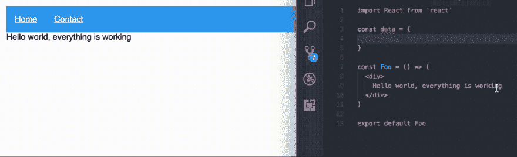

# 反应 16 和 16.2 概述-片段、入口和错误边界

> 原文：<https://dev.to/mildrenben/react-16-and-162-overview---fragments-portals-and-error-boundaries-49>

React 16(和 16.2)增加了一些很好的生活质量变化以及一些性能增益。

## 返回类型和片段

render 方法中有大量新的返回类型。

现在，您可以返回一个字符串或数字。

```
const Foo = () => 'string'

const Foo = () => 25 
```

因为 React 需要一个包装元素，所以通常会在一个`div`或`span`标签中包装一组项目。React 16 引入了返回项目数组的能力。

```
const Foo = () => ([
    <p key='a'>1</p>,
    <p key='b'>2</p>,
    <p key='c'>3</p>,
    <p key='d'>4</p>,
  "Some words"
]) 
```

但是这有点糟糕，因为你需要给每个条目添加一个键，用逗号分隔每个条目，文本必须用引号括起来。呸。

React 16.2 构建于`React.Fragment`之上，提供了一种非常好的方法来包装一组项目，而不需要额外的 DOM 节点。

```
import React, { Fragment } from 'react'

const Foo = () => (
    <Fragment>
        <p>1</p>
        <p>2</p>
        <p>3</p>
        <p>4</p>
    </Fragment>
) 
```

还有一种不需要导入的简写方式。

```
import React from 'react'

const Foo = () => (
    <>
        <p>1</p>
        <p>2</p>
        <p>3</p>
        <p>4</p>
    </>
) 
```

我承认这看起来有点古怪，但是我想一旦我们习惯了，我们就不知道没有它我们是怎么生活的了！Babel 将在 v7 中支持`<>`速记语法。参见这篇[博客文章](https://reactjs.org/blog/2017/11/28/react-v16.2.0-fragment-support.html)，获得各种工具的支持。你现在可以在 Babel 6.x 上使用导入的`Fragment`组件。

需要注意的一点是，当你映射数据等时，你仍然需要键入`Fragment` s。遗憾的是，简写`<>`不接受`key`属性。

```
import React, { Fragment } from 'react'

const Foo = () => (
    <Fragment>
        {[1, 2, 3].map(n => (
            <Fragment key={n}>
                <span>hello</span>
                <span>world {n}</span>
            </Fragment>
        ))}
    </Fragment>
) 
```

上面的代码将产生如下的 HTML 输出:

```
<span>hello</span>
<span>world 1</span>
<span>hello</span>
<span>world 2</span>
<span>hello</span>
<span>world 3</span> 
```

最终不再有包装器聚集我们的 dom

## 错误处理

在 React 16 之前，当一个组件出现问题时，整个应用程序可能会崩溃，并且只能在控制台中看到。这就是为什么像 [redbox-react](https://www.npmjs.com/package/redbox-react) 这样的软件包一个月下载量超过一百万次！

为了解决这个问题，我们现在使用新的`componentDidCatch`生命周期事件来定义错误边界。

您可以将可能中断的组件包装在错误边界中，然后将它们配置为在它们确实中断时显示回退 UI。

我修改了官方 React 博客提供的一个错误边界组件，它基本上可以在任何应用程序中工作。

```
import React from 'react'
import PropTypes from 'prop-types'

class ErrorBoundary extends React.Component {
    constructor(props) {
        super(props)
        this.state = { hasError: false }
    }

    componentDidCatch(error, info) {
        // Display fallback UI
        this.setState({ hasError: true })
        // You can also log the error to an error reporting service
        // Remove this if you have no error logging
        logErrorToMyService(error, info)
    }

    render() {
        const { children, errorMessage } = this.props
        if (this.state.hasError) {
            // You can render any custom fallback UI
            return <h1>{errorMessage}</h1>
        }
        return {children}
    }
}

ErrorBoundary.defaultProps = {
    errorMessage: 'Something went wrong.'
}

ErrorBoundary.propTypes = {
    children: PropTypes.oneOfType([
        PropTypes.arrayOf(PropTypes.node),
        PropTypes.node
    ]).isRequired,
    errorMessage: PropTypes.string
}

export default ErrorBoundary 
```

然后你只要把你认为会失败的东西包起来。

```
const foo = () => (
  <div>
    <ErrorBoundary errorMessage='This component is not working properly'>
      <UnstableComponent>
    </ErrorBoundary>
  </div>
) 
```

[T2】](https://res.cloudinary.com/practicaldev/image/fetch/s--a-ZRN2Y6--/c_limit%2Cf_auto%2Cfl_progressive%2Cq_66%2Cw_880/https://i.imgur.com/6YItkVZ.gif)

请记住，我们可以定制用户界面，它不仅仅是一条消息。所以你可以为组件准备一些非常酷的后备内容。

需要注意的事项:

*   `componentDidCatch`工作起来就像一个普通的旧`catch {}`积木
*   错误边界必须是类组件
*   错误边界只能捕捉来自其子代的错误，而不能捕捉来自自身的错误

## 门户网站

门户为我们提供了在父范围之外的其他 DOM 节点中呈现内容的能力。

这为模态、对话框、工具提示等打开了一些很酷的可能性。

我在 React 的许多项目中见过许多不同的模态系统，但我从来不觉得有人做对了，这可能是因为 React 没有工具来做好。现在有了门户，我们也许能够解决这个问题。不再需要通过 React 树传递函数或者使用上下文。

门户可以通过简单的`ReactDOM.createPortal(child, container)`功能使用。

```
import React, { Component } from 'react'
import ReactDOM from 'react-dom'

const Bar = () => (
    <p>Through the portal</p>
)

class ContactScreen extends Component {
    constructor(props) {
        super(props)
        this.nav = document.querySelector('nav')
    }
    render() {
        return ReactDOM.createPortal(
            Bar,
            this.nav
        )
    }
} 
```

`child`可以是任何有效的 React 组件，而`container`可以是任何 DOM 节点。

当在 js 系统中使用样式化的组件或任何其他 css 时，你的类名将会变成混乱的字符串。为这些组件添加一个 ID 可能是值得的，这样您就可以在需要时访问它们。

当然，这不仅仅是为现有的 DOM 节点保留的。您可以动态地创建一个并插入到 DOM 中。

## 自定义 DOM 属性

以前，您只能使用实际存在的 DOM 属性，以及带有前缀的属性`aria-`和`data-`。现在您可以使用任何自定义属性，它将被传递给真正的 DOM 元素。

```
<div foo='bar' /> 
```

## 服务器端渲染

服务器端渲染不是我个人以前用过的东西，所以我不会试图表现得好像我很了解它。我们确实在我之前工作的公司用过，但我没有参与这个过程。所以这里有一篇[非常好的文章，关于在 React 16](https://hackernoon.com/whats-new-with-server-side-rendering-in-react-16-9b0d78585d67) 中 SSR 发生了什么变化。(TLDR:它更具表演性)

## 多方面的

*   它变小了。React + React DOM 现在比以前小了 30%。
*   他们把许可证改成了麻省理工学院🎉

## 进一步阅读

*   [React 16 官方博客](https://reactjs.org/blog/2017/09/26/react-v16.0.html)
*   [React 16.2 官博](https://reactjs.org/blog/2017/11/28/react-v16.2.0-fragment-support.html)