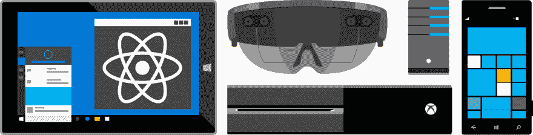
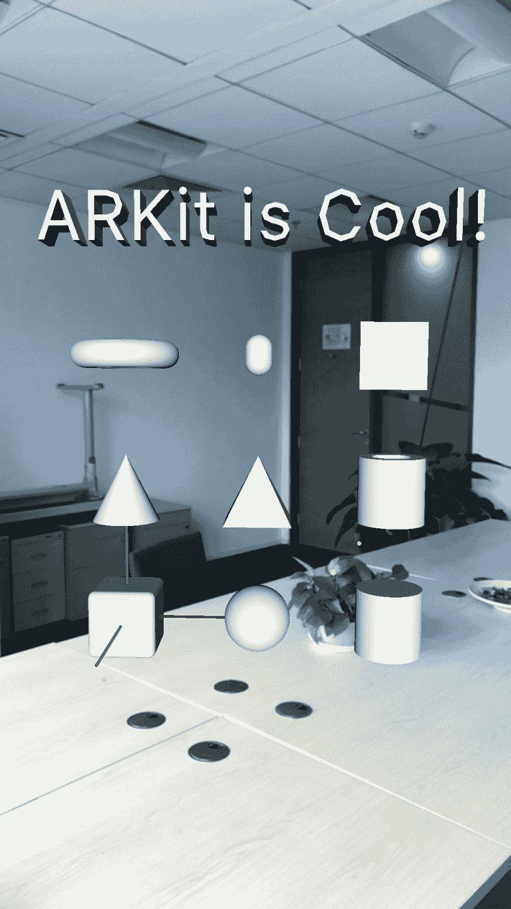
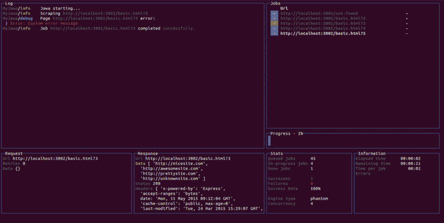
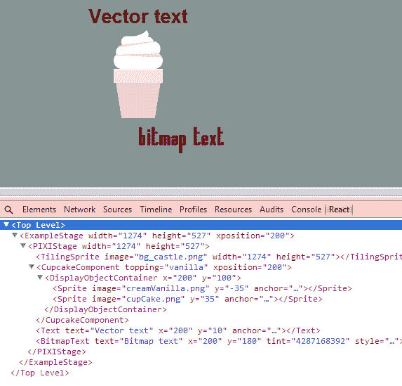
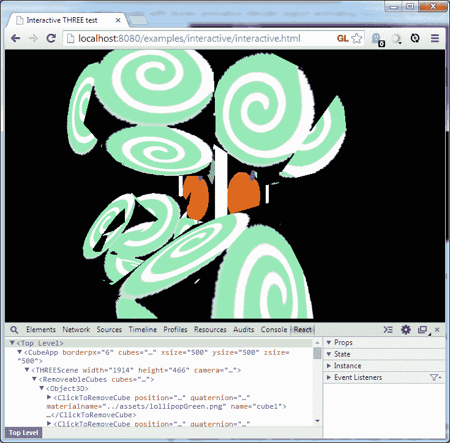

# React 能做到！

> 原文：<https://dev.to/kayis/react-can-do-it-31di>

*[Flickr 上 mrbille1 的封面图片](https://www.flickr.com/photos/mrbille1/)*

我经常读到人们关于 framework X 或 Y 是一个很好的反应替代方案的咆哮，因为，嗯，它更快、更小、更好、更酷或诸如此类的东西，经常错过更大的画面。

虽然我不得不承认，使用 React-Native 进行移动开发并不像进行普通的 React Web 开发那么简单，但它确实降低了门槛，因为您可以利用您的大部分 React 技能。

但是为 Android 和 iOS 开发 nativish 应用并不是 React 允许你做的唯一事情。

*感谢 HN 用户 [mlsarecmg](https://news.ycombinator.com/item?id=16198843) 指出这一点！*

## [Windows&Xbox One](https://github.com/Microsoft/react-native-windows)

[T2】](https://res.cloudinary.com/practicaldev/image/fetch/s--3SleL93k--/c_limit%2Cf_auto%2Cfl_progressive%2Cq_auto%2Cw_880/https://raw.githubusercontent.com/Microsoft/react-native-windows/master/.github/hero.png)

"此存储库添加了对 Windows 10 SDK 的支持"

所以现在可以做 Windows，Xbox 和 Windows Mobile 的应用了。

## [macOS](https://github.com/ptmt/react-native-macos)

"使用 React Native 构建 macOS 桌面应用程序."

一个实验性的叉子，让你写可可桌面应用程序。

## [T2](#linux)Linux

"基于 Qt 框架的跨平台反应本地桌面端口."

基本上是 QML 的替代品，我猜是:D

## [增强现实](https://github.com/HippoAR/react-native-arkit)

[T2】](https://res.cloudinary.com/practicaldev/image/fetch/s--x4CB3Rj2--/c_limit%2Cf_auto%2Cfl_progressive%2Cq_auto%2Cw_880/https://raw.githubusercontent.com/HippoAR/react-native-arkit/master/screenshots/geometries.jpg)

"为 iOS ARKit 反应本机绑定."

用 3D 对象等丰富现实:)

## [虚拟现实](https://facebook.github.io/react-vr/)

[T2】](https://res.cloudinary.com/practicaldev/image/fetch/s--jBa0OKNN--/c_limit%2Cf_auto%2Cfl_progressive%2Cq_auto%2Cw_880/https://facebook.github.io/react-vr/img/hellovr.jpg)

“使用 React 构建虚拟现实网站和 360 度互动体验”

同样基于 React-Native，允许你创建虚拟世界。

## [电视台](https://github.com/react-tv/react-tv)

[T2】](https://camo.githubusercontent.com/81797ab22bd4287d0d5e63b823345e2cc478093b/687474703a2f2f6b736173736574732e74696d65696e63756b2e6e65742f77702f75706c6f6164732f73697465732f35342f323031352f30372f6c672d7765624f532d322d302d323031352d4d61696e2d312e6a7067)

“React-TV 的目标是成为构建和快速开发电视的更好工具”

为 WebOS 和智能电视创建应用程序。

## [控制台](https://github.com/Yomguithereal/react-blessed)

[T2】](https://res.cloudinary.com/practicaldev/image/fetch/s--FmjzK2x1--/c_limit%2Cf_auto%2Cfl_progressive%2Cq_66%2Cw_880/https://raw.githubusercontent.com/Yomguithereal/react-blessed/master/img/demo.gif)

"一个 React 自定义渲染器，用于受祝福的库."

CLI 中的图形用户界面变得简单。

## [字](https://github.com/nitin42/redocx)

"一个可以让你用 React 创建 word 文档的库."

渲染到`.docx`而不是`.html`:)

## [T1](#pdf)[PDF](https://github.com/diegomura/react-pdf)

用于在浏览器、手机和服务器上创建 PDF 文件的 React 渲染器

我们都爱恨交加的格式；)

## [2D](https://github.com/Izzimach/react-pixi)

[T2】](https://res.cloudinary.com/practicaldev/image/fetch/s--J1H8B8lI--/c_limit%2Cf_auto%2Cfl_progressive%2Cq_auto%2Cw_880/https://raw.githubusercontent.com/Izzimach/react-pixi/master/docs/react-pixi-devshot.png)

"使用 React 创建/控制 Pixi.js 画布"

借助 WebGL 绘制 2D 图形。

## [3D](https://github.com/Izzimach/react-three)

[T2】](https://res.cloudinary.com/practicaldev/image/fetch/s--QdWUKBHy--/c_limit%2Cf_auto%2Cfl_progressive%2Cq_auto%2Cw_880/https://raw.githubusercontent.com/Izzimach/react-three/master/docs/react-three-interactiveexample.png)

"使用 React 创建/控制一个 three.js 画布."

WebGL 最常用的 3D 库。

## [草图](http://airbnb.io/react-sketchapp/)

”将 React 组件渲染到草图”

改善设计师的工作流程。

## [硬件](http://iamdustan.com/react-hardware/)

"反应 Arduino 和其他物理设备的绑定"

拥有 React 的物联网和智能家居也是可能的:D