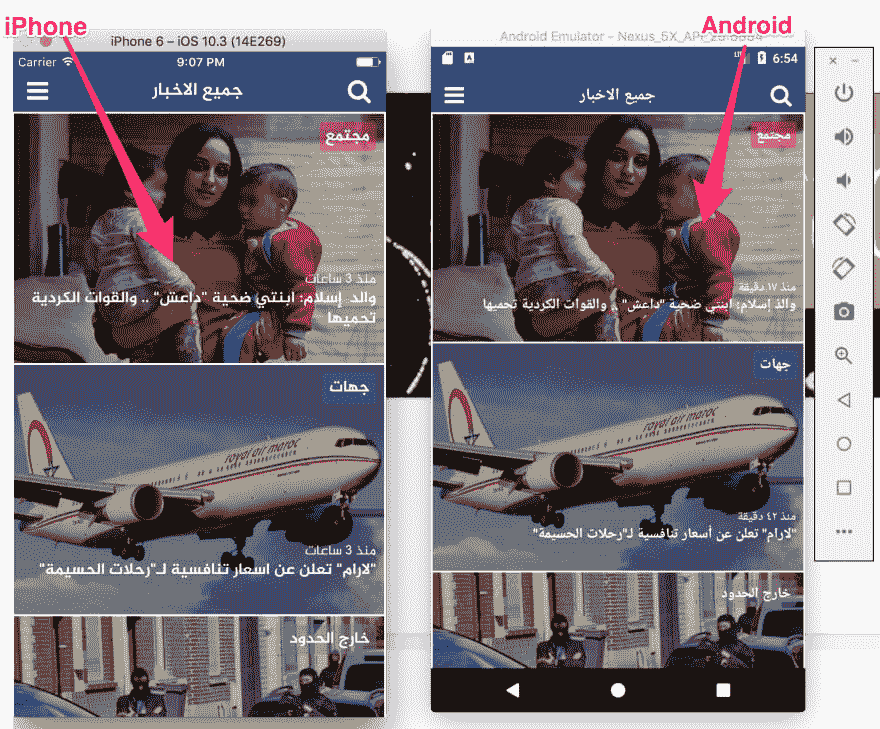
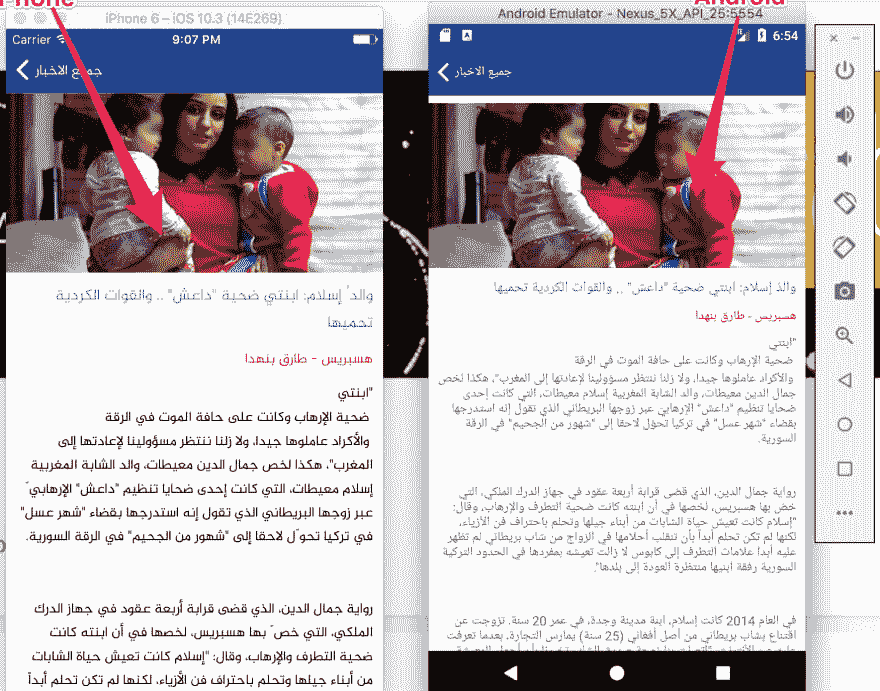
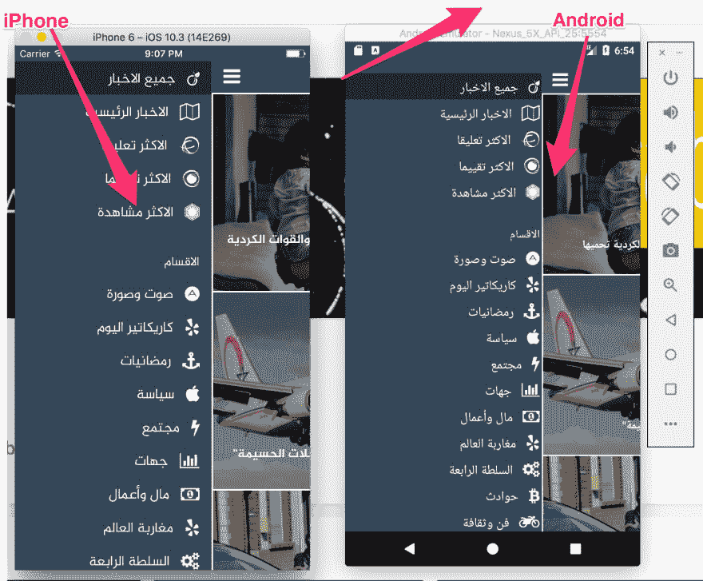

# React 阿拉伯语本地视频培训

> 原文：<https://dev.to/adilbenmoussa/react-native-video-training-in-arabic>

上周，作为 FE 架构师，我有极好的机会在我们的公司@AgileXS 调查未来移动应用的反应能力

作为我的主要原则之一，我开始尝试每天解释我几天前学到的东西，并尝试通过 youtube 视频来教授。我的计划是创建一个真正的应用程序，只是为了好玩，我选择了摩洛哥最受欢迎的报纸应用程序之一。我最后得到的结果是一个非常简单易懂的阿拉伯语视频系列，展示了如何用 React Native 构建一个报纸应用程序。
我在创建该应用程序时接触过的主题有:

*   学习如何使用平面列表，卡片，阿拉伯字体，SVG 图标，侧菜单和拉刷新组件。
*   路由器流量、Redux、Promise 中间件和 Saga 中间件
*   HTML 解析
*   阿克斯

### 结果在这里: [Youtube 播放列表](https://www.youtube.com/watch?list=UUoEuFnwZ1aMYns1X8-KiACQ&v=8MSRurO4Sfc)

### 代码也可以在 [Github](https://github.com/adilbenmoussa/hespress.com-react-native) 获得

### App 图片:

