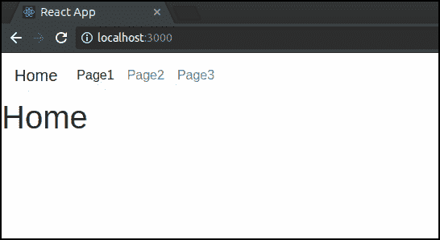
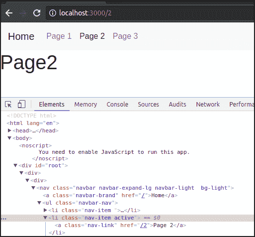

# 用 Bootstrap 4 反应 Navbar

> 原文：<https://dev.to/asaf_g6/react-navbar-with-bootstrap-4-4p0i>

## 做出反应并自举

你很有可能没有听说过[反应](https://reactjs.org/)或[引导](https://getbootstrap.com)。

无论是 React 还是 Bootstrap，都非常非常受欢迎。事实上，它们是如此受欢迎，以至于有一个项目将它们结合在一起。

由于 React 如此受欢迎，我决定我应该更熟悉它，并且也认为分享我的学习会很好。

在这个例子中，我们将创建一个没有“react-bootstrap”的引导导航栏。完整的解决方案在 github 上，你可以从这里得到。

## 先决条件

我假设你熟悉 HTML、Bootstrap、css 和 javascript。React 的入门级知识是必需的。

## 步骤 1 -设置

如果你还没有安装 React，现在就按照 React 网站上的说明进行安装。

创建新的 React 应用:

```
$ create-react-app react-bootstrap-navbar-example 
```

Enter fullscreen mode Exit fullscreen mode

这在 react-bootstrap-navbar-example 文件夹中为我们生成了一些文件。

太好了！现在，让我们将 Bootstrap 添加到新生成的 index.html 文件中。最简单的方法是使用 CDN，如这里的[所记录的](https://getbootstrap.com/docs/4.0/getting-started/introduction/)。
在 index.html 的头部添加 CDN 链接:

**public/index . html**

```
 <head>
    <meta charset="utf-8">
    <meta name="viewport" content="width=device-width, initial-scale=1, shrink-to-fit=no">
    <meta name="theme-color" content="#000000">
    <!--
      manifest.json provides metadata used when your web app is added to the
      homescreen on Android. See https://developers.google.com/web/fundamentals/engage-and-retain/web-app-manifest/
    -->
    <link rel="manifest" href="%PUBLIC_URL%/manifest.json">
    <link rel="shortcut icon" href="%PUBLIC_URL%/favicon.ico">
    <!--
      Notice the use of %PUBLIC_URL% in the tags above.
      It will be replaced with the URL of the `public` folder during the build.
      Only files inside the `public` folder can be referenced from the HTML.

      Unlike "/favicon.ico" or "favicon.ico", "%PUBLIC_URL%/favicon.ico" will
      work correctly both with client-side routing and a non-root public URL.
      Learn how to configure a non-root public URL by running `npm run build`.
    -->
    <!-- Bootsrap! -->
    <link rel="stylesheet" href="https://maxcdn.bootstrapcdn.com/bootstrap/4.0.0/css/bootstrap.min.css" integrity="sha384-Gn5384xqQ1aoWXA+058RXPxPg6fy4IWvTNh0E263XmFcJlSAwiGgFAW/dAiS6JXm" crossorigin="anonymous">

    React App
  </head> 
```

Enter fullscreen mode Exit fullscreen mode

注意，对于这个例子，Bootstrap 的 javascript 不是必需的。

我们将使用“react-router-dom”包，所以继续安装它。

在你的项目目录:

```
$ npm install react-router-dom --save 
```

Enter fullscreen mode Exit fullscreen mode

像这样从项目文件夹中启动 React 开发服务器:

```
$ npm start 
```

Enter fullscreen mode Exit fullscreen mode

## 第二步-添加导航链接

我们将有两个部分:

*   将保存我们内容的“主要”部分。
*   “标题”部分将容纳我们的导航栏。

继续用以下代码替换 src/App.js 的内容:

```
import React, { Component } from 'react';

const Main = () => (
  <div>
    main!
  </div> )

const Header = () => (
  <div>
    header!
  </div> )

const App = () => (
  <div>
    <Header />
    <Main />
  </div> )

export default App; 
```

Enter fullscreen mode Exit fullscreen mode

如您所见，它还没做多少事。它只是把我们的页面分成两个部分。如果你将浏览器指向 [localhost:3000](http://localhost:3000/) ，你应该会看到“header！”和“主！”一个在另一个上面。

让我们继续添加我们的网页。由于这只是一个例子，所以它们不会给人太深刻的印象。
为我们的页面创建一个新文件:
**src/pages.js**

```
import React, { Component } from 'react';

export const Home = () => (
    <div>
        <h1>Home</h1>
    </div> )

export const Page1 = () => (
    <div>
        <h1>Page1</h1>
    </div> )

export const Page2 = () => (
    <div>
        <h1>Page2</h1>
    </div> )

export const Page3 = () => (
    <div>
        <h1>Page3</h1>
    </div> ) 
```

Enter fullscreen mode Exit fullscreen mode

把我们在 index.js 的 App 改成 browser router:

**src/index . js**

```
import { BrowserRouter } from 'react-router-dom';

ReactDOM.render((
    <BrowserRouter>
      <App />
    </BrowserRouter>
  ), document.getElementById('root')) 
```

Enter fullscreen mode Exit fullscreen mode

将 App.js 中的主组件改为一个开关:

**src/App.js**

```
import { Switch, Route, Link } from 'react-router-dom'; // import the react-router-dom components
import { Home, Page1, Page2, Page3 } from './pages' // import our pages

const Main = () => (
  <main>
    <Switch>
      <Route exact path='/' component={Home} />
      <Route exact path='/1' component={Page1}/>
      <Route exact path='/2' component={Page2} />
      <Route exact path='/3' component={Page3} />
    </Switch>
  </main> ) 
```

Enter fullscreen mode Exit fullscreen mode

改变我们的头组件来显示链接:
**src/App.js**

```
 const Header = () => (
  <div>
    <ul>
      <li>
        <Link to="/">Home</Link>
      </li>
      <li>
        <Link to="/1">Page1</Link>
      </li>
      <li>
        <Link to="/2">Page2</Link>
      </li>
      <li>
        <Link to="/3">Page3</Link>
      </li>
    </ul>
  </div> ) 
```

Enter fullscreen mode Exit fullscreen mode

如果你想了解更多关于 React 路由器的内容，这里有一个很好的教程。

好吧！所以我们现在有了一个功能性的，丑陋的带路由的网站。

## 步骤 3 -添加引导

让我们把我们丑陋的标题变成一个引导导航条。如果你想了解更多，这里有一个到 navbar 文档的[链接。

修改 App.js 中的表头组件:

**src/App.js**](https://getbootstrap.com/docs/4.0/components/navbar/) 

```
 const Header = () => (
  <div>
    <nav className="navbar navbar-expand-lg navbar-light  bg-light">
      <Link className="navbar-brand" to="/">Home</Link>
      <ul className="navbar-nav">
        <li className="nav-item">
          <Link className="nav-link" to="/1">Page1</Link>
        </li>
        <li className="nav-item">
          <Link className="nav-link" to="/2">Page2</Link>
        </li>
        <li className="nav-item">
          <Link className="nav-link" to="/3">Page3</Link>
        </li>
      </ul>
    </nav>
  </div> ) 
```

Enter fullscreen mode Exit fullscreen mode

它应该是这样的:

[T2】](https://res.cloudinary.com/practicaldev/image/fetch/s--P_H9Eg-s--/c_limit%2Cf_auto%2Cfl_progressive%2Cq_auto%2Cw_880/https://dev-to-uploads.s3.amazonaws.com/i/jnwamb84e3prslu3v0pp.png)

看起来好多了！

## 步骤 4 -使用引导程序的活动类

我们的页面看起来已经更好了，但我们也希望我们的链接相对于我们所在的页面来说是活动的。为了实现这一点，我们将把链接转向 React 组件。

在 App.js 中添加我们新的 NavLink 组件的代码:

**src/App.js**

```
class NavLink extends Component {
  render() {
      return (
        <li className="nav-item" >
                  <Link className="nav-link" to={this.props.path}>{this.props.text}</Link>
        </li>
      );
  }
} 
```

Enter fullscreen mode Exit fullscreen mode

我们的 NavLink 将获取路径和文本作为其传递属性的一部分。

将我们的标题改为使用新的导航链接:

**src/App.js**

```
 const Header = () => (
  <div>
    <nav className="navbar navbar-expand-lg navbar-light  bg-light">
      <Link className="navbar-brand" to="/">Home</Link>
      <ul className="navbar-nav">
        <NavLink path="/1" text="Page 1" />
        <NavLink path="/2" text="Page 2" />
        <NavLink path="/3" text="Page 3" />
      </ul>
    </nav>
  </div> ) 
```

Enter fullscreen mode Exit fullscreen mode

这在浏览器中看起来完全一样，但是因为我们把简单的 html 变成了一个组件，我们的代码看起来已经更好了。

让我们为 NavLink 添加主动功能:

**src/App.js**

```
class NavLink extends Component {

  render() {
      return (
        <li className={"nav-item " + (this.props.isActive ? "active": "")}>
                  <Link className="nav-link" to={this.props.path}>{this.props.text}</Link>
        </li>
      );
  }
} 
```

Enter fullscreen mode Exit fullscreen mode

如果我们通过了
，我们的 NavLink 现在将使用活动类进行渲染

```
 to it.  
In React, when you have multiple stateful child components, it is better to "lift the state upwards".  
From the React tutorial:  

> When you want to aggregate data from multiple children or to have two child components 
> communicate with each other, move the state upwards so that it lives in the parent component. The 
> parent can then pass the state back down to the children via props, so that the child components 
> are always in sync with each other and with the parent.

Let's change our Header component so it could handle it's children's state:  
**src/App.js**

```javascript
class Header extends Component {

  constructor(props) {
    super(props);
    this.state = {
      links: [
        {path: "/1", text: "Page 1", isActive: false},
        {path: "/2", text: "Page 2", isActive: false},
        {path: "/3", text: "Page 3", isActive: false},
      ]
    }
  }

  handleClick(i) {
    const links = this.state.links.slice(); 
    for (const j in links) {
      links[j].isActive = i == j ;
    }
    this.setState({links: links});
  }

  render() {
    return (
      <div>
        <nav className="navbar navbar-expand-lg navbar-light  bg-light">
          <Link className="navbar-brand" to="/">Home</Link>
          <ul className="navbar-nav">
            {this.state.links.map((link, i) => 
              <NavLink 
                path={link.path} 
                text={link.text} 
                isActive={link.isActive}
                key={link.path} 
                onClick={() => this.handleClick(i)}
              /> 
              )}
          </ul>
        </nav>
      </div>
    );
  }
} 
```

Enter fullscreen mode Exit fullscreen mode

将 onClick 添加到我们的 NavLink 中，这样父级就可以通过了:

**App.js**

```
class NavLink extends Component {

  render() {
      return (
        <li className={"nav-item " + (this.props.isActive ? "active": "")}>
                  <Link 
                    className="nav-link" 
                    to={this.props.path}
                    onClick={() => this.props.onClick()}
                  >
              {this.props.text}</Link>
        </li>
      );
  }
} 
```

Enter fullscreen mode Exit fullscreen mode

太好了！现在，当你点击其中一个链接时，就会添加一个活动类。它应该是这样的:

[T2】](https://res.cloudinary.com/practicaldev/image/fetch/s--K7sxr6RW--/c_limit%2Cf_auto%2Cfl_progressive%2Cq_auto%2Cw_880/https://dev-to-uploads.s3.amazonaws.com/i/dq4tm7q8unu5pa5fktp9.png)

## 总结

因此...我们在这里做了什么？

我们创建了一个 React 路由器，有头部和主体部分。然后我们添加了 Bootstrap，使我们的网站看起来更漂亮。
最后，我们创建了自己的 NavLink 组件，并看到了如何“提升状态”。我相信这个非常普遍的问题有很多解决方案。其中一些可能不太冗长，甚至只用一两行就解决了。

希望你喜欢，当然也可以随意评论或者分享。

感谢阅读。