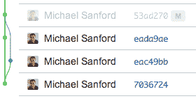
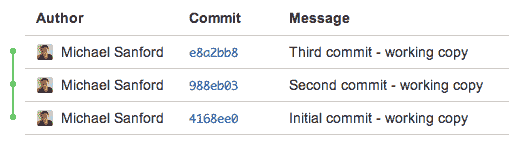
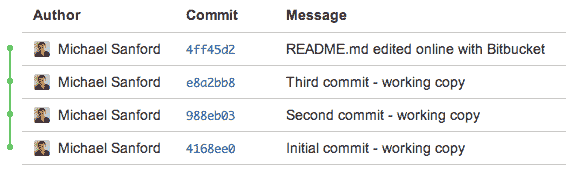
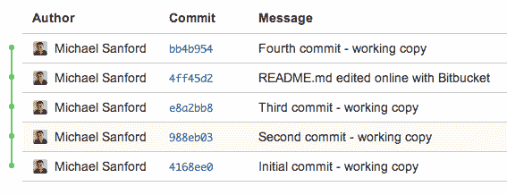

# 重置基础以避免合并提交

> 原文：<https://dev.to/msanford/rebasing-to-avoid-merge-commits-2k0k>

每个人都喜欢保持源代码控制历史的线性，更喜欢快进合并而不是合并提交。真的没那么难。*答应。*

Git 的提交结构是一个快照的*链表，其提交指向一个或几个*祖先*。这意味着您必须将您的工作“基于”先前的提交。*

### 什么是合并提交？

当将主题/特征分支合并在一起以指示在历史中分支被合并的位置时，合并提交可能是有用的。

然而，当在单个分支上工作时，它们是丑陋的、不必要的、杂乱的历史，并且看起来像这样:

<figure>[](https://res.cloudinary.com/practicaldev/image/fetch/s--BokA3qgF--/c_limit%2Cf_auto%2Cfl_progressive%2Cq_auto%2Cw_880/https://cdn-images-1.medium.com/max/280/1%2AjierxlydpVNF-LgiSh134w.png) 

<figcaption>在这里，我曾在两个地方主，</figcaption>

</figure>

这是同时在两个地方工作的结果——不一定是在同一个文件的同一个分支中。这里， *eada9ae* 和 *eac49bb* 都是 *7036724* 的子节点，但是它们包含了在 53ad270 合并的不同快照。

### 为巨大的成功而重整旗鼓

让我们从这样一段历史开始:

<figure>[](https://res.cloudinary.com/practicaldev/image/fetch/s--zP3uQmot--/c_limit%2Cf_auto%2Cfl_progressive%2Cq_auto%2Cw_880/https://cdn-images-1.medium.com/max/509/1%2ADuATfls-IfdYIFQCi3hJ4g.png) 

<figcaption>尼斯，线性历史(至今)</figcaption>

</figure>

现在，让我们同时在两个地方处理同一个文件(并模拟一个合并冲突)。为此，我将在工作副本中本地编辑该文件，并在 BitBucket 编辑器中编辑它(立即提交和推送):

<figure>[](https://res.cloudinary.com/practicaldev/image/fetch/s--BevlHuP---/c_limit%2Cf_auto%2Cfl_progressive%2Cq_auto%2Cw_880/https://cdn-images-1.medium.com/max/566/1%2AycX1RUN6abhyBu0qoOKPKg.png) 

<figcaption>BitBucket 编辑出现在历史中。</figcaption>

</figure>

现在，在本地编辑并提交文件:

```
msanford@Tenjin:/tmp/rebase-example $ git commit -m “Fourth commit — working copy”
[master 25dd301] Fourth commit — working copy
 1 file changed, 1 insertion(+) 
```

Enter fullscreen mode Exit fullscreen mode

我们的分支现在不同步:origin/master 中的 HEAD 指向 4ff5d2，而它在工作副本中指向 25dd 301:

```
msanford@Tenjin:/tmp/rebase-example $ git log --oneline
25dd301 Fourth commit — working copy
e8a2bb8 Third commit — working copy
988eb03 Second commit — working copy
4168ee0 Initial commit — working copy 
```

Enter fullscreen mode Exit fullscreen mode

在这一点上，如果你从工作副本进行 git push，你会看到这个熟悉的消息，建议你 *git pull* :

```
msanford@Tenjin:/tmp/rebase-example $ git push
To [git@bitbucket.org](mailto:git@bitbucket.org):michaelsanford/rebase-example.git
 ! [rejected] master -> master (fetch first)
error: failed to push some refs to ‘[git@bitbucket.org](mailto:git@bitbucket.org):michaelsanford/rebase-example.git’
hint: **Updates were rejected because the remote contains work that you do**
hint: **not have locally**. This is usually caused by another repository pushing
hint: to the same ref. You may want to first integrate the remote changes
hint: (e.g., ‘ **git pull** …’) before pushing again.
hint: See the ‘Note about fast-forwards’ in ‘ **git push --help** ’ for details. 
```

Enter fullscreen mode Exit fullscreen mode

注意，提示还建议参考“联机帮助页的快速部分”，当然，没有人这样做过。它建议了一个更优雅的行动方案。

```
msanford@Tenjin:/tmp/rebase-example $ **git pull --rebase**
remote: Counting objects: 5, done.
remote: Compressing objects: 100% (2/2), done.
remote: Total 3 (delta 1), reused 0 (delta 0)
Unpacking objects: 100% (3/3), done.
From bitbucket.org:michaelsanford/rebase-example
 e8a2bb8..4ff45d2 master -> origin/master
**First, rewinding head to replay your work on top of it…**
Applying: Fourth commit — working copy
**Using index info to reconstruct a base tree…**
M README.md
Falling back to patching base and 3-way merge…
Auto-merging README.md
CONFLICT (content): Merge conflict in README.md
Failed to merge in the changes.
Patch failed at 0001 Fourth commit — working copy
The copy of the patch that failed is found in:
 /private/tmp/rebase-example/.git/rebase-apply/patch

When you have resolved this problem, run “git rebase —continue”. 
```

Enter fullscreen mode Exit fullscreen mode

重置基础成功(无错误消息)？没有合并冲突？马上就可以推！

### 处理合并冲突

哦，不，我们正在处理的文件中有合并冲突！

#### README.md:

```
Edited locally in the working copy.
Second edit locally from the working copy.
Third commit locally from the working copy.
<<<<<<< HEAD
Fourth commit from BitBucket.
=======
Fourth commit locally from the working copy.
>>>>>>> Fourth commit — working copy 
```

Enter fullscreen mode Exit fullscreen mode

没问题:我们可以在工作副本中编辑文件，解决冲突，然后*还原继续*。

```
msanford@Tenjin:/tmp/rebase-example $ vi README.md
msanford@Tenjin:/tmp/rebase-example $ git add README.md
msanford@Tenjin:/tmp/rebase-example $ git rebase —continue
Applying: Fourth commit — working copy

msanford@Tenjin:/tmp/rebase-example $ git status
On branch master
Your branch is ahead of ‘origin/master’ by 1 commit.
 (use “git push” to publish your local commits) 
```

Enter fullscreen mode Exit fullscreen mode

### 发生了什么？

顾名思义，Git rebase 改变了我们工作副本提交历史的 *base* 来匹配 origin/master 的 base。由于本地工作副本和远程都有*相同的基础提交*(修复合并冲突后)，这允许我们*快进*我们的工作，作为远程提交之上的补丁，并维护线性历史。

这产生了一条漂亮的直线，它包含了以语义合理的方式完成的所有工作(因为合并的变更是主题性的):

[T2】](https://res.cloudinary.com/practicaldev/image/fetch/s--9Kexrrzb--/c_limit%2Cf_auto%2Cfl_progressive%2Cq_auto%2Cw_880/https://cdn-images-1.medium.com/max/567/1%2ADQFoHYpM_4r4iRnXZv37HA.png)

在第一个例子(合并提交)中，如果我们的工作副本持有蓝线和 *eac49bb* ， *git pull rebase* 将 pull *eada9ae* ，然后创建一个补丁并在提交的*之上重放 *eac49bb* 中包含的工作(_ 而不是使用 _7036724* 作为基础 _)_，[快进](http://ariya.ofilabs.com/2013/09/fast-forward-git-merge.html)并保存线性主题历史。

### 团队

在这个例子中，我只使用了一个开发人员，但这是不相关的:您可以在团队中以完全相同的方式完成这项工作！