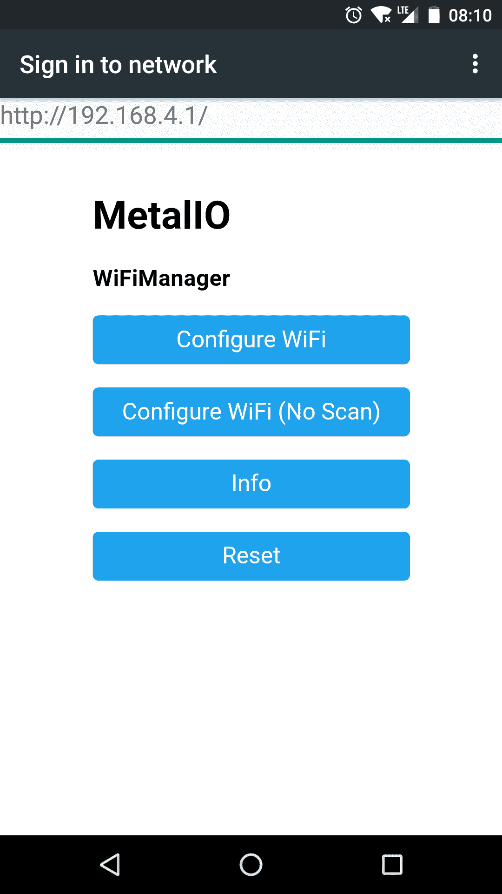

# 微控制器上的远程调用方法

> 原文：<https://dev.to/daniftodi/remote-invoke-methods-on-your-micro-controller-999>

几个月前，我开始制作一个可以打开/关闭房间灯的小装置，我需要这个功能，因为晚上我喜欢阅读，但是关灯有点痛苦，因为我必须从床上站起来。

我已经开始与 ESP8266 控制器，因为纳入 Wifi 和低价格。第一个版本的代码使用 HTTP 请求并基于 GET 调用执行操作(例如:在引脚 13 上放置高值 was /action？pin=13&output=1)，在第一个版本之后，我明白使用相同的代码控制其他房间的灯是不可能的，项目不能以简单的方式扩展，我必须为每个房间调整代码，在请求中添加额外的参数不是一个好的解决方案，因为我必须在为每个设备/房间定制的微控制器上编写源代码，我还必须记住调用动作的 IP 地址。

想象一个移动应用程序，你必须为你想要控制的每一个设备添加 IP 地址，当你的 IP 地址改变时，你必须处理情况——这并不容易，UX 将是一个糟糕的情况。

知道缺点并编写新的需求，我的决定是使用 MQTT 作为数据传输协议从头开始重写项目。

在阅读了一些关于 MQTT 的文章后，我决定编写允许控制无限设备的代码，作为额外的要求，我想使用相同的代码来控制我家的其他东西(如从传感器读取温度或从模拟引脚写入/读取)，设置简单，无需编辑每个微控制器的源代码。

我最初的想法是，一个小的“核心”应该执行它知道的任何方法，并且它们应该可以通过 MQTT 调用。此时，您可以使用 MetalIO，在/src/functions 中添加您的方法，并将它们注册到/src/main.cpp:

```
//create new instance
auto digitalWriteFunction = new DigitalWriteFunction("digitalWrite");
//register to metalio core
metal->put(digitalWriteFunction); 
```

Enter fullscreen mode Exit fullscreen mode

现在您可以通过 MQTT 调用您的方法:
发布一条消息到您配置的主题(例如:/actions/room1 )

```
digitalWrite:13,1 
```

Enter fullscreen mode Exit fullscreen mode

重要的一点是，MetalIO 完全可以通过 Wifi 进行配置，当您启动设备并单击 BTN1(或任何您可以在编译时选择的按钮，platformio.ini 中的“TRIGGER_PIN”参数)时，您的设备将创建一个命名的 AP，您可以在其中连接并查看配置界面(默认地址:192.168.1.4)

[T2】](https://camo.githubusercontent.com/26f41e1c89ff7d0dde3f1fff8972b19618878e10/687474703a2f2f692e696d6775722e636f6d2f56596a477163542e706e67)

目前，MetalIO 软件可以在任何 ESPx、Arduino 或 Intel Galileo 板上编写，通过 Wifi 进行配置，任何支持 MQTT 的应用程序/仪表板都可以用于与硬件设备通信。

项目可以在 GitHub 上找到:[https://github.com/daniftodi/metalio](https://github.com/daniftodi/metalio)