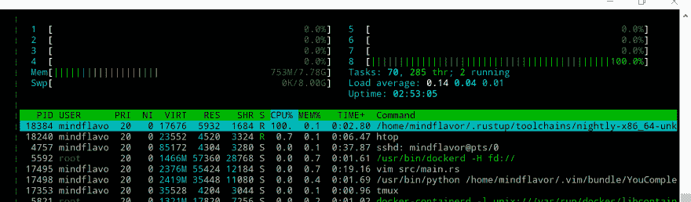
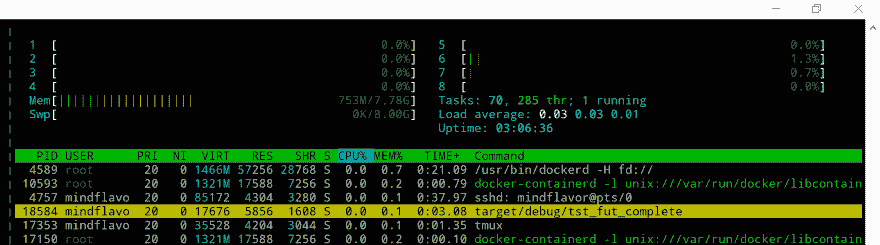

# 锈期货:一个未受教育的，简短的，希望不无聊的教程-第 4 部分-一个“真正的”从零开始的未来

> 原文：<https://dev.to/mindflavor/rust-futures-an-uneducated-short-and-hopefully-not-boring-tutorial---part-4---a-real-future-from-scratch-734>

## [T1】简介](#intro)

在之前的文章中，我们介绍了如何处理`Future`的基本知识。现在我们能够链接它们，执行它们，甚至创建它们。但是，到目前为止，我们的`future`并没有真正将执行委托给另一个*事物*。在《T4》第三部中，我们骗过了停车，并立即开启了未来。这个把戏让我们的未来得以发展，但这是现实生活中一个糟糕的例子。让我们用另一个更合适的例子来纠正这个错误。

## 一个定时器的未来

我们能创造的最简单的未来是计时器(正如我们在《T2》第三部中所做的)。但是这一次，我们不想立即打开`future`的`task`,而是想让任务一直停着，直到它准备好完成。如何才能实现这一点？最简单的方法是拆开一根线。这个线程将等待一段时间，然后它将*打开*我们的*暂停的*任务。

这很好地模拟了异步 IO 的情况。当另一个*实体*(通常是操作系统)提供一些数据时，我们会收到通知。我们的线程——记住，为了简单起见，把反应器看作单线程——可以在等待通知的同时执行其他任务。

## 计时器修正

我们的结构会很简单。它将包含截止日期以及任务是否正在运行:

```
pub struct WaitInAnotherThread {
    end_time: DateTime<Utc>,
    running: bool,
}

impl WaitInAnotherThread {
    pub fn new(how_long: Duration) -> WaitInAnotherThread {
        WaitInAnotherThread {
            end_time: Utc::now() + how_long,
            running: false,
        }
    }
} 
```

Enter fullscreen mode Exit fullscreen mode

`DateTime`型和`Duration`型来自`chronos`板条箱。

### 旋转等待

为了等待时间我们可以使用这个代码:

```
pub fn wait_spin(&self) {
    while Utc::now() < self.end_time {}
    println!("the time has come == {:?}!", self.end_time);
} 
```

Enter fullscreen mode Exit fullscreen mode

在这种情况下，我们基本上一直对照到期时间检查当前时间。这是可行的，而且非常精确。这种方法的缺点是我们浪费了**吨**的 CPU 周期。你看看进程利用率就清楚了:

```
fn main() {
    let wiat = WaitInAnotherThread::new(Duration::seconds(30));
    println!("wait spin started");
    wiat.wait_spin();
    println!("wait spin completed");
} 
```

Enter fullscreen mode Exit fullscreen mode

[T2】](https://res.cloudinary.com/practicaldev/image/fetch/s--9bdozNrp--/c_limit%2Cf_auto%2Cfl_progressive%2Cq_auto%2Cw_880/https://thepracticaldev.s3.amazonaws.com/i/6b3379awx1ofw9qw57q3.png)

在我的例子中，我们的代码完全使用了 core 8。这与我们在第三部中经历的类似。

> 旋转等待非常准确，但是很浪费。仅在非常短的等待时间内或没有其他选择时使用它们。

### 睡眠等待

操作系统能够在特定的时间内*暂停*你的线程。这通常被称为*睡眠*。休眠线程基本上是告诉 OS:“不要在 X 秒内调度我的线程”。因此，操作系统可以自由地将可用资源用于其他用途(或者是您的进程的另一个线程，或者是另一个进程)。Rust 使用`std::thread::sleep()`函数支持这一点。我们的代码可以是:

```
pub fn wait_blocking(&self) {
    while Utc::now() < self.end_time {
        let delta_sec = self.end_time.timestamp() - Utc::now().timestamp();
        if delta_sec > 0 {
            thread::sleep(::std::time::Duration::from_secs(delta_sec as u64));
        }
    }
    println!("the time has come == {:?}!", self.end_time);
} 
```

Enter fullscreen mode Exit fullscreen mode

在这里，我们试图确定线程应该休眠多长时间，从当前时间中减去到期时间。由于`timestamp()`函数不精确，我们像以前一样循环。我们来试试:

```
let wiat = WaitInAnotherThread::new(Duration::seconds(30));
println!("wait blocking started");
wiat.wait_blocking();
println!("wait blocking completed"); 
```

Enter fullscreen mode Exit fullscreen mode

行为将是相同的，除了这一次，我们的进程将不使用任何 CPU:

[T2】](https://res.cloudinary.com/practicaldev/image/fetch/s--4FxCfBkS--/c_limit%2Cf_auto%2Cfl_progressive%2Cq_auto%2Cw_880/https://thepracticaldev.s3.amazonaws.com/i/cy9p6f7lphv96cbrsr03.png)

好多了。但它是一个`Future`吗？

### 未来

不，不是的。我们还没有实现`Future`特征。所以我们开始吧。我们第一个简单的方法可能是:

```
impl Future for WaitInAnotherThread {
    type Item = ();
    type Error = Box<Error>;

    fn poll(&mut self) -> Poll<Self::Item, Self::Error> {
        while Utc::now() < self.end_time {
            let delta_sec = self.end_time.timestamp() - Utc::now().timestamp();
            if delta_sec > 0 {
                thread::sleep(::std::time::Duration::from_secs(delta_sec as u64));
            }
        }
        println!("the time has come == {:?}!", self.end_time);
        Ok(Async::Ready(())
} 
```

Enter fullscreen mode Exit fullscreen mode

虽然这种方法不会浪费 CPU 周期**，但它会阻塞反应器**。一个被封锁的反应堆不会推进其他的未来。这很糟糕。

> 期货应该尽量少堵。

为了成为一名好的反应堆公民，我们需要:

*   等待到期时间时暂停我们的任务。
*   不要阻塞当前线程。
*   任务完成时向反应器发出信号(到期时间)。

我们要做的是创建另一个休眠线程。这个线程不会消耗资源，因为我们会让它休眠。在一个单独的线程中，反应器将继续愉快地工作。当单独的线程醒来时(在睡眠时间之后),它将*解开*任务，向反应器发出信号。

让我们先画出一个实现的草图，然后逐步完成它:

```
impl Future for WaitInAnotherThread {
    type Item = ();
    type Error = Box<Error>;

    fn poll(&mut self) -> Poll<Self::Item, Self::Error> {
        if Utc::now() < self.end_time {
            println!("not ready yet! parking the task.");

            if !self.running {
                println!("side thread not running! starting now!");
                self.run(task::current());
                self.running = true;
            }

            Ok(Async::NotReady)
        } else {
            println!("ready! the task will complete.");
            Ok(Async::Ready(()))
        }
    }
} 
```

Enter fullscreen mode Exit fullscreen mode

我们只需要启动并行线程一次，因此我们使用了`running`字段。注意，我们的*执行*直到`future`被轮询后才会开始。这完全符合我们的目的。此外，我们检查到期时间是否已经过去，在这种情况下，我们根本不产生副线程(我们稍后将看到`run`函数)。

如果到期时间在未来**和**没有运行的副线程，我们就产生它。然后我们要求*停放*我们的任务返回`Ok(Async::NotReady)`。与我们在[第 3 部分](https://dev.to/mindflavor/rust-futures-an-uneducated-short-and-hopefully-not-boring-tutorial---part-3---the-reactor-433)中所做的相反，我们在这里不*解包*任务。那是侧线的责任。在其他实现中，比如 IO，唤醒我们的任务是操作系统的责任。

侧线代码是这样的:

```
fn run(&mut self, task: task::Task) {
    let lend = self.end_time;

    thread::spawn(move || {
        while Utc::now() < lend {
            let delta_sec = lend.timestamp() - Utc::now().timestamp();
            if delta_sec > 0 {
                thread::sleep(::std::time::Duration::from_secs(delta_sec as u64));
            }
            task.notify();
        }
        println!("the time has come == {:?}!", lend);
    });
} 
```

Enter fullscreen mode Exit fullscreen mode

这里有两点需要注意。首先，我们将引用`task`传递给并行线程。这很重要，因为我们不能在单独的线程中使用`Task::current()`。其次，我们没有将`self`移入闭包:这就是我们将`lend`绑定到`self.end_time`副本的原因。这是为什么呢？生锈的螺纹需要具有`'static`寿命的`Send`特征。`Task`符合这两个标准，所以我们可以把它放进瓶盖里。我们的结构没有，所以我们移动了一个`end_time`字段的副本。

这意味着在线程启动后，您不能更改到期时间。

让我们试一试:

```
fn main() {
    let mut reactor = Core::new().unwrap();

    let wiat = WaitInAnotherThread::new(Duration::seconds(3));
    println!("wait future started");
    let ret = reactor.run(wiat).unwrap();
    println!("wait future completed. ret == {:?}", ret);
} 
```

Enter fullscreen mode Exit fullscreen mode

这是输出:

```
 Finished dev [unoptimized + debuginfo] target(s) in 0.96 secs
     Running `target/debug/tst_fut_complete`
wait future started
not ready yet! parking the task.
side thread not running! starting now!
the time has come == 2017-11-21T12:55:23.397862771Z!
ready! the task will complete.
wait future completed. ret == () 
```

Enter fullscreen mode Exit fullscreen mode

注意事件的时间流程:

1.  我们请求`rector`开始我们的未来
2.  我们的`future`注意到到期日期在未来，因此:
    1.  公园`task`
    2.  开始侧线
3.  侧线在一段时间后唤醒，并且:
    1.  通知`reactor`应该将`task`从*解锁*
    2.  破坏侧线(退出)
4.  `reactor`唤醒*停放*T1】
5.  `future`(又名`task`)完成并且:
    1.  通知`reactor`它已经完成
    2.  返回输出值(在我们的例子中是单位)
6.  反应器将`task`的输出值返回给`run`函数的调用者。

很漂亮，你不觉得吗？

### 结论

这就完成了我们的【真实生活】`future`。它不会阻塞，因此在`reactor`中表现正常。它不会使用不必要的资源。它本身也不做任何有用的事情(除了被用作超时机制，你能想象如何吗？).

当然，你通常不会手动编写一个`future`。您可以使用库提供的工具，并根据需要进行组合。尽管如此，理解它们是如何工作的还是很重要的。

下一个主题是`Streams`，它将允许创建迭代器，使*一次产生*一个值，而不会阻塞`reactor`。

* * *

快乐编码

弗朗切斯科·科努