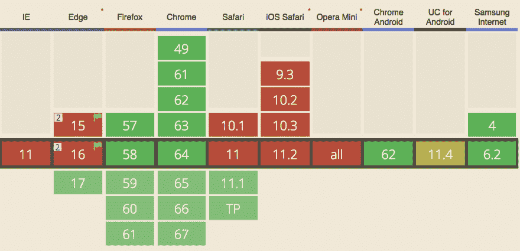

# Safari 现在支持服务人员:这意味着什么(至少对我来说)

> 原文：<https://dev.to/ben/safari-now-supports-service-workers-and-what-that-means-to-me-at-least-3oi7>

苹果最新的发布说明[表明了他们对服务人员](https://developer.apple.com/library/content/releasenotes/General/WhatsNewInSafari/Articles/Safari_11_1.html#//apple_ref/doc/uid/TP40014305-CH14-SW1)的支持。

> ### Safari 11.1 的亮点
> 
> *   Service workers. Implement background scripts for offline web applications and faster web pages.
> *   Payment request. Use standard-based API to provide a consistent user payment experience in Safari.
> *   Improvements in security. Enhanced protection against memory corruption and code execution attacks.
> *   Page inspector update. New design of "Network" tab and "Style" sidebar in "Elements" tab.

服务工作者 API，充当浏览器的网络代理，为 web 开发人员提供对请求的更多控制。这意味着在恶劣的网络条件下可以获得更好的体验，开发人员可以获得某些应用程序架构概念，这些概念可以在所有条件下改善用户体验。

[T2】](https://res.cloudinary.com/practicaldev/image/fetch/s--2noVpYE5--/c_limit%2Cf_auto%2Cfl_progressive%2Cq_auto%2Cw_880/https://thepracticaldev.s3.amazonaws.com/i/t0bx108dqpw0jlu9gip6.png)

Safari 的支持将对[我能更好地使用](https://caniuse.com/#feat=serviceworkers)号吗？对我和我的团队来说，这意味着我们可以开始自信地用更多的时间和精力去了解服务人员。我们仍然需要构建一些应用程序，这些应用程序可以在不支持它们的浏览器上逐步增强，但是这种额外的复杂性现在是合理的。对于一些团队来说，他们本可以更早地达到这一点，但在我看来，在这个主要浏览器上线之前，服务人员必须被认为是更具实验性的。

## App 外壳架构

一种由服务人员实现的应用程序设计称为*应用程序外壳架构*，其中网页的布局和重用资产被缓存以供重用，网络请求更多地以被传递的数据为中心，以便将页面内容呈现为二级请求。类似的页面构造选择在 web 开发领域已经有些流行，但在我看来，如果没有这个缓存层，它们不一定是一个好的选择。如果您不能缓存 shell，我真的不建议您仅仅为了呈现第一个内容就打这么多电话回家。您想要更少的延迟，而不是更多。

我们现在没有使用这个 architexture，这就是为什么 Safari 的更新很重要。我认为这让我们度过了最困难的时期，我们可以把这些想法放在脑海中。它为我们提供了足够的浏览器支持来构建路径，将页面布局存储在用户的机器上——台式机或移动设备。

我们当然是以网络为先的商店，还没有本地的[开发到](https://dev.to/)选项*，我不想本末倒置，但这个*可能*给我们一个借口，即使在移动设备上也要完全保持网络一段时间。但是我不想在这个方向上走得太远。如果强大的浏览器 API 有助于用户体验，那么只有一个*应用程序*的开发好处是巨大的。*

 *## 边缘逻辑

我们的应用已经通过我们的 CDN [快速地](https://www.fastly.com/)在边缘使用网络逻辑，向服务人员倾斜给了我们多一个边缘层。从未被服务工作者处理过的请求仍然可能在边缘节点被处理。

[T2】](https://res.cloudinary.com/practicaldev/image/fetch/s--MOa0MulJ--/c_limit%2Cf_auto%2Cfl_progressive%2Cq_auto%2Cw_880/https://thepracticaldev.s3.amazonaws.com/i/befdsd5tsih0vqvltn14.png)

如果你住在新西兰，我们不希望你大老远跑到犹他州来看你的内容。服务人员意味着大部分 HTML(当然还有其他资产)可以留在浏览器上，这样你下次访问时就可以更快地向你展示一些布局，而且通过网络发送的字节也更少。我们仍然希望在没有服务人员的情况下提供相同的清晰负载，但我们有工具来为一致的用户提供真正良好的整体 web 体验。

## 感谢苹果

这一举措可能会缓解一些对 Safari 的心痛。我很高兴我们已经尝试了服务人员，所以我们现在不仅仅是在追赶，但我也很高兴我们没有在一年前首先尝试维护一个更复杂的跨浏览器兼容性，仅支持 2/3 个版本。

快乐编码*