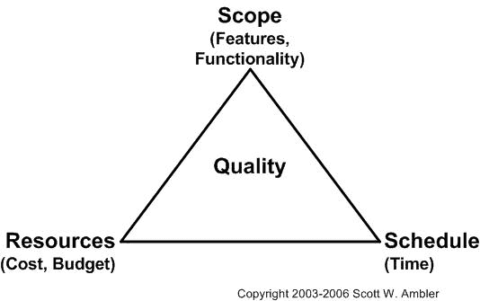

# Scrum，Backlog，产品负责人和项目计划

> 原文：<https://dev.to/jautero/scrum-backlog-product-owner-and-project-plan-3mn>

在我的新工作场所，我们的团队最近开始做 scrum。我们的 scrum 大师本周刚刚接受了训练。当他回来时，我们开始讨论我们做错了什么，以及如何改进。我评论了 scrum 的思想是如何有一个优先的 backlog，团队在 sprint 计划中从中选择最重要的任务，并在 sprint 期间处理。我对此有了更多的想法，并决定写我的第一篇文章。

理论上，事情相当简单。在 sprint 开始时，团队从优先的待办事项中选择下一个 sprint 要处理的项目。在 sprint 期间，团队只处理这些项目。在 sprint 结束时，团队与产品负责人一起回顾在 sprint 期间完成了哪些项目。产品所有者拥有待定项，并对其拥有绝对的权力。他们可以以任何他们想要的方式在每个 sprint 之间重新排列 backlog 的优先级。

人们讨论了如何有太多的工作，以及如何与客户沟通，团队在冲刺阶段只能完成这么多的工作，过度工作最终会适得其反。最后，那是阿宝的问题，不是团队的问题。团队应该避免过度承诺，并确保完成他们承诺的任务。这种“单个可拧断的脖子”的方法使 PO 完全控制了与业务方的通信，如果使用正确，这是非常强大的。

问题是，通常企业习惯于传统的瀑布项目，并试图在时间表和截止日期的框架内工作。这造成了不可阻挡的力量与不可移动的物体相遇的情况，一个瀑布或敏捷规则都不适用的奇点。

软件开发传统上用范围、资源和时间的“铁三角”来说明。

[T2】](https://res.cloudinary.com/practicaldev/image/fetch/s--bRdpPnyv--/c_limit%2Cf_auto%2Cfl_progressive%2Cq_auto%2Cw_880/http://www.ambysoft.com/artwork/ironTriangle.jpg)

想法是，你可以设置三个角中的两个，然后第三个适应项目的变化。改变资源是困难的，因为适应新的资源会产生额外的负载。这就产生了布鲁克斯定律:“在项目后期增加人员会让时间变得更晚”。传统的瀑布项目设定范围，然后通过计划时间表来估计时间。因为在计划阶段通常不能完全理解需求，所以评估永远不成立，项目被延迟。

Scrum 扭转了这个想法。通过固定的冲刺来设定时间，然后通过改变待办事项列表中项目的优先级来调整范围。截止日期是有的，你只是不知道当它到来的时候会做什么。通过保持待办事项的优先顺序，你可以确保至少完成了最重要的事情。

这两种方法是不兼容的。这可能是敏捷失败的最常见原因。整个组织必须适应这样一种理念:范围不是一成不变的，但时间表是。