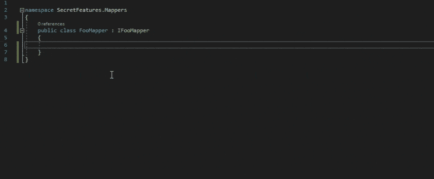
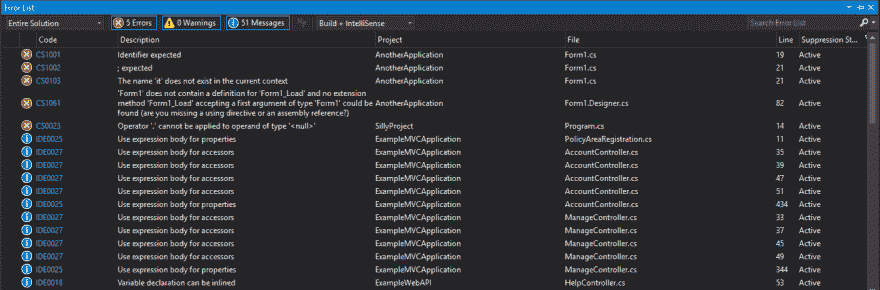
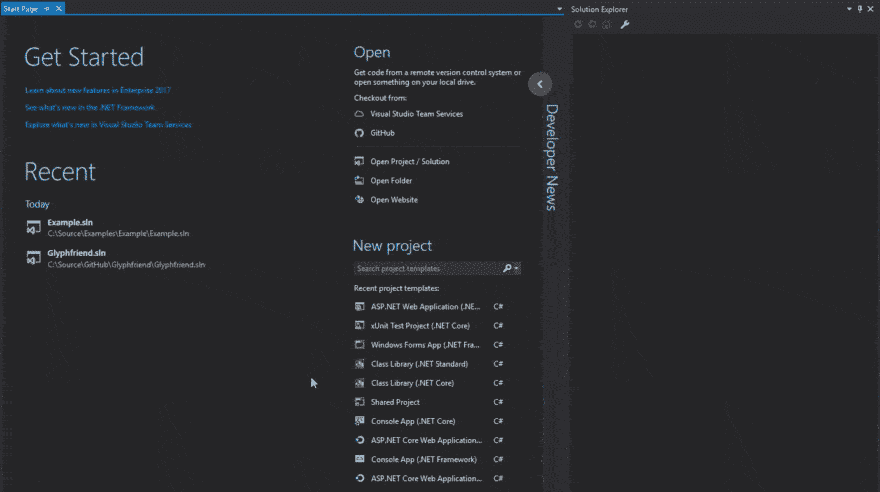
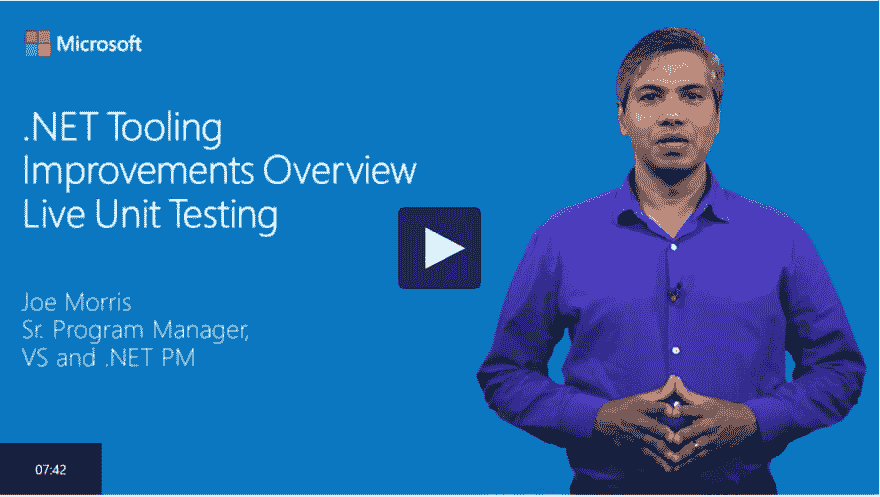
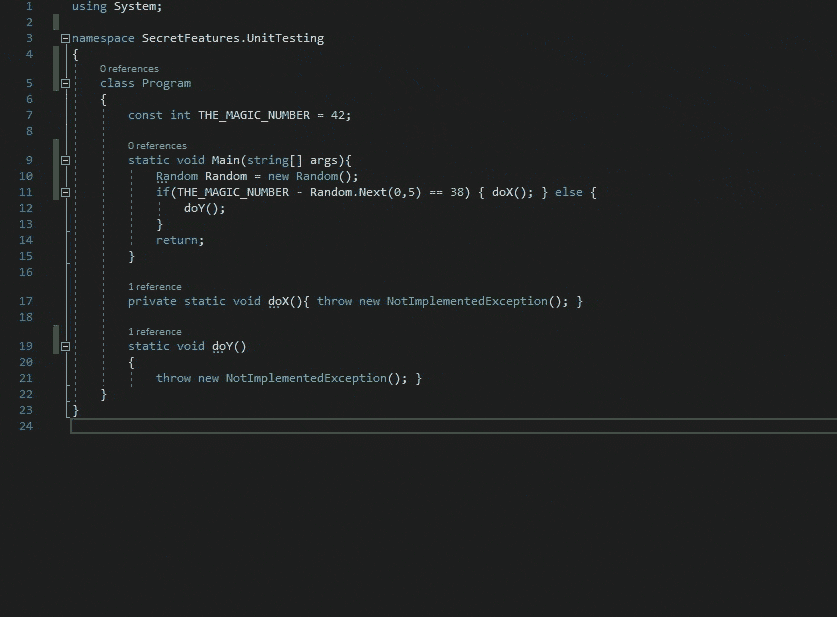
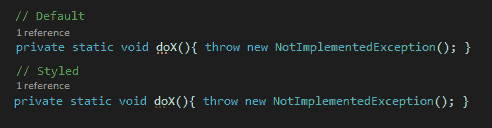

# Visual Studio 2017 的秘密生产力提示

> 原文：<https://dev.to/rionmonster/secret-productivity-tips-for-visual-studio-2017>

*这篇文章最初发表在[我的博客](http://rion.io)上。*

到目前为止，我已经写了一些关于 Visual Studio 2017 的博客帖子，所以我想我应该花一些时间来讨论这个最新版本中引入的可能有助于您提高工作效率的功能，或者您可能会发现有用的功能。

你会注意到这篇文章的标题提到他们是“秘密”。这是因为**所有这些特性在默认情况下都是禁用的**，所以您需要在本地(每个项目)或全局启用它们来利用这些特性。

## 为无法识别的类型获取程序包建议

[T2】](https://res.cloudinary.com/practicaldev/image/fetch/s--nlo4G1Hx--/c_limit%2Cf_auto%2Cfl_progressive%2Cq_66%2Cw_880/https://thepracticaldev.s3.amazonaws.com/i/lisynn6qnlw7bgv1l33x.gif)

在我看来，Visual Studio 2017 最有用的新增功能之一是基于 Nuget 的使用建议功能。这个特性将推荐安装一个特定的 NuGet 包来处理在编辑器中遇到的无法识别的类型的解析。

它可以通过以下方式启用:

*   **工具>选项>文本编辑器> C# >高级>建议对 Nuget 包中的类型使用**

再次强调——这是一个提高工作效率的很好的特性，它肯定比绕着 NuGet 转或者跑去手动下载软件包要好。

## 查询语法中的转到全部(Ctrl+T)

[T2】](https://res.cloudinary.com/practicaldev/image/fetch/s--Mb-nxKv---/c_limit%2Cf_auto%2Cfl_progressive%2Cq_66%2Cw_880/https://thepracticaldev.s3.amazonaws.com/i/wgidy6i5wyt31xuxmkbs.gif)

Visual Studio 2017 中引入的另一个非常有用的工具是在转到所有(Ctrl+T)搜索区域中的查询搜索。这使您现在可以通过使用以下前缀开始搜索来快速搜索任何文件/类型/成员/或符号:

*   **f {文件}**

*   **t {type}**

*   **m {成员}**

*   **# {symbol}**

这可以让您在解决方案中轻松缩小搜索范围，并快速找到您需要的内容。

## 全解分析

[T2】](https://res.cloudinary.com/practicaldev/image/fetch/s--S_lS7kPI--/c_limit%2Cf_auto%2Cfl_progressive%2Cq_auto%2Cw_880/https://thepracticaldev.s3.amazonaws.com/i/6utmlypovbjd61j0doe7.PNG)

完整的解决方案分析功能有助于查看整个解决方案中的每个错误、消息和警告(而不仅仅是当前打开的文件)。

此功能可通过以下方式启用:

*   **工具>选项>文本编辑器> C# >高级>启用全解分析**

如果你是一个坚持己见的人，不能忍受看到非空的错误列表，那么这是给你的。

#### 轻量级解决负载

[T2】](https://res.cloudinary.com/practicaldev/image/fetch/s--j4k0UujX--/c_limit%2Cf_auto%2Cfl_progressive%2Cq_66%2Cw_880/https://thepracticaldev.s3.amazonaws.com/i/xkimuri8hwl70gln6v4t.gif)

另一个可以为 Visual Studio 2017 增添不少活力的出色功能是轻量级解决方案加载。该特性最初将加载每个项目所需的最小数量的*，以使它们在 Visual Studio 中正常工作。在请求之前，不会加载或展开单个项目文件和依赖项，因此您只需加载您需要的内容。*

该功能可以通过两种方式启用；本地:

*   **右键项目>启用轻量级解决方案加载**

或全局(对于所有项目):

*   **工具>选项>项目和解决方案>通用>轻量级解决方案加载**

它非常适合包含多个项目的大型解决方案，这些项目在大多数情况下可能都不会被触及，或者您只是希望 Visual Studio 比正常情况下更快地打开一个项目。

## 现场单元测试

[T2】](https://channel9.msdn.com/Events/Connect/2016/171/player)

Live Unit Testing 是 Visual Studio 2017 发布期间吹捧的功能之一，但它实际上并没有默认启用。这个特性将会指出哪些单元测试受到了任何代码变更的影响，并且测试将会自动运行。此外，它将使用图标来修饰您的代码，以指示哪个代码被覆盖以及覆盖该代码的测试的状态。

该功能可以通过两种方式启用；本地:

*   **测试>现场单元测试>开始**

或全局(对于所有项目):

*   **选项>现场单元测试**

实时单元测试非常方便，不仅可以查看哪些测试通过了，哪些测试失败了，还可以检查代码覆盖率。这个特性也是高度可配置的，它将允许您包含/排除特定的测试，定义您想要专用于它的线程数量，配置测试运行的时间，等等。

## EditorConfig 样式强制执行

[T2】](https://res.cloudinary.com/practicaldev/image/fetch/s--J2Te6wbA--/c_limit%2Cf_auto%2Cfl_progressive%2Cq_66%2Cw_880/https://thepracticaldev.s3.amazonaws.com/i/90dhch671o6cf74pl7b6.gif)

Visual Studio 2017 增加了对[的支持。editorconfig](http://editorconfig.org/) 文件来帮助提供编码风格建议，这对于希望在他们的代码库中保持一致风格的大型开发团队来说很有用。

你可能会注意到省略号很难被注意到，尤其是当你处于黑暗面的时候。这可以很容易地在 IDE 中进行调整，使它们在以下位置更加明显:

*   **工具>选项>环境>字体和颜色>建议省略号**

然后，您可以配置颜色，使其更加“突出”:

[T2】](https://res.cloudinary.com/practicaldev/image/fetch/s--NpGuQOJM--/c_limit%2Cf_auto%2Cfl_progressive%2Cq_auto%2Cw_880/https://thepracticaldev.s3.amazonaws.com/i/x9q9t1dzr3743cxmle0s.PNG)

而此功能*默认为*启用(如果 editorconfig 文件存在)，您可以通过 Mads Kristensen 的 [EditorConfig 扩展](https://marketplace.visualstudio.com/items?itemName=MadsKristensen.EditorConfig)使编辑过程变得更加容易，该扩展可以下载，并将提供完整的自动完成、语法高亮显示等等。

## 键盘快捷键

随着 Visual Studio 2017 中添加的许多新功能和特性，您可能会倾向于考虑放弃对重量级 Resharper 扩展的支持，以了解 vanilla Visual Studio 在这一点上是如何工作的。或者，如果您是来自 IntelliJ、Eclipse 等其他编辑器的开发人员，您可能非常习惯这些工具的键盘快捷键。嗯，有一个扩展可以覆盖你。

[Visual Studio 团队成员 Justin Clarebert](https://twitter.com/justcla78) 发布了[热键键盘快捷键扩展](https://marketplace.visualstudio.com/items?itemName=JustinClareburtMSFT.HotKeys2017-KeyboardShortcuts)，它允许您轻松配置 Visual Studio 2017，以使用那些其他流行编辑器和工具的键盘快捷键，让您在新环境中获得习惯的生产力。

好吧。因此，这是另一个*没有直接内置到 Visual Studio 2017 中的功能，但它是一个太大的生产力增强器，不能从这个列表中删除(因为它不是内置的，我想它仍然有资格作为一个“秘密”)。*

## 在关闭

希望这个列表向你介绍了一些你在 Visual Studio 2017 中可能不知道的功能(如果你知道，希望它向你展示了如何实现它)。