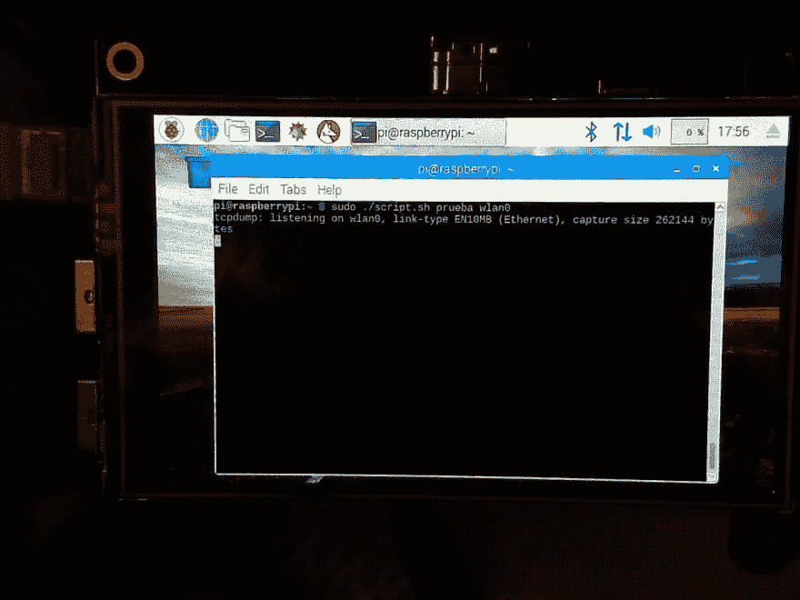

# 安全冲刺:第 5 周:网络捕获探测

> 原文：<https://dev.to/terceranexus6/security-sprint-week-5-network-capture-probe--a33>

最近，我大学的图书馆里增加了一些令人惊讶的东西:你不仅可以索要书籍，还可以索要电子编程包，如 raspberry 或 arduino 工具包。为了做一个实验，我决定带一个 raspberry pi 工具包:一个**网络捕获探头**。

[T2】](https://res.cloudinary.com/practicaldev/image/fetch/s--ckCcwu4v--/c_limit%2Cf_auto%2Cfl_progressive%2Cq_auto%2Cw_880/https://thepracticaldev.s3.amazonaws.com/i/go7r450eu0ysx2uy09mr.jpg)

网络捕获探测器是一种网络系统监控工具，允许您实时捕获流量。不久前，我认识了一个人，他在包里到处都带着这个，用他的树莓派，很棒，是吧？。现在我也想试试...

我下载了最新版本的 [raspbian](https://downloads.raspberrypi.org/raspbian_latest) ，烧了一张 8GB 的 MicroSD，安装了 [Etcher](https://etcher.io/) ，用 Etcher 把 raspbian ISO 安装在卡里，用 hdmi 把 RPI 连接到一个屏幕上。我还附上了键盘和鼠标。我也有一个 RPI 屏幕，所以我后来也做了一些调整，以及 wifi pin，但重要的事情第一。我必须说我首先尝试下载 bro 工具，但是我没有足够的空间在我的 8GB 卡中编译它... *ups* 。

一旦我安装了 **Raspbian** 我就打开终端并使用`apt-get install tcpdump`安装 tcpdump，也要注意`sudo`。为什么？我编写了一个简单的脚本来使用 tcpdump 捕获数据。这就是:

```
#!/bin/bash

eval namedir=$1
eval net=$2
count=0
number=5

mkdir $namedir
cd $namedir

while [ $count -lt 1000 ]
do

    tcpdump -A -w $count_.pcap -c $number -i $2
    echo "just captured $number packets" 

done 
```

Enter fullscreen mode Exit fullscreen mode

[T2】](https://res.cloudinary.com/practicaldev/image/fetch/s--xLpPosSz--/c_limit%2Cf_auto%2Cfl_progressive%2Cq_auto%2Cw_880/https://thepracticaldev.s3.amazonaws.com/i/r7ad5rfjzgafiv3c3zmg.jpg)

这是一个简单的例子，有许多细节需要润色。在这种情况下，第一个参数是目录的名称，第二个是 wifi 卡的名称。任何牌都有一个选项是`any`。总之，这些是输入的例子:

```
# ./script.sh trial wlan0
# ./script.sh trial eth1
# ./script.sh trial any 
```

Enter fullscreen mode Exit fullscreen mode

我们创建的目录中的输出将是`0_.pcap 1_.pcap 2_.pcap`,如此这般。每个 pcap 将包含五个(`number=5`)数据包的 ASCII ( `-A`)信息。要读取它们，有`-r` tcpdump 命令。另一个让它更漂亮的想法是使用`-D`命令，它显示可用接口的列表，将其保存在一个文件中，并在一个`for`循环中使用该文件来保存信息。但是我还没试过。反正是一个有趣的玩具玩一个很好的工具来实践网络系统监测在随机网络。小心点；)