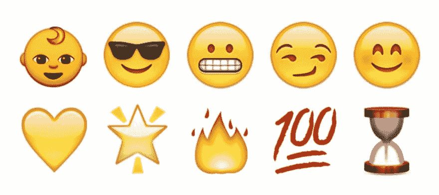
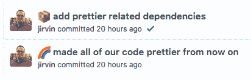
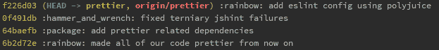

# 带有表情符号的语义提交消息

> 原文：<https://dev.to/sublimegeek/semantic-commit-messages-with-emojis-3p8h>

<figure> 

<figcaption>来源:[http://emojipedia.org](http://emojipedia.org)</figcaption>

</figure>

不久前，我写了一篇关于使用 Git (或任何 SCM)的五个最佳实践的文章。我认为，其中一个核心原则是精心编写的提交信息。拥有一条写得很好的提交信息就像能够和未来的自己或者更好的其他人交谈。

> 🌈更改项目以使用材料设计

### 责备游戏

这是如何发挥作用的是我最喜欢的 Git 命令之一， [git 责备](https://git-scm.com/docs/git-blame)。Git 责备允许您逐行查看文件，并查看与您正在查看的行相关的最新提交。这对于指责☝️很有用，但更重要的是，这是获得每行代码注释的一种方式。有几个工具和插件允许注释显示每一行的提交 ID、提交者和注释。我不会详细讨论它们，但是它们通常在您的日常 ide 中受到支持。

代码注释很容易变得冗长或混乱，有时，如果您正在查看的文件被过度注释，您很容易丢失您试图阅读的代码。我完全赞成好的、文档化的代码，但是请写脚本！

如果你在看外国代码，并试图猜测你之前的程序员在想什么，Git commit 消息可能是一个*非常有价值的*工具，即使那个程序员就是你。

### 盒子原理

我喜欢把 Git 提交描述成一个盒子📦。

> 想象一个盒子。你可以把东西放进盒子里。你可以从盒子里拿出东西。这个盒子是 Git 的集结地。您可以在这里手工提交。承诺就像密封那个盒子，并在上面贴上标签。盒子里的东西是你的改变。那么，为什么标签没有意义呢？你不会给一个搬家的箱子贴上“厨房用品”的标签

Jeremy Mack 写了一篇关于使用语义提交消息的很棒的文章，我想在此详述一下。他的观点是对提交消息进行“分类”,并保持消息简短。以下是一些需要遵循的基本规则:

1.  提交只能有一个类别。如果一个提交有多个类别，那么它应该被分成单独的提交。
2.  提交消息应该简短，但具有描述性。如果觉得太罗嗦，就把提交分割成更小的块，并赋予这些更小的提交更多的意义。

如果你遵循我的一些原则，尽早、经常、原子地提交，语义提交应该是轻而易举的事，⛅️.

### 好吧，但是表情符号呢🤔

我的第五个原则谈到了使用远程存储库并推动它。很有可能，当你读到“远程存储库”时，你想到的不是 GitHub 就是 Bitbucket。

大多数人使用表情符号来传达一种情感或想法。不管你是因为什么而生气😠或者感觉有点傻😜，几乎所有东西都有一个表情符号。我很惊讶有这么多服务支持文字表情符号。

Mack 谈到了不同类型的提交，比如更新文档的文档和修复代码。我想提出一些激进而令人兴奋的东西:**语义表情符号。**

不要误解我，如果你不喜欢表情符号，我强烈推荐杰克的提交信息风格。

> 苦差事:添加牡蛎构建脚本
> 
> 文档:解释帽子抖动
> 
> 专长:添加 beta 序列
> 
> 修复:移除已损坏的确认消息
> 
> 重构:共享 4d3d3d3 and 和 flarhgunstow
> 
> 样式之间的逻辑:将制表符转换为空格
> 
> 测试:确保 Tayne 保留服装

因为我们大多数人都使用托管服务来查看提交、审查拉请求，并且通常在终端之外做大量繁重的工作，所以让它变得有趣一些。

### 带着感情投入

起初需要一点时间来适应，但结果是美好的。这个概念很简单，我们用表情符号代替文字来表达提交类型。

***免责声明:*** *这是我对每种类型的承诺使用表情符号的个人观点。这不是包罗万象的，你可以随意修改。*

让我们开门见山吧。

要在提交时使用表情符号，你必须用冒号(:)把它们打出来。你可以把这个网站当作一本字典。😃创造😃

大多数时候，我要么添加功能(⭐️)，要么修复错误(🛠)，所以这种类型的提交应该是这样的:

> ⭐️增加了一个新的下拉菜单，以便更好地搜索

当我修复代码(🛠)时，我可以像这样使用提交:

> 🛠修复后端优化下拉加载

当你开发你的软件，尤其是开源软件时，维护好文档是很重要的(📝) .

杂务(😒)从来都不好玩，但这是它们本来的样子，是必须要做的事情。未经修饰的表情符号对此有好处。

> 😒添加了缺失的包

有时候，你不是在写新代码⭐️或修复错误🛠，但清理代码要么使其更好地工作，或只是更容易阅读。我们大多数人把这称为重构♻️.是的，我知道那是回收符号，但这是一个很好的方式来看待它。😜

好的代码写得很好，易于阅读，伟大的代码有自动化测试的支持🔍

最后，有时你会改变颜色或者改变字体。这种工作让你“啊”了一声，松了一口气，因为你让你的代码和应用程序变得很漂亮🌈。

<figure> 

<figcaption>那不好看吗？</figcaption>

</figure>

### 我们来回顾一下

编写好的提交不仅有助于你将来的工作，还可以节省花在代码查找错误上的时间。

⭐️用于与添加新功能相关的提交。

【🛠】用于修复破损代码相关的提交。
T3】😒对于那些只是琐事的提交。

📝用于与添加和维护文档相关的提交。

♻️，用于与重构代码相关的提交并使其更好地工作。
T9】🔍用于与编写或修复测试相关的提交。
T11】🌈用于与通过样式更改使您的代码或应用程序变得漂亮相关的提交。

您的 git 日志可能看起来有点奇怪，但是没关系！只要你的提交信息有意义，它们就会看起来更漂亮！

<figure> 

<figcaption>提交消息可能看起来有点奇怪，但这些天我们大多数时间都在看 UI。</figcaption>

</figure>

有成千上万的表情符号，正如我上面所说的，这是我自己的观点。请随意交换我的选择或添加您自己的选择。我很想听听你选择了哪些表情符号！

### 其他资源:

*   [吉泰米](https://gitmoji.carloscuesta.me/)
*   [提交-消息-表情符号](https://github.com/dannyfritz/commit-message-emoji)
*   [Git 提交表情符号](https://gist.github.com/parmentf/035de27d6ed1dce0b36a)

* * *