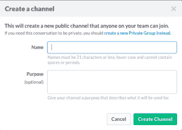

# 将 Monolog 关键日志直接发送到 Slack！

> 原文：<https://dev.to/orask/send-monolog-critical-logs-directly-to-slack-6nh>

这篇文章最初发表在我的博客 [PHP Symfony 提示&招数](http://php-symfony.uk/monolog-send-critical-logs-directly-to-slack/)

通过在 Symfony 应用程序中使用 Monolog，我们可以记录文件、发送电子邮件、登录控制台和许多其他渠道。在这篇文章中，我将一步步展示如何将`Monolog`与 *Slack* 集成。
好的一面是集成只是 config 中的一些配置问题，无需编写任何代码。因此它可以很容易地集成到任何项目中。

步骤:
1)创建松弛通道。

[](https://res.cloudinary.com/practicaldev/image/fetch/s--lrAPUwBj--/c_limit%2Cf_auto%2Cfl_progressive%2Cq_auto%2Cw_880/https://thepracticaldev.s3.amazonaws.com/i/nkjzshrnox4kef06ayl0.png)
[T6】](https://res.cloudinary.com/practicaldev/image/fetch/s--4epkg0Zf--/c_limit%2Cf_auto%2Cfl_progressive%2Cq_auto%2Cw_880/https://thepracticaldev.s3.amazonaws.com/i/h9pdxt59ib29a270yhf7.png)

2)转到[https://api.slack.com/web](https://api.slack.com/web)向下滚动到**认证**并创建认证令牌。

3)在您的 symfony 应用程序中，转到`config_prod.yml`并在`monolog`部分添加以下配置。

```
 slack:
     type: slack
     token: slack api token
     channel: channel name
     [bot_name]: defaults to Monolog
     [icon_emoji]: defaults to null
     [use_attachment]: bool, defaults to true
     [use_short_attachment]: bool, defaults to false
     [include_extra]: bool, defaults to false
     [level]: level name or int value, defaults to DEBUG
     [bubble]: bool, defaults to true 
```

Enter fullscreen mode Exit fullscreen mode

> ### Please note that `debug` will flood your channel with lots of logs, so using `critical`
> 
> ### `channel` should start with #, just like how it appears on Slack.

* * *

完整配置示例:

```
monolog:
    handlers:
        main:
            type:         fingers_crossed
            action_level: error
            handler:      nested
        nested:
            type:  stream
            path:  "%kernel.logs_dir%/%kernel.environment%.log"
            level: debug
        console:
            type:  console
        slack:
            type:       slack
            token:       xxxx-xxxxxxxxxxx-xxxxxxxxx-xxxxxxxxxx-xxxxxx
            channel:     "#name-of-channel"
            bot_name:    ChooseName
            icon_emoji: :ghost:
            level:      critical 
```

Enter fullscreen mode Exit fullscreen mode

你可以使用 Slack 上的任何表情符号。查看本页的完整列表:

[表情符号备忘单](http://www.emoji-cheat-sheet.com)

关于独白的进一步阅读，它是如何工作的..查看以下链接:

*   [用符号 2 中的独白进行记录](https://www.webfactory.de/blog/logging-with-monolog-in-symfony2)
*   [Monog 库](https://github.com/Seldaek/monolog)
*   [你可以用独白(处理程序)做的所有有趣的事情](https://github.com/Seldaek/monolog/blob/master/doc/02-handlers-formatters-processors.md)