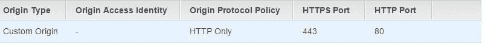
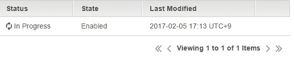
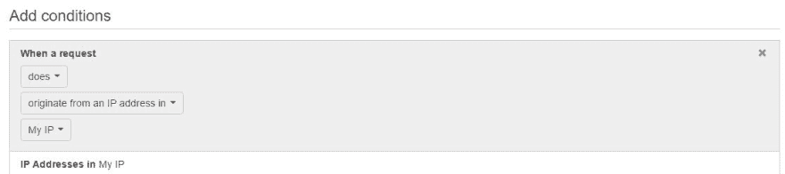
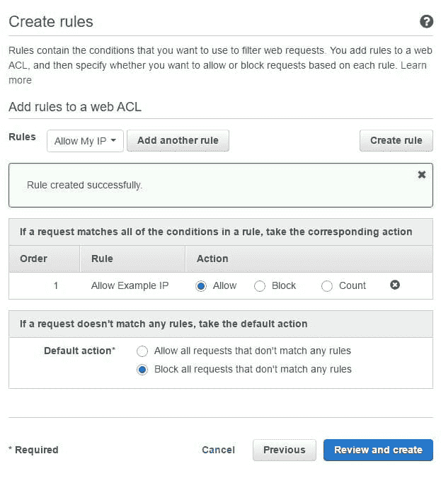

# AWS 云的无服务器后端:Cloudfront 和 WAF

> 原文：<https://dev.to/rob117/serverless-backends-with-aws-cloud-cloudfront-and-waf>

这是 AWS 无服务器架构系列的一部分。在这里和我的博客 [J-bytes](http://robsherling.com/jbytes/index.php/2017/01/08/serverless-backends-with-aws-cloud-intro/) 上都可以找到原始的博文系列。

# 云前端和防火墙

## 为什么 Cloudfront 要做一个 API？

老实说:当我的老板告诉我把 API 放到 CloudFront 上时，我想他可能是在开玩笑。为什么需要在分销网络上安装 API？设置它是这个项目中最难的部分(不，说真的)，并且与 CloudFront 的怪癖一起工作是一件痛苦的事情。

当它开始工作时，我们为什么要这么做就变得非常明显了。

你还记得在开始的时候，我说过我们假设你正在使用的站点是一个静态页面的集合(尽管它不一定是这样的)。嗯，如果你把你的 API 放在 CloudFront 上，把你的站点放在 S3，它们都在相同的 SSL 和发布设置下。这意味着没有任何单独的配置，你可以确保所有的请求自动 HTTPS 等。，所有配置都在一个方便的面板中。此外，多亏了 WAF，您的站点和 API 得到了完全相同的保护。你永远无法启动网站，但却忘记提供 API，导致用户困惑。

我们将(像往常一样)制作两个 API CloudFront 发行版——每个阶段一个。

**注意**:截至本文发布时，根据我和其他几个人的经验，cloudfront 会毫无理由地随意丢弃 API 请求。这种行为是间歇性的，但确实存在[(来源)](https://forums.aws.amazon.com/thread.jspa?threadID=182765&tstart=0)。

## S3 静态遗址

然而，首先我们需要做一个 S3 分布。这是因为我们在分布中创建的第一个起点必须有一个默认(*)的路径模式，并且捕获所有的路径，而我们不希望我们的 API 这样做。我们希望我们的/api 请求发送到我们的 api，其余的发送到我们的 S3。基本上，这只是一个占位符，所以我们只需快速装配一些东西。

去 S3 做一个新的名为“任何你想要的独特的名字——网站”的桶我们现在称之为我们的站点存储桶。编辑该桶的属性，将静态网站托管设置为**启用网站托管**，然后将索引文档设置为 index.html。将错误文档留空。[(来源)](http://docs.aws.amazon.com/AmazonS3/latest/dev/HowDoIWebsiteConfiguration.html)

上传一个名为**index.html**的文件到里面，里面有你选择的一些文本(我总是选择美味这个词，因为实在是迂回的原因，这个词是基于一个表示糟糕情况的日语单词)。确保将该文件的权限设置为**所有人** - **打开/下载**。如果操作正确，您应该能够轻松打开文件并查看其中的所有内容。让我们很快地把它放到一个分布图中，然后到精彩的部分。**请仔细阅读以下内容，因为重新部署可能需要很长时间，因此从时间上来说，故障排除成本非常高。**

*   转到 CloudFront 面板
*   单击创建分发
*   在“Web”下，单击“开始”
*   在**源域名**中，输入站点桶名，配置如下:`<bucket-name>.s3-website-<aws-region>.amazonaws.com`。[(来源)](http://docs.aws.amazon.com/AmazonS3/latest/dev/WebsiteHosting.html)
*   保持**原点路径**空白，**原点 ID** 不变，**原点自定义头**空白。
*   对于**查看器协议策略**，将其更改为“将 HTTP 重定向到 HTTPS”
*   对于**默认缓存行为设置**中的其他内容，您可以保持原样。如果您需要在您的登台环境中实时确认大量快速的站点更改，请将您的**对象缓存**设置为 Customize，并将所有 TTL 设置为 0。对于您的**分销设置**，配置您所在地区的**价格等级**。例如，我在日本，所以我们使用“仅美国、加拿大、欧洲和亚洲”你可能实际上不需要这样做，但是这是一个很好的习惯。我们还没有制作晶片(稍后我们将简单地讨论这一点)，所以就让它保持空白吧。
*   忽略其他一切，向下滚动到**启用 IPv6** 。除非你知道你需要它，否则关掉它。例如，如果这是一个 iPhone 应用程序的后端，他们的测试标准要求 ipv6 连接[(来源)](https://developer.apple.com/support/ipv6/)。
*   在注释下，写下 STAGING。
*   创建分配。
*   确保您的**原始协议策略**在 Origins 标签下显示“仅 HTTP”。我不知道为什么，但我的一个阶段默认为 HTTPS，后来它打破了我的分布。如果你的屏幕不是这样:点击编辑按钮，然后简单地点击**是，编辑**来保存你的更改。这应该有希望迫使它回到 HTTP，就像我做的那样。

## 将 API 放在 CloudFront 之后

*   点击我们刚刚制作的发行版，然后点击**原点**标签，再点击**创建原点。**
*   在**源域名**中，键入 API 的基本 URL。例如，如果你进入 API 面板，点击**stagings**，然后 **staging** ，你应该会看到一个类似`https://<letters>.execute-api.us-west-1.amazonaws.com/staging`的调用 URL。复制 URL，*不带*的/staging，粘贴到原域名框`https://<letters>.execute-api.us-west-1.amazonaws.com`
*   在**原点路径**中，写入艺名`/staging`。这就是为什么我们没有在上面写 staging 我们自动将`/staging`附加到所有到达这个域的 api 请求上。
*   保持**原始 ID** 和**原始 SSL 协议**不变
*   将**原产地协议政策**更改为仅 HTTPS。API 网关将只接受 HTTPS。
*   **HTTPS 港**为 443(现状)
*   **原产地定制头**是原样
*   点击**创建**
*   点击**行为**选项卡。
*   **创造行为**。
*   **路径模式** : `/api*`。这将匹配任何看起来像`https://<url.top>/api/endpoint`的东西。这也是我们设置 api 网关的原因，因此所有请求都在/api 资源下，因为 CloudFront 在将路径模式发送到 API 网关时会自动附加路径模式。因此，作为一个快速的解释，如果我们将 CloudFront 路径模式设置为`/api*`，但是我们的网关只是/email，然后尝试 site.com/api/email,，它将永远不会工作，因为 CloudFront 将/api/email 原样转发到我们的 api 网关。
*   将 **Origin** 改为我们刚刚创建的:Custom-letters . execute-API-stuff
*   查看器协议策略将 HTTP 重定向到 HTTPS，因为网关要求这样做。
*   **允许的 HTTP 方法**有 GET、HEAD、OPTIONS、PUT、POST、PATCH、DELETE，因为我们需要向网关发布信息。
*   **转发头**被设置为白名单，然后在框中键入“Origin”并将其“添加> >”到白名单中。这是网关所要求的。
*   对于我们的**对象缓存**，设置为自定义，然后所有 TTL 必须设置为 0。**您不希望在 API** 上有任何缓存。如果您稍后试图添加 GET api 方法，这将使请求完全不起作用。
*   **转发饼干- >全部**
*   **查询字符串转发和缓存- >全部转发，基于全部缓存**
*   其他都是 no. **Create** 。现在，如果你回到你的 Cloudfront 概览页面，你应该会在 status 上看到类似这样的内容:这可能，而且几乎肯定会，至少需要 20 分钟来更新。虽然这样做是可行的，但是继续按照上面的所有步骤再做一次，除了这次创建一个生产发行版(或者不做，我不是你的老板)。如果你这样做了，请随意将 S3 部分指向同一个桶，因为这只是一个演示。当我们还在等待的时候(说真的，这需要一段时间)我会解释 WAF。

## WAF:无线应用防火墙

您将在实际设置中使用 WAF 来保护您站点。例如，您可以将 WAF 配置为暂存，以便只有您的 IP 地址(以及您的客户的 IP 地址，如果他们必须在投入生产之前批准站点更改)可以访问。您可以将您生产站点添加到同一个晶片中(例如，在发布之前或维护期间)，然后在您准备好启动/完成维护时，只需将其从晶片中移除即可。

转到控制台中的**晶片&防护罩**。
点击**进入 AWS AWF** ，然后点击**配置 web ACL** 。如果需要，请阅读概念概述，然后点击下一个**按钮**。您可能实际上并不需要创建 WAF，所以除非您有一个静态的 IP 地址或者只是想测试它，否则您可以随意地跟随学习体验，然后删除结果。

*   ACL 名称应该是唯一的，如“防火墙”
*   **区域**是全局的(云锋)
*   **关联资源**是生产(目前)。
*   单击下一步
*   点击“IP 匹配条件”
*   **名称**是允许的示例 IP(例如)
*   **IP 版本**是 V4
*   地址是 Google 告诉你的 IP 地址，后面跟一个/32(例如:127.0.0.1/32)。如果您拥有一个范围，请用/24 添加它(参见页面上的建议)。你可以随意添加你想要的 IP 地址。请注意，除非您从 ISP 处购买了一个固定的 IP 地址，否则您不能指望这个号码不会改变。
*   点击**添加 IP 地址或范围**按钮。如果你不这样做，你会创造一个空的环境，什么也做不了。
*   单击创建。
*   单击下一步。
*   在“创建规则”页面上，单击创建规则
*   **名称**:允许实例 IP(或者真的，随便你)。在“条件”下，它应显示为:当请求“确实来自允许示例 ip 中的 IP 地址” **注意**:如果您需要添加多个 IP，请不要单击“添加条件”并在此屏幕上添加 IP。如果这样做，它将使条件“所有请求同时来自 IP 集 1 和 IP 集 2”，这是不可能的，并使这条规则完全无效。如果您在最后一页创建了多个 IP 条件(例如，一组 IP 地址代表您的公司，另一组代表您的客户)，您需要为每组创建一个单独的规则。
*   单击创建。
*   将**默认动作**更改为“阻止所有不匹配任何规则的请求”页面应该是这样的:这告诉我们，我们允许的 IP 已经被设置为允许，如果它不在我们的 IP 列表中，阻止它。
*   点击**查看并创建**
*   确认你的产品 Cloudfront 是附在底部的。
*   点击**确认并创建**如果您想将您的暂存分布添加到 WAF，只需点击屏幕右侧的**添加关联**并选择您的暂存分布即可。继续等待您的 Cloudfront 发行版更新。看 Youtube，玩游戏等等。当状态不再处于进行中时，继续进行测试。

## 测试 Cloudfront 分发版和防火墙

凉爽来了。转到您的 Cloudfront 页面。您应该在那里看到两个分布。将**域名**部分的 url 复制并粘贴到您的浏览器中，然后点击 enter。假设您正确配置了所有内容，并且来自正确的 IP(如果您在 WAF 后面),您应该会看到 index.html 页面的内容。如果你试图通过不同的 IP(移动数据智能手机)进入同一个域，你应该会看到一个禁止页面。成功！

尝试用`domain-name/api/emails`(或 twitter)在 postman 中向每个 API (staging 和 production)发送一些请求，看看会发生什么。记得省去`/staging`和`/production`，因为它们包含在原点中。您应该得到和以前一样的结果，并且数据库记录应该被正确地更新。

网站到此为止！那真是一次疯狂的旅行。接下来，我们将看到当我们需要从 Dynamodb 获取数据到本地环境并为客户保存电子邮件/发送推文时会发生什么！