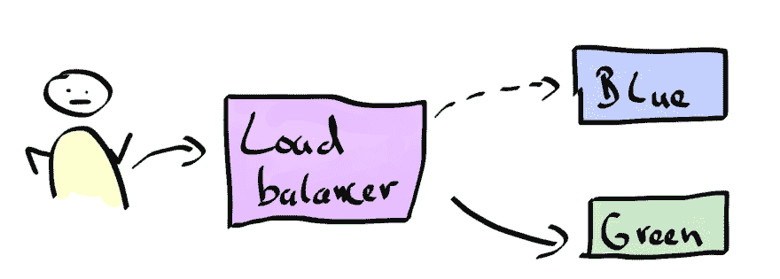
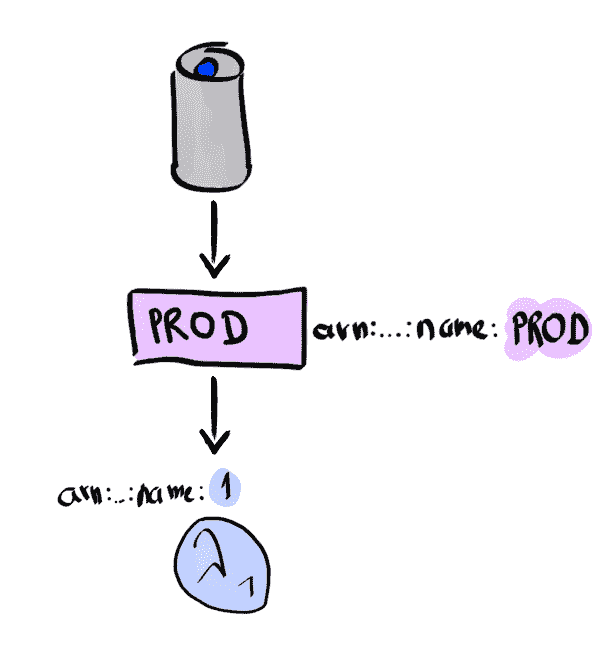
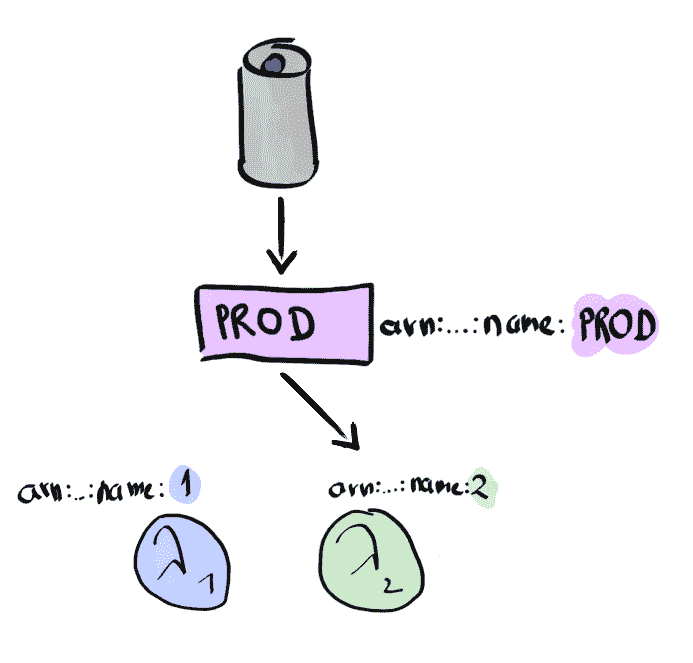

# 无服务器蓝绿色部署和金丝雀释放流量转移

> 原文：<https://dev.to/koenighotze/serverless-blue-green-deployments-and-canary-releases-with-traffic-shifting-b55>

无服务器计算是一个热门话题。特别是 AWS Lambda 正在获得牵引力。它被用作亚马逊 Alexa 产品线的基础，以及像云专家这样的整个网站的基础。我们能够以前所未有的速度为客户快速构建和释放新的商业价值。

也就是说，我们仍然希望以高速度部署工作解决方案。我们的产品发布应该是最高质量的，不应该危及任何用户或依赖系统。

通常，我们应用类似于 [Canary Releases](https://martinfowler.com/bliki/CanaryRelease.html) 和[Blue Green deployment](https://martinfowler.com/bliki/BlueGreenDeployment.html)的技术来降低投入生产的风险，并能够轻松回滚任何有问题的解决方案。

在这篇短文中，我想向你介绍 AWS Lambda *流量转移*。这个相当新的特性允许我们在一个无服务器的世界中进行金丝雀发布和蓝绿色部署。我将向您展示，如何使用它以可控的方式推出新功能，以及如何在出现问题时回滚到安全点。

如果你需要快速复习 AWS Lambda，请查看之前的[帖子](https://dev.to/koenighotze/serverless-hype-train-with-aws-lambda-21p)。

## 蓝绿色部署和金丝雀释放

在我们深入研究 AWS Lambda 流量转移之前，我们需要刷新我们对*蓝绿部署*和*金丝雀发布*的理解。

当我们将我们的解决方案部署到生产环境或更新现有解决方案时，我们希望将停机时间降至最低。在当今世界，停机 4 小时进行维护不再是可行的选择。

蓝绿色部署可以帮助我们。请看下图。

[T2】](https://res.cloudinary.com/practicaldev/image/fetch/s--ngZi_uOH--/c_limit%2Cf_auto%2Cfl_progressive%2Cq_auto%2Cw_880/https://thepracticaldev.s3.amazonaws.com/i/o8nrrh97gekqtxy9sg59.png)

客户通过负载均衡器访问我们系统的当前版本，即蓝色版本。在发布新版本(绿框)时，我们可以等待新版本稳定下来，例如进行数据库迁移等等。
当*绿色版本*可以使用时，我们可以将负载平衡器切换到新版本，而不会对客户产生任何可见的影响。此外，如果*绿色释放*出现故障，我们可以轻松切换回*蓝色释放*。如果事情出了差错，一个安全的避风港。

金丝雀发布类似于蓝绿色部署。他们试图通过向减少的用户群缓慢推出更新来降低部署新版本的风险。你可以从引导 10%的进入流量到新的*绿色释放*开始，逐步增加这个百分比，直到你达到 100%。到那时你就可以退役蓝色版本的*。*

 *## 版本和 Lambda 函数

在我们继续讨论蓝绿色部署和金丝雀之前，我们需要看看 AWS Lambda 处理我们功能的确切方式。

每当你上传你的代码到 AWS Lambda，AWS 会把你的代码存储在一个 S3 桶里。让我们使用一个简单的 Hello-World Lambda 来检查这一点:

```
exports.handler = (event, context, callback) => {
  callback(null, 'Hello World!')
} 
```

我们使用命令行创建 Lambda 函数。首先创建包含代码的 Zip 文件。

```
$ zip index.zip index.js 
```

然后创建名为`TrafficShiftDemo`的函数。注意，我用`$ROLE_ARN`引用了一个角色学习，如果你需要这方面的帮助，请看我之前的[帖子](https://dev.to/koenighotze/serverless-hype-train-with-aws-lambda-21p)...为了保持可读性，我已经截断了所有的 arns。

```
$ aws lambda create-function \
   --function-name TrafficShiftDemo \
   --runtime nodejs6.10 \
   --role $ROLE_ARN  \
   --handler index.handler \
   --zip-file fileb://index.zip

{

    "FunctionName": "TrafficShiftDemo",
    "FunctionArn": "arn:aws:...:TrafficShiftDemo",
    "Version": "$LATEST",
    ...
} 
```

我要强调的一点是`"Version": "$LATEST"`字段。顾名思义，`$LATEST`指向最新的版本。

对比一下*发布*一个 Lambda 函数。首先再次删除该功能。

```
$ aws lambda delete-function --function-name TrafficShiftDemo 
```

然后使用命令行参数`--publish`重新创建并发布该函数。

```
$ aws lambda create-function \
   --function-name TrafficShiftDemo \
   --runtime nodejs6.10 \
   --role $ROLE_ARN  \
   --handler index.handler \
   --zip-file fileb://index.zip \
   --publish

{
    "FunctionName": "TrafficShiftDemo",
    "FunctionArn": "arn:aws:...:TrafficShiftDemo",
    "Version": "1",
    ...
} 
```

代替`$LATEST`，该函数具有`1`的版本。发布的函数本质上是函数代码及其配置(如环境变量)的不可变快照。

考虑这个例子。

[T2】](https://res.cloudinary.com/practicaldev/image/fetch/s--TvU_kArA--/c_limit%2Cf_auto%2Cfl_progressive%2Cq_auto%2Cw_880/https://thepracticaldev.s3.amazonaws.com/i/ot0y6088vu2v0aeyv9f0.png)

我们发表了λ函数矩阵。版本 1、版本 2 和版本 3 可通过它们各自的版本号来识别。`$LATEST`版本总是指向上传到 AWS Lambda 的最新版本。

让我们将功能代码修改如下:

```
exports.handler = (event, context, callback) => {
  callback(null, 'Bonjour le monde!')
} 
```

现在我们通过更新 Lambda 函数来发布这个新代码(不要忘记压缩代码):

```
$ aws lambda update-function-code \
   --function-name TrafficShiftDemo \
   --zip-file fileb://index.zip \
   --publish

{
    "FunctionName": "TrafficShiftDemo",
    "FunctionArn": "arn:aws:...:TrafficShiftDemo:2",
    "Version": "2",
    ...
} 
```

现在 AWS Lambda 通知我们，那个版本`2`已经被创建。

如果我们检查函数，AWS Lambda 列出了所有版本。我使用 [JQ](https://github.com/stedolan/jq) 来提取函数 arn。

```
$  aws lambda list-versions-by-function \
    --function-name TrafficShiftDemo \
    |jq '.Versions[] | .FunctionArn'

"arn:aws:...:TrafficShiftDemo:$LATEST"
"arn:aws:...:TrafficShiftDemo:1"
"arn:aws:...:TrafficShiftDemo:2" 
```

你可以看到所谓的函数的完全限定名。我们可以用这个名字来调用不同的版本。

```
$ aws lambda invoke \
   --function-name arn:aws:...:TrafficShiftDemo:1 out.txt

{
    "ExecutedVersion": "1",
    "StatusCode": 200
}

$ aws lambda invoke \
   --function-name arn:aws:...:TrafficShiftDemo:2 out.txt

{
    "ExecutedVersion": "2",
    "StatusCode": 200
} 
```

Cloudwatch 还会报告使用了哪个版本:

```
 START RequestId: 2771b...801f Version: 1
 END RequestId: 2771b...801f
 REPORT RequestId: 2771b...801f  Duration: 33.87 ms  Billed Duration: 100 ms   Memory Size: 128 MB Max Memory Used: 19 MB

 START RequestId: 2dd66...043d Version: 2
 END RequestId: 2dd66...043d
 REPORT RequestId: 2dd66...043d  Duration: 37.58 ms  Billed Duration: 100 ms   Memory Size: 128 MB Max Memory Used: 19 MB 
```

正如我上面所说的，一个发布的函数是一个不可变的快照。这也意味着版本号不会被重用。例如，如果您删除了该函数的版本 2，然后再次发布该函数，那么您最终会得到版本 3。版本 2 永远不会被重用。

```
$ aws lambda delete-function \
   --function-name arn:aws:...:TrafficShiftDemo:2

$ aws lambda update-function-code \
   --function-name TrafficShiftDemo \
   --zip-file fileb://index.zip \
   --publish

{
    "FunctionName": "TrafficShiftDemo",
    "FunctionArn": "arn:aws:...:TrafficShiftDemo:3",
    "Version": "3",
    ...
} 
```

## 具有 Lambda 别名的稳定客户端

*别名*允许我们通过名称引用 AWS Lambda 函数的特定版本。可以把它想象成一个简单的逻辑链接，就像你在一个标准的*nix 类文件系统上所做的那样。

让我们为 Hello-World Lambda 的版本 1 创建一个别名`HELLO`。

```
$ aws lambda create-alias \
   --name HELLO \
   --function-name TrafficShiftDemo \
   --function-version 1

{
    "AliasArn": "arn:aws:...:TrafficShiftDemo:HELLO",
    "FunctionVersion": "1",
    "Name": "HELLO",
    "Description": ""
} 
```

如果我们调用别名，我们会得到我们的`Hello World`响应，正如预期的那样:

```
$ aws lambda invoke --function-name arn:aws:...:TrafficShiftDemo:HELLO out.txt

{
    "ExecutedVersion": "1",
    "StatusCode": 200
}

$ cat out.txt

"Hello World!" 
```

AWS Lambda 告诉我们，正如我们所希望的那样，我们调用了版本 1: `"ExecutedVersion": "1"`。

现在将别名指向更新的法语功能代码:

```
$ aws lambda update-alias \
   --name HELLO \
   --function-name TrafficShiftDemo \
   --function-version 2

{
    "AliasArn": "arn:aws:...:TrafficShiftDemo:HELLO",
    "FunctionVersion": "2",
    "Name": "HELLO",
    "Description": ""
} 
```

如果我们再次调用别名，我们会得到法语响应:

```
$ aws lambda invoke \
   --function-name arn:aws:...:TrafficShiftDemo:HELLO out.txt

{
    "ExecutedVersion": "2",
    "StatusCode": 200
}

$ cat out.txt
"Bonjour le monde!" 
```

有了这个，我们就有了一个稳定的客户，它只调用我们的别名，我们可以安全地替换幕后的版本，而无需接触客户。

考虑一个 Alexa 技能的例子，它引用了一个 AWS Lambda 别名，但实际上并不知道使用了哪个确切的版本。Alexa 技能仅指`PROD` Lambda 别名。这又为实际 Lambda 函数的版本 1 起了别名。

[T2】](https://res.cloudinary.com/practicaldev/image/fetch/s--gmGajcXG--/c_limit%2Cf_auto%2Cfl_progressive%2Cq_auto%2Cw_880/https://thepracticaldev.s3.amazonaws.com/i/c6a070gzb14h9m3s4xc0.png)

在升级到新的版本 2 并测试其工作正常后，我们将别名更新为指向版本 2。Alexa 技能不需要以任何方式更新。

[T2】](https://res.cloudinary.com/practicaldev/image/fetch/s--TPWp3_1c--/c_limit%2Cf_auto%2Cfl_progressive%2Cq_auto%2Cw_880/https://thepracticaldev.s3.amazonaws.com/i/ouaaoj3wicrhzkwd3ix1.png)

这一切都很好，但是我们如何确保人们喜欢我们的新 Lambda 函数，并且它的行为符合预期？这就把我们带到了金丝雀释放与交通转移。

## 使用 AWS Lambda 进行交通转移

流量转移是指与当前版本并行逐步发布更新。

让我们假设生产中有一个 Lambda 函数`1`。现在我们想发布版本`2`，但我们想以一种安全的方式推出新版本。

交通转向救援。

我们部署了两个版本，`1`和`2`。最初，所有流量都流向版本`1`。但是随着时间的推移，我们越来越多地将流量转移到版本`2`，直到有一天 100%的流量都转移到版本`2`。届时版本`1`可以退役。

AWS Lambda 别名现在支持开箱即用的特性。我们只需要使用新的命令行参数`--routing-config`。在继续之前，请检查您的 AWS CLI 工具的版本，因为这是 AWS Lambda 的新版本。其内容应如下:

```
$ aws --version
aws-cli/1.14.2 
```

首先删除上面创建的`HELLO`别名:

```
$ aws lambda delete-alias \
   --function-name arn:aws:...:TrafficShiftDemo \
   --name HELLO 
```

现在创建一个新的别名，将 70%的传入流量重定向到版本 1，其余 30%重定向到版本 2。

```
$ aws lambda create-alias \
   --name HELLO \
   --function-name TrafficShiftDemo \
   --function-version 2 \
   --routing-config AdditionalVersionWeights={'1'=0.7} 
```

`--routing-config AdditionalVersionWeights={'1'=0.7}`告诉 AWS Lambda 将 70%的流量重定向到版本 1，而不是使用版本 2。您可以通过多次调用该函数并检查响应中的`"ExecutedVersion"`来验证这一行为。

```
$ aws lambda invoke --function-name arn:aws:...:TrafficShiftDemo:HELLO out.txt

{
    "ExecutedVersion": "2",
    "StatusCode": 200
}

$ aws lambda invoke --function-name arn:aws:...:TrafficShiftDemo:HELLO out.txt

{
    "ExecutedVersion": "1",
    "StatusCode": 200
}

$ aws lambda invoke --function-name arn:aws:...:TrafficShiftDemo:HELLO out.txt

{
    "ExecutedVersion": "1",
    "StatusCode": 200
} 
```

我们终于可以发布新的 Lambda 函数，并以真正敏捷的方式检查它们的行为和影响。

## 摘要

流量转移是蓝绿部署和金丝雀发布的重要组成部分。有了这个新功能，我们可以发布新的业务功能，并了解人们如何使用它以及市场对它的反应。想想简单的事情，比如测试人们是否喜欢在流媒体服务上看到电影的更多细节，而不仅仅是标题和播放时间。

再想一想:没有额外的负载平衡器，没有额外的基础设施。这就是我所说的无服务器。

如果你想更深入地了解这个话题，我强烈建议你看一下 [AWS Codedeploy](http://docs.aws.amazon.com/codedeploy/latest/userguide/welcome.html) ，它可以进一步自动化滚动更新和回滚。例如，使用 Codedeploy，您可以将 Lambda 配置为以每 5 分钟 10%的速率升级到新版本。

在后续文章中，我将介绍一个集成示例，它将 Lambda、流量转换、Codedeploy 和无服务器应用程序模型整合到一个真正的无服务器连续交付管道中。*