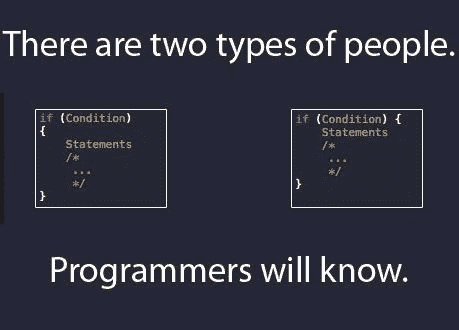
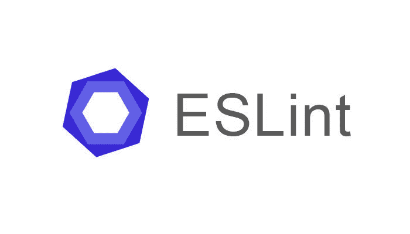

# 使用 NodeJS 为 Rails 设置自动化代码格式

> 原文：<https://dev.to/jesalg/setting-up-automated-code-formatting-for-rails-using-nodejs>

### 为什么？

[T2】](https://res.cloudinary.com/practicaldev/image/fetch/s--9eJHIn_7--/c_limit%2Cf_auto%2Cfl_progressive%2Cq_auto%2Cw_880/https://jes.al/public/wp-content/uploads/meme1.jpg)

随着我参与的一个 Rails 项目在代码行数和参与编写代码的人数方面的增长，保持代码质量和风格的一致性变得越来越具有挑战性。

很多时候，这些问题在代码评审中被提出来，在此之前它们就应该被解决，这样代码评审中的讨论就可以集中在实质上，而不是风格上。

话虽如此，我还是想在代码签入时设置一种自动修复风格问题的方法。以下是我如何着手设置的。

在我之前的博客文章中，我谈到了用 Rails 整合现代 Javascript 构建工具[，如果你已经有了类似的设置，你可以跳过接下来关于设置 NodeJS 环境的两节。如果没有，请继续阅读。](https://jes.al/2017/03/incorporating-modern-javascript-build-tools-with-rails/)

### 节点

在我们开始之前，让我们确保已经安装了 NodeJS。我发现最简单的方法是通过 nvm。Rails 开发人员会发现这与 rvm 非常相似。要安装，请运行以下命令，这将安装 nvm 和最新版本的 NodeJS:

```
$ curl -o- https://raw.githubusercontent.com/creationix/nvm/v0.32.1/install.sh | bash
$ source ~/.bash_profile
$ nvm install node
$ nvm use node 
```

Enter fullscreen mode Exit fullscreen mode

### 纱线

接下来，我们需要一个包管理器。传统上我们会使用 npm，但我发现脸书的纱线更加稳定可靠。这和 bundler 很像。要在 Debian Linux 上安装，运行下面的命令或者按照[他们的安装指南](https://yarnpkg.com/en/docs/install)为你的操作系统安装:

```
$ curl -sS https://dl.yarnpkg.com/debian/pubkey.gpg | sudo apt-key add -
$ echo "deb https://dl.yarnpkg.com/debian/ stable main" | sudo tee /etc/apt/sources.list.d/yarn.list
$ sudo apt-get update && sudo apt-get install yarn 
```

Enter fullscreen mode Exit fullscreen mode

### Git 挂钩管理

[T2】](https://res.cloudinary.com/practicaldev/image/fetch/s--vvkk95DW--/c_limit%2Cf_auto%2Cfl_progressive%2Cq_auto%2Cw_880/https://jes.al/public/wp-content/uploads/meme2.jpg)

现在，为了在签入时自动格式化代码，我们必须首先弄清楚如何运行这些林挺脚本。有几个选项:

1) Bash 脚本——您可以手动将 Bash 脚本保存为`.git/hooks/pre-commit`,并赋予它执行权限。这种方法的缺点是，您必须让团队的每个成员手动完成这项工作。此外，如果脚本中有什么变化，每个人都必须从头再来一遍。它会很快变得不可收拾。

2) [预提交](https://github.com/pre-commit/pre-commit)——这是一个非常健壮的框架，内置于 Python 中，用于管理 git 挂钩。我真的很喜欢它的一切，除了对于 RoR 项目来说，除了 Ruby 和 NodeJS 之外，它还增加了对本地环境的另一种语言依赖。同样，这也是整个团队必须手动安装(尽管每个环境只安装一次)才能启动并运行的东西。对于 Python 项目，我肯定会推荐它。

3) [过量提交](https://github.com/brigade/overcommit) ( **推荐**)——这是另一个优秀的 git 钩子管理器，非常类似于预提交，但用 Ruby 编写。它有很多内置的钩子，用于格式化 Ruby、JS、CSS 等等。它实际上是即插即用的，如果没有 NodeJS 构建管道设置，它对项目来说是完美的。它将帮助您避免引入另一种语言依赖。尽管出于这篇博文的目的，我们将使用下一个选项。如果你想使用这个选项，我会推荐你看看[这篇](https://medium.com/@kirill_shevch/lint-your-ruby-code-with-overcommit-and-static-analysis-tools-bd36d3147d2e)博客文章。

4) [哈士奇](https://github.com/typicode/husky) & [皮棉分期](https://github.com/okonet/lint-staged) ( **推荐**)——这两个 NodeJS 包充当了一记组合拳。Husky 允许您直接在 package.json 中指定要针对 git 挂钩运行的任何脚本，而 lint-staged 允许您使用一个 staged 文件列表作为参数来运行任意 npm 和 shell 任务，并在预提交时通过指定的 glob 模式进行过滤。最棒的是，一旦设置好了，你的团队除了运行`yarn install`之外什么都不用做。

要开始安装这两个软件包:

```
yarn add lint-staged husky --dev 
```

Enter fullscreen mode Exit fullscreen mode

接下来在你的包中添加一个预提交的钩子

```
{  "scripts":  {  "precommit":  "lint-staged"  },  } 
```

Enter fullscreen mode Exit fullscreen mode

最后，在根目录下创建一个空的`.lintstagedrc`文件，这是我们将集成各种 linters 的地方，我们将在下面讨论。

### JavaScript

[T2】](https://res.cloudinary.com/practicaldev/image/fetch/s--2fC9T7I7--/c_limit%2Cf_auto%2Cfl_progressive%2Cq_auto%2Cw_880/https://jes.al/public/wp-content/uploads/eslint.jpg)

所以现在我们准备好挂一些棉绒了。对于 JavaScript，有几个很好的林挺框架，从非常固执己见到非常灵活:

1) [StandardJS](https://standardjs.com/) -这是最固执己见的框架，也非常流行。它有很好的 IDE 集成，被很多大公司使用。尽管如此，我们不同意它的一些规则，也没有办法改变它们。它真的被设计成一个安装后就忘了的那种棉绒，这不是我想要的。

2) [更漂亮](https://prettier.io/)——这让我开始研究另一个非常流行的框架。更漂亮的很像 StandardJS，很好的 IDE 支持，被很好的采用。与 StandardJS 相比，它试图在一些基本规则上提供更多的灵活性。尽管它相对于 StandardJS 的主要优势在于，除了 JavaScript 及其预处理程序之外，它还能够嵌入 CSS 和 GraphQL。

3) [ESLint](http://eslint.org/) ( **推荐**)——在尝试了上面提到的两种棉绒之后，我最终选择了 ESLint，主要是因为它让我们可以根据自己的需求调整所有选项。这个框架的灵活性和可扩展性令人印象深刻。

所以让我们继续安装它:

```
yarn install eslint --dev 
```

Enter fullscreen mode Exit fullscreen mode

接下来，您需要运行设置并回答一些关于您的偏好的问题

```
./node_modules/.bin/eslint --init 
```

Enter fullscreen mode Exit fullscreen mode

根据您的回答，它将在您的项目中创建一个`.eslintrc`文件，您可以在以后手动编辑该文件。这里有一个我正在使用的:

```
env:
  browser: true
  commonjs: true
  es6: true
extends: 'eslint:recommended'
parserOptions:
  sourceType: module
rules:
  indent:
    - warn
    - 2
  linebreak-style:
    - warn
    - unix
  quotes:
    - warn
    - single
  semi:
    - warn
    - always
  no-undef:
    - off
  no-unused-vars:
    - warn
  no-console:
    - off
  no-empty:
    - warn
  no-cond-assign:
    - warn
  no-redeclare:
    - warn
  no-useless-escape:
    - warn
  no-irregular-whitespace:
    - warn 
```

Enter fullscreen mode Exit fullscreen mode

我将大多数规则设置为非阻塞警告，因为我们正在处理一些遗留代码，并希望尽可能减少开发人员的摩擦。

最后把这一行加到你的`.lintstagedrc`

```
{  "*.js":  ["eslint --fix",  "git add"]  } 
```

Enter fullscreen mode Exit fullscreen mode

### 红宝石

[T2】](https://res.cloudinary.com/practicaldev/image/fetch/s--b4255JOz--/c_limit%2Cf_auto%2Cfl_progressive%2Cq_auto%2Cw_880/https://jes.al/public/wp-content/uploads/rubocop.png)

说到鲁比·林挺，这里真的只有一个游戏，即 RuboCop。你需要做的就是把它添加到`Gemfile`中，然后运行`bundle install` :

```
gem 'rubocop', require: false 
```

Enter fullscreen mode Exit fullscreen mode

接下来在你的`.lintstagedrc` :
中添加一个钩子

```
{  "*.js":  ["eslint --fix",  "git add"],  "*.rb":  ["rubocop -a -c .rubocop-linter.yml --fail-level E",  "git add"],  } 
```

Enter fullscreen mode Exit fullscreen mode

接下来，您需要用您的配置创建`.rubocop-linter.yml`。这里有一个我们用过的:

```
AllCops:
  Exclude:
    - 'vendor/**/*'
    - 'spec/factories/**/*'
    - 'tmp/**/*'
  TargetRubyVersion: 2.2

Style/Encoding:
  EnforcedStyle: when_needed
  Enabled: true

Style/FrozenStringLiteralComment:
  EnforcedStyle: always

Metrics/LineLength:
  Max: 200

Metrics/ClassLength:
  Enabled: false

IndentationConsistency:
  EnforcedStyle: rails

Documentation:
  Enabled: false

Style/ConditionalAssignment:
  Enabled: false

Style/LambdaCall:
  Enabled: false

Metrics:
  Enabled: false 
```

Enter fullscreen mode Exit fullscreen mode

这里还有一个[列表](https://github.com/bbatsov/rubocop/wiki/Automatic-Corrections)，列出了当`-a` / `--auto-correct`标志打开时，如果你需要在文件中添加/更改任何更多的规则，RuboCop 能够做的所有自动更正。

### CSS/SCSS

[T2】](https://res.cloudinary.com/practicaldev/image/fetch/s--ll3FM553--/c_limit%2Cf_auto%2Cfl_progressive%2Cq_auto%2Cw_880/https://jes.al/public/wp-content/uploads/stylelint.png)

所以，现在我们有鲁比和 JS 林挺广场了。让我们看看如何用 CSS 做同样的事情。

1)[sass-lint](https://github.com/sasstools/sass-lint)——因为我们在项目中使用了 SASS，所以我首先查看了这个包。虽然很快意识到目前没有自动修复的选项。有一个[公关](https://github.com/sasstools/sass-lint/pull/1089)目前正在工作中，预计将在某个时候增加这一功能。但是现在我们必须去别的地方看看。

2) [stylelint](https://stylelint.io/) ( **推荐**)——最终选择了这个选项，因为它的规则集很大(在撰写本文时有 150 个)，而且它是由 postscs 支持的，postscs 理解 postscs 可以解析的任何语法，包括 SCSS、SugarSS 等等。唯一的缺点是，自动修复功能是实验性的，但无论如何值得一试。

所以让我们继续安装它:

```
yarn add stylelint --dev 
```

Enter fullscreen mode Exit fullscreen mode

接下来在你的`.lintstagedrc` :
中添加一个钩子

```
{  "*.js":  ["eslint --fix",  "git add"],  "*.rb":  ["rubocop -a -c .rubocop-linter.yml --fail-level E",  "git add"],  "*.scss":  ["stylelint --fix",  "git add"]  } 
```

Enter fullscreen mode Exit fullscreen mode

同样，这是一个非常可配置的包，有许多选项，你可以在一个`.stylelintrc`文件中管理它们。

为了与，我可能只是建议扩展[stylelint-config-standard](https://github.com/stylelint/stylelint-config-standard)或[stylelint-config-recommended](https://github.com/stylelint/stylelint-config-recommended)预置。

这里有一个`.stylelintrc` :
的例子

```
{  "extends":  "stylelint-config-standard",  "rules":  {  /*  exceptions  to  the  rule  go  here  */  }  } 
```

Enter fullscreen mode Exit fullscreen mode

### HAML

[T2】](https://res.cloudinary.com/practicaldev/image/fetch/s--wU_yBVR2--/c_limit%2Cf_auto%2Cfl_progressive%2Cq_auto%2Cw_880/https://jes.al/public/wp-content/uploads/haml.jpg)

至于模板引擎，我们的项目使用 HAML，但不幸的是，我找不到任何自动格式化的解决方案。 [haml-lint](https://github.com/brigade/haml-lint) 有一个[的开放标签](https://github.com/brigade/haml-lint/issues/217)来添加这个特性，但是看起来实现起来不是很容易。

因此，在此之前，您可以选择只连接 linter，这样它就可以提供关于您的标记的反馈，您必须手动纠正这些反馈。

首先，将宝石添加到您的`Gemfile` :

```
gem 'haml_lint', require: false 
```

Enter fullscreen mode Exit fullscreen mode

接下来在你的`.lintstagedrc` :
中添加一个钩子

```
{  "*.js":  ["eslint --fix",  "git add"],  "*.rb":  ["rubocop -a -c .rubocop-linter.yml --fail-level E",  "git add"],  "*.scss":  ["stylelint --fix",  "git add"]  "*.haml":  ["haml-lint -c .haml-lint.yml",  "git add"],  } 
```

Enter fullscreen mode Exit fullscreen mode

接下来，您需要用您的配置创建`.haml-lint.yml`。这里有一个你可以用的:

```
# Whether to ignore frontmatter at the beginning of HAML documents for
# frameworks such as Jekyll/Middleman
skip_frontmatter: false

linters:
  AltText:
    enabled: false

  ClassAttributeWithStaticValue:
    enabled: true

  ClassesBeforeIds:
    enabled: true

  ConsecutiveComments:
    enabled: true

  ConsecutiveSilentScripts:
    enabled: true
    max_consecutive: 2

  EmptyScript:
    enabled: true

  HtmlAttributes:
    enabled: true

  ImplicitDiv:
    enabled: true

  LeadingCommentSpace:
    enabled: true

  LineLength:
    enabled: false

  MultilinePipe:
    enabled: true

  MultilineScript:
    enabled: true

  ObjectReferenceAttributes:
    enabled: true

  RuboCop:
    enabled: false

  RubyComments:
    enabled: true

  SpaceBeforeScript:
    enabled: true

  SpaceInsideHashAttributes:
    enabled: true
    style: space

  TagName:
    enabled: true

  TrailingWhitespace:
    enabled: true

  UnnecessaryInterpolation:
    enabled: true

  UnnecessaryStringOutput:
    enabled: true 
```

Enter fullscreen mode Exit fullscreen mode

或者，您也可以通过运行以下命令并在上面的配置文件中包含排除文件(`inherits_from: .haml-lint_todo.yml`)来排除所有存在林挺问题的现有 HAML 文件，以简化启动过程:

```
haml-lint --auto-gen-config 
```

Enter fullscreen mode Exit fullscreen mode

### 结论

那都是乡亲们！在连接自动格式化程序的几个星期后，我们的代码库在每次提交时看起来更加一致了。代码评审现在可以关注更重要的反馈。

*这篇文章最初发表在[我的博客](https://jes.al/2017/08/setting-up-automated-code-formatting-for-rails/)上。如果你喜欢这篇文章，请在社交媒体上分享，并在推特上关注我！*