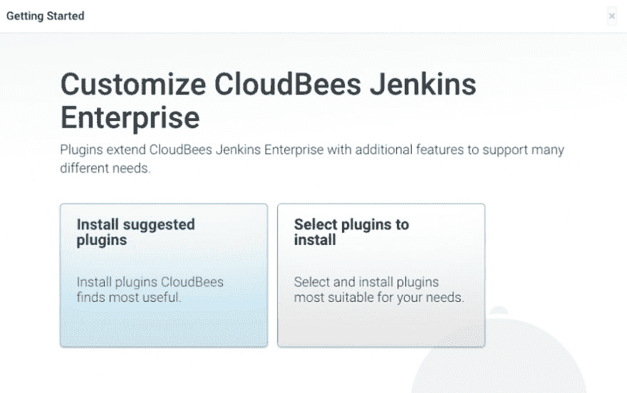
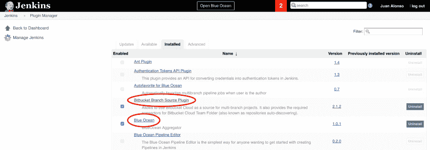
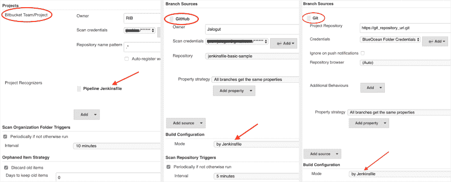

# Jenkins Pipelines 和 Blue Ocean 只需 4 个步骤即可建立连续集成/交付系统

> 原文：<https://dev.to/jalogut/setup-continuos-integrationdelivery-system-in-just-4-steps-with-jenkins-pipelines-and-blue-ocean>

既然第一个稳定版本的[蓝海插件](https://jenkins.io/projects/blueocean/)已经发布，设置你与 Jenkins 的持续集成/交付比以往任何时候都更容易和更酷。 [Jenkins](https://jenkins.io/) 在最近几年也有了很大的发展，使得设置自动化服务器变得更加容易，只需几个步骤就可以完成构建。

首先，让我们澄清一下我们将在本教程中使用的一些概念:

**[多分支管道](https://wiki.jenkins-ci.org/display/JENKINS/Pipeline+Multibranch+Plugin) :** 管道，尤其是多分支管道，是 Jenkins 的游戏改变者。多亏了这个插件，你可以简单地设置你的库 url，Jenkins 会识别你所有的分支。它还会在新提交时自动开始新的构建，因此不再需要 webhooks 或繁琐的配置。

**[詹金斯档案](https://jenkins.io/doc/book/pipeline/jenkinsfile/) :** 连同管道`Jenkinsfile`的新概念被引入。这是您在 repo 中创建的文件，其中包含您的管道配置。Jenkins 将在您的分支中查找这个文件，并根据其中定义的阶段执行构建。这使得将您的管道配置与您的项目一起置于版本控制之下成为可能。

**[蓝海](https://jenkins.io/projects/blueocean/) :** 这个插件是每个使用 jenkins 管道的人必备的。蓝海 it 是一个开源插件，它重新思考了 Jenkins 的用户体验。最令人惊奇的特性是漂亮的管道用户界面，允许快速直观地理解构建状态。如果 Jenkins 糟糕的用户体验阻碍了你使用它，那就没有更多的理由了。

好了，现在这些概念都清楚了，让我们看看如何通过 4 个步骤建立并运行我们的持续交付环境:

### 1。Jenkins 安装:

您可以按照官方文档中的 *OS* 或 *Docker* 的安装步骤进行操作:

*   [https://jenkins.io/doc/book/getting-started/installing/](https://jenkins.io/doc/book/getting-started/installing/)

对于这篇文章，我们假设你使用的是 Ubuntu。您可以作为 sudo 登录到您的系统，并执行以下命令:

```
wget -q -O - https://pkg.jenkins.io/debian/jenkins-ci.org.key | sudo apt-key add -
sudo sh -c 'echo deb http://pkg.jenkins.io/debian-stable binary/ > /etc/apt/sources.list.d/jenkins.list'
sudo apt-get update
sudo apt-get install jenkins 
```

这将自动创建一个 jenkins 用户和守护程序来监听端口 8080。这意味着您的 Jenkins 系统现在可以在`http://<your_ip>:8080`到达。如果你在本地测试，那就是`http://127.0.0.1:8080`

如果您不知道您的服务器公共 IP，您可以执行`ifconfig`来获取此信息。

打开网址，按照[安装向导](https://jenkins.io/doc/book/getting-started/installing/#post-install-setup-wizard)进行操作。在这里，我们建议您选择默认选项来安装建议的插件。

[T2】](https://res.cloudinary.com/practicaldev/image/fetch/s--o1FtSwu3--/c_limit%2Cf_auto%2Cfl_progressive%2Cq_auto%2Cw_880/https://thepracticaldev.s3.amazonaws.com/i/4tggspeafhjnlryphjxj.png)

### 2\. Intall Plugins

*   转到`Manage Jenkins > Manage Plugins > Available`并通过`Blue Ocean`过滤。
*   选择并安装
*   如果您使用 *Bitbucket* 作为您的存储库，您还必须安装`Bitbucket Branch Source Plugin`

[T2】](https://res.cloudinary.com/practicaldev/image/fetch/s--XZQ6hhev--/c_limit%2Cf_auto%2Cfl_progressive%2Cq_auto%2Cw_880/https://thepracticaldev.s3.amazonaws.com/i/fqxqqg6jpohnywjqszrf.png)

### 3\. Jenkinsfile

*   在您的项目存储库根目录中，创建一个名为`Jenkinsfile`的新文件。这个文件是用`Groovy`写的，它将定义你的`Pipeline Stages`配置。对于本教程，只需复制下面的虚拟示例，并将其粘贴到刚刚创建的`Jenkinsfile`中。
*   保存它，提交并推送。

```
node {
    // Clean workspace before doing anything
    deleteDir()

    try {
        stage ('Clone') {
            checkout scm
        }
        stage ('Build') {
            sh "echo 'shell scripts to build project...'"
        }
        stage ('Tests') {
            parallel 'static': {
                sh "echo 'shell scripts to run static tests...'"
            },
            'unit': {
                sh "echo 'shell scripts to run unit tests...'"
            },
            'integration': {
                sh "echo 'shell scripts to run integration tests...'"
            }
        }
        stage ('Deploy') {
            sh "echo 'shell scripts to deploy to server...'"
        }
    } catch (err) {
        currentBuild.result = 'FAILED'
        throw err
    }
} 
```

### 4。设置多分支管道

*   进入 jenkins 主页，点击`new Item`。为您的工作命名并选择`Multibranch Pipeline`。

    *   如果使用*位桶*，则必须选择`Bitbucket Team/Project`选项。
*   之后，我们需要配置存储库 url 和凭证。根据您的源代码控制系统(Bitbucket、github、git)，您可以在下面的截图中看到这样的例子:

    *   这里非常重要的一点是，您选择`Jenkinsfile`作为构建配置模式。

    [T2】](https://res.cloudinary.com/practicaldev/image/fetch/s--ueoJUvyK--/c_limit%2Cf_auto%2Cfl_progressive%2Cq_auto%2Cw_880/https://thepracticaldev.s3.amazonaws.com/i/92p77kpbdvrrgy15sd8o.png)

*   单击保存。你会注意到詹金斯开始扫描你的回购协议，寻找你所有的分支机构。事实上，詹金斯正在做的，是在你的分支内部寻找`Jenkinsfiles`。

*   点击标题`Blue Ocean`按钮。

*   瞧！您只需设置一个连续的交付系统，该系统将自动扫描、构建和部署存储库中的所有分支。

*   现在点击`Blue Ocean`管道分支，看看它看起来有多棒。

您可能已经注意到，我们的`Jenkinsfile`只是定义阶段并打印一些`echos`。这个想法是你用你实际的脚本替换这些`echos`。你可以在下面的链接中看到我们为 Magento 2 版本所做的真实例子:

*   [Jenkinsfile 真实例子](https://github.com/jalogut/jenkinsfile-basic-sample/blob/master/Jenkinsfile.realExample.groovy)

您还可以在这里找到关于`Jenkinsfile`选项和语法的更多信息:

*   [https://jenkins.io/doc/book/pipeline/jenkinsfile/](https://jenkins.io/doc/book/pipeline/jenkinsfile/)

在后续文章中，我将解释如何更进一步，在共享存储库中为所有项目只保留一个管道配置。敬请期待！