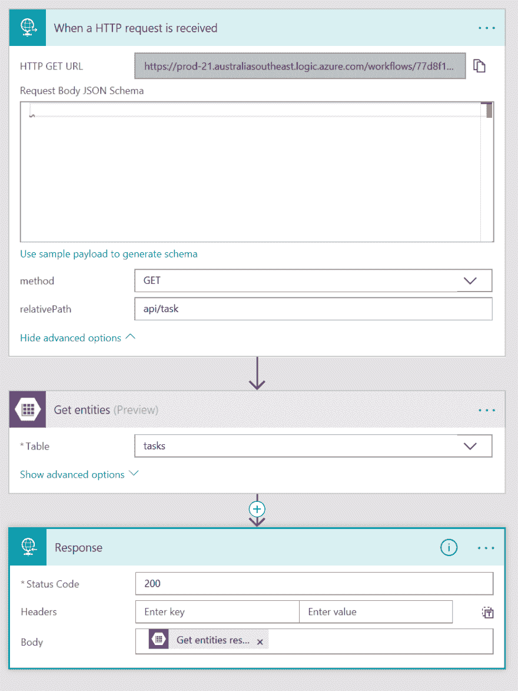
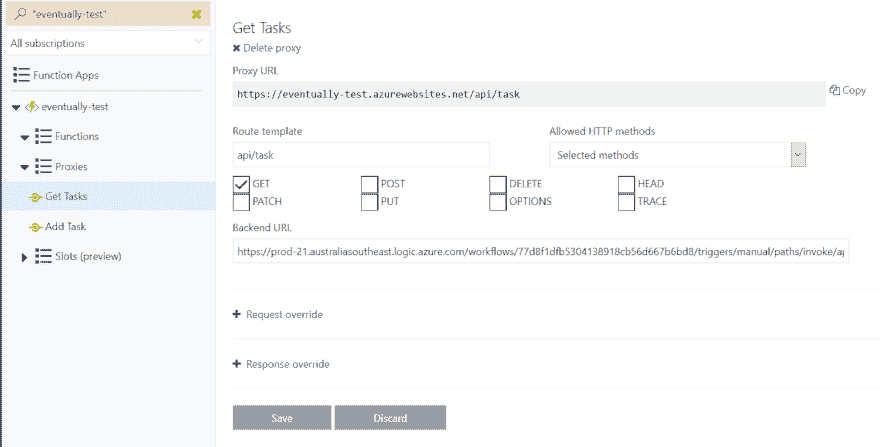

# 具有微软流程和 Azure 功能的简单 API

> 原文：<https://dev.to/azure/simple-apis-with-microsoft-flow-and-azure-functions-2hcb>

当我为一个博客帖子/演讲/OSS 项目/等做演示时。我倾向于创建一个 ASP.NET 核心应用程序或 Node.js 应用程序，并将其放在某个地方进行托管。但是它总是有点乏味，不管我做多少次，它都需要我找出旧的样板代码，然后把它放在某个地方。

最近，我想创建一个概念验证，但我想让数据持久化，我真的不在乎如何持久化数据，只是它需要持久化。建立一个 Azure SQL 实例是多余的，这是一个概念验证，所以我可能有一打记录在里面。好吧，我想我可以把它写到磁盘上的一个文件中，但是作为一个应用服务，这并不太好，下一次部署将会杀死它，所以我想为什么不使用 Azure 表。

嗯，这很简单，但是当我真的想发送一些值并存储它们以便从另一个 API 调用中检索时，我需要编写一堆代码来让它工作。

好吧，对于我试图解决的问题的一个非常小的部分来说，这真的是一个很大的工作量，我感觉在我的未来有一群肖恩·雅克在周围...

## 进入微软流程

我已经玩了[微软流程](https://flow.microsoft.com/?WT.mc_id=devto-blog-aapowell)有一段时间了，这是一个很好的自动化方式，它类似于 [IFTTT](https://ifttt.com/) ，但与 O365 和其他 MS 服务集成得很好。我喜欢的一个流连接器是 HTTP 连接，它创建了一个 HTTP 端点，您可以使用它来调用您的流！

这听起来是个不错的起点，不是吗？我可以创建一个流，它是一个 HTTP 端点，然后有一个 [Azure 表存储连接器](https://docs.microsoft.com/en-au/connectors/azuretables/?WT.mc_id=devto-blog-aapowell)，它可以读写表存储。

那么，这看起来很简单，不是吗？

[T2】](https://res.cloudinary.com/practicaldev/image/fetch/s--4Y3XWppX--/c_limit%2Cf_auto%2Cfl_progressive%2Cq_auto%2Cw_880/https://www.aaron-powell.cimg/flow-functions/001.PNG)

但是使用 Flow 作为 HTTP 端点也有一些缺点，一个是生成的 URL，它看起来像这样:

```
https://prod-21.australiasoutheast.logic.azure.com/workflows/77d8f1dfb5304131918db56d667b6bd8/triggers/manual/paths/invoke/api/task?api-version=2016-06-01&sp=%2Ftriggers%2Fmanual%2Frun&sv=1.0&sig=HRN8KhwMbox9fbsGXJRG9y-As4VQkMilRgMe2NbqQ2A 
```

是的，这不是一个特别简单的网址。另一个问题是，如果您正在构建任何 CRUD，您将不得不使用一堆不同的 URL，因为每个流都将有一个唯一的 URL(当然，您可以通过让流接受许多不同的 HTTP 方法，然后根据它是什么进行内部分支来解决这个问题，但这会使流变得复杂)。

## 输入 Azure 函数代理

Azure Functions 是微软在无服务器架构中的入口，它有一个简洁的功能，叫做[功能代理](https://docs.microsoft.com/en-us/azure/azure-functions/functions-proxies?WT.mc_id=devto-blog-aapowell)。

函数代理顾名思义，是另一个端点的代理(或者您可以用它来模仿一个端点)。现在，您可能已经明白我在做什么了，创建一个代理来用代理包装流 URL！

[T2】](https://res.cloudinary.com/practicaldev/image/fetch/s--1z1GihZg--/c_limit%2Cf_auto%2Cfl_progressive%2Cq_auto%2Cw_880/https://www.aaron-powell.cimg/flow-functions/002.PNG)

这给了我一个来自 Azure 函数的友好的 URL，我可以定义一个路由模板(例如:`/api/tasks`)来挂掉我从 Azure 函数得到的主机名。

现在，我能够隐藏我的流 URL，以便从我的应用程序中轻松使用，如果我的 PoC 成为一个真正的应用程序，我可以将代理中的流 URL 替换为另一个 AppService 或 Azure 函数。

## 结论

创建一个 Azure 函数代理很容易使用，它将包装你的丑陋的 URL 进行测试。我为此使用了 Flow，但你也可以使用[逻辑应用](https://azure.microsoft.com/en-us/services/logic-apps/?WT.mc_id=devto-blog-aapowell)，它们是与 Flow 相同的基础设施，但它们是 Azure 门户的一部分(而不是一个独立的服务)，并且更容易与 CI/CD 管道或 Azure CLI 集成。