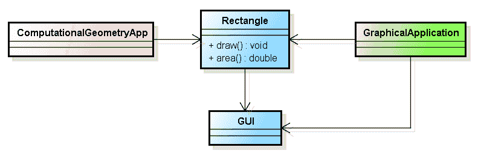
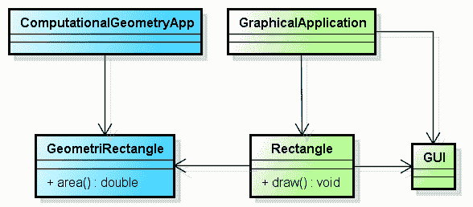

# 单一责任原则做得对

> 原文：<https://dev.to/riccardo_cardin/single-responsibility-principle-done-right-15eo>

*原贴于:[大泥球](http://rcardin.github.io/)T3】*

我是 Robert C. Martin 的《坚实的编程原则》的忠实粉丝。在我看来，当鲍勃叔叔第一次在书中定义它们时，他做了一件伟大的工作。特别是，我认为单一责任原则是这些原则中最有力的原则之一，但也是最容易引起误解的原则之一。它的定义没有给出如何应用它的任何严格的细节。每个开发人员都根据自己的经验和知识来定义什么是责任。好吧，也许我找到了一种方法，在开发过程中规范这个原则的应用。让我来解释一下。

## 单一责任原则

因为它是用来做所有的大故事，我认为最好从头开始。2006 年，Robert C. Marting，又名 Bob 叔叔，在《C# 中的敏捷原则、模式和实践》一书中收集了一系列代表清洁编程基础的文章。单词 SOLID 的每个字母都代表一个编程原则:

*   S 代表单一责任原则
*   **O** 代表开闭原理
*   L 代表利斯科夫替代原理
*   **I** 代表界面分离原理
*   **D** 代表依赖倒置原则

尽管有响亮的名字和背后明显的营销意图，在上述原则中描述了一些有趣的面向对象编程的最佳实践。

单一责任原则是五项原则中最著名的一项。罗伯特用了一句非常吸引人的话来定义它:

> 一个类应该只有一个改变的理由。

嘣。简洁，吸引人，却又如此暧昧。为了解释这个原理，作者使用了下面的类图中总结的一个例子。

[T2】](https://res.cloudinary.com/practicaldev/image/fetch/s--BchUpsLU--/c_limit%2Cf_auto%2Cfl_progressive%2Cq_auto%2Cw_880/http://rcardin.github.io/assets/2017-12-26/srp_wrong_design.png)

在上面的例子中，据说类`Rectangle`至少有*两个职责*:在 GUI 上画一个矩形并计算这个矩形的面积。真的很糟糕吗？嗯，是的。例如，这种设计迫使`ComputationalGeometryApp`类依赖于`GUI`类。

此外，拥有一个以上的职责意味着，每当与用户界面相关的需求发生变化时，类`ComputationalGeometryApp`也有可能发生变化。这也是*职责*和*理由*之间的联系。

完全遵循单一责任原则的设计如下。

[T2】](https://res.cloudinary.com/practicaldev/image/fetch/s--yqWiWfDw--/c_limit%2Cf_auto%2Cfl_progressive%2Cq_auto%2Cw_880/http://rcardin.github.io/assets/2017-12-26/srp_design.png)

按照上面类图中的描述来安排类之间的依赖关系，几何应用程序不再依赖于用户界面。

## 单一责任原则的阴暗面

嗯，这可能是我的一个问题，但我曾经认为，一个原则应该以两个不同的人以同样的方式理解它的方式来定义。不应该留有解释的余地。应该使用*定量方法*而不是*定性方法*来定义原则。大概，我的错来自于我的数学提取。

鉴于单一责任原则的上述定义，很明显，它没有数学上的严密性。

每个开发人员都可以用自己的经验赋予责任一词不同的含义。关于责任，最常见的误解是哪一个是要实现的正确目标。

最近，编程领域一位“著名”的博客作者 Yegor Bugayenko 在他的博客上发表了一篇文章，他在文章中讨论了单责任原则是一个骗局: [SRP 是一个骗局](http://www.yegor256.com/2017/12/19/srp-is-hoax.html)。在这篇文章中，我认为他对责任的概念做了错误的解释。

他从一个简单的类型开始，目的是管理存储在 AWS S3 中的对象。

```
class AwsOcket {
    boolean exists() { /* ... */ }
    void read(final OutputStream output) { /* ... */ }
    void write(final InputStream input) { /* ... */ }
} 
```

Enter fullscreen mode Exit fullscreen mode

在他看来，上述阶层负有不止一项责任:

1.  检查 AWS S3 中的对象是否存在
2.  阅读其内容
3.  修改其内容

嗯。因此，他提议将这个班级分成三种不同的新类型，`ExistenceChecker`、`ContentReader`和`ContentWriter`。对于这种新类型，为了读取内容并将其打印到控制台，需要以下代码。

```
if (new ExistenceChecker(ocket.aws()).exists()) {
  new ContentReader(ocket.aws()).read(System.out);
} 
```

Enter fullscreen mode Exit fullscreen mode

正如你所看到的，叶戈尔的经历驱使他定义了过于精细的职责，导致了三种明显不合适的类型**内聚**。

叶戈尔演绎的问题在哪里？理解单一责任原则的关键是什么？*凝聚力*。

## 这都是关于凝聚力的

说实话，鲍勃大叔用下面两句话打开了专门讨论单一责任原则的章节。

> 这个原理在汤姆·狄马克和梅里尔·佩奇-琼斯的著作中有所描述。他们称之为凝聚力。他们把内聚定义为一个模块中元素的功能相关性。

维基百科将凝聚力定义为

> 一个模块内的元素属于一起的程度。在某种意义上，它是一个类的方法和数据与该类所服务的某种统一目的或概念之间的关系强度的度量。

那么，单一责任原则和衔接之间的关系是什么？当我们不确定一个类型是否拥有多个职责时，内聚性给了我们一个正式的规则。如果一个类型的客户端总是倾向于使用该类型的所有功能，那么该类型可能是高度内聚的。这意味着它只有一个责任，因此也只有一个改变的理由。

事实证明，就像开闭原则一样，你不能说一个类是否孤立地实现了单一责任原则。您需要查看它的*输入依赖关系*。换句话说，*一个类的客户定义它是否满足原则*。

令人震惊。

回顾叶戈尔的例子，很明显他创建的三个类，考虑到以这种方式坚持单一责任原则，是松散结合的，因此是紧密耦合的。类别`ExistenceChecker`、`ContentReader`和`ContentWriter`可能会一直一起使用。

### 推至极限:对依赖程度的影响

在文章[依赖](http://rcardin.github.io/programming/oop/software-engineering/2017/04/10/dependency-dot.html)中，我定义了一个数学框架来推导类型间依赖的*程度。自然产生的问题是:应用上面的推理，整体架构的依赖程度是降低了还是增加了？*

好吧，首先，让我们回忆一下如何获得一个类型`A`的总依赖度。

$ $
\delta_{tot}^{a} = \ frac { 1 } { n } \ display style \ sum _ { c _ j \ in { c _ 1，\dots，C_n}} \delta_{A \to C_j }
$$

在我们的例子中，类型`A`是类`AwsOcket`的客户端。回想一下\(\delta_{A \to C_j }\)的值的范围在 0 和 1 之间，在没有任何动机的情况下将类`AwsOcket`分成三个不同的类型不会增加客户端`A`的整体依赖程度。事实上，规范化因子\(\frac{1}{n}\)向我们保证重构过程不会增加局部依赖程度。

整个架构的整体程度反而会增加，因为我们有三个新类型仍然依赖于`AwsOcket`。

这是否意味着我在帖子中给出的单责任原则的观点是错误的？不，不是的。然而，它向我们表明，数学框架是不完整的。或许，依赖程度的公式应该是递归的，以便考虑新的紧耦合类型的增加。

## 结论

从罗伯特·c·马丁对单一责任原则的定义出发，我们展示了误解它是多么简单。为了给出一些更正式的定义，我们展示了如何从衔接的角度来看待这一原则。最后，我们试图给出我们所做的数学证明，但我们得出的结论是，我们使用的框架是不完整的。

这篇文章总结了 2017 年。我想感谢所有在这一年里花时间阅读我的帖子的人。2018 年我一定会回来。敬请关注。

新年快乐。

## 参考文献

*   第八章:单一责任原则。C#中的敏捷原则、模式和实践，Robert C. Martin，Micah Martin，2006 年 3 月，Prentice Hall
*   SRP 是一个骗局
*   [依赖关系](http://rcardin.github.io/programming/oop/software-engineering/2017/04/10/dependency-dot.html)