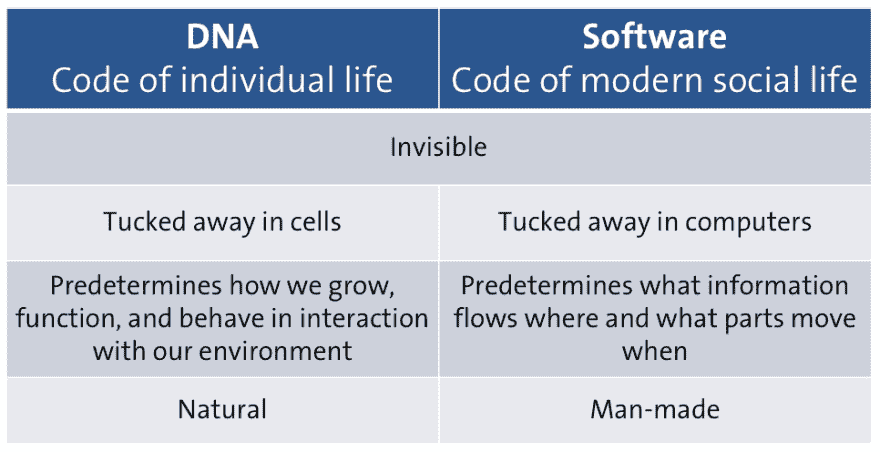
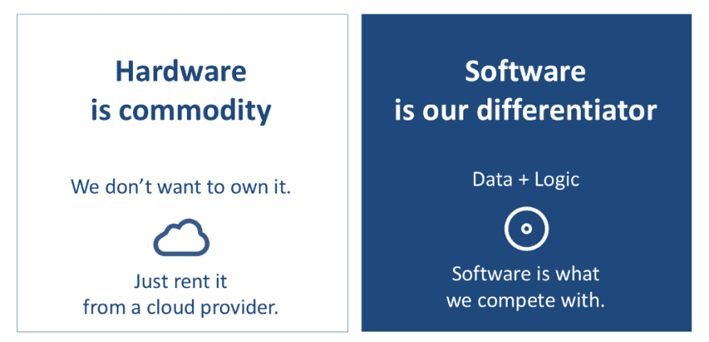

# 软件:越来越快，但是怎么做？

> 原文：<https://dev.to/jstvssr/software-more-and-faster-but-how-3ndo>

#### 可持续经营需要掌握软件

#### **软件是我们信息社会的 DNA**

我们做任何事情都依赖软件。旅游、支付、娱乐、医疗、贸易、制造、教育。如今，几乎每一项人类活动都涉及软件。正如 DNA 预先决定了我们如何与环境互动，软件也决定了物体如何移动和信息如何流动。

<figure> 

<figcaption>如果软件是我们现代信息社会的 DNA，它是自主进化还是在我们的控制下进化？另请参见[“您的软件符合标准吗？—掌握我们信息社会的 DNA "](http://www.cs.ru.nl/J.Visser/wp-content/uploads/2012/12/2012-12-06-Inaugural-address-Joost-Visser.pdf)</figcaption>

</figure>

#### **软件为了生存需要进化**

用户的需求是变化的。平台会改变。规定变了。软件需要适应。越来越多的情况下，软件是竞争市场中的差异化因素，或者说是进入市场的先决条件。无法快速创建新软件解决方案或调整现有解决方案的企业无法保持相关性和竞争力。

<figure> 

<figcaption>软件正在吞噬世界。竞争会吃掉那些不掌握软件的企业。</figcaption>

</figure>

#### 自动化和生态系统是主要趋势

软件开发人员试图满足这种生产更多软件和更快发展软件的需求。两个重要的当前趋势支持在软件开发中增加自动化和*重用*:

1.  自动化:现代软件开发团队努力使尽可能多的软件开发过程自动化。例子是持续集成、自动化测试和部署，以及低代码环境(与耶鲁安·海曼斯一起检查关于低代码趋势的[平衡观点](https://medium.com/softwareimprovementgroup/low-code-wave-of-the-future-or-blast-from-the-past-7fcd618371b2#.bzpsgrn4u))。自动化有助于提高开发速度，限制知识消耗，并将质量构建到每一步中。
2.  生态系统:现代团队越来越多地通过组合第三方的部分解决方案来创建新系统，而不是从头开始构建软件系统。复杂的新功能是用有限的代码创建的，将库、框架和外部 web 服务粘合在一起。开放平台释放了合作伙伴、客户和用户社区的创造力。

#### 隐现混乱

随着开发工具和第三方组件以极低的成本随处可得，**软件市场变得越来越竞争激烈**。初创企业、技术供应商和社区驱动的开源计划经常推出新的和改进的解决方案，这些解决方案可能会随时扰乱现有的业务。老牌企业面临着被法规、安全要求、技术债务、遗留代码、过时技术和架构复杂性拖慢脚步的风险，为了实现数字化转型的雄心，它们需要计划逃离遗留问题。

[【网上研讨会】逃离遗留问题——软件改进小组](https://www.sig.eu/insight/webinar-escape-from-legacy-mountain/)

#### 掌握软件的两大成功因素

致力于可持续的、有竞争力的业务的组织必须**掌握软件的创造和发展**。高生产率和可预测的软件开发管理依赖于两个成功因素:

1.  **产品超过过程**:成功的软件管理清楚地看到最终最重要的东西:高质量的软件产品。太多的组织试图只通过过程来控制软件开发，包括大量的文档、正式的方法、决策和报告结构。
2.  实用的度量:成功的软件管理有效地利用了产品和过程的有意义的度量。太多的组织主要依靠直觉、道听途说和未经测试的假设来评估他们产品的状态和过程的有效性。

当管理人员和开发人员在软件生产生命周期的任何时刻对他们的软件产品的状态有了一个清晰的、量化的视图时，他们就能够在引入缺陷时进行纠正，根据需要修改设计，并通过受控的迭代来适应他们发展的业务需求。对软件生产管道中所有阶段的度量允许自动化程度、重用、生产率和技术质量的增量改进。**可持续的商业需要掌握软件。**

Joost Visser 是软件改进小组的首席技术官，是 Radboud 大学大规模软件系统的教授，也是 O'Reilly 著作《构建可维护软件》和《构建软件团队》的作者。

*   [建立软件团队](http://shop.oreilly.com/product/0636920048565.do)
*   [构建可维护的软件，Java 版](http://shop.oreilly.com/product/0636920049159.do)

* * *