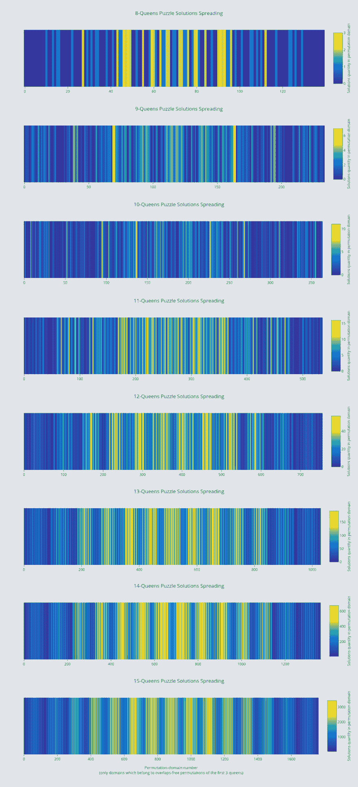

# N 皇后问题的解分布

> 原文：<https://dev.to/zubetto/solutions-distribution-of-the-n-queens-problem-3nl>

我想分享一些玩 N 皇后问题解决程序的有趣结果。下面的图表示了取决于皇后子集排列的解数分布。这种分布是通过迭代这种子集的可能排列并对包含当前排列的所有解的数量进行计数(即，通过为每个排列求解 N 皇后完成问题)来建立的。在这种特殊情况下，子集由占据前三个相邻列的三个皇后组成，并且仅枚举没有重叠的排列(没有人互相攻击)。子集长度影响图的分辨率，但不影响分布的一般性质。

[T2】](https://res.cloudinary.com/practicaldev/image/fetch/s--M0bmt3gT--/c_limit%2Cf_auto%2Cfl_progressive%2Cq_auto%2Cw_880/https://thepracticaldev.s3.amazonaws.com/i/0iiedd6qg31toxbdkuoh.jpg)

[在这里](https://plot.ly/create/?fid=Zubetto:7)你可以看到 N = 13，14 的结果和数据...17