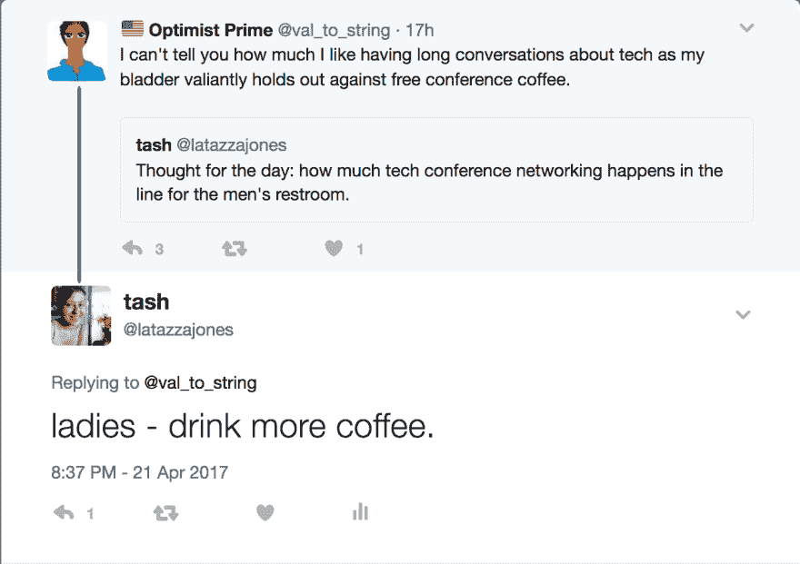
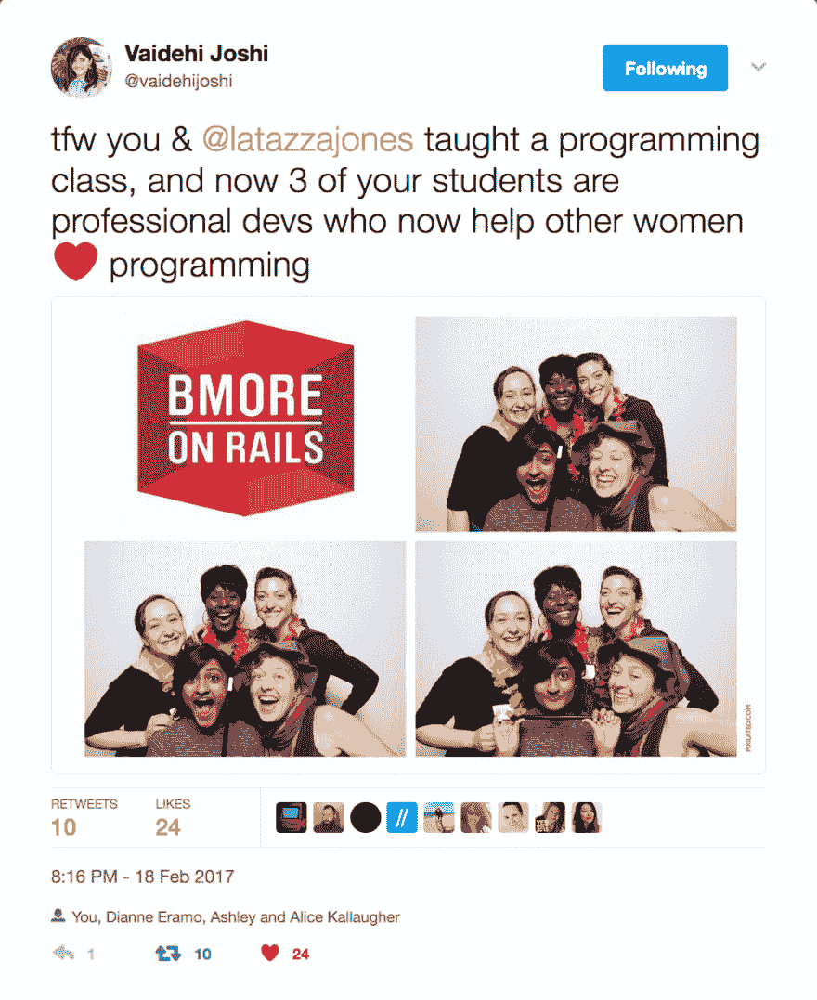

# 关于解构 2017 的一些思考

> 原文：<https://dev.to/latazzajones/some-thoughts-on-deconstruct-2017>

晚上 10 点我坐在机场，筋疲力尽。在过去的两天里，解构会议是一个惊人的，令人沮丧的，鼓舞人心的野生组合。作为一个开发者，我很受鼓舞，作为一个活动组织者，我很受鼓舞，但作为一个女人，我筋疲力尽。

解构是一个技术不可知论的会议，由加里·伯恩哈特精心制作和策划，我从未见过他，但他看起来是一个真正可爱的人。这个概念是，会议是单一轨道，没有赞助商和一个手选择的发言者阵容，具有强大的高影响力和有影响力的会谈记录。这是会议景观中的一颗宝石，常常让人感觉挤满了推广员和招聘人员。这是一个由技术专家为对技术感兴趣和好奇的技术专家设计的会议。

演讲者阵容令人振奋，甚至令人惊讶。作为一名直言不讳的倡导者，我经常谈论我对缺乏愿意谈论种族和性别问题或包容性的白人男性的沮丧，但贾斯汀·塞尔斯和迈克尔·伯恩斯坦都在他们的谈话中提到了这个话题。

看到 Suz Hinton 和 David Nolen 的演讲对我来说是真正的变革。

然而，尽管演讲者的选择有所提高，但观众中缺乏女性和有色人种仍然令人眼花缭乱。在第一次谈话后，当 300 多名男子起身撒尿时，情况的荒谬性迅速上升。在这种情况下，我的性别通常不是优势。

[T2】](https://twitter.com/latazzajones/status/855566278773284864)

洗手间从来没有这么明显。当我第一次躲进女厕所时，我清楚地意识到洗手间里的每一个女人都是 Ada 学院第六和第七届的成员，因为 Ada 学院提供了非常便宜的门票，这太棒了！我对女性学习编码感到非常兴奋。

[T2】](https://twitter.com/vaidehijoshi/status/833107900075737089)

但是-我整个会议都感觉很不舒服，因为一个接一个的人都以为我是训练营的学生。

我想在这里说明一下——还有其他女性从事开发工作，但她们为数不多。如此之少，以至于我经常感到格格不入。

我最期待的演讲者是 Jenn Schiffer。平时看她说话的时候我都是戴着很安慰的耳机对着电脑笑。我的搭档很棒，他总是告诉我不要担心别人对你的看法。尽管他的声音在我的脑海中-我的笑声如此响亮，因为环顾四周，我的同事和我是唯一的女性。

JENN SCHIFFER 才华横溢，令人捧腹，她的幽默毫无疑问是性别化的，非常能表达一个女人的经历。我想了很久很久才决定起立鼓掌，但是之前提到的疲惫感已经出现了，并且被我不断膨胀的不安全感进一步加剧。很遗憾我没有离开座位。

人们很容易抱怨科技和整个世界的排他性所助长的权力结构。然而，我真的相信排他性是一种工具，可以用来产生良好的效果。这是一种工具，可以用来排除那些伤害或消极的人，它可以被亲和网络用来为妇女和少数民族创造安全的交流空间。也可以用来拉拢志同道合的人。

我仍在努力理解的是，排他性是如何在解构中发挥作用的。一方面，我的印象是，大多数观众是通过口口相传和个人网络了解这次会议的，这导致了一个相当单一的人群。另一方面，那群人是自我选择的，据我所知，他们都是有思想、有成长意识的开发人员。多年来，我一直在技术社区中被骚扰、被解雇、被定型，但总的来说，我在解构公司感到相对安全。但是感觉安全和感觉被包容和舒服不是一回事。

Gary 正在做的事情太棒了——有一些粗糙的边缘和真正大的问题需要问，这篇文章并不是要批评。这些问题是系统性的。我的希望是明年我们也许能黑进系统一点。

明年，我希望看到我们行业中一些了不起的有色人种女性登上舞台。

此外，我要求今年的每一位与会者鼓励那些看起来不像他们的人参加明年的会议。这是一个很好的开端，但是作为一个社区，我们还有很多工作要做。