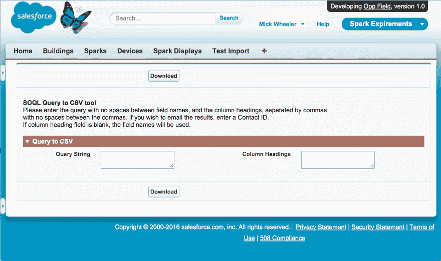

# SOQL 到 CSV 实用程序

> 原文：<https://dev.to/mickwheelz_/soql-to-csv-utility>

最近，我需要为用户提供一些简单的案例度量，这些度量需要包含用户不一定也能看到的案例。

现在，这里有几个选择:

*   仪表盘
*   预定报告
*   定制的东西

现在，前两个选项是我通常会使用的选项，控制面板和报告都可以计划作为有权访问所有案例的用户运行，并通过电子邮件发送给需要查看它们的人，控制面板还有一个额外的优势，即可以随时查看它们。

但是如果你需要 excel 中的数据呢？嗯，你可以从预定的电子邮件中复制/粘贴，或者让别人为你导出。但两者都不是很好的解决方案。

所以你可以定制一些东西，这就是我在这里做的；

[T2】](https://res.cloudinary.com/practicaldev/image/fetch/s--VoVIJeIo--/c_limit%2Cf_auto%2Cfl_progressive%2Cq_auto%2Cw_880/http://www.mickwheelz.net/wp-content/uploads/2016/03/Screen-Shot-2016-03-14-at-11.46.46-AM.png)

现在，这个工具本身对您的普通最终用户没有太大用处，因为使用它需要 SOQL 的工作知识。然而，这可以很容易地扩展到在[自定义设置](https://developer.salesforce.com/docs/atlas.en-us.apexcode.meta/apexcode/apex_methods_system_custom_settings.htm)中存储经常使用的“导出”，使用[自定义权限](https://developer.salesforce.com/docs/atlas.en-us.securityImplGuide.meta/securityImplGuide/custom_perms_overview.htm)授予对工具的访问权限，将结果 CSV 附加到记录，或者使用[可调度 apex](https://developer.salesforce.com/docs/atlas.en-us.apexcode.meta/apexcode/apex_interface_system_schedulable.htm) 在设定的时间间隔通过电子邮件发送 CSV。

它是这样工作的:

在文本框中输入的 SOQL 查询针对[数据库](https://developer.salesforce.com/docs/atlas.en-us.apexcode.meta/apexcode/apex_dynamic_soql.htm)运行，返回一个 sObjects 列表。一旦我们有了这个列表，我们需要构建一个 CSV。

CSV 的第一行是列标题，取自页面上的文本框(或者作为查询字符串的一部分输入的字段的 API 名称)。为了简单起见，我简单地从 SOQL 查询中提取了这些字段(列表中的字段[总是](https://developer.salesforce.com/docs/atlas.en-us.soql_sosl.meta/soql_sosl/sforce_api_calls_soql_select.htm)与查询中的顺序相同)，但是您可以在这里使用[sobjectdescription](https://developer.salesforce.com/docs/atlas.en-us.apexcode.meta/apexcode/apex_dynamic_describe_objects_understanding.htm)来做更有趣的事情。

然后，代码遍历 sObjects 列表，接着遍历字段名列表，每次循环都写入 CSV 的一行，然后在末尾添加一个新行

```
 for(Sobject s :sobjects) {
            for(String fn :fieldNames) {
                csvReport += '"' + s.get(fn) + '"' + ',';
            }
            csvReport += '\r\n';
        } 
```

Enter fullscreen mode Exit fullscreen mode

`
然后我们将 CSV 作为字符串返回给 VisualForce 控制器，并显示在页面上。为了使页面“呈现为”CSV，而不是 HTML 或文本，我们需要设置的内容类型属性，这也允许我们设置下载的 CSV 的文件名。

``html
<apex:page controller="SOQLCSVController"
contentType="application/csv#{!fileName}.csv"cache="true" showheader="fase">
<apex:outputText value="{!stringCSV}" />
</apex:page>` ``
确实如此，在按下下载按钮时，用户被发送到下载 VisualForce 页面，该页面呈现为 CSV 格式，浏览器进行下载。``

 ``如果您想通过电子邮件发送生成的 CSV，或者将其附加到记录中，您可以简单地调用 [Blob](https://developer.salesforce.com/docs/atlas.en-us.apexcode.meta/apexcode/apex_methods_system_blob.htm) 类，然后将生成的 Blob 附加到电子邮件或记录中。

这个例子的完整代码在我的 [github](https://github.com/mickwheelz/SOQL-CSV) 上，你可以随意使用和扩展它。``