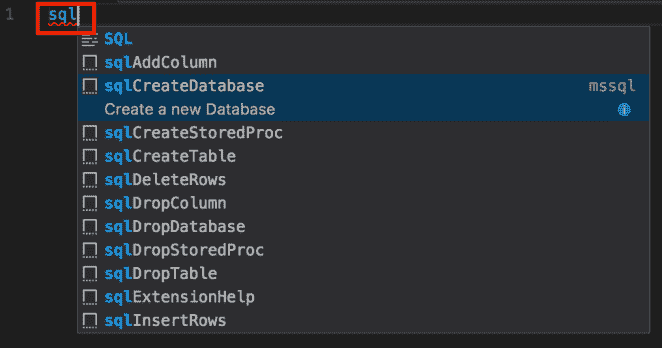

# 带有 Visual Studio 代码的 SQL

> 原文：<https://dev.to/funkysi1701/sql-with-visual-studio-code-1k3p>

编写 SQL 查询通常是用 SQL Management Studio (SSMS)完成的。然而，这个工具有点像野兽，所以让我们看看如何使用 Visual Studio 代码。

Visual Studio 代码是一个免费的文本编辑器，但它不仅仅是一个文本编辑器。VS 代码可以从[https://code.visualstudio.com/Download](https://code.visualstudio.com/Download)下载

若要使用 SQL Server，请下载 mssql 扩展。按下 **CTRL+SHIFT+P** 然后选择**安装扩展**并键入 **mssql** 。

Visual Studio 代码中的智能感知非常出色，比 SSMS 还要好。让我们看看如何设置好这一切。

创建一个新文件，并将语言类型设置为 SQL(按下 **CTRL+K，M**

打开命令面板，* *CTRL+SHIFT+P ** 并键入 SQL 以显示 mssql 命令。选择连接命令。

然后选择**创建连接配置文件**，这将创建一个配置文件来连接您的 SQL Server。按照提示进行设置。

查看状态栏的右下角，您应该会看到您已连接。

现在，如果您键入 sql，您将看到一长串您可以使用的 SQL 代码片段。

[T2】](https://res.cloudinary.com/practicaldev/image/fetch/s--DPAK_gRt--/c_limit%2Cf_auto%2Cfl_progressive%2Cq_auto%2Cw_880/https://i1.wp.com/www.funkysi1701.com/wp-content/uploads/2017/11/vscode-sql-snippets.png%3Fresize%3D662%252C348%26ssl%3D1)

选择要创建的代码片段，并根据需要进行编辑。高兴的时候按* *CTRL+SHIFT+E ** 执行。

这基本上就是全部内容了。然而，这是一种非常强大的工作方式，intellisense 会立即告诉您可以在查询中使用哪些数据库对象，并且有大量不同的代码片段可供您使用。

当返回数据时，您会得到一个类似于 SSMS 的视图，但您可以保存为 Excel、CSV 或 JSON。

SSMS 是一个非常图形化的做事方式，你可以双击一个表，并看到它的列或索引。VS 代码依赖于 TSQL 命令，但是你可以访问完全相同的信息。

有关 VS 代码和 mssql 扩展的更多信息，请查看[https://docs . Microsoft . com/en-us/SQL/Linux/SQL-server-Linux-develop-use-VS Code](https://docs.microsoft.com/en-us/sql/linux/sql-server-linux-develop-use-vscode)

帖子 [SQL with Visual Studio Code](https://www.funkysi1701.com/2017/11/06/sql-visual-studio-code/) 最先出现在 [Funky Si 的技术讲座](https://www.funkysi1701.com)上。