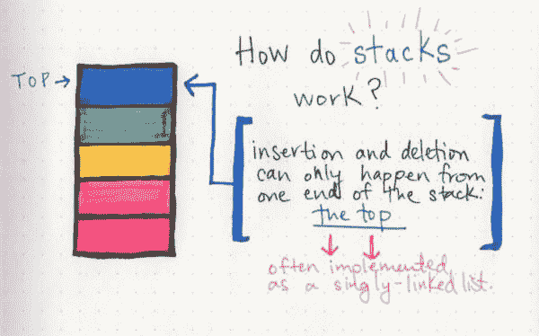
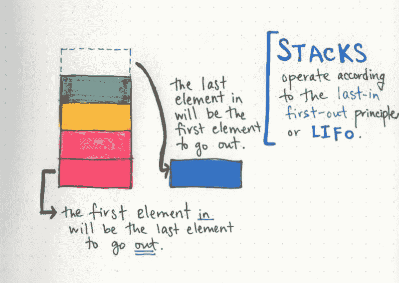
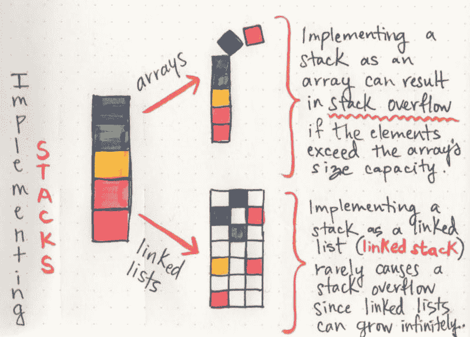
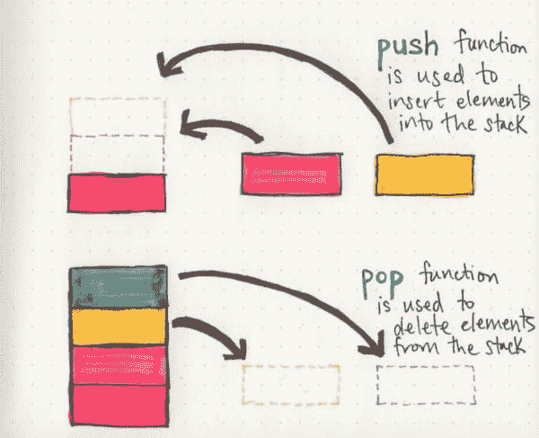
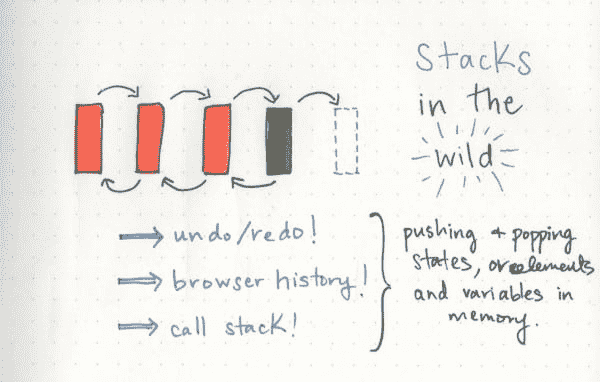
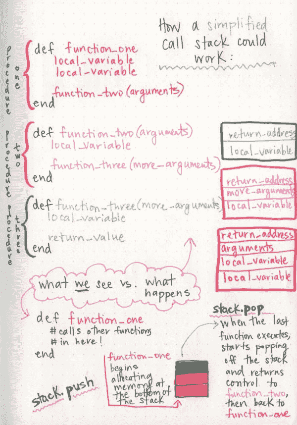

# 堆栈和溢出

> 原文：<https://dev.to/vaidehijoshi/stacks-and-overflows>

当我第一次学习编码的时候，错误曾经把我吓坏了。我的本能反应是恐慌，并立即认为我做错了什么。我打碎了什么东西。或者一切！

嗯，那种担心有一部分是真的:我*曾经*经常做*做错*的事情。但是我花了几个月的时间才不那么害怕找出我到底做错了什么。这就是我早期学习编码的样子，那时我被调试吓坏了，甚至在开始之前就永远放弃了自己。

在我喜欢调试我的代码之前，我经常遇到的一个错误是这样的:

```
SystemStackError: stack level too deep! 
```

一开始，我并不真的知道这是什么意思，但我知道这是*坏*。*栈层次太深？*我的意思是，我们*真的*在这里谈了多深？

但是，随着时间的推移，我开始更深入地研究这个错误消息，并阅读了更多关于这个叫做堆栈的东西，我似乎溢出了。那是我第一次了解到被称为*堆栈(_ 或有时 _ 调用堆栈)*的东西，这是一种存储程序执行时发生的所有事情的结构——或运行时发生的所有事情。

然而，事实证明，术语**堆栈**还有更多含义。它实际上是它自己的抽象数据类型！关于它有太多东西要学了。

### 教我怎么叠

那么什么是栈，它是如何工作的呢？嗯，就像[链表](https://dev.to/vaidehijoshi/whats-a-linked-list-anyway)一样，栈只不过是一个包含一大堆元素的数据结构。像链表一样，堆栈是线性的 T2，这意味着它们的构造和遍历是有顺序的。

[T2】](https://res.cloudinary.com/practicaldev/image/fetch/s--go2pvwOO--/c_limit%2Cf_auto%2Cfl_progressive%2Cq_auto%2Cw_880/https://cdn-images-1.medium.com/max/600/1%2AXnGrKGHgW18OnU1gl0HM-w.jpeg)

关于堆栈如何工作的有趣的事情是，它们实际上只有一个方向。也就是说，如果我们想在这个结构中添加元素，或者想从中删除元素，我们必须从一个地方开始:栈的**顶部**。

我们可以把它想象成一个堆栈数据类型，就像一堆书一样。如果我们有一叠 50 本书，我们必须把第 51 本书加到我们的书堆的最上面，对吗？我们可能不会试图把它放在这堆书的底部。同样的概念也适用于堆栈结构:元素的插入和删除只能从堆栈的一端——顶部——进行。

这种从同一个位置插入和删除的行为也有一个名字——有时，这个名字也被用来指代堆栈: ***后进先出*** 。

> 后进先出原则( **LIFO** )指的是这样一条规则，即无论哪一个元素是*最后*进入*到*的，堆栈都将是第一个必须取出的。

反过来，这也意味着你放入堆栈的第一个元素将总是最后一个输出的。

[T2】](https://res.cloudinary.com/practicaldev/image/fetch/s--vETe69YA--/c_limit%2Cf_auto%2Cfl_progressive%2Cq_auto%2Cw_880/https://cdn-images-1.medium.com/max/800/1%2ADe8zfOowwtRZg2jBTGPvhg.jpeg)

看起来栈和链表非常相似，不是吗？嗯，这有一个很好的理由:栈通常是由使用链表的实现的*！因为它们只能在一个方向上“增长”——也就是说，它们只允许我们在一个地方添加和删除元素——它们很容易表现得和**单链表**一模一样。*

如果我们记住了链表的特征，我们会回忆起它们有一个头节点，在链表的开头添加元素的时空复杂度是 **O(1)** ，或者说是**常数时间**。这真的很好，因为不管我们的栈有多大，因为我们只是从顶部(我们的头节点)添加和删除，所以我们可以在相对相同的时间内执行单个操作，即使对于一个大的栈也是如此。

当然，链表不是我们唯一的选项:我们也可以使用数组实现堆栈。但是，这有一个缺点:数组是静态数据结构。它们需要在创建之前留出并分配一定数量的内存和空间。这里的问题是栈的大小没有上限:它们可以增长到无限大！

那么在这种情况下，当你使用一个数组作为我们的数据结构来实现一个堆栈时会发生什么呢？好吧，如果我们试图添加更多的元素到我们的堆栈中，超过我们的数组所能容纳的空间，事情会变得非常糟糕，非常快。

我们的堆栈不会阻止我们添加另一个元素(因为它认为它可以增长到它想要的大小)，但是实现堆栈的数组没有为我们添加的新元素分配足够内存所需的空间！所有这些导致了——你猜对了——一个**堆栈溢出**！这可不好。(顺便提一句，这与我一直以来最喜欢的错误有关:`Stack level too deep!!`但稍后会有更多的讨论。)

[T2】](https://res.cloudinary.com/practicaldev/image/fetch/s--9HmcwhgA--/c_limit%2Cf_auto%2Cfl_progressive%2Cq_auto%2Cw_880/https://cdn-images-1.medium.com/max/800/1%2AZHyw2HzdH87jUl7zxnOvaw.jpeg)

因为链表是动态数据结构，它的内存可以存储在任何地方，*非连续的*，只要每个节点都有一个指针指向下一个节点在内存中的位置，它们的大小就更容易增长。用链表实现堆栈时，很少会出现堆栈溢出。唯一一次*真的*会发生的情况是，如果我们用完了机器上所有可能的内存……在这种情况下，我们将面临一个更大的问题(比如内存泄漏)!

这两个原因——恒定的空间时间复杂度和大小容易增长的能力——是为什么如此多的栈实际上只是引擎盖下的链表的实现。

### 堆积如山

酷，现在我们知道了栈是什么，问题仍然是:建立一个栈有多难？好消息！答案是:相当容易。因为我们只能从堆栈的一端(顶部)添加和移除元素，所以构建堆栈真正需要的功能是有限的。

[T2】](https://res.cloudinary.com/practicaldev/image/fetch/s--EXEZToAu--/c_limit%2Cf_auto%2Cfl_progressive%2Cq_auto%2Cw_880/https://cdn-images-1.medium.com/max/600/1%2A2S145xm6QZ9juHRGRFVHtg.jpeg)

不管栈是用哪种语言实现的，有几个函数几乎总是需要的:

*   **push** :用于向堆栈中添加元素的函数
*   **pop** :用于从堆栈中移除元素的函数
*   **top** ( ***peek*** ):一个函数，返回第一个值(栈顶的值)，但不删除它
*   **isEmpty** :检查堆栈是否为空的函数——在试图清除堆栈中的所有元素时非常有用
*   **size** :一个函数，返回在任意给定时间堆栈中元素的数量

差不多就是这样——在大多数情况下，这些函数是我们创建堆栈真正需要的唯一东西！

这很好。但是为什么栈很重要呢？它们在我们开发人员的生活中出现在哪里？(当然，除了烦人的错误信息)。

### 现实生活泛滥

建立一个栈并以链表的形式写一个是很容易的。但是谁会这么做呢？对于大多数高级编程语言来说，我们并没有真正发现自己曾经编写或实现过堆栈(甚至是链表)。然而，它们就在我们身边，只要我们花时间去寻找它们。

[T2】](https://res.cloudinary.com/practicaldev/image/fetch/s--fs7Nf9f1--/c_limit%2Cf_auto%2Cfl_progressive%2Cq_auto%2Cw_880/https://cdn-images-1.medium.com/max/600/1%2A9FN_1LpVrdI0-DEB-X2lHw.jpeg)

有几个流行的栈实现的例子，其中一些是我们每天都要多次使用的特性！例如，当您打开一个文档或文本编辑器，并使用撤销/重做功能时，您实际上是(在一个非常低的级别上)将“状态”推入和弹出堆栈。在我添加这个段落之前，我的文章的状态是堆栈中的一个元素，在我添加这个段落之后，我的文章的状态是下一个。当我在撤销和重做之间切换时，我会**弹出**，然后**将**一个元素推到包含我文章“历史”所有状态的堆栈顶部。

类似地，当你打开 dev.to 网站的浏览器，点击一篇文章，然后点击返回箭头回到 dev.to 主页时，你在两种状态之间切换，并弹出和推送状态到堆栈上！这个浏览器最酷的地方在于它有一个叫做[的历史对象](https://developer.mozilla.org/en-US/docs/Web/API/Window/history)，向我们展示了这个抽象是如何工作的。Mozilla 开发者网络有一个记录良好的 API，解释了他们的浏览器历史的[实现](https://developer.mozilla.org/en-US/docs/Web/API/History_API#The_pushState%28%29_method)是如何工作的。他们实际上有一些方法可以揭示可能正在使用的堆栈，例如:`pushState, replaceState`和一个`popstate`事件。听起来熟悉吗？

然而，我最喜欢的堆栈例子当然是调用堆栈。构建调用堆栈的方式非常有趣，因为这种堆栈创建随时都会发生——即使只调用一个函数也是如此。

这里有一个*超级简化的*例子，展示了调用栈是如何工作的:

我们有一个函数(`function_one`)，它定义了几个局部变量，然后将这些变量作为参数传递给另一个函数。在`function_one`内部，第二个内部函数(`function_two`)做类似的事情:定义一些局部变量，然后将它们作为参数传递给另一个函数(`function_three`)。

[T2】](https://res.cloudinary.com/practicaldev/image/fetch/s--cAb3lyBs--/c_limit%2Cf_auto%2Cfl_progressive%2Cq_auto%2Cw_880/https://cdn-images-1.medium.com/max/600/1%2ADDqihCxM05Z6FDDunAh3HQ.jpeg)

在我们这个超级简单的例子中，我们总共只有三个函数，只需要发生三个不同的过程。当调用栈建立起来运行所有这些代码时，每个“过程”对应于栈中的一个元素。这里唯一的大区别是事物的命名略有不同。

当`function_one`运行时，它为它的局部变量、传递给它的任何参数分配一些内存，并且无论什么值的返回地址最终都将由`function_one`返回。分配给`function_one`的整个内存段被称为**堆栈帧**。

但是，`function_one`靠着`function_two`！因此，它需要传递一些参数，并将控制权和执行权交给嵌套函数。这意味着`function_two`也需要为任何局部变量、参数和它自己的返回地址分配内存。所以`function_two`也得到了自己的栈帧。

这个以堆栈帧的形式分配内存的过程一直持续到程序执行结束。至此，我们已经用**堆栈框架*元素*** 构建好了我们的堆栈！这很酷的一点是，当我们构建调用堆栈时，我们一直在**将**堆栈帧推送到我们的调用堆栈上。

那么当函数运行完毕，我们有一个返回值的时候会发生什么呢？好吧，我们需要拆掉那堆东西。由于`function_three`是堆栈上的最后一个元素——在堆栈的**顶部**,根据 LIFO 原则，它的堆栈框架必须是第一个离开的。随着堆栈被销毁和拆除，每个元素(堆栈帧)都从调用堆栈中**弹出****。这个过程不断重复，我们的调用堆栈不断从内部函数的堆栈框架中交出控制权，直到我们回到堆栈的底部。在堆栈的底部是`function_one`的堆栈框架:现在我们为它返回一个值，这是我们清空堆栈的最后一个结果。**

 **很神奇，对吧？栈及其元素可以是任何东西——甚至是整个程序进程的子集，就像我们的例子一样！

所以，希望到现在为止，我们可能已经对多年前是什么导致了我的第一次堆栈溢出和那个`stack level too deep`错误有了一些想法。我的猜测是，我可能写了一个递归函数，其中我将一个局部变量命名为与函数相同的东西，并且我的调用堆栈一直试图分配内存，直到它完全耗尽并…溢出。

老实说，我很高兴它做到了。否则，我永远也不会知道筹码到底有多深。

### 资源

你想溢出所有的东西吗？(或者可能只是阅读书库和所有关于它们的知识？)查看这些令人惊叹的资源:

1.  [堆栈应用](http://jcsites.juniata.edu/faculty/kruse/cs240/stackapps.htm)，杰拉德·克鲁斯教授
2.  [调用堆栈，作用域&变量生存期](https://www.youtube.com/watch?v=1cPSeJLspT8)，ReelLearning
3.  [栈-链表实现](https://www.cs.bu.edu/teaching/c/stack/linked-list/) *，*罗伯特·皮茨教授
4.  [使用 stacks](https://www.youtube.com/watch?v=hNP72JdOIgY) 反转字符串或链表，我的代码学校
5.  [推动和弹出历史 API](http://html5doctor.com/history-api/) ，迈克·罗宾逊
6.  “堆栈溢出”是如何发生的，你如何防止它？，StackOverflow**