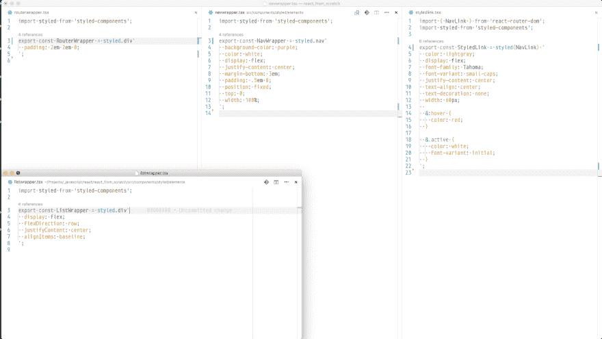

# 学习 Webpack 的阶段。2 -配置

> 原文：<https://dev.to/nitishdayal/stages-of-learning-webpack-pt-2---the-config>

***免责声明** : Webpack 不是模块捆绑的唯一选项。模块捆绑甚至不是解决客户端模块“问题”的唯一选择。做这件事有很多方法。我要试着解释一些 Webpack 的东西，因为这是我一直在做的事情。+我的语法不是很好，我的方言是想成为知识分子和讨厌的孩子的混合体。已经警告过你了。*

这应该是上个星期，但事情发生了。ðÿ:最初的草稿被意外的系统重启和我没有保存我在 Dev.to 平台上的进展所消耗，在第二次尝试时，我意识到试图适应我在第一篇文章[结尾提到的所有内容会导致一篇不够深入有价值的文章，或者会导致信息过载。相反，我将把这些内容分成多个帖子。](https://dev.to/nitishdayal/stages-of-learning-webpack)

**这篇**帖子的目的是通过探索它试图解决的问题来解释什么是 [Webpack](https://webpack.js.org) ，并回顾 Webpack 配置的基础。这些内容将面向 Webpack 生态系统的新用户。我不知道我对 Webpack 的理解会比“初学者”高多少，所以如果你相当有经验，请继续阅读并提供反馈。ðÿ˜ƒ:还有很多其他类似的帖子。我正站在稍微不赞成的内容的肩膀上。

## 简介-客户端模块的问题

随着用户对应用程序的期望越来越高，客户端 JavaScript 开发也在不断发展以满足这些期望。我们现在的情况是，将所有代码放在一个 JavaScript 文件中会很快变得非常不受欢迎。应用程序的开发是通过将代码库分割成小的、相关的块，并将这些块放在单独的文件中。这些文件被称为 *JavaScript 模块*。当`fileB.js`中需要`fileA.js`中的一段代码时，只要该代码在`fileA`中被导出，就可以导入到`fileB`中。为了将这些文件加载到浏览器中，处理更多可管理文件的方法是根据需要添加`<script>`标签。这在处理少量文件时是可行的，但是应用程序会很快发展到手动加载所有文件会非常非常复杂的地步。您不仅要负责确保所有文件都在您的根文档(主`index.html`文件，无论您怎么称呼它)中被正确引用，您还必须管理它们被加载的顺序。我不想对 100 多个文件做这些。

例如，下面是我的样板文件中的目录结构:

```
 ├── LICENSE
  ├── README.md
  ├── TODO.todo
  ├── index.html
  ├── package.json
  ├── src/
  │   ├── components/
  │   │   ├── containers/
  │   │   │   └── root.js #1
  │   │   ├── displayItems.js #2
  │   │   ├── hello.js #3
  │   │   ├── page2.js #4
  │   │   └── styled/
  │   │       ├── elements/
  │   │       │   ├── listwrapper.js #5
  │   │       │   ├── navwrapper.js #6
  │   │       │   ├── routerwrapper.js #7
  │   │       │   └── styledlink.js #8
  │   │       └── index.js #9
  │   ├── main.js #10
  │   ├── routes/
  │   │   └── index.js #11
  │   └── store/
  │       └── listItems.js #12
  ├── tslint.json
  └── yarn.lock 
```

Enter fullscreen mode Exit fullscreen mode

一个**样板文件**的十二个 JavaScript 文件；我们谈论的是一个美化了的“你好世界”。这些是大文件吗？一点也不。取`src/components/styled/elements/` [(全尺寸)](https://thepracticaldev.s3.amazonaws.com/i/ffzwgh10rw2c7pigx81j.png)下的文件:

[T2】](https://res.cloudinary.com/practicaldev/image/fetch/s--BdBX_Ffe--/c_limit%2Cf_auto%2Cfl_progressive%2Cq_auto%2Cw_880/https://thepracticaldev.s3.amazonaws.com/i/ffzwgh10rw2c7pigx81j.png)

所有的文件都在 25 行代码之下。事实上，`src/`文件夹中的每个文件都在 50 行以下。然而，我这样做并不是为了计算行数。这是编写*模块化*代码的一个有益副作用。我这样分割代码是因为它给了我一个更容易维护、阅读、导航和调试的代码库。如果我需要改变我的链接的显示方式，我知道我需要去哪里进行改变，我知道一旦改变，它将反映在任何链接被创建的地方。文件夹结构，虽然在视觉上可能不那么吸引人，但在编程时是很好的，因为它是有逻辑和有组织的；在`styled/elements/styledlink`下可以找到一个样式化的链接元素。如果有错误或缺陷(肯定会有)，很容易追溯到一个文件/模块的问题，因为他们被分开的目的是给每个模块**一个**的工作。如果有什么东西坏了，很可能是因为我没有告诉某人如何正确地做他们的工作，通常很容易就能看出错误是从哪里产生的。一旦在模块级别解决了错误，我知道在代码被重用的任何地方都会被修复。

## Webpack 作为解决方案

那么我们如何把它加载到浏览器*中，而不需要*处理`<script>`标签诡计呢？Webpack！Webpack 将从*应用程序根*或初始起始点`src/main.js`开始，跟随任何`import`语句，在我们的应用程序中爬行，直到它拥有应用程序的完整*依赖图*。一旦有了这个图，它将创建一个捆绑文件(或多个文件，取决于您如何配置 Webpack ),然后可以从`index.html`内部加载到浏览器中。瞧！在其最简单的用例中，这就是 Webpack 所做的。它将一堆 JavaScript 文件放入一个(或几个)文件中，在加载到浏览器中时更易于管理，同时允许您在代码库中保持您喜欢的模块化和分离。

*“等一下，盖伊。我见过有人用 Webpack 做 CSS，图片，视频...什么都有，你却告诉我它只做 JS？”*是的！开箱即用，这是 Webpack 能够理解的。然而，在我的[第一篇文章](https://dev.to/nitishdayal/stages-of-learning-webpack)的开始，我提到 Webpack 不仅仅是**的模块捆绑器。有了正确的配置设置、插件和加载器(稍后将详细介绍)，Webpack 可以扩展到理解前端开发人员遇到的大多数文件类型，以便捆绑(和优化)*您的所有*应用程序资产。在大多数情况下，我的构建过程完全由 Webpack & NPM 脚本管理。**

## 基本配置

**先决条件:**

*   结节
*   NPM/纱线——安装依赖项，运行脚本
*   Git -分支、克隆、提交
*   耐心——有时候我可能太啰嗦了，对我自己没好处

本节的示例代码可在以下位置找到:[github.com/nitishdayal/webpack-stages-example](https://github.com/nitishdayal/webpack-stages-example)

本文的其余部分假设您将继续克隆包含示例代码的 repo。回购被分为多个分支，与即将到来的部分相对应。

初始文件布局和目录结构:

```
 ├── index.html
 ├── package-lock.json
 ├── package.json
 ├── src
 │   ├── app
 │   │   └── sayHello.js
 │   └── index.js 
```

Enter fullscreen mode Exit fullscreen mode

提供的示例中有几个毫无价值的文件:

1.  `index.html`
2.  `src/app/sayHello.js`
3.  `src/index.js`

让我们来分析一下示例中发生了什么:

1.  `index.html`是一个 HTML 文档，包含两个关键项:

    *   id 为`root`的`div` HTMLElement
    *   `script`标签加载文件`./build/bundle.js`
2.  `src/app/sayHello.js` *出口*两种物品。

    *   一个匿名函数，接受一个参数并返回一个窗口警告，消息为“Hello”+所提供的参数作为**默认**导出。
    *   一个常量`donut`以一个字符串值作为**名为**导出。
3.  `src/index.js`是与文档交互的文件。

    *   从`src/app/sayHello.js`输出的**默认**是从输入到`src/index.js`的*，称为`Hello`。*
    *   声明并定义了两个变量，`name`引用一个字符串值，`root`引用 ID 为`'root'`的`div` HTMLElement。
    *   调用`Hello`函数(**默认**从`src/app/sayHello.js`导出)，并提供之前声明的`name`变量。
    *   `root`引用的`div`html 元素的*文本内容*更新为`'Helllloooo ' + name +'!'`

### 第一步

*分支:主*

首先，我们需要安装 Webpack。如果您使用的是示例代码，从命令行运行`npm install/yarn`。如果你正在创建自己的项目，运行`npm install webpack -D/yarn add webpack -D`。`-D`标志将把 Webpack 保存为*开发者依赖*(我们在制作应用程序时使用的依赖，但不是应用程序核心功能所需要的)。

***注:**有时候我从命令行运行 Webpack。为了做到这一点，我在全球范围内安装了 Webpack。如果你也想要这个选项，从命令行运行`npm install --global webpack/yarn global add webpack`并重启你的终端。要检查 Webpack 是否安装正确，请从命令行运行`webpack --version`。*

安装 Webpack 后，更新`package.json`文件的“脚本”部分:

```
"scripts" {
    "build:" "webpack"
}, 
```

Enter fullscreen mode Exit fullscreen mode

我们添加了一个脚本`npm run build/yarn build`，可以从命令行调用它。这个脚本将调用 Webpack(它通过`npm install webpack -D/yarn add webpack -D`作为*开发者依赖项*安装)。从命令行运行`npm run build/yarn build`。

**错误信息！**呜呜！

```
No configuration file found and no output filename configured via CLI option.
A configuration file could be named 'webpack.config.js' in the current directory.
Use --help to display the CLI options. 
```

Enter fullscreen mode Exit fullscreen mode

就错误消息而言，这个非常友好。Webpack 可以以多种方式运行，在这个错误消息中提到了其中的两种；*命令行界面* (CLI)或一个*配置*文件。最后，我们将混合使用这两个选项，但是现在让我们把重点放在配置文件上。错误消息提到一个配置文件可能被命名为`webpack.config.js`；您可以随意命名您的配置文件。可以命名为`chicken.cat.js`。只要该文件导出了有效的配置对象，只需使用`--config`标志将 Webpack 指向正确的方向。示例(来自命令行或作为 package.json 脚本):`webpack --config chicken.cat.js`。然而，如果您将文件命名为`webpack.config.js`，Webpack 将无需`--config`标志就能找到它。权力越大，责任越大，等等。

我们知道 Webpack 失败是因为我们没有正确配置它，所以让我们创建一个配置文件。

### 第二步

*分支:初始化*

这个分支中有一个名为`webpack.config.js` :
的新文件

```
module.exports = env => ({
  entry: "./src/index.js",
  output: { filename: "./build/bundle.js" },
  resolve: { extensions: [".js"] }
}); 
```

Enter fullscreen mode Exit fullscreen mode

*...wat*

是啊，我也是。让我们打破这一点！首先，让我们重写这个没有箭头的函数，所以`output`和`resolve`对象被分成多行:

```
module.exports = function(env){
  return {
    entry: "./src/index.js",
    output: {
      filename: "./build/bundle.js"
    },
    resolve: {
      extensions: [".js"]
    }
  }
}; 
```

Enter fullscreen mode Exit fullscreen mode

目前我们没有对这个“env”参数做任何事情，但是我们以后可能会用到它。导出一个函数是一个选项，但是最终 Webpack 关心的是获得一个 JavaScript 对象，该对象具有 Webpack 知道的键/值对。在这种情况下，这个例子可以进一步简化为:

```
// Oh hey look! Somewhere in that mess was a good ol' JavaScript object. The kind 
// you can 'sit down and have a beer with'.
module.exports = {
    entry: "./src/index.js",
    output: {
        filename: "./build/bundle.js"
    },
    resolve: {
        extensions: [".js"]
    }
}; 
```

Enter fullscreen mode Exit fullscreen mode

这个对象有 3 个键:入口、输出和解析。 **Entry** 定义了我们应用程序的入口点；在我们的例子中，它是`index.js`文件。这个文件首先与 HTML 文档交互，并启动应用程序中其他 JS 文件之间的任何通信。 **Output** 是一个包含选项的对象，用于配置如何捆绑和输出应用程序的文件。在我们的例子中，我们希望我们的应用程序被打包到一个文件中，`bundle.js`，这个文件应该放在一个名为`build/`的文件夹中。 **Resolve** 是一个带有数组`extensions`的对象，该数组只有一个值。js '。这告诉 Webpack，如果遇到任何没有指定`import`语句所针对的文件扩展名的`import`语句，就假设它是一个`.js`文件。例如，如果 Webpack 看到这个:

```
import Hello from './app/sayHello'; 
```

Enter fullscreen mode Exit fullscreen mode

给定所提供的配置，它会知道将其视为:

```
import Hello from './app/sayHello.js'; 
```

Enter fullscreen mode Exit fullscreen mode

概括一下:文件`webpack.config.js`导出一个*函数，该函数返回一个对象*(这就是整个`module.exports = env => ({ /*...Webpack config here...*/ })`的事情)。返回的对象由用于配置 Webpack 的键/值对组成，这样它就可以解析我们的应用程序并创建一个包。目前，我们为 Webpack 提供以下内容:

*   我们的应用程序从哪里开始(入口)
*   我们希望我们的包放在哪里，以及我们希望它是什么样子(output.filename)
*   Webpack 应如何处理未指定文件扩展名的导入(resolve.extensions)

现在，如果我们从命令行调用`npm run build/yarn build`，Webpack 应该能够完成它的任务:

```
$ npm run build
> example@1.0.0 build /Projects/dev_to/webpack_configs/example
> webpack

Hash: fa50a3f0718429500fd8
Version: webpack 2.5.1
Time: 80ms
            Asset     Size  Chunks             Chunk Names
./build/bundle.js  3.78 kB       0  [emitted]  main
   [0] ./src/app/sayHello.js 286 bytes {0} [built]
   [1] ./src/index.js 426 bytes {0} [built] 
```

Enter fullscreen mode Exit fullscreen mode

现在应该有一个包含文件`bundle.js`的新文件夹`build/`。根据调用`npm run build`的输出，该文件由`./src/app/sayHello.js`和`./src/index.js`组成。如果我们查看这个文件，并查看第 73-90 行，我们会看到:

```
"use strict";
/* harmony default export */ __webpack_exports__["a"] = (name => alert(`Hello ${name}`));

const donut = "I WANT YOUR DONUTS";
/* unused harmony export donut */

/**
 * Same code, ES5(-ish) style:
 * 
 * var donut = 'I WANT YOUR DONUTS';
 * 
 * module.exports = function(name) {
 *    return alert('Hello ' + name);
 * };
 * exports.donut = donut;
 * 
 */ 
```

Enter fullscreen mode Exit fullscreen mode

那是`./src/app/sayHello.js`，你看，Webpack 知道即使`const donut`是从文件中导出的*，它在我们的应用程序中没有被使用，所以 Webpack 用`/* unused harmony export donut */`标记它。整洁！它还做了一些其他的事情，比如将`export`语法改为...完全不同的东西。`./src/index.js`见于第 97—111 行。这一次，无论哪里使用了来自`./src/app/sayHello.js`的一段代码，它都被换成了别的东西。* 

```
"use strict";
Object.defineProperty(__webpack_exports__, "__esModule", { value: true });
/* harmony import */ var __WEBPACK_IMPORTED_MODULE_0__app_sayHello__ = __webpack_require__(0);

// Import whatever the default export is from /app/sayHello
// and refer to it in this file as 'Hello'

const name = "Nitish";
// Reference to the <div id="root"> element in
const root = document.getElementById("root");

// Call the function that was imported from /app/sayHello, passing in
// `const name` that was created on line 5.
__webpack_require__.i(__WEBPACK_IMPORTED_MODULE_0__app_sayHello__["a" /* default */])(name);
root.textContent = `Helllloooo ${name}!`; 
```

Enter fullscreen mode Exit fullscreen mode

查看捆绑包中发生的所有事情最好留到下一篇文章中讨论；查看该文件的目的是为了证明，是的，Webpack 确实检查了我们的代码并将其全部放入一个文件中。

如果我们还记得的话，`index.html`文档有一个`<script>`标签，它引用了这个捆绑的 JS 文件。在你的浏览器中打开`index.html`,会看到一个警告和一个 div 中的句子！恭喜，您已经使用 Webpack 创建了一个包！

编辑:[第三部终于上来了！](https://dev.to/nitishdayal/stages-of-learning-webpack-pt-3---sourcemaps-loaders--plugins)*