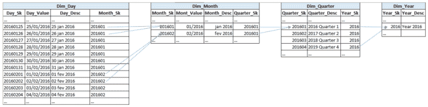
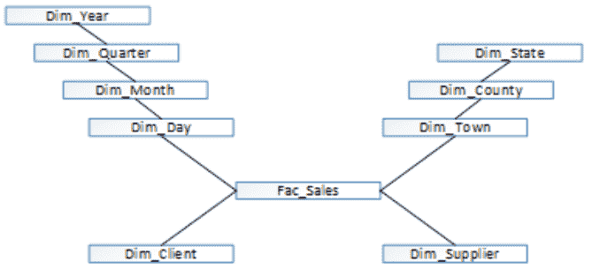
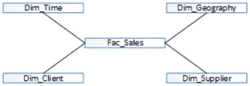

# 星型模式与雪花型模式，以及为什么要关注它们

> 原文：<https://dev.to/pedrojmfidalgopt/star-schema-vs-snowflake-schema-and-why-you-should-care-40fh>

你们中的许多人都在数据仓库领域工作，大多在开始建模时，可能会问自己，我应该用这种方式建模吗，或者我可以使用其他更好的方法吗？如果你在谷歌上搜索这个主题(星型模式或者雪花模式)，你会找到很多关于它们的信息，比较，优缺点，每种技术需要的空间等等。例如，这里有一个 wiki 页面，收集了关于 star [模式和雪花辩论](https://www.etltools.net/wiki/display/dataintegration/Star+vs+Snowflake+Data+Schema)的一些资源。

在这篇文章中，我将尝试提供一些技术见解和我个人对一些细节的看法，主要是因为我在现实世界的解决方案中所面临的问题。首先，人们必须考虑，当一个公司决定建立一个决策支持系统时，空间不能(或者不应该...)是一个问题，尽管我知道财务限制总是存在。项目发起人必须意识到信息占据空间，因此主要决策之一将是:

我应该追求性能还是节省硬盘和随机存取存储器？

这就是说，我还必须提到我的想法主要是针对大型数据库(几百万行甚至十亿行大小的数据集)。因此，如果需要的空间将作为一个约束出现，你的建模技术将立即受到它的制约。雪花方法将会出现，因为一旦规范化存在于所有或大多数分析维度中(如果你有大的维度),你就可以通过使用它来节省空间。

首先，我认为对我来说，对每种方法和一些相关概念进行简要描述是很重要的

(请考虑更多详细信息，您也可以访问 [Teradata 主页](https://info.teradata.com/htmlpubs/DB_TTU_16_00/index.html)或[learn data modeling 主页](http://learndatamodeling.com/))

在典型的数据仓库建模中，中心模型表被称为事实表。在那里，您将存储您的业务流程主数据，这些数据稍后将用于计算您的 CEO 或 CFO 可能记得的各种指标。定义您的信息粒度级别(更深层次的细节)非常重要。我的意思是，如果你需要在二级存储数据，然后考虑细节，如果需要的话，以后再汇总。另一方面，如果你以小时为单位存储信息，四个月后你意识到它不够详细，相信我，你的整个项目都将处于危险之中。

因此，根据这个非常简短的介绍，如果你不能按照重要的相关属性(如时间、地理和许多其他你能记住甚至生成的属性)对信息进行分组、切片和过滤，那么你的信息将毫无用处(如垃圾维度，在以后的文章中会有更多相关内容)。每个寻找报告的人都希望看到每月的信息、商店和客户类型，或者了解哪个年龄段的人购买更多卫生纸(那边肯定有人需要)。

为了能够呈现这样有用的报告，你应该用指向这些属性的“指针”来丰富你的事实，否则它们将会是与其他事情一起浮动的数据。这就是我们的主中央表周围的分析维度变得生动的地方。

因此，简单地说，最终，星型模式和雪花将允许开发人员迁移并为每个事实表记录分配一个关于特定分析属性的适当标识符。它们之间的主要区别实际上是数据规范化和数据冗余。

让我们考虑一个在 99.8%的数据仓库模型中使用的典型时间维度(剩下的 0.02%没有被很好地建模:)...).如果你考虑下面的图像，这可以更容易观察到。

[T2】](https://res.cloudinary.com/practicaldev/image/fetch/s--RspG6I4r--/c_limit%2Cf_auto%2Cfl_progressive%2Cq_auto%2Cw_880/https://thepracticaldev.s3.amazonaws.com/i/jlcvpcewgy9l79qmt2fy.png)

一旦所有信息被划分到适当的分组级别，它就被规范化了。天数是将出现在事实表中的较小的时间粒度。我使用了一个对应于代理键的数字(作为日期)(但是我也可以使用一个数字序列)。下一个图像可能对应于从中提取时间维度的主维度模型。你可以看到两个规范化的维度，时间和地理。

[T2】](https://res.cloudinary.com/practicaldev/image/fetch/s--W_cMHIJ2--/c_limit%2Cf_auto%2Cfl_progressive%2Cq_auto%2Cw_880/https://thepracticaldev.s3.amazonaws.com/i/53pqcrqjumifhawrykss.png)

雪花方法看起来很合理，而且效果很好。现在假设您有一个包含 100，000 条记录的日维度。每次需要提取或分析按年份分组的数据时，数据库引擎都需要将所有四个表链接在一起，以便可以为每个事实表粒度记录找到正确的年份。如果使用内存驻留表、索引、索引或表簇、底层物化视图、数据压缩等，这可能是也可能不是问题，主要取决于所使用的数据库和特性。有一些技术可以大大加快数据分组的速度，例如，可以考虑将 Year_Sk 迁移到事实记录中。如果 exploring 工具利用了这一逻辑，那么这一逻辑是有意义的，它必须能够定义和保存分组路径，并根据用户的选择使用最方便的路径(分组上下文或数据分组路径)。

但是我们讨论的是维度建模，为了减少数据库连接工作，可以将数据反规格化，这样全天的属性都显示在一个表中(例如，通用 Dim_Time，请查看下面的内容)

[T2】](https://res.cloudinary.com/practicaldev/image/fetch/s--69thYefY--/c_limit%2Cf_auto%2Cfl_progressive%2Cq_auto%2Cw_880/https://thepracticaldev.s3.amazonaws.com/i/fup4sexccbdbhjoq4cj1.png)

如果你横向阅读数据，你将能够恰当地描述每一天，它的月份，它的季度，年。以这种方式放置的数据没有被规范化，但另一方面，它已经被连接，所以数据库不需要这样做。

我个人的观点是，这种方法会产生更好的性能，主要是在列被高度索引并且查询是选择性的情况下。典型的星型模式模型方法应该如下图所示，在此示例模型中，地理和时间维度可能是某种数据规范化程度的候选对象。

[T2】](https://res.cloudinary.com/practicaldev/image/fetch/s--fSHrXVn4--/c_limit%2Cf_auto%2Cfl_progressive%2Cq_auto%2Cw_880/https://thepracticaldev.s3.amazonaws.com/i/8qhb5psnrvaup088nz0a.png)

无论哪种方式，这都不是教条，现在机器是如此强大，内存变得更加便宜，固态驱动器正在成为规则，使用规范化集方法(雪花)并使表驻留在内存中(SQL Server 功能)甚至可能更快，因为一旦它们在内存中，加入它们可能比从非内存驻留的非规范化表中加载数据更快。如果尺寸很小，连接起来会很快。您甚至可以同时使用这两种方法，在 Oracle 中，您可以对一组表使用雪花方法，并在后台使用连接表的物化视图。根据查询的解释计划，Oracle 将使用更好的查找方法(连接表或直接访问物化视图)。这就是为什么开发人员应该正确地将建模逻辑理论与真实世界案例分开，并尽可能地了解您的工具。一些工具特性真的会对 ETL 或数据探索查询的运行时间产生影响。

所以，试着恢复一些关于维度建模的见解:

雪花方法允许:

*   节省空间；
*   它更好地模拟了业务逻辑，因为您看到了完全隔离的组级别；
*   可能更容易实现层次结构(允许深入数据分组)；
*   它将允许在一个广泛的数据仓库模型(通常称为星座模型)中重用单个维度。例如，事实表的数据可能是基于每日的，而其他一些业务流程的数据可能是基于每月的。一旦有了不同的维度，就可以将它们中的每一个都链接到适当的必需事实表。单一的时间维度不允许这样做。那些单独的维度应该是全局 ETL 维护计划的一部分；
*   如果需要一个以上的级别属性来标识低级别维度代理键(事实中存在的那个)，雪花方法可能会使您的 ETL 查找过程更加困难和缓慢。如果您需要联接表来执行查找，则速度会比已经联接了表的情况慢得多(查找过程还会受到所用工具的限制，例如，可以在内存中缓存和加载整个查找结构，因此数据只联接一次，SQL Server SSIS 可以利用这一点。Net 数据结构，如哈希映射或字典，它们只将数据加载到内存中一次，IBM Datastage 使用的数据集也将数据加载到内存中并执行并行查找)；

在以下情况下，星型模式更好:

*   您关注性能(但是再次首先检查数据库和底层工具的能力，例如 Oracle 有许多性能改进特性，可以让雪花运行得非常快)；
*   您不需要担心空间问题，因此数据冗余不是问题(如果您的维度有 26，621，547，000 行，这一点很重要)。想想全国工资申报数据仓库，有多少人每月领取工资；
*   当运行 ETL 过程时，如果单个维度有正确定义和考虑周全的索引，查找性能会更快；
*   访问几个信息聚合级别也应该更快，因为它们都存储在同一个表中；

关于 SQL 生成，当然，在雪花模式模型中，生成的查询将更加复杂，因为它们将连接更多的表(如果连接几个维度，它们会变得很大)。如果您将手动生成查询，这是很重要的，否则，如果它们是由 exploring 工具生成的，问题就被最小化了。星型模式查询易于生成和解释。

作为一条经验法则，我建议您理解并思考当您的数据模型被查询时将如何生成所需的查询，将您自己想象成一个数据库引擎，尝试理解它是如何工作的，您将找到满足您的模型需求的最佳方法(查看解释计划)。人们不应该认为这是教条，甚至可能需要在 ETL 查找过程中使用高度非规范化的表(这样它们运行得更快)，然后在探索工具中使用雪花规范化的表(当然所有这些表也应该在 ETL 过程中正确同步)。像往常一样，测试、搜索和寻找意见总是强制性的。要有创意。