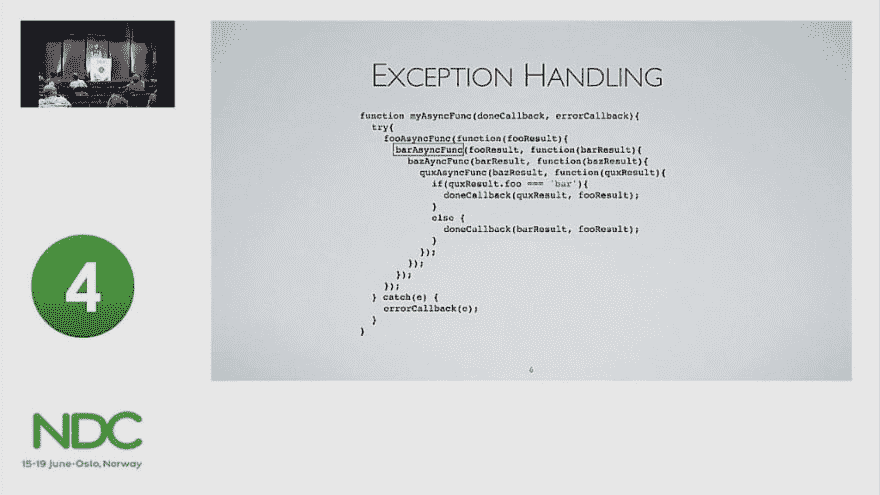

# 提高代码质量的步骤

> 原文：<https://dev.to/isaacdlyman/steps-to-better-code>

*这是来自**的一个章节的早期版本，是一本给新开发者的实用指南和建议的书。如果你正在考虑从事软件行业，去 https://leanpub.com/firstyearincode*看看吧。

* * *

#### 初学者指南

当你开始编码时，你通常会花一两年的时间完全忘记“好代码”的规则。你可能会听到“优雅”或“干净”这样的词，但你无法定义它们。没关系。对于一个没有任何经验的程序员来说，只有一个度量标准值得关注:它能工作吗？

不过，很快你就需要提高期望值了。好的代码不仅仅是工作。它简单、模块化、可测试、可维护、考虑周到。这些术语中的一些可能会在您不知道的情况下应用到您的代码中，但很可能不会。如果你幸运的话，你的团队会仔细地计划和构建它的代码解决方案，并温和地指导你，相信你会对编写良好的软件产生直觉。如果你运气不好，他们[每次看到你的代码都会](https://xkcd.com/1513/) [或者](https://xkcd.com/1695/) [抱怨](https://xkcd.com/1833/)。无论哪种方式，你都可以从学习一些普遍原则中获益良多。

以*全局变量*为例:在整个代码库中可以轻松访问的任何未划分的变量。假设您的应用程序有一个`username`变量，它是在用户登录时设置的，可以通过引用变量名——这是一个全局变量——从应用程序中的任何函数访问。全局变量被有影响力的博主和风格指南普遍鄙视，但大多数入门级的编码人员不明白为什么。原因是——请注意，因为这是几乎所有编码最佳实践的原因——*它使代码写得更快，但更难理解*。在这种情况下，一个全局变量可以很容易地将用户的用户名插入到应用程序的任何地方，这可能意味着更少的代码行和更少的时间。不过，这是虚假的安慰:你为了方便而牺牲了安全。如果您发现一个涉及`username`的 bug，您将不得不调试不仅仅是一个类或方法，而是整个项目。这个我以后再讲。

“好代码”和“坏代码”之间的区别通常不是基于它在你写的时候影响你的方式。代码总是一种共享的资源:你与其他开源维护者，或者与你团队中的其他开发人员，或者与将来接替你工作的人，或者与“未来的你(他不知道你现在在想什么)”或者甚至只是与“调试你，他正在检查你的新代码寻找错误并且感到沮丧”的人共享它。如果你的代码有意义，所有这些人都会很感激。这会让他们的工作更轻松，压力更小。这样看来，写好代码就是一种职业礼貌。

如果你仍然不相信，请继续阅读——我将讨论几个导致优秀代码的原则，并尝试证明每一个原则。

#### 术语

在我们开始之前，一些快速定义:

*   *状态:*程序运行时存储在内存中的数据。你赋的每个变量都是程序状态的一部分。
*   *重构:*改变程序的代码而不改变其行为(就用户而言)。重构的目标通常是让代码更简单、更有条理、更易读。

#### 1。[关注点分离](https://en.wikipedia.org/wiki/Separation_of_concerns)

对编码来说，一个合理的类比是写一份食谱。在简单的食谱中，每一步都依赖于前一步，一旦所有的步骤完成，食谱就完成了。但是，如果你曾经试图遵循一个更复杂的食谱，你可能会体验到这样的压力:炉子上有两个锅在沸腾，一个盘子在微波炉中旋转，三种蔬菜在砧板上半切，厨房台面上散落着一大堆香料和香草瓶(你不记得你已经添加了哪些)。

厨房里多了一个厨师使问题变得复杂，也使问题变得简单。你浪费时间来协调，来来回回地处理事情，为炉灶空间和烤箱温度而争吵。需要实践才能想出怎么做好。

如果你知道你的厨房里会有几个厨师，那么把食谱分成大部分独立的子食谱不是更有效率吗？然后你可以把部分食谱交给每个厨师，他们可以尽可能少地互动。其中一个是煮意大利面的水。其中一个是切菜和炒菜。其中一个在切奶酪。其中一个在做酱。并且交互点被明确定义，所以他们每个人都知道什么时候移交他们的工作。

最糟糕的代码形式就像一个简单的菜谱:一堆有序的步骤，每个步骤都在相同的空间中完全定义，并且从上到下贯穿始终。为了理解和修改它，你必须把整本书读几遍。第 2 行上的一个变量可能会影响第 832 行上的一个操作，找出这个问题的唯一方法是仔细阅读整个程序。

稍微好一点的代码形式就像厨房里有第二个厨师。您将一些操作交给程序的其他部分，但您的目标主要是降低代码库的复杂性，而不一定是组织代码库。这是一个进步，只是还不够。

最好的代码形式就像是将一个食谱分割成子食谱，通常在代码中称为“模块”或“类”。每个模块都与一个单一的内聚操作或数据有关。蔬菜厨师不应该担心酱汁的成分，做意大利面的人也不应该担心奶酪刨丝器。他们的关注点是分离的(因此，*关注点分离*)。

这样做的好处是显著的。假设一名编码人员需要修改程序，为患有乳糜泻的客户提供无麸质食品，或者添加季节性蔬菜。程序员只需要阅读、理解和修改程序的一小部分。如果所有处理蔬菜的代码都包含在一个具有最小化接口的小类中，那么编码人员就不必担心添加蔬菜会破坏调味汁。

这里的目标是确保，为了做出任何给定的改变，编码者必须考虑尽可能少的程序部分，而不是一次考虑所有的部分。

#### 2。[全局变量](https://en.wikipedia.org/wiki/Global_variable)(不好)

让我们跳回你的`username`变量。当您为应用程序构建登录表单时，您意识到需要在几个地方显示用户的用户名，比如标题和设置页面。所以你选择了阻力最小的路径:你把它创建为一个全局变量。在 Python 中，它是用`global`关键字声明的。在 JavaScript 中，它是`window`对象的一个属性。这似乎是一个很好的解决方案。在任何需要显示用户名的地方，你只需插入`username`变量就可以了。为什么不是所有的变量都这样维护？

然后事情就偏离了方向。代码有 bug，和`username`有关系。尽管大多数 ide 都提供了即时代码搜索工具，但这需要一段时间来修复。你搜索`username`，会有成百上千的结果；一些将是你在项目开始时设置的全局变量，一些将是碰巧也命名为`username`的其他变量，一些将是注释中的单词“用户名”、类名、方法名等等。您可以改进您的搜索并减少 cruft 的数量，但是调试仍然会花费更多的时间。

解决方案是把`username`放在它应该在的地方:在一个容器(例如一个类或数据对象)内部，它作为一个参数被注入或传递给需要它的类和方法。该容器还可以保存类似的数据——登录时设置的任何内容都是不错的选择(但不要存储密码。永远不要存储密码)。如果你愿意，你可以让这个容器不可变，这样一旦`username`被设置，它就不能被改变。这将使调试变得极其容易，即使`username`在你的应用中被使用了数万次。

这样编码会让你的生活更轻松。您总是能够在一个地方找到您正在寻找的数据。如果您需要跟踪某个数据何时被使用或更改，您可以添加一个 getter 或 setter 就可以了。

#### 3。[干](https://en.wikipedia.org/wiki/Don%27t_repeat_yourself)

我们先来谈谈人际关系。

处于一段关系中是好的，因为有伴侣的陪伴和支持。谈恋爱不好，因为每次你遇到新的人，或者很久没见的人，他们都想听听你们俩是怎么认识的。这个故事很少像“我们在杂货店里搭讪，第二天就结婚了”这么简单。因此，你最终会每周重复几次同样的 15 分钟长的故事，这种情况很快就会消失。

更糟糕的是，想象几个月后你了解到一些关于你一见钟情故事的新信息:你认为这是一个幸福的意外，但它根本不是偶然的。一个共同的熟人，经过几个月的精心策划，成功地策划了第一次“你好”,并利用潜意识的暗示让你们互相喜欢。一方面，事情解决了，你们都很开心。另一方面，几个月来你一直在讲一个非常不完整的故事。当人们发现真实发生的事情时，他们可能会认为你对他们撒了谎(也许是善意的谎言，但仍然令人尴尬)。

在对事情的这种转变感到彻底沮丧的情况下，你创建了一个网页，上面有“我们如何相遇的故事”的最新版本，然后访问联邦快递，打印出一千张带有该页面简短链接的名片。你给每个听过这个陈旧过时的故事的人寄一封。从现在开始，每当有人问你是如何认识你的另一半的，你只要从你的后口袋里拿出一叠名片，递给他们一张。如果故事发生变化，您可以更新网页，每个人都可以访问它。

这不仅是缓解最困难的关系问题的好方法，也是最好的编码方式:对每个操作(每个算法、每个表示元素、与外部接口的每个交互)只编码一次，每当另一段代码需要知道该操作时，就通过名称引用它。*每当你在代码库中复制和粘贴代码时，你应该问问自己是否做错了什么。*如果“如何将`LonelyUser`对象映射到`MarriedUser`对象故事(或任何其他故事)”被讲述了不止一次，那么是时候进行重构了。

目标是这样的:如果一个操作需要以某种方式改变，你应该只需要修改一个类或方法。这比试图维护同一代码的多个副本要快得多，也可靠得多——当需要更改时，更新所有副本将花费长得多的时间，并且不可避免地会留下一两个副本，从而导致难以诊断的错误。

#### 4。[隐藏复杂性](https://en.wikipedia.org/wiki/Information_hiding)

我有辆车要卖给你。你需要一些训练来学会如何使用它。

要启动汽车，拿起红线#2 和白线#7，在用脚踢发动机转速针轮的同时将它们接触在一起，并将适量的燃油注入喷油器，您可以在中控台下找到喷油器。一旦汽车启动，将手伸入变速箱，将副轴推到差速器轴的第一个齿轮上。为了加速，增加进入喷射器的汽油流量。要刹车，把你的脚放在轮胎上。

我希望你和我一样讨厌这辆车。现在，将这种憎恨投射到接口过于复杂的代码元素上。

当你构建一个类或方法时，你要写的第一件事应该是*接口*:一段不同的代码(一个调用者)为了使用这个类或方法需要知道的部分。对于一个方法，这也被称为*签名*。每当你在 API 文档中查找一个函数或类时(比如在 MDN 或 jquery.com 上)，你看到的都是接口——只是你需要知道使用它的内容，而没有它包含的任何代码。

界面应该简单但富有表现力。它应该用简单的英语表达，不要期望呼叫者知道事情发生的顺序、呼叫者不负责的数据或全局状态。

这是一个不好的界面:

```
function addTwoNumbersTogether(number1, number2, memoizedResults, globalContext, sumElement, addFn) // returns an array 
```

这是一个很好的界面:

```
function addTwoNumbersTogether(number1, number2) // returns a number 
```

如果一个界面可以更小，那就应该更小。如果您显式提供的值可以从其他值中推断出来，那就应该如此。如果一个方法有多个参数，你应该问问自己是否做错了什么(尽管你可能会为依赖注入构造函数做一个例外)。

别想得太远。如果你设置和使用全局变量是为了避免向函数传递参数，那你就错了。如果一个方法需要很多不同的数据，试着把它分成更具体的函数；如果这不可能，就创建一个专门用于传递这些数据的类。

记住*所有由一个类拥有但在该类之外可访问的方法和数据*都是其接口的一部分。这意味着您应该尽可能多地将方法和字段设为私有。在 JavaScript 中，使用`var`、`let`或`const`声明的变量对于声明它们的函数来说是自动私有的，只要你不返回它们或将它们赋给一个对象；在许多其他语言中，有一个`private`关键字。这应该是你最好的朋友。仅在需要知道的基础上公开数据。

#### 5。接近度

尽可能在使用的地方声明事物。

程序员本能的组织欲在这里会对他们不利。你可能认为一个有组织的方法是这样的:

```
function () {
  var a = getA(),
      b = getB(),
      c = getC(),
      d = getD();

  doSomething(b);
  doAnotherThing(a);
  doOtherStuff(c);
  finishUp(d);
} 
```

在这个片段中没有定义它的同胞，但是假设它们返回有用的值。

在这样一个小方法中，您可能会认为代码组织良好且易于阅读。但事实并非如此。出于某种原因，`d`在第 4 行被声明，尽管它直到第 9 行才被使用，这意味着你必须阅读*几乎整个方法*以确保它不在其他地方被使用。

一个更好的方法是这样的:

```
function () {
  var b = getB();
  doSomething(b);

  var a = getA();
  doAnotherThing(a);

  var c = getC();
  doOtherStuff(c);

  var d = getD();
  finishUp(d);
} 
```

现在很清楚什么时候使用一个变量:在它被声明之后。

大多数时候情况并不那么简单；如果`b`需要同时传递给`doSomething()`和`doOtherStuff()`怎么办？在这种情况下，你的工作就是权衡各种选择，确保方法仍然简单易读(主要是通过保持它的*简短*)。在任何情况下，确保在第一次使用之前不要声明`b`，并在尽可能短的代码段中使用它。

如果你坚持这样做，有时你会发现方法的一部分完全独立于它上面和下面的代码。这是将其提取到自己的方法中的好机会。即使该方法只使用一次，它也是一种很有价值的方法，可以将一个操作的所有部分封装在一个易于理解、命名良好的块中。

#### 6。深度嵌套(不好)

众所周知，JavaScript 有一种不舒服的情况，称为“回调地狱”:

<figure>[](https://res.cloudinary.com/practicaldev/image/fetch/s---Mssukcl--/c_limit%2Cf_auto%2Cfl_progressive%2Cq_auto%2Cw_880/https://cdn-images-1.medium.com/max/1024/1%2AlDjW_AqCulDGWnMjyXHqag.jpeg) 

<figcaption>途经[https://vimeo.com/131192407](https://vimeo.com/131192407)。</figcaption>

T9】</figure>

看到这一页中间的`});`的痕迹了吗？那是回拨地狱的名片。这是可以避免的，但这是一个很多其他作家已经解决的问题。

我想让你考虑的是更像“如果地狱”的东西。

```
callApi().then(function (result) {
  try {
    if (result.status === 0) {
      model.apiCall.success = true;

      if (result.data.items.length > 0) {
        model.apiCall.numOfItems = result.data.items.length;

        if (isValid(result.data) {
          model.apiCall.result = result.data;
        }
      }
    }
  } catch (e) {
    // suppress errors
  }
}); 
```

数一数成对的`{`花括号`}`。六个，其中五个是嵌套的。*太多了*。这段代码很难阅读，部分原因是代码将会从屏幕的右侧滑落，程序员*讨厌*水平滚动，部分原因是你必须阅读所有的`if`条件才能弄清楚你是如何到达第 10 行的。

现在看看这个:

```
callApi().then(function (result) {
  if (result.status !== 0) {
    return;
  }

  model.apiCall.success = true;

  if (result.data.items.length <= 0) {
    return;
  }

  model.apiCall.numOfItems = result.data.items.length;

  if (!isValid(result.data)) {
    return;
  }

  model.apiCall.result = result.data;
}); 
```

那好多了。我们可以清楚地看到“代码遵循的正常路径，只有在异常情况下，代码才会偏离到`if`块中。调试简单多了。如果我们想添加额外的代码来处理错误情况，那么在那些`if`块中添加几行代码就很容易了(想象一下，如果原始代码中的`if`块附加了`else`块！的恐怖)。

此外，我移除了 try-catch 块，因为您永远不应该隐藏错误。错误是你的朋友，没有他们的帮助，你的应用程序将是垃圾。

#### 7。[纯函数](https://en.wikipedia.org/wiki/Functional_programming#Pure_functions)

纯函数(或函数方法)就是不改变或不依赖于外部状态的方法。换句话说，对于一个给定的输入，它将总是提供完全相同的输出，不管外部发生了什么变化，应用程序状态将完全不受内部发生的事情的影响。所有纯函数都至少有一个参数和一个返回值。

这个功能很纯粹:

```
function getSumOfSquares(number1, number2) {
  return (number1 * number1) + (number2 * number2);
} 
```

而这个不是:

```
function getSumOfExponents(number1, number2) {
  scope.sum = Math.pow(number1, scope.exp) + Math.pow(number2, scope.exp);
} 
```

如果你想调试第一个函数，你需要的一切都在那里。你可以把它粘贴到一个单独的环境中，比如 jsfiddle 或者浏览器控制台，然后使用它直到你发现问题所在。

如果你想调试第二个函数，你可能必须挖掘整个程序，以确保你已经找到了所有访问`scope.sum`和`scope.exp`的地方。如果你想把函数转移到另一个类中，你必须考虑它是否能访问所有相同的范围。

不是所有的方法都可以是纯的；如果你的应用程序没有状态，它的用处将会受到限制。但是你应该尽可能多地写纯函数。这将使您的程序易于维护和扩展。

#### 8。单元测试(很好)

任何超出其他代码的裸包装的类或方法——也就是说，任何包含逻辑的类或方法——都应该附带单元测试。该单元测试应该作为构建管道的一部分自动运行。

正确编写的单元测试可以剔除错误的假设，让你的代码更容易理解。如果有人不知道一段代码做什么，他们可以看看单元测试，看看用例。编写测试可能会很麻烦，我并不提倡 100%的测试覆盖率，但是如果你曾经在编码任务中思考过，*伙计，这个很棘手*，这是一个明确的信号，表明你应该一直编写测试。

#### 结论

好的代码是维护、构建和解决问题的乐趣。糟糕的代码是对灵魂的折磨。选择写好代码。

写代码时问自己的一个好问题是:当我们不再需要它时，它会很容易被删除吗？如果它被深深地嵌套，到处复制和粘贴，依赖于程序中不同的状态级别和代码行，否则就是垃圾，人们将无法理解它的目的和影响，并且他们会不舒服地删除它。但是，如果它的使用方式和与它交互的代码行数一目了然，那么当它的用处用完时，人们就可以放心地删除它。我知道你喜欢你的代码，但事实是有一天没有它这个世界会变得更好。

关于什么是好代码的更完整的讨论，我推荐史蒂夫·麦康奈尔的书 *Code Complete* 。这是一本很厚的书(有点过时)，但可读性很强，会帮助你从“工作代码程序员”成长为“优秀、干净、优雅的代码程序员”。

*本帖最初发表于[medium.com](https://medium.com/@isaaclyman/steps-to-better-code-e6c3cce0c7f9)T3】*