# 使用 CSS 设计导航栏的样式

> 原文：<https://dev.to/codetheweb/styling-a-navigation-bar-using-css-4b7>

你几乎可以在互联网上的任何网站上找到导航栏。在这篇文章中学习如何编码和设计一个！

## 最终产品

这是我们今天要做的:

[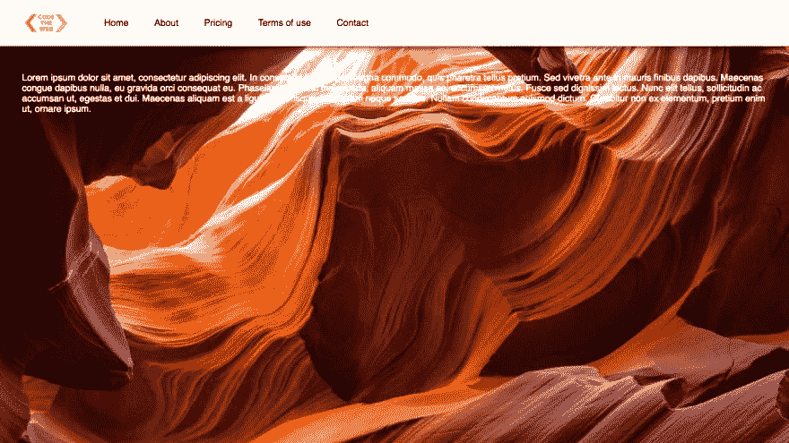T2】](https://res.cloudinary.com/practicaldev/image/fetch/s--B3vBNc-t--/c_limit%2Cf_auto%2Cfl_progressive%2Cq_auto%2Cw_880/https://codetheweb.blog/assets/img/posts/style-a-navigation-bar-css/final-product.png)

你可以在这里看到现场演示。

## 术语

> 哈哈，这听起来像是法律协议的开始😂

就本文而言，导航栏(nav-bar)和标题是一回事。我将在本文中使用术语“导航条”,但要知道它们基本上是一样的。

## 入门

我建议你跟随我的每一个教程——它真的会帮助你更快地学习和掌握概念。尤其是在这样的教程中，跟着一起编码会很有趣。

首先，创建一个新的项目文件夹，并在其中创建空白的`index.html`和`style.css`文件。让我们去把它们装满吧！

## HTML

如你所知，HTML 是任何网站的起点。将以下内容添加到您的`index.html`文件中:

```
<!DOCTYPE html>
<html>
    <head>
        Navigation bar DEMO
        <link rel="stylesheet" href="style.css">
    </head>
    <body>
        <header>
           
            <nav>
                <ul>
                    <li><a href="#">Home</a></li>
                    <li><a href="#">About</a></li>
                    <li><a href="#">Pricing</a></li>
                    <li><a href="#">Terms of use</a></li>
                    <li><a href="#">Contact</a></li>
                </ul>
            </nav>
        </header>
        <main>
            <p>Lorem ipsum dolor sit amet, consectetur adipiscing elit. In consequat libero eget magna commodo, quis pharetra tellus pretium. Sed viverra ante in mauris finibus dapibus. Maecenas congue dapibus nulla, eu gravida orci consequat eu. Phasellus nec nunc malesuada, aliquam massa ac, accumsan metus. Fusce sed dignissim lectus. Nunc elit tellus, sollicitudin ac accumsan ut, egestas et dui. Maecenas aliquam est a ligula scelerisque, in aliquam neque sodales. Nullam condimentum euismod dictum. Curabitur non ex elementum, pretium enim ut, ornare ipsum.</p>
        </main>
    </body>
</html> 
```

Enter fullscreen mode Exit fullscreen mode

在主体内部，我们有标题和导航元素。如果你不熟悉 HTML 中导航栏的这种结构，[看看这篇文章](https://codetheweb.blog/2017/10/29/lists-and-navigation/#navigation)。

在标题下面，`<main>`元素中有一些虚拟文本。这是为了让我们可以看到在教程的后面会出现的问题。

在浏览器中打开您的`index.html`文件——此时，它应该是这样的:

[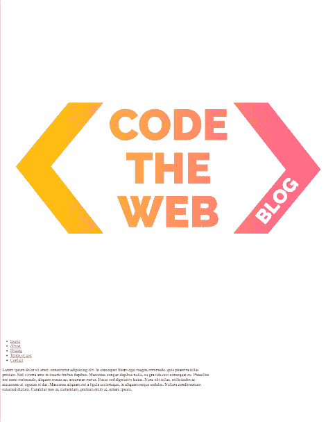T2】](https://res.cloudinary.com/practicaldev/image/fetch/s--ydhvkUCz--/c_limit%2Cf_auto%2Cfl_progressive%2Cq_auto%2Cw_880/https://codetheweb.blog/assets/img/posts/style-a-navigation-bar-css/base-html.png)

不是说你可能必须向下滚动，除非你真的缩小了，因为我们的图像是巨大的！

我们的 CSS 时间到了...

## 基本 CSS

首先，我们的形象太大了。让我们把它缩小到`80px`的高度——这将是我们导航条的高度。将以下内容添加到您的`style.css`文件中:

```
header img {
    height: 80px;
} 
```

Enter fullscreen mode Exit fullscreen mode

结果:
[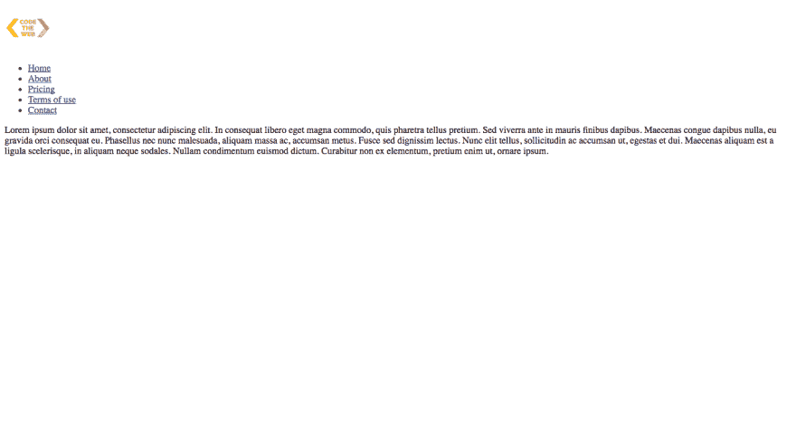](https://res.cloudinary.com/practicaldev/image/fetch/s--mmMOzHxu--/c_limit%2Cf_auto%2Cfl_progressive%2Cq_auto%2Cw_880/https://codetheweb.blog/assets/img/posts/style-a-navigation-bar-css/fixed-image-height.png)

唷，我现在可以呼吸了😅

接下来，让我们设置我们的样式，这样我们将能够看到发生了什么。首先，我们希望能够滚动——我们可以通过将`<body>`高度设置为`125vh` ( [视口高度](https://codetheweb.blog/2017/12/04/css-units/#vw--vh))来实现。我们希望能够在向下滚动时看到，我们可以通过添加一个`background-image`来做到这一点。当我们这样做的时候，让我们设置我们的字体为`sans-serif`，这样看起来就不会那么糟糕。下面是 CSS:

```
header img {
    height: 80px;
}
body {
    height: 125vh;
    background-image: url('https://codetheweb.blog/assets/img/posts/style-a-navigation-bar-css/background.jpg');
    background-size: cover;
    font-family: sans-serif;
} 
```

Enter fullscreen mode Exit fullscreen mode

还有一件事，让我们在我们的`<main>`上加一个`color`，这样我们可以更好地看到虚拟文本:

```
header img {
    height: 80px;
}
body {
    height: 125vh;
    background-image: url('https://codetheweb.blog/assets/img/posts/style-a-navigation-bar-css/background.jpg');
    background-size: cover;
    font-family: sans-serif;
}

main {
    color: white;
} 
```

Enter fullscreen mode Exit fullscreen mode

下面是所有这些的结果:
[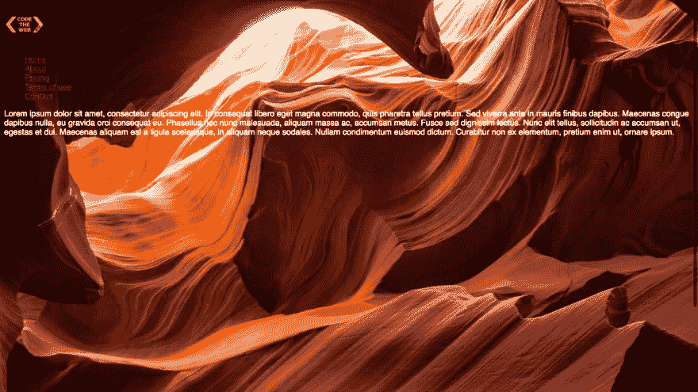](https://res.cloudinary.com/practicaldev/image/fetch/s--0mOv8ydL--/c_limit%2Cf_auto%2Cfl_progressive%2Cq_auto%2Cw_880/https://codetheweb.blog/assets/img/posts/style-a-navigation-bar-css/base-css.png)

不要担心改变链接的颜色，因为我们将在以后设计它们的样式。

## 定位导航条

好了，现在我们的网站看起来不错，但不是我们的导航栏！它看起来仍然像一个列表，因为**无论何时你制作一个导航栏，它必须有[一个特定的结构](https://codetheweb.blog/2017/10/29/lists-and-navigation/#navigation)** (包含一个`<ul>`)。这是因为网络爬虫更容易导航，而且[谷歌会喜欢你](//%7B%7Bsite.newsletter%7D%7D)😉

首先，让我们从定位实际的`<header>`元素开始。我们还想给`<header>`一个`background-color`，这样我们可以看到它的位置。再来加点风格吧！

```
header img {
    height: 80px;
}
body {
    height: 125vh;
    background-image: url('https://codetheweb.blog/assets/img/posts/style-a-navigation-bar-css/background.jpg');
    background-size: cover;
    font-family: sans-serif;
}

main {
    color: white;
}

header {
    background-color: white;
    position: fixed;
    top: 0;
    left: 0;
    right: 0;
    height: 80px;
} 
```

Enter fullscreen mode Exit fullscreen mode

这里我们使用`position : fixed` 来定位`<header>`元素[。然后，我们也像我之前提到的那样将`height`设置为`80px`(我们使用这个细节的唯一原因是因为它看起来不错)。](https://codetheweb.blog/2017/11/21/css-position-property/#position-fixed)

下面是结果:
[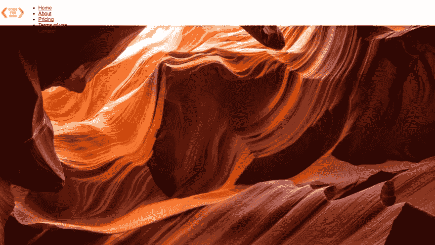](https://res.cloudinary.com/practicaldev/image/fetch/s--WQImW8Ys--/c_limit%2Cf_auto%2Cfl_progressive%2Cq_auto%2Cw_880/https://codetheweb.blog/assets/img/posts/style-a-navigation-bar-css/header-positioning.png)

耶，我们的标题/导航条现在定位了！然而，`<main>`中的虚拟文本已经被遮住😕

现在导航栏有了一个`fixed`的`position`，页面上的其余内容向上移动。这意味着主文本实际上是在导航条下面的*！*

要解决这个问题，我们只需要给主体一个等于导航条高度的`margin-top`，`80px` :

```
header img {
    height: 80px;
}
body {
    height: 125vh;
    background-image: url('https://codetheweb.blog/assets/img/posts/style-a-navigation-bar-css/background.jpg');
    background-size: cover;
    font-family: sans-serif;
    margin-top: 80px;
}

main {
    color: white;
}

header {
    background-color: white;
    position: fixed;
    top: 0;
    left: 0;
    right: 0;
    height: 80px;
} 
```

Enter fullscreen mode Exit fullscreen mode

结果:
[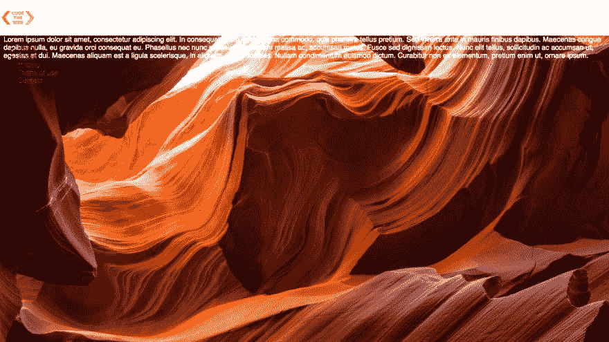](https://res.cloudinary.com/practicaldev/image/fetch/s--LKig8PCU--/c_limit%2Cf_auto%2Cfl_progressive%2Cq_auto%2Cw_880/https://codetheweb.blog/assets/img/posts/style-a-navigation-bar-css/body-margin-top.png)

呜！唯一的问题是，现在文本正对着导航栏的底部😕让我们通过添加一些`padding`来修复它(我完全没有想到要押韵😂)——下面是 CSS:

```
header img {
    height: 80px;
}
body {
    height: 125vh;
    background-image: url('https://codetheweb.blog/assets/img/posts/style-a-navigation-bar-css/background.jpg');
    background-size: cover;
    font-family: sans-serif;
    margin-top: 80px;
    padding: 30px;
}

main {
    color: white;
}

header {
    background-color: white;
    position: fixed;
    top: 0;
    left: 0;
    right: 0;
    height: 80px;
} 
```

Enter fullscreen mode Exit fullscreen mode

结果:
[](https://res.cloudinary.com/practicaldev/image/fetch/s--C7bNlSJ6--/c_limit%2Cf_auto%2Cfl_progressive%2Cq_auto%2Cw_880/https://codetheweb.blog/assets/img/posts/style-a-navigation-bar-css/body-padding.png) 
好多了！

下面是被可视化的主体的`margin`和`padding`:
[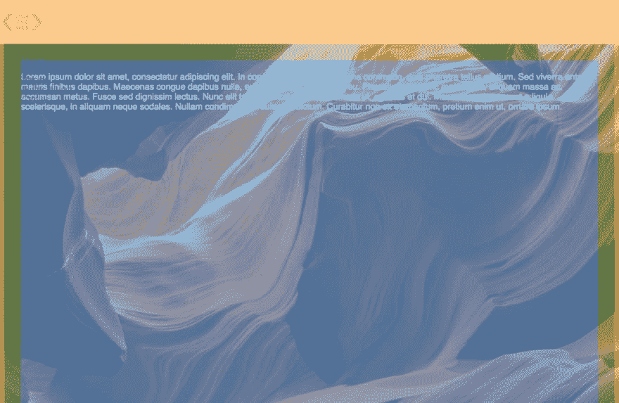](https://res.cloudinary.com/practicaldev/image/fetch/s--KM6l0_pK--/c_limit%2Cf_auto%2Cfl_progressive%2Cq_auto%2Cw_880/https://codetheweb.blog/assets/img/posts/style-a-navigation-bar-css/body-margin-padding-visualized.png)
(边缘为橙色，填充为绿色，主体部分为蓝色)

恭喜，现在我们已经让我们的页面基本上正常工作了！然而，不是在`<header>`里面的东西——它与文本的其余部分重叠，看起来很糟糕。

## 样式化导航条的内容

现在，让我们把这些项目放在导航条里面！首先，我们要让物品横向而不是纵向。我们可以使用`display: inline` :
来实现这一点

```
header img {
    height: 80px;
}
body {
    height: 125vh;
    background-image: url('https://codetheweb.blog/assets/img/posts/style-a-navigation-bar-css/background.jpg');
    background-size: cover;
    font-family: sans-serif;
    margin-top: 80px;
    padding: 30px;
}

main {
    color: white;
}

header {
    background-color: white;
    position: fixed;
    top: 0;
    left: 0;
    right: 0;
    height: 80px;
}

header * {
    display: inline;
} 
```

Enter fullscreen mode Exit fullscreen mode

这里，我们使用选择器`header *`。`*`是一个通配符，可以表示任何元素。所以`header *`基本上是指`header`里面的任何元素。另外，请注意，当我们使用`display: inline`时，项目符号会消失。项目符号首先出现的原因是默认情况下`<li>`元素有一个`display`类型的`list-item`。因此，当我们覆盖它并将其更改为`inline`时，项目符号会消失。

下面是结果:
[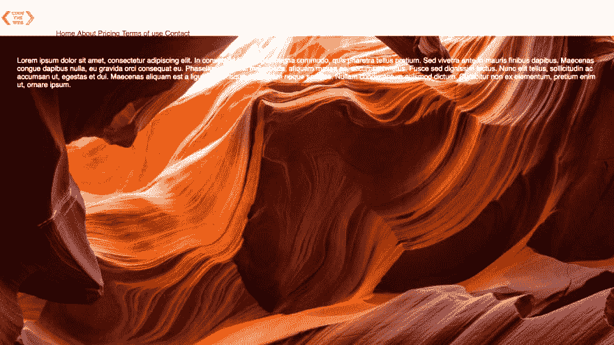](https://res.cloudinary.com/practicaldev/image/fetch/s--opKlL5oy--/c_limit%2Cf_auto%2Cfl_progressive%2Cq_auto%2Cw_880/https://codetheweb.blog/assets/img/posts/style-a-navigation-bar-css/header-items-inline.png)

然而，我们的链接现在会出现在导航栏的底部！我们可以通过给我们的`<header>`元素一个 [`flex`](https://codetheweb.blog/2017/12/05/css-flexboxes/) :
的`display`属性，让它们去导航栏的顶部

```
header img {
    height: 80px;
}
body {
    height: 125vh;
    background-image: url('https://codetheweb.blog/assets/img/posts/style-a-navigation-bar-css/background.jpg');
    background-size: cover;
    font-family: sans-serif;
    margin-top: 80px;
    padding: 30px;
}

main {
    color: white;
}

header {
    background-color: white;
    position: fixed;
    top: 0;
    left: 0;
    right: 0;
    height: 80px;
    display: flex;
}

header * {
    display: inline;
} 
```

Enter fullscreen mode Exit fullscreen mode

结果:
[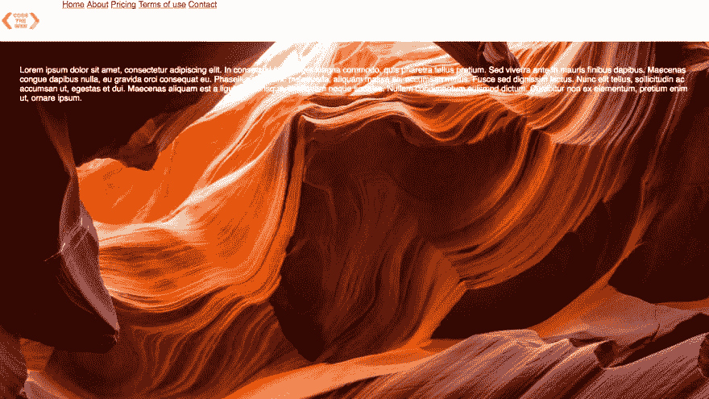](https://res.cloudinary.com/practicaldev/image/fetch/s--qLzcordE--/c_limit%2Cf_auto%2Cfl_progressive%2Cq_auto%2Cw_880/https://codetheweb.blog/assets/img/posts/style-a-navigation-bar-css/header-display-flex.png)

但是，文本仍然没有与导航条的中间垂直对齐。我们可以使用`align-items: center`在导航栏中垂直对齐我们的项目。如果你不知道`display: flex`或者`align-items: center`，可以看看我的 [flexbox 教程](https://codetheweb.blog/2017/12/05/css-flexboxes/)。下面是 CSS:

```
header img {
    height: 80px;
}
body {
    height: 125vh;
    background-image: url('https://codetheweb.blog/assets/img/posts/style-a-navigation-bar-css/background.jpg');
    background-size: cover;
    font-family: sans-serif;
    margin-top: 80px;
    padding: 30px;
}

main {
    color: white;
}

header {
    background-color: white;
    position: fixed;
    top: 0;
    left: 0;
    right: 0;
    height: 80px;
    display: flex;
    align-items: center;
}

header * {
    display: inline;
} 
```

Enter fullscreen mode Exit fullscreen mode

结果:
[](https://res.cloudinary.com/practicaldev/image/fetch/s--O3nXz-vt--/c_limit%2Cf_auto%2Cfl_progressive%2Cq_auto%2Cw_880/https://codetheweb.blog/assets/img/posts/style-a-navigation-bar-css/align-items-center.png)

然而，导航栏中的所有链接都挤在一起——我们可以给它们一个`margin`属性:
,让它们之间的距离更大

```
header img {
    height: 80px;
}
body {
    height: 125vh;
    background-image: url('https://codetheweb.blog/assets/img/posts/style-a-navigation-bar-css/background.jpg');
    background-size: cover;
    font-family: sans-serif;
    margin-top: 80px;
    padding: 30px;
}

main {
    color: white;
}

header {
    background-color: white;
    position: fixed;
    top: 0;
    left: 0;
    right: 0;
    height: 80px;
    display: flex;
    align-items: center;
}

header * {
    display: inline;
}

header li {
    margin: 20px;
} 
```

Enter fullscreen mode Exit fullscreen mode

结果:
[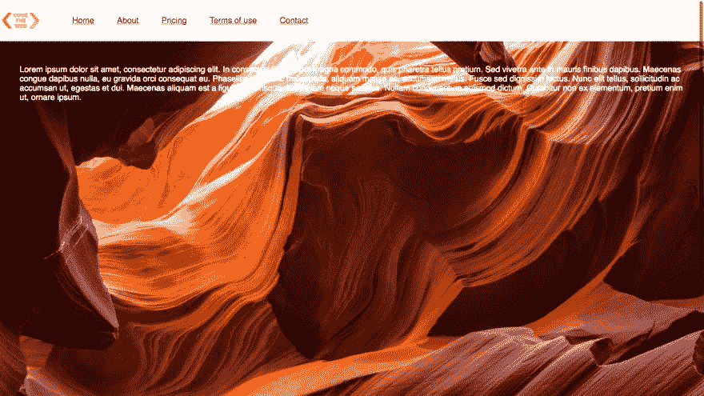](https://res.cloudinary.com/practicaldev/image/fetch/s--WyKISiFH--/c_limit%2Cf_auto%2Cfl_progressive%2Cq_auto%2Cw_880/https://codetheweb.blog/assets/img/posts/style-a-navigation-bar-css/header-items-margin.png)

这样看起来更好！现在我们的导航条项目已经定位，是时候给它们一些样式了！我们想去掉难看的默认链接样式，所以让我们继续做吧——我们可以将`color`设置为`black`，将`text-decoration`设置为`none`(通常是`underline`)。下面是 CSS:

```
header img {
    height: 80px;
}
body {
    height: 125vh;
    background-image: url('https://codetheweb.blog/assets/img/posts/style-a-navigation-bar-css/background.jpg');
    background-size: cover;
    font-family: sans-serif;
    margin-top: 80px;
    padding: 30px;
}

main {
    color: white;
}

header {
    background-color: white;
    position: fixed;
    top: 0;
    left: 0;
    right: 0;
    height: 80px;
    display: flex;
    align-items: center;
}

header * {
    display: inline;
}

header li {
    margin: 20px;
}

header li a {
    color: black;
    text-decoration: none;
} 
```

Enter fullscreen mode Exit fullscreen mode

结果:
[](https://res.cloudinary.com/practicaldev/image/fetch/s--b4aGN9yS--/c_limit%2Cf_auto%2Cfl_progressive%2Cq_auto%2Cw_880/https://codetheweb.blog/assets/img/posts/style-a-navigation-bar-css/link-styling-override.png)

我们现在在最后的冲刺阶段！我们的标志(嗯，技术上是我的标志😜)看起来有点怪怪的，那我们就加个`margin-left`固定一下定位吧！下面是 CSS:

```
header img {
    height: 80px;
    margin-left: 40px;
}
body {
    height: 125vh;
    background-image: url('https://codetheweb.blog/assets/img/posts/style-a-navigation-bar-css/background.jpg');
    background-size: cover;
    font-family: sans-serif;
    margin-top: 80px;
    padding: 30px;
}

main {
    color: white;
}

header {
    background-color: white;
    position: fixed;
    top: 0;
    left: 0;
    right: 0;
    height: 80px;
    display: flex;
    align-items: center;
}

header * {
    display: inline;
}

header li {
    margin: 20px;
}

header li a {
    color: black;
    text-decoration: none;
} 
```

Enter fullscreen mode Exit fullscreen mode

结果:
[](https://res.cloudinary.com/practicaldev/image/fetch/s--HULsi4Ax--/c_limit%2Cf_auto%2Cfl_progressive%2Cq_auto%2Cw_880/https://codetheweb.blog/assets/img/posts/style-a-navigation-bar-css/logo-margin-left.png) 
好看多了！😘

好了，这是今天最后一件事了，非常酷。我们将添加一个阴影到我们的导航栏。什么？一个影子？我以为那是你只能在 Photoshop 里做的东西？？？

好吧，信不信由你，CSS 有自己制作阴影的方法——事实上，多种方法！在另一篇文章中，我将更深入地研究所有不同类型的 CSS 阴影。

目前，我们将使用`box-shadow`属性。它只是在元素周围创建一个矩形阴影。

下面是`box-shadow`属性的语法:
[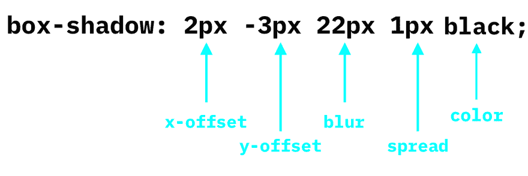](https://res.cloudinary.com/practicaldev/image/fetch/s--m-YBo3tS--/c_limit%2Cf_auto%2Cfl_progressive%2Cq_auto%2Cw_880/https://codetheweb.blog/assets/img/posts/style-a-navigation-bar-css/box-shadow-syntax.png)

`x-offset`和`y-offset`是阴影到侧面和上下的距离，`blur`是阴影的模糊程度，`spread`是阴影在元素外扩散的距离。所有这些值都可以是负值，除了`blur`。之后，我们得到了我们想要的阴影颜色。让我们给导航条添加一个非常简单(但是有效)的阴影:

```
header img {
    height: 80px;
    margin-left: 40px;
}
body {
    height: 125vh;
    background-image: url('https://codetheweb.blog/assets/img/posts/style-a-navigation-bar-css/background.jpg');
    background-size: cover;
    font-family: sans-serif;
    margin-top: 80px;
    padding: 30px;
}

main {
    color: white;
}

header {
    background-color: white;
    position: fixed;
    top: 0;
    left: 0;
    right: 0;
    height: 80px;
    display: flex;
    align-items: center;
    box-shadow: 0 0 25px 0 black;
}

header * {
    display: inline;
}

header li {
    margin: 20px;
}

header li a {
    color: black;
    text-decoration: none;
} 
```

Enter fullscreen mode Exit fullscreen mode

如你所见，我们在这里只使用了`blur`——我们将其余的值(`x-offset`、`y-offset`和`spread`)设置为`0`。下面是结果:
[](https://res.cloudinary.com/practicaldev/image/fetch/s--B3vBNc-t--/c_limit%2Cf_auto%2Cfl_progressive%2Cq_auto%2Cw_880/https://codetheweb.blog/assets/img/posts/style-a-navigation-bar-css/final-product.png)

厉害！！！我们的导航栏现在有了阴影！！！🎉

今天到此为止😉

## 结论

所以，我希望你在这篇文章中学到了很多！现在你可以开始制作你自己的导航栏了。你访问的几乎每个网站都会用到它们，所以知道如何编码是一件非常重要的事情。

将来，我会写一篇关于[如何设计*响应*导航条](//%7B%7Bsite.newsletter%7D%7D)的教程，这意味着它将适应不同的屏幕尺寸(例如，在手机上显示‘菜单’图标)。

同时，如果你[分享这个](https://codetheweb.blog/2017/12/12/style-a-navigation-bar-css/#share)或者[订阅时事通讯](https://codetheweb.blog/newsletter)在你的收件箱里收到新帖子，我会非常高兴。如果你做了其中任何一件事，你就太棒了，我会给你一辈子的玉米卷🌮(不完全是，只是我的新营销策略😜 ).

玩得开心，继续写代码，下次见，我将讨论 HTML 中的[网站图标(我想我应该稍微改变一下，做一个 HTML)。到时候见！](https://codetheweb.blog/2017/12/14/html-icons/)

> ### 想要更多这样的帖子？[注册我的简讯](https://codetheweb.blog/newsletter/)。
> 
> 我一直在努力学习这些教程，但是到目前为止还没有赚到任何钱，所以如果你注册的话，我会非常感激；)

这篇文章最初发表在 [Code The Web](https://codetheweb.blog) 上，这是一个有趣且易于理解的博客，帮助你学习 Web 开发🚀
学:[HTML](https://codetheweb.blog/learn/html/)|[CSS](https://codetheweb.blog/learn/css/)|[JavaScript](https://codetheweb.blog/learn/javascript/)