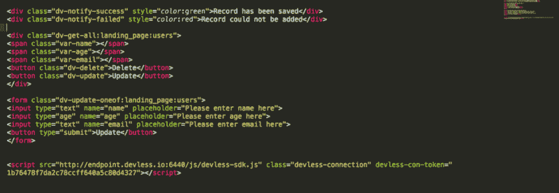
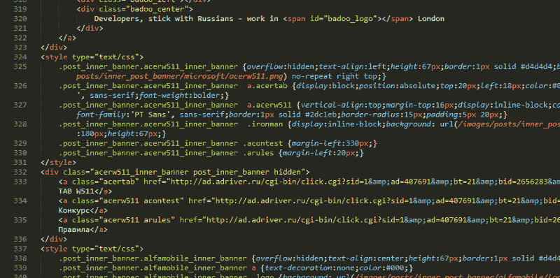
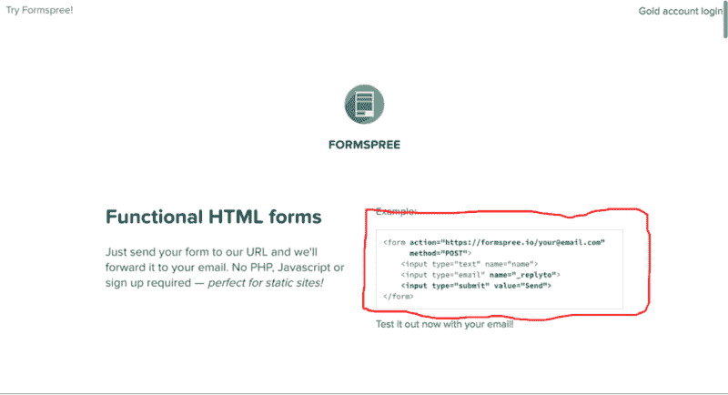

# 用 HTML 替换 JavaScript

> 原文：<https://dev.to/eddymens/substituting-javascript-with-html-9c3>

[T2】](https://res.cloudinary.com/practicaldev/image/fetch/s--aToCbdr_--/c_limit%2Cf_auto%2Cfl_progressive%2Cq_auto%2Cw_880/https://cdn-images-1.medium.com/max/800/1%2Anh5kmyjwgrz8xv3lrLkPmw.png)

所以现在你可能在想 HTML 究竟会怎样取代 Javascript。

我不是指字面意思。但在某种程度上这是可能的。

### **我们如何编写代码**

[T2】](https://res.cloudinary.com/practicaldev/image/fetch/s--79ZyZQTa--/c_limit%2Cf_auto%2Cfl_progressive%2Cq_auto%2Cw_880/https://cdn-images-1.medium.com/max/800/1%2ANVkEotMqoos4fNQ5boRDkg.png)

你有没有在一个项目中，意识到在不同的视图之间，你一直在编写相同的代码来获取或发送数据到你的服务器？

最显而易见的解决方案是重构，将这个公共部分作为一个类、对象、方法、函数、例程或我们现在做的任何东西。所以我们可以在多个视图中调用同一个片段。

### **更进一步**

但是只有少数开发人员将大量可重用代码重构为可以在原始项目之外使用的精炼库。

事实上，一旦你开始从你工作的项目中创建库，你会开始注意到增长。我说的成长是指你感觉自己像一个工程师，因为你花时间把这些库组装在一起以完成项目，并花业余时间修补和修复这些库，这扩展了你的思维深度。我必须说这是一次非常有趣的经历。

### **出示证明**

我最近从构建终端用户应用程序过渡到更加关注开发者工具@ [Devless](https://medium.com/@devless) 。

我不仅致力于加速软件开发过程，还致力于确保它是可伸缩的。我们发布的旗舰产品之一是一个后端框架，它已经准备好构建现成的 SAAS 应用程序。

当我们第一次发布时，我们发布了几个 SDK 来处理这个框架，包括 JS、RUBY、PHP 和 PYTHON。作为我们业务模式的一部分，我们还与开发人员合作开发企业应用。这些项目通常是我们框架的关键点。在这样的项目中，我们了解到 DevLess 在快速开发过程中提供了多少速度，以及它是否能在生产中真正扩展。

在过去的几个月里，我学到了很多。我发现的一件事是，即使在将最常用的 JS 代码重构为函数和对象之后，我们仍然编写了太多的 JS。其他因素也导致了 JS 的过度写作，但那是另一篇文章了。

示例:我们有多达 8 个表单提交和大约 12 个显示数据的点。每次我不得不组装一个表单，然后在 submission 函数上调用一些绑定的 JS 代码，将这些数据发送到 DevLess 框架时，我就开始担心了。所以我开始着手做些事情。

### **啊哈！时刻**

[](https://res.cloudinary.com/practicaldev/image/fetch/s--POXxL2jh--/c_limit%2Cf_auto%2Cfl_progressive%2Cq_auto%2Cw_880/https://cdn-images-1.medium.com/max/800/1%2A3Csa4903w-nLl6sUJE7FtA.png)
[https://formspree.io/](https://formspree.io/)

我不记得我是如何找到 Form Spree 的，但当我看到页面上的例子时，我有所触动。我意识到我仍然必须告诉我的表单关于 JS 函数的原因是因为我还没有把关注点的分离提高到一个更高的层次。我很快开始研究类似 Bootstrap 的实现，这完成了另一半的难题。

```
<button class="btn btn-warning">Submit<button> 
```

Enter fullscreen mode Exit fullscreen mode

随着类的增加，我可以享受自定义 CSS Bootstrap 提供的大部分样式。为什么我们不能对 JS 做同样的事情？事实证明，我们确实有，这样的库被称为无争议 JS 库。

所以我们想出了一个用很少或者根本不用 Javascript 就能把数据发送回后端的解决方案。

例如，下面的示例代码用于向一个标有 details 的表提交数据。注意类`dv-add-oneto:profiles:details`这就是你需要提交下面的表单给 DevLess 的全部内容。

所以现在 JS 库监听特殊的类并相应地行动。这与我们之前所做的相反，现在 N 次我们处理来自后端的数据，负责它的 JS 代码是相同的。例如，如果你把 JQuery 比作 Bootstrap。虽然您编写了一些 JS 来使用 JQuery，但是您没有编写任何 CSS 来使用 Bootstrap 中的标准组件。

### **爽，接下来还有什么**

本着开源的精神，我们将从 DevLess 中提取 HTML SDK，并使它也可以用于其他框架。同样值得注意的是，HTML SDK 并不是所有数据工作的灵丹妙药。对于某些情况，您可能需要使用其他 SDK 或为此编写自定义代码。但至少现在我们能让该简单的事情变得简单。

您可以查看下面的文档，了解使用 HTML SDK 还能做些什么:

### **再见**

好吧，这是我说再见的地方，所以请记得在下面分享，爱和评论。哦！你可以通过电子邮件 [edmond@devles.io](mailto:edmond@devles.io) 或 twitter 上的@eddy_mens 联系我

*   [网页开发](https://medium.com/tag/web-development?source=post)
*   [JavaScript](https://medium.com/tag/javascript?source=post)
*   [后端即服务](https://medium.com/tag/backend-as-a-service?source=post)
*   [HTML](https://medium.com/tag/html?source=post)
*   [无损](https://medium.com/tag/devless?source=post)

通过或多或少的鼓掌，你可以向我们发出信号，哪些故事真正脱颖而出。

“不要担心其他人会做什么。预测未来的最好方法就是创造未来。”创新或者死亡；)

### [t1](#devless)[无损](https://medium.com/devless?source=footer_card)

DevLess 是一个平台，通过拼接即插即用后端模块，允许您轻松地为您的 web 和移动应用程序构建健壮的后端。