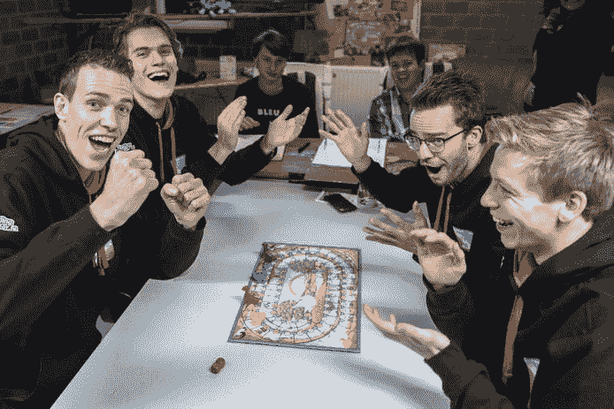
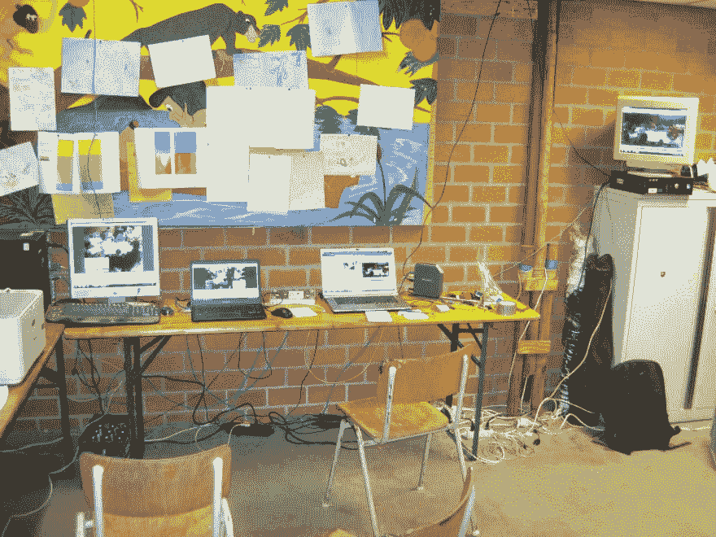
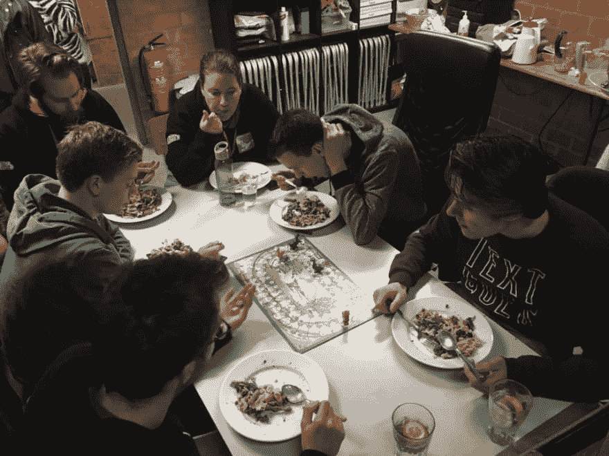
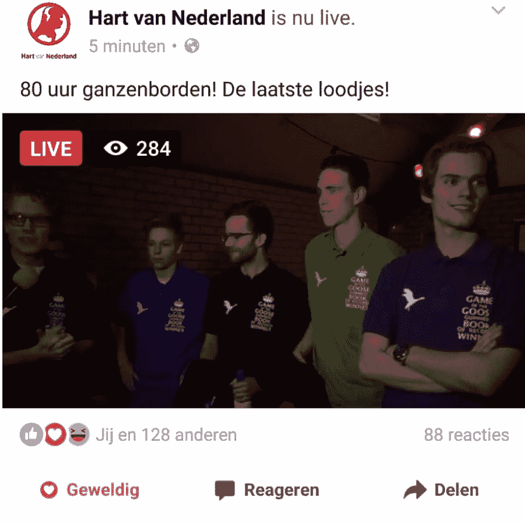
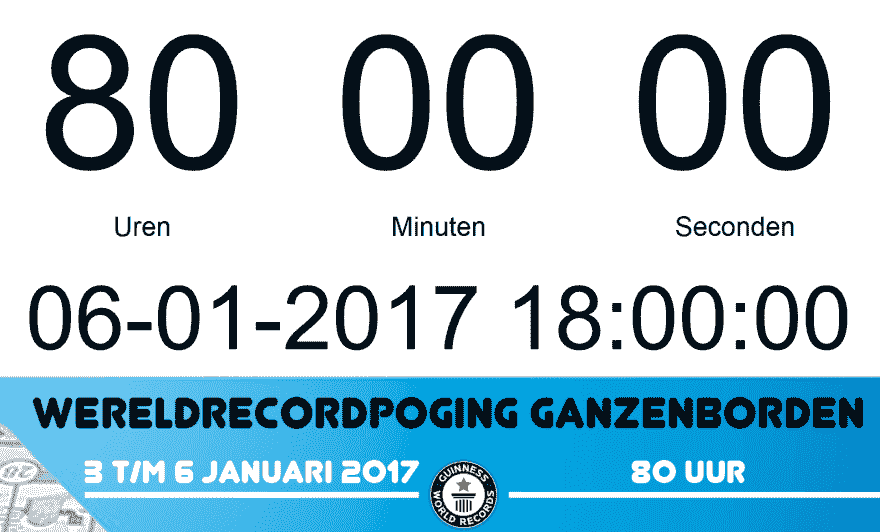

# 支持吉尼斯世界纪录的尝试

> 原文：<https://dev.to/joepweijers/supporting-a-guiness-world-record-attempt>

四个带着使命的家伙:打破玩棋盘游戏的最长马拉松吉尼斯世界纪录。80 个小时玩令人麻木的鹅游戏。由于睡眠不足，从生理学角度来说，这是一个非常有趣的话题，但我想向你展示一下确保这一事件被载入吉尼斯世界纪录的电脑设置。

> 好玩的事实是这样列举的。那么，你知道几年前，地方世界纪录和全球世界纪录是不同的吗？鹅的最长马拉松比赛的纪录是 74 小时，但在吉尼斯纪录全球化后，这一具体纪录消失了，成为更普遍的“最长马拉松玩棋盘游戏”。纪录也被刷新，现在只有 61 小时 2 分钟。

[T2】](https://res.cloudinary.com/practicaldev/image/fetch/s--rtlVV290--/c_limit%2Cf_auto%2Cfl_progressive%2Cq_auto%2Cw_880/https://thepracticaldev.s3.amazonaws.com/i/za05b69llq0jorrq67lu.jpg)

一项记录要想被吉尼斯世界纪录组织认可，要么一名官方裁判必须在整个记录期间在场，要么你必须提供整个事件的充分(视频)证据。由于我们的预算很少，我们选择了后者。这给我带来了挑战:无论发生什么事情，我怎样才能记录 80 个小时的视频，一秒不漏。因此，我的 IT 背景开始发挥作用:我们需要冗余、故障转移、不间断电源和监控！但是在我们有限的预算下，我不得不利用每个人都有的 IT 基础设施:几台笔记本电脑，一些电脑和一些网络摄像头。

> 除了视频证据，吉尼斯世界纪录组织还要求一份详细的日志，包含所有比赛和详细的休息时间，由两名公正的法官填写。这些法官必须一直在场，而且只能审判四个小时。我们真的很感谢我们的 40 多名评委，他们抽出时间来协助这项世界纪录的尝试，将 04:00 转换到 08:00 是一个不小的壮举！

## 冗余

《吉尼斯世界纪录指南》指出“*视频证据必须显示整个记录尝试，从开始到结束*”。真的需要记录一切:“*对于‘最长马拉松’的记录尝试，我们知道在尝试过程中可能需要更换电池或磁带，因此，当第一台摄像机不工作时，您应该有第二台摄像机进行拍摄。*

我们使用两个网络摄像头和一个 handicam 来提供双重冗余。所有的摄像机都从不同的角度拍摄，所以如果有人挡住了摄像机，或者新闻摄制组的光线遮住了摄像机，我们仍然可以向吉尼斯世界纪录组织展示不间断的清晰视频。

## 不间断电源

这个很简单:使用笔记本电脑！还有一个插着适配器的手提袋。另一个手提袋准备好了电池。

所以我们被保护得很好，但在完全断电的情况下，我们可能会有其他问题，因为在黑暗中玩鹅的游戏是一个挑战。为此，我们还准备了几个手电筒和一个大电池供电的 LED 泛光灯备用。

> 谢天谢地，唯一一次停电发生在我们前一天设置 IT 基础设施的时候。在尝试记录的过程中没有任何问题！

## 监控

我不知道有什么 Nagios 核心插件可以确保时钟显示正确的时间或者视频应用程序正在录制，所以我们采取了手动监控的方式。所有显示时钟或正在传输视频的机器都安装了 [TightVNC](http://www.tightvnc.com/) 服务器，因此我们可以从控制室远程监控所有机器。

[T2】](https://res.cloudinary.com/practicaldev/image/fetch/s--NtfSC_OV--/c_limit%2Cf_auto%2Cfl_progressive%2Cq_auto%2Cw_880/https://thepracticaldev.s3.amazonaws.com/i/ag7of593ndpzvewfpejj.JPG)

当我不在控制室的时候，我随身带着装有遥控涟漪应用程序的 iPad。这是 TightVNC 为 iPad 开发的 VNC 浏览器，所以我可以在任何地方监控所有的机器。这款应用非常棒，远远领先于应用商店中所有蹩脚的共享软件和免费的 VNC 产品，所以绝对值得花这么少的钱来支持 TightVNC 团队。

> 其中一台显示时钟的笔记本电脑会偶尔弹出一个窗口，显示一些丢失的 dll，覆盖时钟。原来是病毒感染。这种意想不到的失败几乎是不可能的，所以手动监控是我们最好的选择。额外提示:确保你使用的所有机器都是最新的，并且进行了病毒扫描！

## 储存

您是否知道 GoPro 中的 32 GB SD 卡在几个小时内就被填满了？高分辨率录像会占用太多的磁盘空间。也不需要在 80 小时内看到板上的每一点灰尘，所以我们在质量和文件大小之间寻找平衡。我们使用了一个名为 iSpy 的开源工具来记录来自网络摄像头的镜头。iSpy 是一种监控工具，通常用于 CCTV 摄像机，专门用于连续录制镜头。它使用一种编码器，以相对较小的文件大小提供清晰的图像，但帧率较低。对我们的目的来说是可接受的折衷。

handicam 内置 80GB 硬盘。在其最低设置下，它预测最长录制时间为 72 小时，但最终它成功完成了 80 小时。这是一个完美的无需关注的备份解决方案。

[T2】](https://res.cloudinary.com/practicaldev/image/fetch/s--bWWyAXDD--/c_limit%2Cf_auto%2Cfl_progressive%2Cq_auto%2Cw_880/https://thepracticaldev.s3.amazonaws.com/i/1tv08cy8ryp39wyon0g2.jpg)

> 80 个小时不睡觉还玩游戏是不可能的。马拉松世界纪录的规则规定，每打满一小时，你将有 5 分钟的休息时间。这一休息时间可以累积为更长的休息时间。我们有一个非常严格的休息计划，以确保玩家可以休息足够的时间来完成 3 天 3 夜的游戏。这些休息时间也允许我们，支持团队，对摄像机或游戏室进行调整。

## 时钟

为了安全起见，考虑到从指南到证据的要求，我们需要一个显示当前时间和记录尝试的当前持续时间的时钟。这个时钟必须在所有的视频上清晰可见，对我们的独立裁判和支持团队也是如此(我们严格的休息时间表意味着我们必须对恢复游戏非常严格)。所以我们有几个屏幕(由几台电脑驱动)显示时钟。为了方便起见，每个人都可以在他们的 iPads 或手机上打开这个时钟的托管版本。

但是当时钟在 5 台不同的计算机上运行时，我们遇到了另一个挑战:计算机的时钟会慢慢倾斜。评委们会倒计时，直到休息，观众们也会计时，但不同步。大多数笔记本电脑是 Windows 笔记本电脑。您可以告诉 Windows 自动调整时间，但这并不经常发生，因此时钟偏差仍然可见。手动调整时间是解决这个问题的方法。Linux 电脑可以在任何需要的时候与 NTP 服务器同步，所以它们更容易保持同步。

> 我的钟出现在荷兰各大新闻媒体上！

## 观众参与度

真正鼓舞运动员的精神并帮助他们度过 80 个小时的奋斗的是他们的支持者的欢呼。在观看、聊天和提供必要支持的过程中，朋友和家人都出现了几次。但是也有很多人通过脸书网页和各种新闻渠道在线关注。

为了向整个世界实时展示正在发生的事情，我们使用[开放广播软件](https://obsproject.com/)将一个网络摄像头传输到[脸书直播](https://live.fb.com/)。OBS 允许你添加叠加到你的流媒体视频，我们用它来叠加时钟。设置这个真的很容易，但由于我们 400 kbps 的上行互联网连接，我们不得不使用非常低的分辨率。

[T2】](https://res.cloudinary.com/practicaldev/image/fetch/s--kTIy5Cww--/c_limit%2Cf_auto%2Cfl_progressive%2Cq_auto%2Cw_880/https://thepracticaldev.s3.amazonaws.com/i/c18cg9iapj19z0a9bmjs.JPG)

> 人们喜欢直播，所以我们有稳定数量的并发观众，即使是在晚上。我们托管视频的频道比平时多了 37.027%的流量。数百人现场观看了最后的几分钟和庆祝活动，现在已经累积了超过 [240，000 的浏览量](https://www.facebook.com/hartvannederland/videos/1323835197638005/)！

## 编辑视频

运动员们成功地完成了他们 80 小时记录的尝试。睡了 16 个小时后，每个人都开始收集所有的证据。浏览航海日志，收集论文和广播报道，从每个参加的人那里接收图片。我的工作是把所有千兆字节的视频整理好，这样我们就可以和吉尼斯世界纪录组织分享视频了。

YouTube 允许视频长度为 11 小时，所以我决定制作 8 个视频，每个 10 小时。我们将 iSpy 配置为录制 30 分钟的文件，因此我们有大约 160 个视频可以拼接在一起。YouTube 有一个在线编辑器允许你这样做。但是在上传了所有单独的文件之后(谢天谢地你可以把它们都拖放进去)，结果是编辑器中的视频长度被限制在 1 小时以内。我尝试了几个视频编辑器，但没有一个能轻松处理这么多的电影。在我的机器上对一个 1 小时的拼接视频进行重新编码需要几个小时，所以这不能很好地扩展。

最后，我重用了 iSpy 内部使用的 [`ffmpeg`](https://ffmpeg.org/) 实用程序。这是一个命令行工具，可以将文件名列表缝合在一起。我还必须使用裁剪功能，因为 30 分钟的文件实际上是 32 分钟。如果你在[关键帧](https://en.wikipedia.org/wiki/Key_frame#Video_compression)处剪切电影，剪辑一个 MP4 文件不需要重新编码，因此只需要几秒钟而不是几个小时。在我们的例子中，由于关键帧的裁剪，我们损失了几秒钟，但是我们发现这是可以接受的。

## 主持视频

所以视频已经完成了，现在我们只需要与吉尼斯世界纪录组织分享它们。我们把它们都上传到了 YouTube，但由于侵犯了版权，它们立即被屏蔽了。在所有视频的背景中，人们可能会隐约听到让这些人持续 80 小时的 Spotify 播放列表。

YouTube 会主动扫描视频中获得许可的音频，并自动应用版权限制。版权所有者可以施加不同的限制:阻止视频(在某些国家)，禁止嵌入，要求视频的收入，显示广告，或静音所有音频。

> 我们有各种各样的版权限制。整整 10 个小时的视频被完全静音，因为从 07:57:03 - 07:58:56 播放了一首大约 3 分钟的歌曲。另一个视频在日本无法观看，因为它播放的是荷兰歌曲“Ik wou dat ik jou was”。

使用`ffmpeg`我可以很容易地剥离音频，不违反 YouTube 上的版权。有人牺牲了他的 OneDrive，为吉尼斯世界纪录组织提供音频视频。

[T2】](https://res.cloudinary.com/practicaldev/image/fetch/s--KgNpC6pQ--/c_limit%2Cf_auto%2Cfl_progressive%2Cq_auto%2Cw_880/https://thepracticaldev.s3.amazonaws.com/i/shb07zhe5g65bo683f7t.png)

> 吉尼斯世界纪录组织审查了证据，将玩棋盘游戏最长马拉松的吉尼斯世界纪录授予了古斯、马塞尔、马克斯和斯蒂安。