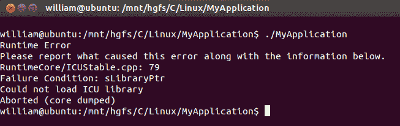
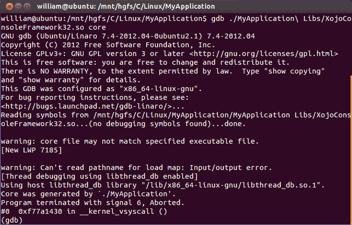
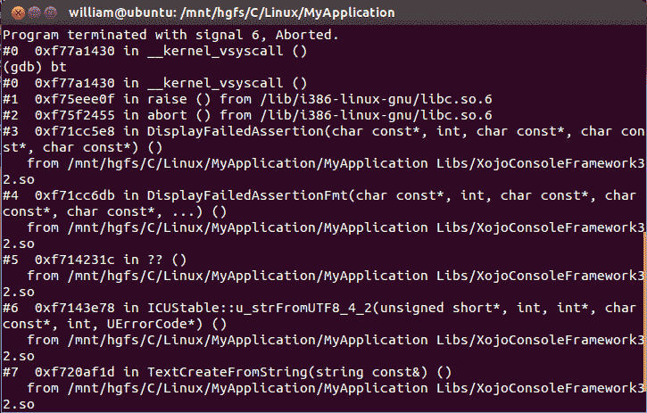

# 进行核心转储:当你的应用在 Linux 上崩溃时该怎么办

> 原文：<https://dev.to/lefebvre/take-a-core-dump-what-to-do-when-your-app-crashes-on-linux-6p0>

*交叉发布自 [Xojo 博客](https://blog.xojo.com/2015/08/17/take-a-core-dump-what-to-do-when-your-app-crashes-on-linux/)T3】*

对于生活中的许多事情，更多的选择意味着更多的表达自由。我们可以挑选自己喜欢的东西作为表达自己的方式。这就是 Linux 的世界。无数不同的 Linux 发行版以及所有不同的桌面管理器和窗口管理器令人望而生畏。虽然更多的选择是好事(总的来说)，但也会导致更多的困惑。作为一名跨平台开发人员，您可能知道每个操作系统都有自己处理崩溃和崩溃报告的方式。在 Linux 上这没有什么不同，但是它更令人困惑，因为不是每个 Linux 发行版都有相同的配置。这篇博客将回答一些你可能会有的基本问题，当你的应用程序在 Linux 上崩溃时会发生什么。

# “核心转储”是什么意思？

每当应用程序崩溃时(例如，我不是指 Xojo 异常崩溃)，操作系统可以存储(甚至发送)一个崩溃报告。在 OS X 上，一个漂亮的崩溃报告对话框出现了，你甚至可以查看崩溃报告的细节，并获得堆栈跟踪的样本。在 Windows 上，您可能会收到一个类似的对话框，其中有一个将报告发送给 Microsoft 的按钮。这个崩溃报告将出现在我们与微软一起设置的 Windows 错误报告仪表板中，所以请尽可能按下那个按钮，这将对我们有很大帮助。在 Linux 上，每当应用程序崩溃时(最常见的是由于分段错误，即当访问坏的指针/内存时)，它可以选择生成核心转储。但是，在大多数情况下，默认情况下，这种核心转储生成是禁用的。

# 那么什么是核心转储，它包含哪些信息呢？

就像你在 OS X 上看到的崩溃报告或你从 Windows 崩溃发给我们的崩溃报告一样，它是一个包含程序在崩溃时的运行状态的文件。它还包含您的应用程序访问的所有虚拟内存区域的快照，所以是的，核心转储中可能存储有机密信息，所以要小心您将它交给谁。

# 如何生成核心转储文件，在哪里可以找到这个文件？

这实际上取决于您的 Linux 发行版/配置。为了保持简短，我将详细介绍最常见的步骤，如果需要，还可以通过链接进一步阅读。让我们假设我们在一个运行 bash 的 Linux 发行版上(例如，运行 Gnome 桌面管理器的 Ubuntu 发行版)。首先，我们需要告诉系统允许多大的核心转储。为此，请在终端中键入以下行:

```
ulimit -c unlimited 
```

Enter fullscreen mode Exit fullscreen mode

默认情况下，该值为 0，这就是从不生成核心转储的原因。在 bash 终端中执行上面的行将允许为该终端会话生成核心转储。“unlimited”参数告诉系统不要限制核心转储文件的大小。现在假设您有一个崩溃的应用程序，在您的终端会话中运行该应用程序并等待它崩溃。下面是一个生成核心转储的非常简单的例子。我使用的是 64 位的 Ubuntu 发行版，但是我没有安装 32 位的 ICU 库:

[T2】](https://res.cloudinary.com/practicaldev/image/fetch/s--hsRUNd9r--/c_limit%2Cf_auto%2Cfl_progressive%2Cq_auto%2Cw_880/https://blog.xojo.com/wp-content/uploads/2015/08/CoreDumpExample.pngt1466486449161)

在此终止之后，您应该看到在当前目录中生成了一个“核心”文件(但是，根据您的配置，它可能位于其他位置)。

[T2】](https://res.cloudinary.com/practicaldev/image/fetch/s--qtyiIGIC--/c_limit%2Cf_auto%2Cfl_progressive%2Cq_auto%2Cw_880/https://blog.xojo.com/wp-content/uploads/2015/08/CoreDumpFile.pngt1466486449161)

现在您已经有了核心文件，您可以将它发送给开发人员，他可以使用 gdb 调试它。假设开发人员可以访问调试符号(或者可以使用调试符号构建有问题的崩溃应用程序/库)，他/她可以收集相当不错的堆栈跟踪来找出问题所在。如果你对堆栈跟踪有点好奇，如果你知道崩溃的应用程序/库是什么，你甚至可以自己调试它。在我们的简单示例中，我知道崩溃发生在 XojoConsoleFramework32.so 中，所以我会在核心文件上运行这样的 gdb:

[T2】](https://res.cloudinary.com/practicaldev/image/fetch/s--IXVb5XRA--/c_limit%2Cf_auto%2Cfl_progressive%2Cq_auto%2Cw_880/https://blog.xojo.com/wp-content/uploads/2015/08/gdb.pngt1466486449161)

现在核心文件已经加载到 gdb 中，您可以继续执行回溯:

[T2】](https://res.cloudinary.com/practicaldev/image/fetch/s--ULKo8Q1u--/c_limit%2Cf_auto%2Cfl_progressive%2Cq_auto%2Cw_880/https://blog.xojo.com/wp-content/uploads/2015/08/gdbtrace.pngt1466486449161)

请注意，gdb 不会从我们的框架库中加载任何调试信息，因为我们不会构建包含调试信息的发布框架。但是，我们确实在本地存储了这些调试信息文件，并使用它们来调试核心转储。因此，核心文件本身以及正确的调试信息对于调试崩溃非常有用。如果您的 Linux 应用程序崩溃了，现在您知道如何生成核心转储，在哪里可以找到它，并且希望您能够将它发送给开发人员，以便他们可以调试它。

根据您的需求/发行版，这里有一些额外的资源供进一步研究。

*   [如何在全局应用 ulimit，而不是在我们的终端会话中](http://serverfault.com/questions/292237/apply-ulimit-globally-on-ubuntu)
*   [如何为不同的 shells(如 tcsh)生成核心转储，以及生成转储的不同方式](http://stackoverflow.com/questions/17965/generate-a-core-dump-in-linux)
*   [如何找到您的核心转储文件](http://stackoverflow.com/questions/2065912/core-dumped-but-core-file-is-not-in-current-directory)
*   [调试无可执行文件](https://sourceware.org/ml/archer/2008-q4/msg00119.html)