# 使用无服务器框架和 Webtask 的电报机器人原型

> 原文：<https://dev.to/fernalvarez590/telegram-bot-prototype-using-serverless-framework-and-webtask-e7g>

伦敦玛丽女王大学认知科学研究小组的科学家给一个机器人编程，让它表演单口喜剧。https://www.youtube.com/watch?v=fL5ZtBO4NzM

FaaS (Functions as a Service)目前越来越受欢迎，因为它们易于扩展，没有闲置时间成本，并且在创建微服务时非常强大。我被告知 Auth0 Inc .创建了他们自己的名为 Webtask 的 FaaS，其中一个最大的特点是您可以使用 NodeJS 轻松创建您的函数，所以我决定尝试一下，用电报机器人创建一个非常简单的原型，为什么是机器人？因为机器人通常使用服务器来提供服务，我想尝试这种无服务器的方法。为什么是电报机器人？因为我很好奇如何做一个电报机器人。

### 我们要造什么？

在本文中，我们将创建一个非常简单的电报机器人，它使用[*icanhazdaddjoke*API](https://icanhazdadjoke.com/api)检索一个随机的爸爸笑话

### 我们要用什么？

*   NodeJS 的最新版本———此处 下载
***   一个 [Webtask](https://webtask.io/) 账户*   您选择的编辑器——在 mi 情况下，我使用 [VSCode](https://code.visualstudio.com/)*   电报帐户和电报桌面客户端(推荐)。*   无服务器命令行界面——在此下载**

 **### 在电报中创建机器人

在您创建了您的电报帐户并登录到桌面客户端后，您需要与 [*机器人父亲*](https://telegram.me/botfather) 对话(点击进入电报客户端与之对话)来创建您的机器人并为您的新机器人生成您的 **API 令牌**。

用*机器人父亲打开客户端后，*会自动触发/start，机器人会给出一大串命令来帮助你创建和管理电报机器人

[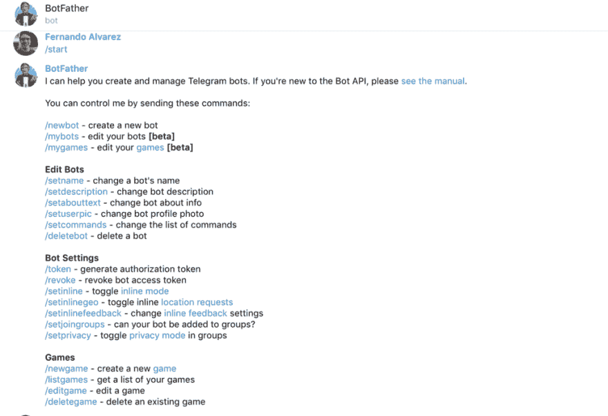T2】](https://res.cloudinary.com/practicaldev/image/fetch/s--kd_mD8hf--/c_limit%2Cf_auto%2Cfl_progressive%2Cq_auto%2Cw_880/https://cdn-images-1.medium.com/max/1024/1%2ARg_4nvtKJB65kR1VPAIN6w.png)

使用/newbot 命令启动。这个机器人需要一个人类可读的名字。我用“爸爸笑话机器人，但你可以使用任何名称，如“我的第一个超级骗子机器人笑话 5000。"

[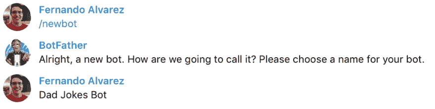T2】](https://res.cloudinary.com/practicaldev/image/fetch/s--mSsFbrFU--/c_limit%2Cf_auto%2Cfl_progressive%2Cq_auto%2Cw_880/https://cdn-images-1.medium.com/max/1024/1%2Att0OoLHTcEqClZFDded-Ig.png)

*机器人父亲*会要求你输入机器人的用户名。用户名**必须**唯一，并且**以 **bot** 结尾**。在我的例子中，我使用了*“dadjokestbot”*，但是用户名可以是任意的。在您插入有效的 bot 用户名后，它会告诉您 bot 已成功创建，并会给您一个 **API 令牌。**写下来。你会需要它的，ðÿ"œ.

[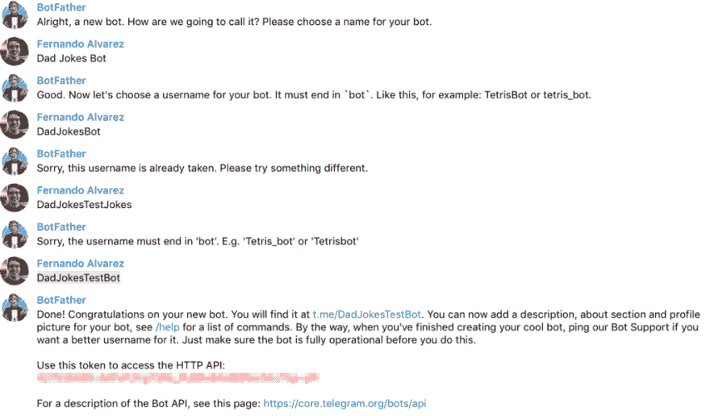](https://res.cloudinary.com/practicaldev/image/fetch/s--4TrGbz8u--/c_limit%2Cf_auto%2Cfl_progressive%2Cq_auto%2Cw_880/https://cdn-images-1.medium.com/max/1024/1%2ARLucsPL9aOH2NQkKWy8e8g.png) 

<figcaption>机器人用户名的例子必须是唯一的</figcaption>

### 使用无服务器 CLI 创建 Webtask 功能

在使用 bot 父亲创建了我们的电报 bot 之后，我们需要创建将提供 bot 功能的函数。在这种情况下，我们将使用无服务器 CLI。

> 无服务器框架提供了一个非常易用的 CLI，它可以从不同的提供商那里生成函数的框架，如 AWS Lambdas、Google Cloud Functions、Microsoft Azure Functions，当然还有 Auth0 Webtask。

首先，我们需要使用 CLI 创建 webtask 函数。使用下一个命令

$无服务器创建-模板 webtasks-nodejs - path<folder_name_of_your_bot_></folder_name_of_your_bot_>

[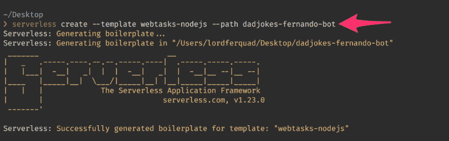T2】](https://res.cloudinary.com/practicaldev/image/fetch/s--f0nlCUa1--/c_limit%2Cf_auto%2Cfl_progressive%2Cq_auto%2Cw_880/https://cdn-images-1.medium.com/max/1024/1%2AKX3W742tuF_5q-6SKvFHcw.png)

我们生成的文件夹结构将如下所示:

[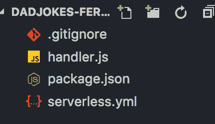](https://res.cloudinary.com/practicaldev/image/fetch/s--iyuaeZfl--/c_limit%2Cf_auto%2Cfl_progressive%2Cq_auto%2Cw_880/https://cdn-images-1.medium.com/max/432/1%2ABBwAryv1SXxAmS_y02Ok_g.png) 

<figcaption>通过无服务器 CLI 生成文件夹结构</figcaption>

上传我们的功能到 Webtask 后，我们需要做一些事情。首先，我们需要为这个项目安装包含在 package.json 文件中的 webtask 处理程序。我们只需要发出这个命令:

$ npm 安装

[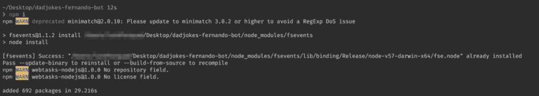T2】](https://res.cloudinary.com/practicaldev/image/fetch/s--zxnZ16Vf--/c_limit%2Cf_auto%2Cfl_progressive%2Cq_auto%2Cw_880/https://cdn-images-1.medium.com/max/1024/1%2ACzGdeDOmDNieab5QtYxegA.png)

之后，我们需要安装几个包来使机器人工作:

*   axios–NodeJS 的 HTTP 客户端
*   node-Telegram-Bot-API-用于 NodeJS 的 Telegram Bot API

$ npm 安装-保存 axios 节点-telegram-bot-api

[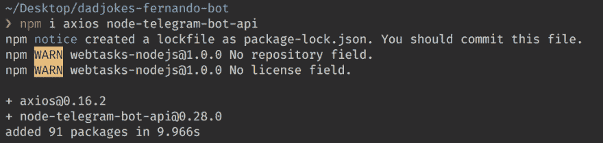T2】](https://res.cloudinary.com/practicaldev/image/fetch/s--u1-ZGnnP--/c_limit%2Cf_auto%2Cfl_progressive%2Cq_auto%2Cw_880/https://cdn-images-1.medium.com/max/1024/1%2AbfIx6mvEAk1GtWbpFulKtw.png)

安装完所有的项目依赖项后，我们需要为 Webstask 配置函数名。打开 serverless.yml 文件，然后在 service>name 中修改函数的名称。典型的生成示例名是 *webtasks-nodejs*

[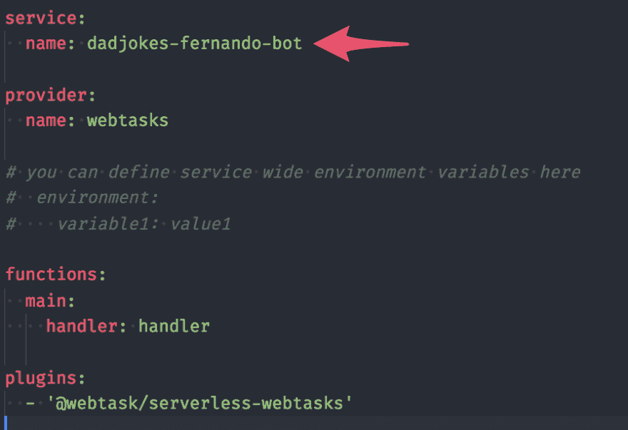T2】](https://res.cloudinary.com/practicaldev/image/fetch/s--tXgQ9bqI--/c_limit%2Cf_auto%2Cfl_progressive%2Cq_auto%2Cw_880/https://cdn-images-1.medium.com/max/896/1%2A3oF-NTHuuggMNXfts-1lIA.png)

之后，我们需要使用以下命令登录到 Webstask:

$无服务器登录

登录后，剩下的唯一事情就是部署我们的功能。使用下一个命令:

$无服务器部署

[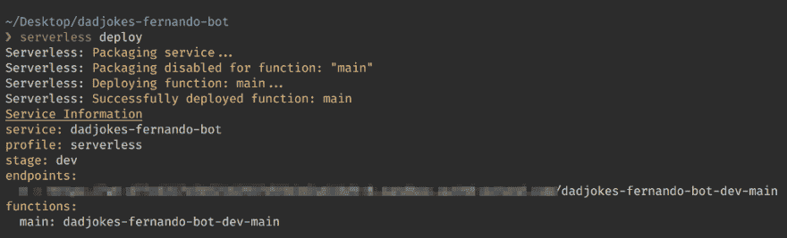T2】](https://res.cloudinary.com/practicaldev/image/fetch/s--i7aCCpk7--/c_limit%2Cf_auto%2Cfl_progressive%2Cq_auto%2Cw_880/https://cdn-images-1.medium.com/max/1024/1%2AY-eYiJhFz1muGzW6eisa3Q.png)

在此之后，您将收到您的端点 URL，在您的浏览器中测试它，以确保它正在工作。如果一切正常，需要出现这样一个 JSON:

[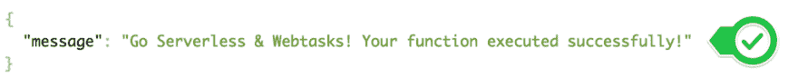](https://res.cloudinary.com/practicaldev/image/fetch/s--IMggWC8q--/c_limit%2Cf_auto%2Cfl_progressive%2Cq_auto%2Cw_880/https://cdn-images-1.medium.com/max/1024/1%2AFAELJVG6ZhpvxjdvlVTFZw.png)

<figcaption>web task 端点正在工作——ðÿ™œ</figcaption>

### 设置我们电报机器人的 WebHook

在配置了我们的 Webtask 端点之后，我们需要告诉我们的 bot 它需要将我们在聊天中可以发出的所有请求发送到哪里。电报机器人使用**网络钩子。**它们非常容易设置。我们将使用 curl 将 WebHook 设置为任务的端点:

```
$ curl -X POST https://api.telegram.org/bot<TELEGRAM_BOT_API_TOKEN>/setWebhook -H "Content-type: application-json" -d '{"url": "WEBTASK_ENDPOINT_URL"}' 
```

[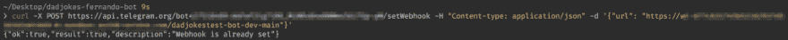](https://res.cloudinary.com/practicaldev/image/fetch/s--KlNSGfp6--/c_limit%2Cf_auto%2Cfl_progressive%2Cq_auto%2Cw_880/https://cdn-images-1.medium.com/max/1024/1%2AtVZSMsrvmL9JAWbhkUAxVQ.png) 

<figcaption>设置网页挂钩的例子，这是我在</figcaption>

之前制作的另一个机器人

### 哔哔ðÿ-:“你好，世界！”

该编码了！ðŸ'

在 handler.js 文件中，我们将让机器人响应消息:**