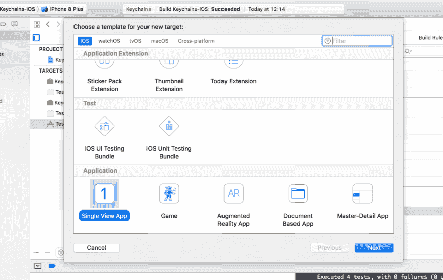
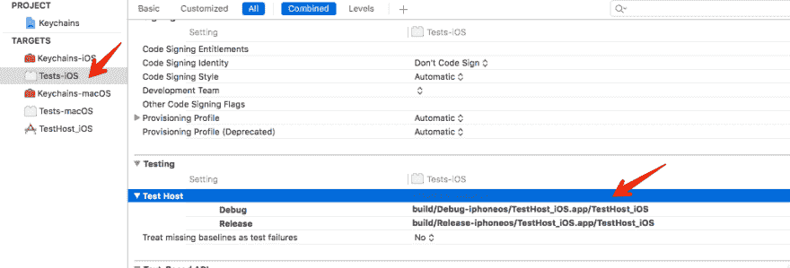

# 在 iOS 中测试钥匙串

> 原文：<https://dev.to/onmyway133/testing-keychain-in-ios-2nb>

原帖[https://github.com/onmyway133/blog/issues/92](https://github.com/onmyway133/blog/issues/92)

今天我把[钥匙链](https://github.com/hyperoslo/Keychains)升级到 swift 4，借此机会修复测试。测试在 macOS 上通过了，但是在 iOS 上，我得到了
的`-25300`错误

```
var status = SecItemCopyMatching(query as CFDictionary, nil) 
```

这是因为测试目标没有钥匙串授权。但这是一个框架，我怎么能添加授权ðÿ”解决方案是使用一个[测试主机](https://developer.apple.com/library/content/documentation/DeveloperTools/Conceptual/testing_with_xcode/chapters/05-running_tests.html)来托管`XCTest`测试。看我的[拉请求](https://github.com/hyperoslo/Keychains/pull/14)

**创建测试主机目标**

[T2】](https://res.cloudinary.com/practicaldev/image/fetch/s--y15rV0MM--/c_limit%2Cf_auto%2Cfl_progressive%2Cq_auto%2Cw_880/https://user-images.githubusercontent.com/2284279/31816541-059750f6-b591-11e7-9348-4119d07e57ca.png)

首先创建一个 iOS 应用程序作为测试主机

**启用钥匙串功能**

然后启用钥匙串功能，让 Xcode 自动为您创建授权文件。注意，输入`Keychain group`即可。你不需要去`Apple Developer dashboard`配置任何东西

[T2】](https://res.cloudinary.com/practicaldev/image/fetch/s--ql1PdBJ9--/c_limit%2Cf_auto%2Cfl_progressive%2Cq_auto%2Cw_880/https://user-images.githubusercontent.com/2284279/31816588-37d10d14-b591-11e7-8703-2b4c77fd7c34.png)

**指定测试主机**

然后在您的测试目标中，使用`$(BUILT_PRODUCTS_DIR)/TestHost_iOS.app/TestHost_iOS`指定`Test Host`

[T2】](https://res.cloudinary.com/practicaldev/image/fetch/s--3iQhcJf8--/c_limit%2Cf_auto%2Cfl_progressive%2Cq_auto%2Cw_880/https://user-images.githubusercontent.com/2284279/31816646-68d8c7c6-b591-11e7-8ae8-e04d52e41e09.png)

现在再次运行您的测试，它应该通过ðÿž‰