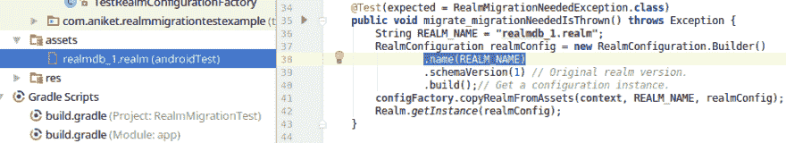

# 测试领域迁移。

> 原文：<https://dev.to/aniketsmk/testing-realm-migrations-16g>

### 为什么要考试？

领域迁移经常被留到最后。它们可能会带来压力，如果您正在进行手动测试，设置甚至创建测试条件可能会花费很长时间。

让我们看看如何将 20 分钟的手工劳动减少到 20 秒的自动化测试。

### 如何？

这个想法很简单，

*   存储您将迁移的数据库的旧副本。
*   在仪器测试中，将保存的数据库复制到一个临时位置。
*   将您的配置设置为新的模式号，并获取一个实例。(这是最有可能当场崩溃的地方)
*   验证你得到了正确的结构。

### 先说个例子。

完整的源代码可以在这里找到[https://github.com/AniketSK/RealmMigrationTestsExample](https://github.com/AniketSK/RealmMigrationTestsExample)

我有这门课。姑且称之为版本 1。

```
public class Dog extends RealmObject {
    String name;
} 
```

我想跟踪我的狗的年龄，所以我想把它改成这样:我们将把它做成版本 2。

```
public class Dog extends RealmObject {
    String name;
    int age;
} 
```

这是我在 v1 上的配置。

```
Realm.init(this);
RealmConfiguration realmConfiguration = new RealmConfiguration.Builder()
        .schemaVersion(1)
        .build();
Realm.setDefaultConfiguration(realmConfiguration);
Realm realm = Realm.getDefaultInstance();
realm.close(); 
```

我在这里为 v2 修改的两行代码将出现在配置中:

```
RealmConfiguration realmConfiguration = new RealmConfiguration.Builder()
        .schemaVersion(2)
        .migration(new MigrationExample())
        .build(); 
```

简单地说，我更新了模式版本并提供了一个迁移类。这看起来像:

```
class MigrationExample implements RealmMigration {

    @Override
    public void migrate(DynamicRealm realm, long oldVersion, long newVersion) {
        if (oldVersion < 2) {
            updateToVersion2(realm.getSchema());
        }
    }

    private void updateToVersion2(RealmSchema schema) {
        RealmObjectSchema dogSchema = schema.create(Dog.class.getSimpleName()); // Get the schema of the class to modify.
        dogSchema.addField("age", int.class); // Add the new field.
    }
} 
```

这里有一个问题，我已经留下了，但我们会在测试中发现它:)你已经看到它了吗？

如果你很急，这是已经完成的测试，一定要从它下面的领域获取支持文件。

*   [AniketSK/realmmigrationtest 示例](https://github.com/AniketSK/RealmMigrationTestsExample/blob/master/app/src/androidTest/java/com/aniket/realmmigrationtestexample/MigrationExampleTest.java)
*   [realm/realm-java](https://github.com/realm/realm-java/blob/master/realm/realm-library/src/androidTest/java/io/realm/rule/TestRealmConfigurationFactory.java)

**了解**

现在，您的代码已经过测试并部署到生产环境中，您可以放松下来并理解这是如何工作的。

让我们从准备考试开始。

*   存储您将迁移的数据库的旧副本。

为此，你最好在模拟器上运行你的应用程序。

*为什么？

答:模拟器默认提供 root 访问权限，这是获取旧版本领域的最简单方法。默认情况下，旧版本的 realm 位于应用程序内部存储的 files 文件夹中。*

在模拟器上安装并运行旧版本的应用程序。这可能会初始化您的领域，并在内部存储中创建领域文件。现在你可以拉它了。

最简单的方法是使用 adb 的终端命令。

**ADB pull/data/data/com . aniket . realmmigrationtestexample/files/default . realm ~/RealmMigrationTest/app/src/androidTest/assets/realmdb _ 1 . realm**

这样就实现了两件事:

1.  您的应用程序的领域文件从内部手机(模拟器)存储中提取到您的计算机。
2.  它存储在您的应用程序项目的 androidTest 文件夹的资产中，并有一个新名称！现在它被称为 realmdb_1.realm

太好了，我们完成了第一步！

注意:如果你需要做更复杂的事情，比如创建你的应用程序在大量用户交互后的整个状态，最简单的方法就是手动完成一次，然后拉它。确保您想要的所有数据都实际写入了磁盘！

**设置测试**

*   在您的检测测试中，将保存的数据库复制到一个临时位置。

这条线跳了几步。我们如何将资产中的文件复制到我们可以使用的新领域文件中？

Realm 已经写了一个类来帮助解决这个问题，并提供了许多支持活动。这是 TestRealmConfigurationFactory，可以从他们的 repo 中获取从这里[https://github . com/realm/realm-Java/blob/master/realm/realm-library/src/androidTest/Java/io/realm/realmmigrationtests . Java](https://github.com/realm/realm-java/blob/master/realm/realm-library/src/androidTest/java/io/realm/RealmMigrationTests.java)

为什么要复制他们的文件？肯定有更好的办法吧？

答:这是他们项目的内部内容，据我所知，只是没有以某种方式输出到其他地方。如果你知道一个更好的方法把它放到你的项目中，而不是复制它，请在评论中告诉我。

好了，现在您已经有了这个文件，让我们创建一个 bog 标准仪器测试来使用它。

```
@RunWith(AndroidJUnit4.class)
public class MigrationExampleTest {

    @Rule
    public final TestRealmConfigurationFactory configFactory = new TestRealmConfigurationFactory();

    @Before
    public void setUp() throws Exception {

    }

    @Test
    public void migrate() throws Exception {

    }

} 
```

您的迁移测试应该像这样开始。

注意，如果您还没有将 TestRealmConfigurationFactory 复制到您的项目中，它将显示为一个错误。

如果你错过了，你需要从前面提到的地方拿这个。一定要换包，保留版权文字！

**安装完成！**

**编写测试**

现在让我们从测试本身开始。把这个加到测试里。

```
@Test(expected = RealmMigrationNeededException.class)
public void migrate_migrationNeededIsThrown() throws Exception {
    String REALM_NAME = "realmdb_1.realm";
    RealmConfiguration realmConfig = new RealmConfiguration.Builder()
            .name(REALM_NAME) // Keep using the temp realm.
            .schemaVersion(1) // Original realm version.
            .build();// Get a configuration instance.
    configFactory.copyRealmFromAssets(context, REALM_NAME, realmConfig); // Copy the stored version 1 realm file from assets to a NEW location.
    Realm.getInstance(realmConfig);
} 
```

[T2】](https://res.cloudinary.com/practicaldev/image/fetch/s--42SVYeJ9--/c_limit%2Cf_auto%2Cfl_progressive%2Cq_auto%2Cw_880/https://cdn-images-1.medium.com/max/915/1%2AOWCHxdjdPI5fsxgOIqyvGQ.png)

REALM_NAME 应该与您从 adb 中提取的文件的名称相匹配。回想一下，我们将它从默认名称重命名为 realmdb_1.realm，并将其存储在 assets 文件夹中，用于 androidTest。而不是 main 下的 assets 文件夹！

接下来，我们将模式版本设置为原来的版本，并获得一个领域配置。

然后使用 configFactory，将资产中的领域复制到与默认领域分开的新位置*。这只是防止我们删除默认领域(因为 TestRealmConfigFactory 在复制之前删除了 namedRealm)*

然后我们试图得到它的一个实例。这应该会失败，因为狗对象已经添加了年龄字段。

这将验证是否确实引发了 MigrationNeededException。

**测试第二部分:**

在本测试中，我们将实际进行迁移！

再次获取领域配置，这次增加模式版本并添加主迁移类。

```
@Test
public void migrate_migrationSuceeds() throws Exception {
    String REALM_NAME = "realmdb_1.realm"; // Same name as the file for the old realm which was copied to assets.
    RealmConfiguration realmConfig = new RealmConfiguration.Builder()
            .name(REALM_NAME)
            .schemaVersion(2) // NEW realm version.
            .migration(new MigrationExample())
            .build();// Get a configuration instance.
    configFactory.copyRealmFromAssets(context, REALM_NAME, realmConfig); // Copy the stored version 1 realm file
    // from assets to a NEW location.
    // Note: the old file is always deleted for you.
    // by the copyRealmFromAssets.
    Realm realm = Realm.getInstance(realmConfig);
    assertTrue("The age field was not added.", realm.getSchema().get(Dog.class.getSimpleName())
        .hasField("age"));

    assertEquals(realm.getSchema().get(Dog.class.getSimpleName())
        .getFieldType("age"), RealmFieldType.INTEGER);
    realm.close();
} 
```

完成后，再次获取领域实例。这一次迁移将会运行，您的测试应该会失败！这里我们终于遇到了我提到的错误。在添加字段之前，我最初重新创建了 Dog.class。

所以在 MigrationExample.java 改‘创造’:

```
private void updateToVersion2(RealmSchema schema) {
    RealmObjectSchema dogSchema = schema.create(Dog.class.getSimpleName()); // Get the schema of the class to modify.
    dogSchema.addField("age", int.class); // Add the new field.
} 
```

到‘获取’:

```
private void updateToVersion2(RealmSchema schema) {
    RealmObjectSchema dogSchema = schema.get(Dog.class.getSimpleName()); // Get the schema of the class to modify.
    dogSchema.addField("age", int.class); // Add the new field.
} 
```

再运行一次，你的测试就会通过！

恭喜你，你现在可以测试领域迁移了！

### 结论:

使用插装测试来测试领域迁移非常容易，并且可以帮助您跟踪棘手的 bug。例如，您现在可以在测试结束时收到的最终领域上运行领域查询和其他操作。例如，你可以验证你现有的所有狗，有一个默认的年龄分配给他们。您可以确保您正在进行的一些数据转换成功完成。

和往常一样，您可以设置调试指针并逐步完成迁移，以修复您遇到的问题。

我希望这个精简的例子能帮助你更彻底地测试你的应用程序，并把一个难以设置的测试带入易于测试的领域。

如需了解更多使用示例，请访问:

[realm/realm-java](https://github.com/realm/realm-java/blob/master/realm/realm-library/src/androidTest/java/io/realm/RealmMigrationTests.java)

直到下一次，记住，如果你正在做任何手工重复的工作，总有更好的方法！

你可以通过 twitter [@aniketsmk](https://dev.to/aniketsmk) 联系我，我很乐意收到评论和建议。

注意事项:

如果您发现模拟器很难运行，或者您的测试 db 只能在真实设备上创建，那么您总是可以使用

```
File externalStorageFile = new File(getExternalFilesDir(null), "copiedInternalRealmToExternal.realm");
realm.writeCopyTo(externalStorageFile); 
```

从那里拿起文件。这将把你的内部领域复制到一个外部位置，在那里，即使是真实的设备也不会妨碍你拿起它。

这是在 2017 年 8 月 7 日编辑的，以更正其中一个测试。