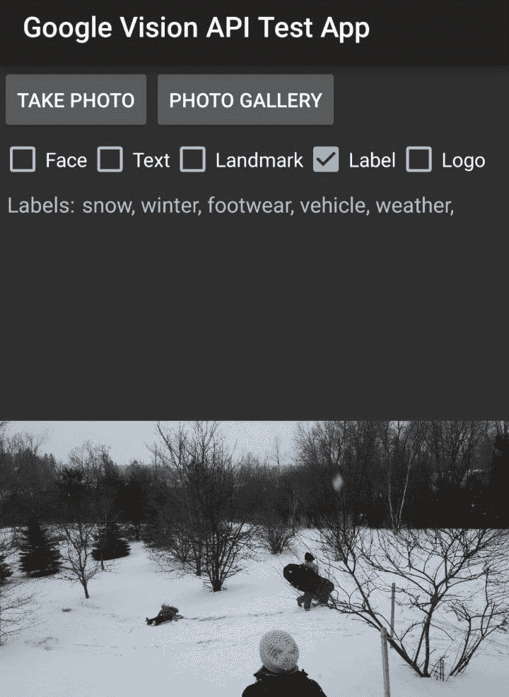

# 测试 Google Vision API

> 原文：<https://dev.to/lawjeremy/testing-the-google-vision-api-2aod>

2016 年 4 月 23 日

上个月，我发现了一篇有趣的谷歌云平台[博文](https://cloudplatform.googleblog.com/2016/02/Google-Cloud-Vision-API-enters-beta-open-to-all-to-try.html)，宣布云视觉 API 正在进入公开测试阶段。

来自帖子:

> 现在，任何人都可以将他们的图像提交到云视觉 API，以了解这些图像的内容，从检测日常物体(例如，“跑车”、“寿司”或“老鹰”)到阅读图像中的文本或识别产品标志。

在使用像 [Tesseract](https://github.com/tesseract-ocr/tesseract) 这样的库尝试过 OCR(获得了不同程度的成功)之后，我渴望尝试这个新工具，并开始构建一个应用程序来测试它的可用性和准确性。

## 加速器钛

我花了一些时间探索我的测试应用程序的不同平台，并决定因为应用程序需要直接访问硬件 API，所以 Android 应用程序将是最好的选择。

我有一些使用 Appcelerator 平台的经验，尽管它可能很难正确设置和配置，但它对于开发移动应用程序原型非常有用。我可以用 JavaScript 编写应用程序代码，并且仍然可以创建原生 UI 组件。然后，我可以在不同的移动平台(iOS、Android、Windows Phone)上部署该应用程序，只需稍加修改。

在这种情况下，利大于弊，我决定在这个项目中使用 Appcelerator。

## 入门

我需要创建一个[谷歌云平台](https://cloud.google.com/)账户，以便获得一个令牌并管理对单个 API 的访问。虽然 Vision 是一项付费服务，但有一个免费层，其中包括每月针对每种检测类型的前 1000 个请求。这个使用限制对于测试来说已经足够了。

## 创建一个样本 App

我已经为之前的项目安装了最新的 Appcelerator 工具，所以我开始创建一个新的钛合金应用程序。我不打算在这里详细介绍钛/合金，但是[快速入门指南](https://docs.appcelerator.com/platform/latest/#!/guide/Quick_Start)是关于如何开始你的第一个项目的一个很好的信息来源。

Alloy 项目框架是用一个视图(index.xml)和一个控制器(index.js)创建的。

在视图中，我为应用程序创建了一个简单的界面。一个打开照片库的按钮，这样我们可以选择要分析的图像，一个保存从 api 请求中获取的数据的标签。

控制器将包含 out 接口的事件处理程序，以及向 Vision API 发出实际请求所需的应用程序逻辑。

```
#views/index.xml

<Button id="btn_gallery" onClick="showGallery">
  Photo Gallery
</Button>

<Label id="lbl_labelsText"></Label>

#controllers/index.js

function showGallery()
{
    Ti.Media.openPhotoGallery({
        ....
        success: photoCallback
    });
} 
```

## 对图像进行编码

photoCallback 函数将被传递一个 CameraMediaItemType 对象。从这个对象中，我们可以获得 Ti.Blob 形式的图像。

Vision 希望图像是 Base64 编码的，所以我使用 Titanium base64encode 实用程序对其进行编码。

```
#views/index.js

function photoCallback(cameraMediaItem)
{
    var image = cameraMediaItem.media;
    var encodedImage = Ti.Utils.base64encode(image);
} 
```

## 选择一种检测类型

现在我已经选择了一个图像并对其进行了适当的编码，我准备构建一个请求并发送给 Vision。

```
#controllers/index.js

function photoCallback(cameraMediaItem)
{

    var image = cameraMediaItem.media;
    var encodedImage = Ti.Utils.base64encode(image);

    //create the object to send
    var request = {
        "requests":[
          {
            "image":{
              "content": image
            },
            "features":[
                 {
                  "type":"LABEL_DETECTION",
                  "maxResults":5
                }
            ]
          }
        ]
    };
} 
```

在这个例子中，我请求对图像进行 LABEL_DETECTION。通过将对象添加到“特征”阵列，可以请求多种类型的检测。

可用的检测类型有:

人脸检测

文本 _ 检测

地标 _ 检测

标签 _ 检测

徽标 _ 检测

安全 _ 搜索 _ 检测

图像 _ 属性

接下来，我继续提出请求

```
#controllers/index.js

var apikey = 'YOUR_GOOGLE_KEY_HERE';
var xhr = Ti.Network.createHTTPClient();

xhr.onload = function(e)
{

  var response = JSON.parse(e.source.responseText);

  if('labelAnnotations' in response.responses[0]){
   var labels = response.responses[0].labelAnnotations;

   var description = '';
   labels.forEach(function(label, index, labels){
     description += label.description + ' ';
   });

   //Set label text to show return data in app
   $.lbl_labelsText.setText(description);

  }
}

xhr.onerror = function(err)
{

  //Alert the error message
  alert(e.source.responseText);

}

xhr.open('POST','https://vision.googleapis.com/v1/images:annotate?key=' + apikey);

xhr.setRequestHeader("Content-Type", "application/json");

xhr.send(JSON.stringify(request)); 
```

onload 处理程序获取返回数据，并检查其中是否有“labelAnnotations”。如果有，它会将它们连接起来并显示在屏幕上。

如果我添加任何其他类型的检测，结果将出现在不同的“typeAnnotations”对象中。例如，用于文本检测的“文本注释”，用于面部检测的“面部注释”，等等...

## 结果

现在我已经准备好构建和运行应用程序了。我启动它，从设备上的图库中选择一张图片。应用程序发送请求，并在屏幕上产生以下输出:

[T2】](https://res.cloudinary.com/practicaldev/image/fetch/s--HVLYd1_U--/c_limit%2Cf_auto%2Cfl_progressive%2Cq_auto%2Cw_880/https://thepracticaldev.s3.amazonaws.com/i/swhm7vbzw0b87nlz0aur.jpeg)

如您所见，Vision 返回了描述照片内容的准确标签列表。

## 结论

我用这个应用程序分析了几十张图片，结果令人印象深刻。标签检测相当准确。每尝试几次，列表中就会出现一个没有意义的标签，但大多数返回的标签都是相关的。

印象最深的检测类型是 TEXT_DETECTION。正如我在这篇文章的开头所写的，我过去曾经试验过 OCR，结果大多很差。我会花几个小时调整设置和修改图像，以便能够找出一些可读的字符。相比之下视觉极其准确。我分析了收据和名片，我能够从中获得几乎所有的文本。用漂亮字体印刷的标志文字或单词有时会出现混乱，但符号、电话号码和电子邮件地址几乎总是会出现。

FACE_DETECTION 类型是最有趣的，它返回关于面部标志位置的数据，并试图评估对象的情绪。有很多内容要介绍，所以我将在以后的文章中专门介绍它。

Vision 是迄今为止我用过的最好的图像分析工具，绝对值得一试。