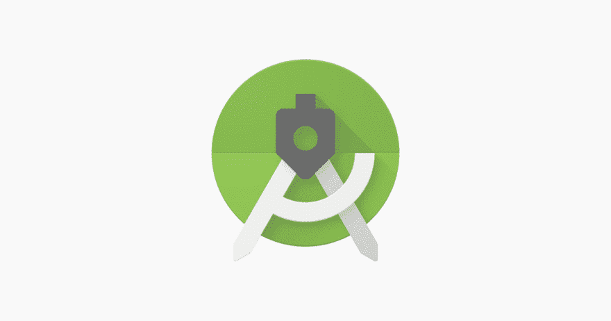
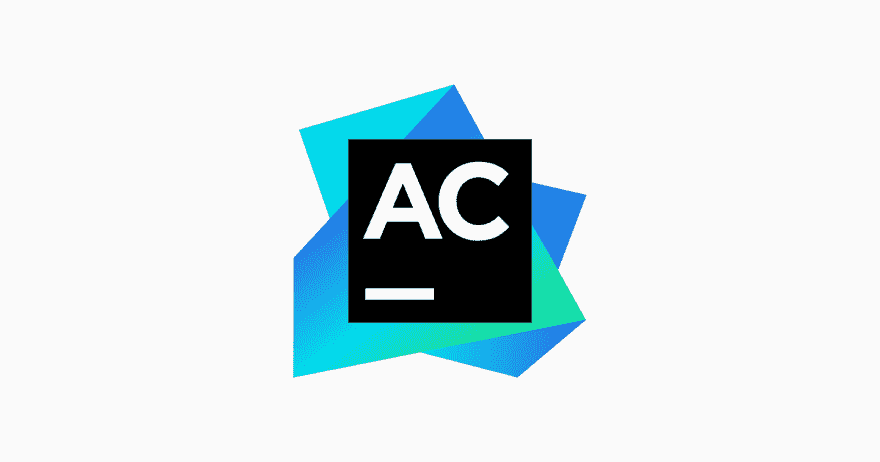
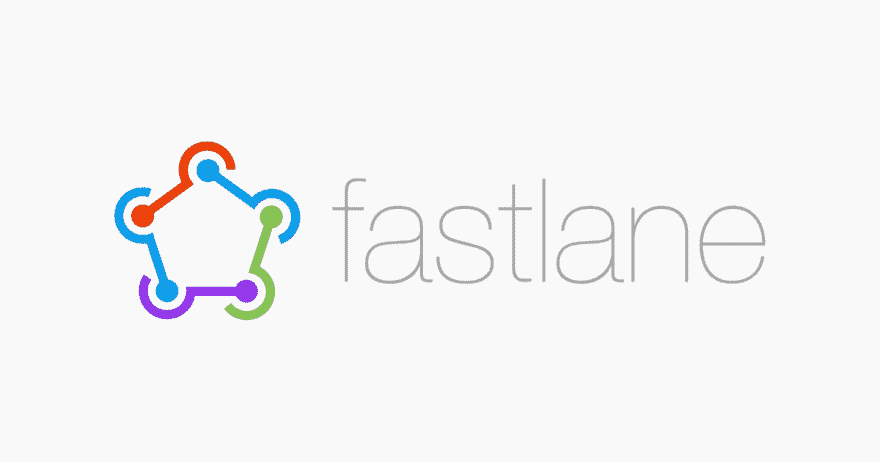

# 2018 年最佳移动开发工具

> 原文：<https://dev.to/bugfenderapp/the-best-mobile-development-tools-in-2018-6m0>

*这篇文章最初发表在我们的[博客](https://bugfender.com/blog/the-best-mobile-development-tools-in-2018/)上。*

正如预测的那样(显然也是如此)，移动应用在 2017 年继续蓬勃发展。大大小小的公司已经意识到，拥有一个移动应用程序不再是可选的。毫无疑问，对于一个公司来说，应用程序是与用户互动的最快、最简单的方式。

对我们这些幕后的开发者来说。我们所依赖的工具和服务发展如此之快，以至于我们必须跟上最新的技术，否则就会面临过时。

虽然有许多多平台框架正在获得牵引力，但没有什么能比真正的本地应用程序的体验更好。侧栏:了解一下[我们如何着手开发一款适用于 Android 和 iOS 的应用](https://mobilejazz.com/blog/why-we-froze-our-mobile-team-in-order-to-move-faster/)。

早在 2014 年，苹果就向我们介绍了用于其 xxOS 系列的编程语言 [Swift](https://developer.apple.com/swift/) ，该语言与 Objective-C 兼容。2017 年，谷歌宣布 Android 现在全面支持 [JetBrain 的 Kotlin](https://kotlinlang.org/) ，这是一种基于 Java 的现代编程语言。

在这篇文章中，我召集了团队来分享一些他们最喜欢的工具，以帮助您在 2018 年的移动开发之旅中前进。

[T2】](https://res.cloudinary.com/practicaldev/image/fetch/s--X1Tr36G8--/c_limit%2Cf_auto%2Cfl_progressive%2Cq_auto%2Cw_880/https://bugfender.com/wp-content/uploads/2017/11/mobile-dev-2018-wtf-auto-faliure.jpg)

## WTF 自动布局

**它是什么，谁使用它？**

iOS 和上的自动布局功能令人难以置信，但它的错误日志很难理解。将您的错误日志复制/粘贴到这个 web 工具中， [WTF 自动布局](http://www.wtfautolayout.com/)会让您对故障有更深刻的了解。

**优点**

*   这是一个简单的网络工具
*   将难以阅读的控制台错误日志分解成易于阅读的语句

**缺点**

*   这里没有缺点，这个工具只能通过提供对问题的洞察来提供帮助

**谁该学？**

这个工具没有学习曲线，任何使用自动布局的开发人员都会发现这很有用。

[T2】](https://res.cloudinary.com/practicaldev/image/fetch/s--bkj4WgX7--/c_limit%2Cf_auto%2Cfl_progressive%2Cq_auto%2Cw_880/https://bugfender.com/wp-content/uploads/2017/11/frontend-2018-charles.jpg)

## 查尔斯

**它是什么，谁使用它？**

Charles 是一个 HTTP 代理/监控/反向代理，使开发者能够查看他们的机器和互联网之间的所有流量。这包括 http 请求、响应和报头。作为一名开发人员，很难看到你的网络浏览器和互联网之间发送和接收了什么，这使得跟踪问题和错误变得很痛苦。Charles 让您可以轻松看到发生了什么，从而更快地解决问题。

**优点**

*   流量分析-查看进出的流量
*   SSL 代理-以纯文本格式查看 https 请求和响应
*   可以限制带宽以模拟较慢的互联网连接
*   Ajax 调试-查看 XML 和 JSON 请求
*   编辑并重复请求

**缺点**

*   如果不知道自己在做什么，很难配置
*   网上其他地方没有太多信息

**谁该学？**

任何希望重新控制其网站或应用程序与互联网通信的开发人员。

[T2】](https://res.cloudinary.com/practicaldev/image/fetch/s--RpKy8kkb--/c_limit%2Cf_auto%2Cfl_progressive%2Cq_auto%2Cw_880/https://bugfender.com/wp-content/uploads/2017/11/mobile-dev-2018-realm-browser.jpg)

## 领域浏览器

**它是什么，谁使用它？**

[领域浏览器](https://itunes.apple.com/us/app/realm-browser/id1007457278?mt=12)是一个 macOS 应用程序，允许你查看和编辑。realm 数据文件，允许使用 Realm 的开发人员调试其应用程序数据库的内容。

**优点**

*   它是免费的
*   对调试极其有用
*   通过一个漂亮的界面管理数据库

**缺点**

*   仅在 macOS 上可用

**谁该学？**

这是一个很棒的免费工具，任何使用 Realm 数据库的开发者都应该看看。

[T2】](https://res.cloudinary.com/practicaldev/image/fetch/s--4KFdFj77--/c_limit%2Cf_auto%2Cfl_progressive%2Cq_auto%2Cw_880/https://bugfender.com/wp-content/uploads/2017/11/mobile-dev-2018-bugfender.jpg)

## 挡泥板

**它是什么，谁使用它？**

Bugfender 是一个结合了 web 控制台的移动应用远程日志工具。它使您能够从远程设备读取日志，这些日志可以在调试时保存有价值的线索。

**优点**

*   支持 iOS、Android 和多平台框架，包括 Cordova、PhoneGap、Ionic、Xamarin 和 React。
*   易于集成
*   问题跟踪和崩溃报告
*   可以通过单个设备远程启用或禁用日志记录

**缺点**

*   目前仅限于手机和可穿戴设备。tvOS、web 和 Windows SDK 还不可用，但已经在路线图中。
*   日志搜索可以改进

**谁该学？**

寻找更多见解来帮助修复 bug 的开发人员和能够深入研究日志来为他们的产品提供改进支持的技术支持冠军

[T2】](https://res.cloudinary.com/practicaldev/image/fetch/s--kxoD5D8_--/c_limit%2Cf_auto%2Cfl_progressive%2Cq_auto%2Cw_880/https://bugfender.com/wp-content/uploads/2017/11/mobile-dev-2018-android-studio-3.jpg)

## 安卓工作室 3

**它是什么，谁使用它？**

Android Studio 是 Android 的官方 IDE。它速度超快，有很棒的代码编辑器、调试和性能工具，以及构建/部署系统。

**优点**

*   科特林支架
*   用于调试的新分析工具
*   最新 Android Oreo APIs 的向导和工具
*   Google Play 系统映像 Android Oreo 的最新模拟器系统包括谷歌 Play 商店，允许您使用 Google Play 对应用程序进行端到端测试。

**缺点**

*   这里没有缺点，这是一个伟大的，专门构建的工具。

**谁该学？**

Android 开发人员正在寻找一个专门为所有东西构建的可靠 IDE——Android。

[T2】](https://res.cloudinary.com/practicaldev/image/fetch/s--KHnaGzkV--/c_limit%2Cf_auto%2Cfl_progressive%2Cq_auto%2Cw_880/https://bugfender.com/wp-content/uploads/2017/11/mobile-dev-2018-stetho.jpg)

## 斯特索

**它是什么，谁使用它？**

Stetho 是脸书为 Android 开发的调试平台，它支持非常有用的 Chrome 开发者工具和更多功能。

**优点**

*   出色的网络调试
*   SQL 数据库调试
*   使用插件可以使用领域检查器

**缺点**

*   它没有与 Android SDK 集成，所以它是一个独立的库，我们需要添加它，所以它是另一个依赖项。

**谁该学？**

任何 Android 开发人员都在寻找一个伟大的工具来帮助他们调试代码。

[T2】](https://res.cloudinary.com/practicaldev/image/fetch/s--ViHOoIIK--/c_limit%2Cf_auto%2Cfl_progressive%2Cq_auto%2Cw_880/https://bugfender.com/wp-content/uploads/2017/11/mobile-dev-2018-appcode.jpg)

## JetBrains 应用代码

**它是什么，谁使用它？**

[AppCode](https://www.jetbrains.com/objc/) 是 JetBrains 的 iOS/macOS IDE，同时支持 Swift 和 Objective-C。

**优点**

*   一个非常强大的代码生成和重构工具
*   自动代码样式
*   集成版本控制
*   自动代码分析和上下文错误预防

**缺点**

*   无法打开 UI(。xib)文件
*   它很贵
*   这不是 iOS 开发的行业标准

**谁该学？**

JetBrains 构建了许多开发人员所信赖的奇妙的 IDE。AppCode 也不例外，它是任何 iOS 或 macOS 开发人员都应该考虑的可靠编辑器。

[T2】](https://res.cloudinary.com/practicaldev/image/fetch/s--aqsGKUjW--/c_limit%2Cf_auto%2Cfl_progressive%2Cq_auto%2Cw_880/https://bugfender.com/wp-content/uploads/2017/11/mobile-dev-2018-fastlane.jpg)

## Fastlane

**它是什么，谁使用它？**

[浪子](https://fastlane.tools/)是 iOS 和 Android 开发的自动化工具精选。

**优点**

*   截图自动化
*   自动构建部署
*   测试人员管理

**缺点**

*   文档可以更清晰
*   发布新版本的 XCode 工具时可能会中断

**谁该学？**

所有移动开发者！浪子提供了大量有用的工具来帮助完成单调的任务。

[T2】](https://res.cloudinary.com/practicaldev/image/fetch/s--3C--ngUp--/c_limit%2Cf_auto%2Cfl_progressive%2Cq_auto%2Cw_880/https://bugfender.com/wp-content/uploads/2017/11/mobile-dev-2018-itellij.jpg)

## IntelliJ IDEA 插件- Git 流集成

**它是什么，谁使用它？**

这个插件将 Git 流的奇妙过程引入 IntelliJ IDEA。

**优点**

用于创建功能、版本和补丁的快捷方便的工具，无需使用命令行或其他应用程序，如 SourceTree。

**缺点**

插件偶尔会没有解释地失败——尽管我们发现这通常是因为还没有为 Git Flow 初始化 repo。

**谁该学？**

对于任何使用 IntelliJ IDEA 的开发人员来说，这都是一个很好的补充。

## Intellij IDEA 插件-内部构建

**它是什么，谁使用它？**

[InnerBuild 插件](https://plugins.jetbrains.com/plugin/7354-innerbuilder)向 IntellIJ 的生成菜单添加了一个构建器动作，帮助 Java 开发人员快速创建 InnerBuild 类。

**优点**

*   快速创建 Java 构建器

**缺点**

*   既不赞成也不反对，但有其他类似的更灵活的插件提供更多。然而，它们不如 InnerBuild 插件好，后者又不够灵活或完整。

**谁该学？**

使用 IntelliJ IDEA 寻找快速构建器的 Java 开发人员。

* * *

## 结论

从调试到自动化，这些只是 2018 年帮助你进行移动开发的众多可用工具中的几个。

展望未来，我们认为 Kotlin 将继续增长，因为它的最新发展包括对 iOS 和 web 应用程序的支持。在 iPhones 中引入 NFC 将带来新的机遇，这在过去是不可能的。

区块链技术正在以爆炸式的速度增长。它的发展将使支付更快，并可能最终用于日常商店，为金融科技应用带来一个全新的机遇世界。

还有其他建议吗？[让我们知道](#comments)。

*这篇文章最初发表在我们的[博客](https://bugfender.com/blog/the-best-mobile-development-tools-in-2018/)上。*