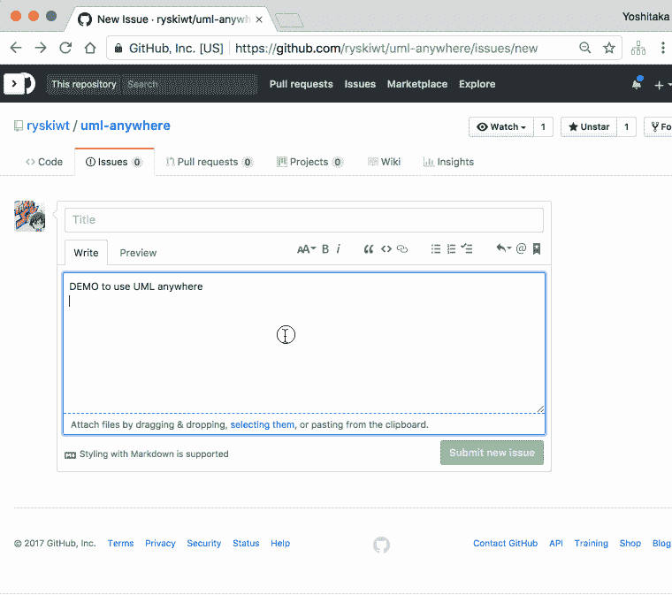

# 在任何地方编写 UML 的最佳方式

> 原文：<https://dev.to/takasek/the-best-way-to-write-umlanywhere-29o>

我要介绍的是与 PlantUML 相处融洽的 Google Chrome 扩展:[“UML anywhere”](https://chrome.google.com/webstore/detail/uml-anywhere/mcefidbiooofpmcanlmgcjiickpdehah)。
百聞は一見にしかず。
看下面的演示。

[T2】](https://res.cloudinary.com/practicaldev/image/fetch/s--iLFniHQw--/c_limit%2Cf_auto%2Cfl_progressive%2Cq_66%2Cw_880/https://thepracticaldev.s3.amazonaws.com/i/4a8ots3zxk7stc51xs3d.gif)

here is the article by the author ( in Japanese ) :
[为了能在 Qiita (啦博客啦)上贴上用 PlantUML 写的 UML 图，制作了 Chrome 扩展功能- Qiita](https://qiita.com/ryskiwt/items/06c1322ebae8af376f7a)