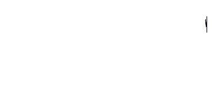
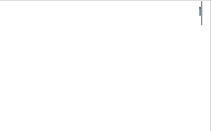

# 跳跃点的情况

> 原文：<https://dev.to/obahareth/the-case-of-the-jumping-dot-4cf8>

[T2】](https://res.cloudinary.com/practicaldev/image/fetch/s--jjxKSnNr--/c_limit%2Cf_auto%2Cfl_progressive%2Cq_66%2Cw_880/https://omar.engineer/conteimg/2018/03/1_W4dUNX0JP_ZI33EM09iz3Q-1.gif)

当你在用英语打字时输入点/句号字符，它就工作了，你不需要考虑它在你的单词和句子周围跳舞。阿拉伯语不是这样的。由于句号字符在技术上被认为是双向字符，奇怪的事情开始发生。如何正确渲染没有明确的标准(据我所知)。

例如，看看这张 GIF:

[T2】](https://res.cloudinary.com/practicaldev/image/fetch/s--PAtxHgTJ--/c_limit%2Cf_auto%2Cfl_progressive%2Cq_66%2Cw_880/https://omar.engineer/conteimg/2018/03/1_W4dUNX0JP_ZI33EM09iz3Q.gif%23left)

圆点突然移到了行首(在右边而不是左边)，闪烁的光标甚至没有移动。现在，这不仅仅发生在那个字符上，它还会发生在 RTL(从右到左)文本中间的任何 BiDi 字符(例如感叹号)上。

对于某些字符，实际上有一个解决方案，有一个阿拉伯语句号字符，唯一的问题是大多数人不知道它的存在或如何键入它。我通常用谷歌搜索它，并从显示 Unicode 字符的网站上复制下来，正如你在这个例子中看到的，它工作得很好:

[T2】](https://res.cloudinary.com/practicaldev/image/fetch/s--7XbUr101--/c_limit%2Cf_auto%2Cfl_progressive%2Cq_66%2Cw_880/https://omar.engineer/conteimg/2018/03/1_RaDySb6voidlLSLRuDQQlw.gif)

它的渲染方式有点怪异，有些字体在非常奇怪的垂直位置渲染，但它不会在文本周围跳跃，让我抓狂。

另一个解决方案是“设置文本方向”，但大多数用户不知道如何做到这一点，当你在同一行中混合使用 LTR(从左到右)和 RTL 时，效果并不好，在许多平台/应用程序中，如何做到这一点甚至不是很明显。因此，我建议在所有桌面和移动操作系统上使用阿拉伯语输入时，将正常的句号字符改为阿拉伯语字符(其他所有适用的字符也是如此)。顺便说一句，这就是当你尝试使用阿拉伯语输入的 a 型问号[时已经发生的情况。](http://www.fileformat.info/info/unicode/char/61f/index.htm)

事实上，我已经给苹果、谷歌和微软以及他们的首席执行官发了推文，但没有任何回应。

> 当我们试图用阿拉伯语输入句号时，我们能输入阿拉伯语句号字符吗？普通的字体到处都是，大多数人不知道阿拉伯字体的存在，也不知道如何输入。[@苹果](https://twitter.com/Apple?ref_src=twsrc%5Etfw)[@谷歌](https://twitter.com/Google?ref_src=twsrc%5Etfw)[@微软](https://twitter.com/Microsoft?ref_src=twsrc%5Etfw)[https://t.co/ccpePNJ45G](https://t.co/ccpePNJ45G)
> 
> —奥马尔·巴哈瑞斯|区块链(@ o _ 巴哈瑞斯)[2017 年 12 月 8 日](https://twitter.com/o_bahareth/status/939275224801054721?ref_src=twsrc%5Etfw)

> [@ sundarpichai](https://twitter.com/sundarpichai?ref_src=twsrc%5Etfw)[@ Tim _ cook](https://twitter.com/tim_cook?ref_src=twsrc%5Etfw)[@ satyanadella](https://twitter.com/satyanadella?ref_src=twsrc%5Etfw)你们能帮忙看看这个吗？
> 
> —奥马尔·巴哈瑞斯|区块链(@ o _ 巴哈瑞斯)[2017 年 12 月 8 日](https://twitter.com/o_bahareth/status/939275739274326016?ref_src=twsrc%5Etfw)

我认为这类 UX 问题比汉堡表情符号上的奶酪在哪里更重要。

> 我认为我们需要讨论一下谷歌的汉堡表情符号是如何把奶酪放在汉堡下面，而苹果把奶酪放在上面[pic.twitter.com/PgXmCkY3Yc](https://t.co/PgXmCkY3Yc)
> 
> —托马斯·拜克达尔(@拜克达尔)[2017 年 10 月 28 日](https://twitter.com/baekdal/status/924312294439444480?ref_src=twsrc%5Etfw)

> 我将放下我们正在做的其他事情，在周一解决:)如果人们能就正确的方法达成一致！[https://t.co/dXRuZnX1Ag](https://t.co/dXRuZnX1Ag)
> 
> —桑德尔·皮帅(@ sundarpichai)[2017 年 10 月 29 日](https://twitter.com/sundarpichai/status/924487551372615680?ref_src=twsrc%5Etfw)

我可能会在其他帖子中展示我们面临的许多其他困难，但我将仅提及我经常面临且极其恼火的几个:

*   选择阿拉伯文本，尤其是当选择中有英文文本时。屏幕上呈现为选中的内容实际上并不是选中的内容。
*   微小的字体大小。我访问的大多数网站的字体大小都在 16px 左右(例如谷歌搜索栏)，这对于英文来说看起来很好，但是由于某些原因，许多阿拉伯字符不清晰。我不知道这是字体的问题，还是我们需要每种语言的动态字体大小。

我希望这篇文章将揭示许多用户在电脑和手机上输入阿拉伯语时面临的一些问题，甚至推动开发人员和字体创作者解决这些问题。有许多应用程序和网站已经解决了很多这样的问题，但我们需要分享这些知识，并将其转化为操作系统和浏览器处理的标准，而不是每个应用程序和网站都必须重复这项工作。