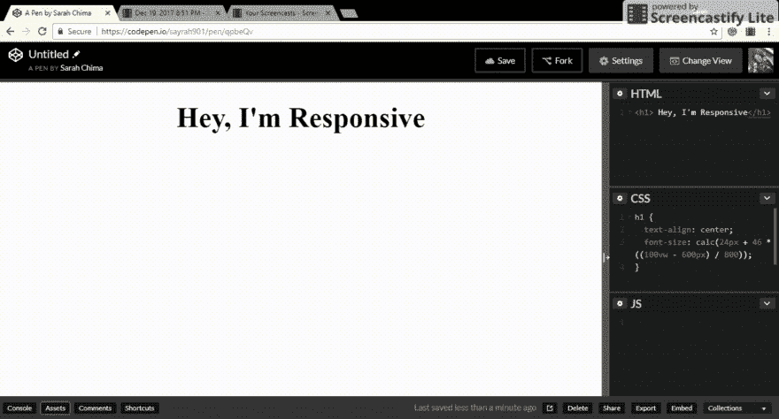

# CSS Calc 函数

> 原文：<https://dev.to/sarah_chima/the-css-calc-function-1ai7>

当我第一次读到一篇关于 CSS calc 函数的文章时，我非常兴奋。
说真的，在 CSS 中用不同的单位进行计算的能力绝对是令人敬畏的。当你实际运用它的时候，那就更棒了。因此，在本文中，我们将学习 CSS calc 函数，然后了解该函数的一个用例。让我们马上开始吧。

### **CSS 计算函数**

 **CSS calc 函数用于在指定 CSS 属性值时执行计算。它可以用在任何可以使用数值的地方。它将一个表达式作为其参数，并将结果用作 CSS 属性的值。我们可以用它进行加法`+`，减法`-`，乘法`*`，除法`/`。酷吧？这里有一个简单的例子。

```
 div {
        width: calc(100% / 3);
    } 
```

Enter fullscreen mode Exit fullscreen mode

所以在上面的例子中，使用的宽度值是对`100%/3`求值的结果。

`calc()`功能令人兴奋的部分是混合单位的能力。这意味着您可以使用不同的 CSS 单位执行计算，如视口宽度(vw)和像素(px ),并且仍然可以获得有效的结果。这就是 CSS calc 函数区别于预处理器所做计算的地方。预处理程序无法做到这一点，因为这是在渲染时完成的。让我们玩一会儿这个。

```
 div {
        height: calc(100% - 2em);
        width: calc((100% - 20px) / 3);
    } 
```

Enter fullscreen mode Exit fullscreen mode

你现在可能看不到它是如何工作的，但是等一下，我们很快就会有实际的用途。首先，在使用 calc 函数时应该遵循一些规则。让我们考虑一下它们。

### **规则**

1.  使用乘法时，至少有一个参数必须是数字。使用除法时，右边必须是一个数字。因此，`calc(100px * 20px)`和`calc(700 / 40px)`无效，`calc(100px * 20)`和`calc(400px / 40)`有效。

2.  加减运算符，即`+`和`-`必须用空格括起来。因此，`calc(100%-2rem)`、`calc(100%+ 2rem)`或`calc(100% -2rem)`不会产生有效值。正确的语法是`calc(100% - 2rem)`，在操作符前后有空格。

3.  被零除会导致错误。

4.  允许嵌套 calc 函数。在这种情况下，嵌套函数被简单地视为括号。

### **浏览器支持**

从 IE9 开始，calc 函数就拥有令人惊叹的浏览器支持。访问[我可以使用](https://caniuse.com/#feat=calc)查看详细信息吗？如果你为老版本的浏览器或 Opera Mini 编写代码，考虑使用一个数值作为后备。

让我们跳到 calc 函数的一个超级酷的用法。

### **响应式排版**

嗯，这更像是流动排版和响应排版。这使得你的文本在任何屏幕尺寸下都显示得很好，而不需要大量使用媒体查询。最近，我不得不做一个项目，这个项目中的文本必须具有响应性。这里有一个我发现很有用的公式。

```
 font-size: calc(min font-size + font range * (100vw - min screen size)/ screen range); 
```

Enter fullscreen mode Exit fullscreen mode

其中字体范围=最大字体大小-最小字体大小
，屏幕范围=最大屏幕大小-最小屏幕大小。

让我们将这个公式付诸实践。我们希望标题在 600 像素宽的屏幕上是`24px`，在 1400 像素宽的屏幕上是`70px`。所以我们的字体范围是`70 - 24`也就是`46`，屏幕范围是`1400 - 600`也就是`800`。将所有这些放入公式中，我们有:

```
 h1 {
        font-size: calc(24px + 46 * ((100vw - 600px) / 800));
    } 
```

Enter fullscreen mode Exit fullscreen mode

它是这样工作的。

[T2】](https://res.cloudinary.com/practicaldev/image/fetch/s--I2mzywdT--/c_limit%2Cf_auto%2Cfl_progressive%2Cq_66%2Cw_880/http://res.cloudinary.com/dvj2hbywq/image/upload/v1513715493/Dec-19-2017-8_54-PM_qvjd5g.gif)

请注意，随着屏幕变小，文本也变得很小。这可以与媒体查询相结合，使其在所有屏幕上看起来都很棒。您可以参考[这篇文章](https://dev.to/promhize/completely-responsive-css-values-no-not-media-queries-d4l)了解该公式的一个变体的详细解释，以及它如何处理媒体查询。

这是一些关于 calc 函数更多用例的文章。
[Calc()](https://css-tricks.com/a-couple-of-use-cases-for-calc/)
[Calc()by MDN](https://developer.mozilla.org/en-US/docs/Web/CSS/calc)的几个用例。

你如何使用计算功能？我很想知道。请留言评论。

有什么问题或补充吗？留下评论。

感谢您的阅读。:)**