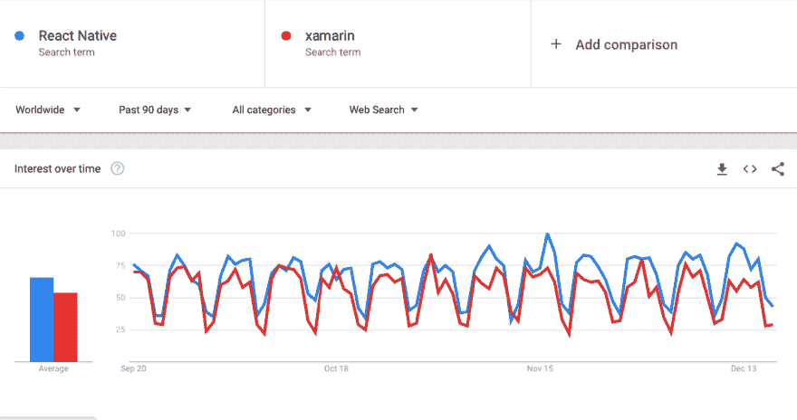

# 您应该为 React 本机应用程序选择哪个数据库？

> 原文：<https://dev.to/purvak_pathak/the-database-selection-guide-for-react-native-3kfm>

截至 2017 年，开发者更倾向于 Xamarin，并以原生方式构建他们的跨平台应用。

尽管 Xamarin 的测试云、IDE、分析和微软集成对企业更加友好，但 React Native 在开发人员社区中越来越受欢迎。

[T2】](https://res.cloudinary.com/practicaldev/image/fetch/s--7SIPPZaU--/c_limit%2Cf_auto%2Cfl_progressive%2Cq_auto%2Cw_880/https://thepracticaldev.s3.amazonaws.com/i/caoybvm34ovae5dy6mve.png)

许多大型组织已经使用 React Native 和合适的技术堆栈来构建高性能的应用程序。你也可以！

在合适的技术体系中，您需要:

#### 一个后端框架

查看这些指南来选择你喜欢的后端:[流星指南](https://medium.com/differential/why-meteor-is-the-perfect-backend-for-react-native-4c8a776726c2)，和[React Native](https://medium.baqend.com/a-backend-for-your-react-and-react-native-apps-baqend-react-starters-337d47200ec)的后端。

#### 库

我会推荐看看这个-[React Native 的前 15 个库](https://codingislove.com/top-15-react-native-libraries)以及其他一些与[分析、推送通知等相关的有用库](https://blog.codeinfuse.com/9-libraries-to-consider-for-your-next-react-native-project-723f179d4764)。

#### 数据库

您需要选择一个提供离线同步、可靠性能、安全性以及与其他堆栈更好集成的数据库。

在本文中，我们将探讨如何为您的 React 本机应用程序选择正确的[数据库。](https://www.simform.com/react-native-database-selection-guide)

如果你在网上搜索，你会发现开发者正在使用这些主要的数据库。比如:

**1。**
境界 **2。Firebase**
**3。SQLite**T8**4。核心数据**
**5。PouchDB**
**6。异步存储**(不是一个全面的数据库，但仍然很受欢迎)

### 但是，哪个数据库适合您的 React 原生应用程序呢？

为了进行公正的比较，我们考虑了许多开发因素和应用程序特性。

例如:

**离线-首先**

它在应用程序中支持离线功能吗？它如何处理多个设备之间的同步和冲突？

**数据库安全**

它支持 AES 256 级别的加密和解密吗？我能够实现安全认证吗？

**应用性能**

为了评估性能，我们采用了许多因素，如读/写速度、零拷贝设计、存储引擎，以及它如何处理并发控制？

**行业法规**

大型组织必须遵守行业法规和合规性，以便安全地部署其应用程序。了解哪些数据库符合法规，哪些不符合。

**支持的文件和数据类型**

我们研究了这些数据库支持的数据类型(Bool、Int、Int8、Int16、Int32、Int64)和文件类型(图像、视频)。

**定价**

有些数据库是开源的，可以免费使用，比如 SQLite 和 PouchDB。但是，像 Realm 和 Firebase 这样的数据库对它们的附加功能收费。了解数据库价格如何满足您的需求。

**实时同步**

对于流媒体和游戏应用，实时同步至关重要。当需要实时同步数据时，了解哪个数据库更合适。

**与第三方库和本机模块的兼容性。**

React Native 提供了大量第三方库来定制应用程序，以获得更丰富的体验。了解哪种数据库能够更灵活地构建您的应用。

我评估了许多其他开发因素，并制作了本[综合指南](https://www.simform.com/react-native-database-selection-guide)来帮助您选择合适的数据库。