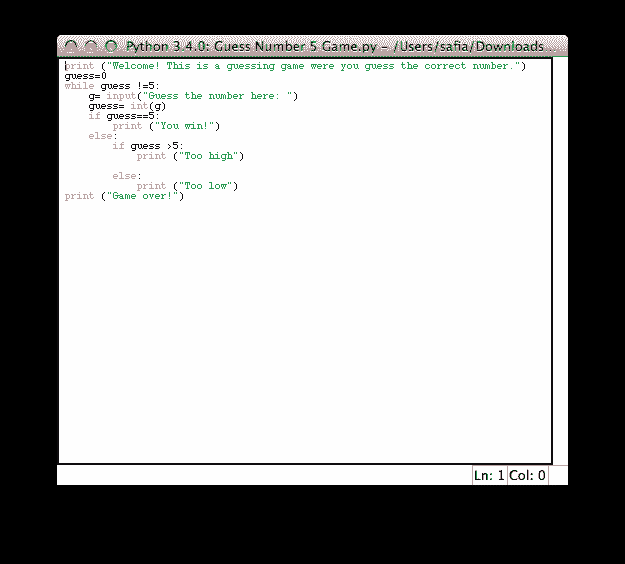

# 我如何进入科技行业的决定性故事

> 原文：<https://dev.to/captainsafia/the-definitive-story-of-how-i-got-into-tech-bne>

经常有人问我是如何进入科技行业的。而我每次被问到的问题，往往都有不同的答案。事实是，技术已经成为我生活中不可或缺的一部分，以至于我都分不清自己什么时候真正迷上了技术。在我最近(希望是许多次中的第一次)就[成为数据科学家播客](http://www.becomingadatascientist.com/2016/01/04/becoming-a-data-scientist-podcast-episode-02-safia-abdalla/)对 Renee 进行播客采访后，我认为我应该深入挖掘我记忆中的蜘蛛网，写下我如何进入技术领域的明确故事。准备好了吗？开始了。

我对电脑最早的记忆是在像“99”和“Barbie.com”这样的网站上玩 flash 游戏，因为那是我们小时候做的事情(哈！)，我可以说我最早的编程相关工作是定制我的 Neopets 个人资料页面。Neopets 是一个在线游戏，你有神奇的宠物，你负责喂养，衣服，和其他事情，你会期望与他们的在线宠物做。除此之外，用户有一个个人资料页面，他们可以炫耀他们的宠物的状态和他们在游戏中的成就。现在，孩子们之间碰巧有一场比赛，看谁能最大限度地展示他们的个人资料页面。大多数人只是安装了提供商提供的免费主题，但我呢？没有先生。我想出了这个叫做 HTML 和 CSS 的东西，并在我的个人资料页面上做了足够多的工作，到处添加闪亮的粉红色字幕图片！虽然 HTML 和 CSS 在技术上不是编程语言，但这可以看作是我最早的代码经验。

当我大约 11 岁的时候，我对 Photoshop 非常感兴趣，特别是图像处理。我在网上找到了一些教程，可以告诉你如何拍摄各种不同的图片，并创建一个单独的场景。例如，你可以拍一张女人躺在床上的照片，一个森林背景，一只蝴蝶，然后创建一个森林中仙女的图像。我认为那是狗屎！但是 Photoshop 很贵，而我又很穷，所以我开始尝试并弄清楚如何“黑掉”Photoshop 以超过 30 天的试用期。这包括浏览奇怪的网站。ru TLDs 和互联网上其他邪恶的部分。我搞乱了 dll、注册表文件和各种程序配置，这样我就可以把时间花在构建令人敬畏的幻想场景上。

我这样做了大约 2 年，直到高中前的那个夏天。那时我对纪录片很着迷。有一个在线网站提供历史和探索频道的免费纪录片(那时候它们还不错)，我会在周末和休息时间花几个小时看关于天底下一切的纪录片(但可能有太多关于外星人阴谋论的)。后来，在一个决定命运的夏日，我看了一部关于计算机历史的系列纪录片。它涵盖了从 ENIAC 到 PC 的所有内容，我爱上了它。我不知道我每天按键的东西有一个故事。如此多的人对他们所做的事情充满热情和兴奋，他们创造了一场革命。太棒了！这部系列纪录片的最后一部分恰好是关于 21 世纪初的互联网。它报道了雅虎的出现。和微软等大型科技公司，但最重要的是它报道了谷歌的出现。谷歌太棒了。这部纪录片稍微介绍了一下 PageRank，在进一步阅读之后，我非常兴奋。这真是太棒了！两个人，一台电脑，他们的大脑发明了可以改变世界的东西。你能想象一个女孩和她的电脑能做什么吗？

所以我用谷歌搜索了“制作计算机程序的简单方法”或者类似的东西，最终找到了 Python。然后我查找了“学习 Python 的书籍”,正如我在俄罗斯黑客论坛上的可爱的朋友们所建议的，在最后添加了“PDF”。那年夏天，我学会了如何用 Python 编程。我写的第一个程序非常简单。它允许你玩高低猜谜游戏来猜一个数字。卑微的出身。

[T2】](https://res.cloudinary.com/practicaldev/image/fetch/s--JzzZzOY7--/c_limit%2Cf_auto%2Cfl_progressive%2Cq_auto%2Cw_880/http://i.imgur.com/QW2a2Kb.png)

在我认为自己已经学习了足够多的编程知识之后，我选择了曼宁、Raghavan 和 Schütze 的《信息检索导论》。我阅读了构建搜索引擎的艺术，并在 2011 年夏天用 Scrapy、MySQL 和我的大脑用 Python 构建了一个简单的搜索引擎。

我摆弄了一下我的搜索引擎，最终对我输入的查询产生了兴趣。当我在搜索引擎中输入东西时，结果不是很好。为什么谷歌更好？现在看来，这个问题的答案比我 14 岁的大脑所能理解的要复杂得多，但是我简化了这个问题。我想这一定和我输入的单词有关。我花了 2011 年的秋天学习自然语言处理(NLP)，玩 NLTK(自然语言工具包)，涉猎语言学。

在我对此感到厌倦之后，我开始研究这个地区的其他事物。我在维基百科的 NLP 页面上试图寻找相关的主题，这时我偶然发现了机器学习页面(哦，亮晶晶的！).哇哦。这东西很酷。看看这些大词和这些奇特的数学。似乎很难。哦嘿，机器人！也许我不会得到它。嘿，我至少可以试试。所以我下载了一大堆书(**咳** **咳**)读啊，编码啊，读啊，编码啊。我在 YouTube 上看了大学讲座的视频。我阅读了我最近发现的公司的技术博客。我尽我所能去学习尽可能多的东西。一路走来，我发现了一些令我着迷的东西和一些不令我着迷的东西。我发现了这个领域的细微差别。心底有一种温暖的感觉。我找到我的激情了吗？

此时，我正处于高中生涯的尾声，故事有趣的部分也到此结束。如果你有兴趣听其他的，请随时在推特上联系我，我很乐意分享。

最后，我想感谢所有免费将资料放到网上的作者。我大概是学的时候负担不起我非法下载的书的数量，所以免费的书总是一种福气。

我也向那家大型科技出版公司(你知道你是谁)道歉，我通过“下载”你的书骗走了几百美元。我很高兴为你写本书来报答你！:)

在整个旅程中，我真正站在了巨人的肩膀上，我很高兴现在能亲自认识他们中的许多人。到目前为止，这是一个令人敬畏的旅程，我对剩下的感到兴奋。

*感谢我的好朋友 Eric (@EricTendian)审阅这篇帖子。*