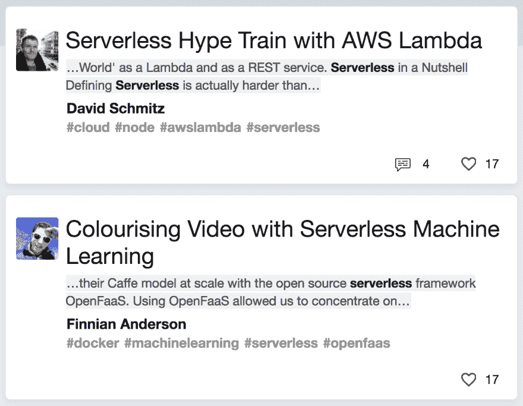

# dev.to 搜索引擎实际上非常有用

> 原文：<https://dev.to/ben/the-devto-search-engine-is-actually-pretty-damn-useful-1ic>

我尽可能多的尝试“[狗粮](https://dev.to/jess/how-dogfood-makes-us-better-devs)”[dev .](https://dev.to/)。这意味着，如果我想要一个编程问题的答案，我会使用我们的搜索引擎，而不是谷歌。这有点傻，因为谷歌有无限的搜索空间，而我们的搜索是一个非常基本的拼凑而成的搜索功能，只包括来自这个本身非常新的网站的帖子。

但实际上已经变得很好了。当我对一个话题感到不确定的时候，很多时候我可以找到一个非常好的个人观点来解释它，而且它非常可靠。它不需要比谷歌更好，因为当我们需要的时候，搜索巨头会一直在那里，但它应该在好的方面有所不同。

## 我们来看看 [*git rebase* 查询](https://dev.to/search?q=git%20rebase)

# 谷歌

[T2】](https://res.cloudinary.com/practicaldev/image/fetch/s--LYrmHMjt--/c_limit%2Cf_auto%2Cfl_progressive%2Cq_auto%2Cw_880/https://thepracticaldev.s3.amazonaws.com/i/e0pcnwbaee7m1bdyudbw.png)

# 开发到

[T2】](https://res.cloudinary.com/practicaldev/image/fetch/s--QxxPw20R--/c_limit%2Cf_auto%2Cfl_progressive%2Cq_auto%2Cw_880/https://thepracticaldev.s3.amazonaws.com/i/ispqf9b0ao9zwbvxrww8.png)

* * *

## [*无服务器*](https://dev.to/search?q=serverless) 怎么样？

# 谷歌

[T2】](https://res.cloudinary.com/practicaldev/image/fetch/s--HEQuI1Ao--/c_limit%2Cf_auto%2Cfl_progressive%2Cq_auto%2Cw_880/https://thepracticaldev.s3.amazonaws.com/i/f9eezfwcf1hrk1qkaf76.png)

# 开发到

[T2】](https://res.cloudinary.com/practicaldev/image/fetch/s--aquqS8iB--/c_limit%2Cf_auto%2Cfl_progressive%2Cq_auto%2Cw_880/https://thepracticaldev.s3.amazonaws.com/i/d3w47sqz6wjl6m6rmjbf.png)

* * *

## 让我们试试

 *# 谷歌

[T2】](https://res.cloudinary.com/practicaldev/image/fetch/s--9Bn67BUa--/c_limit%2Cf_auto%2Cfl_progressive%2Cq_auto%2Cw_880/https://thepracticaldev.s3.amazonaws.com/i/4sd5yurtppfsy9k5amn6.png)

# 开发到

[T2】](https://res.cloudinary.com/practicaldev/image/fetch/s--lOxIKIFL--/c_limit%2Cf_auto%2Cfl_progressive%2Cq_auto%2Cw_880/https://thepracticaldev.s3.amazonaws.com/i/wr201uo49quv1lwbnhdj.png)

* * *

前几天，我想看一些洛伦佐·帕斯奎里斯的帖子，所以我搜索了他的名字。

## 我们来对比一下 [*洛伦佐*查询](https://dev.to/search?q=lorenzo)

# 谷歌

[T2】](https://res.cloudinary.com/practicaldev/image/fetch/s--9Fos2kwy--/c_limit%2Cf_auto%2Cfl_progressive%2Cq_auto%2Cw_880/https://thepracticaldev.s3.amazonaws.com/i/e231h7blbitf9a8nstr9.png)

# 开发到

[T2】](https://res.cloudinary.com/practicaldev/image/fetch/s--MUXfWQeI--/c_limit%2Cf_auto%2Cfl_progressive%2Cq_auto%2Cw_880/https://thepracticaldev.s3.amazonaws.com/i/2fq6kutpw8j58pqp81ba.png)

* * *

下一个很好的特性，目前在移动用户界面中还没有，是一些简单的过滤，这取决于你在寻找什么。例如，回到无服务器的例子。如果我们试图深入这个主题，我们可能想通过一些播客来尽可能多地吸收。(速度是我的两倍😋)

[T2】](https://res.cloudinary.com/practicaldev/image/fetch/s--hFESVTcm--/c_limit%2Cf_auto%2Cfl_progressive%2Cq_auto%2Cw_880/https://thepracticaldev.s3.amazonaws.com/i/x2ic8pnalhw4tqp0pkn0.png)

* * *

编写一个能做一件事的代码并不难。很难让那东西真正有用。为了让 [dev.to](https://dev.to/) 搜索变得有用，我们花了很大力气来发展社区，理解谷歌搜索偶尔的不足，同时保持谦逊的态度。

当你看到来自这个社区的帖子时，你会得到一些高质量的信号，在评论方面有一些一致性，还可以在评论中提出后续问题，并有很大的机会得到回复。不仅仅是搜索。

一年后，[dev to](https://dev.to/)搜索将比现在有用得多，但我可以自豪地说，它实际上非常有用。

快乐编码。*