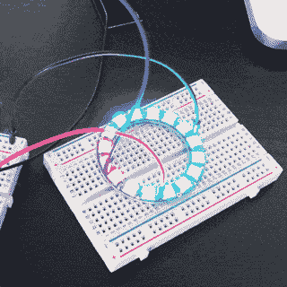
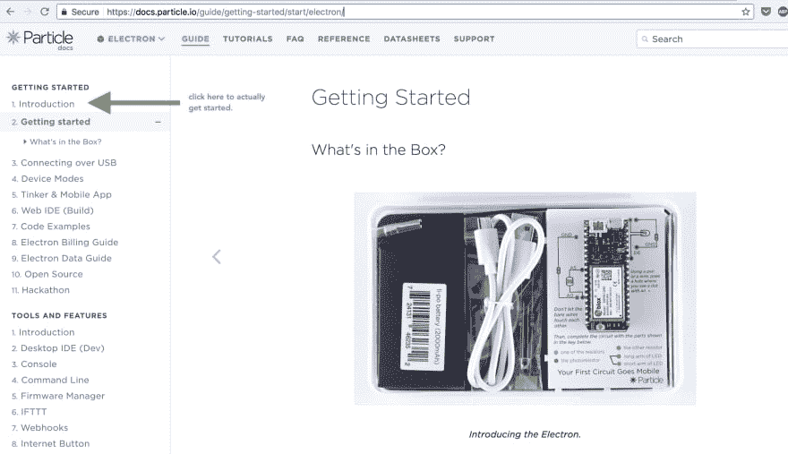
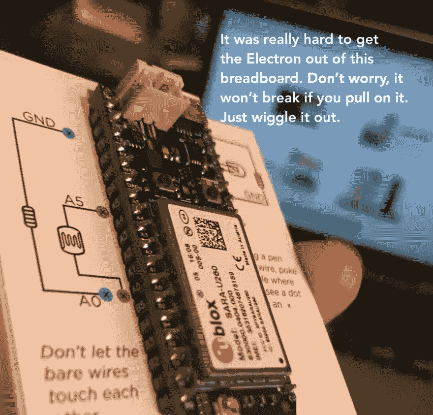
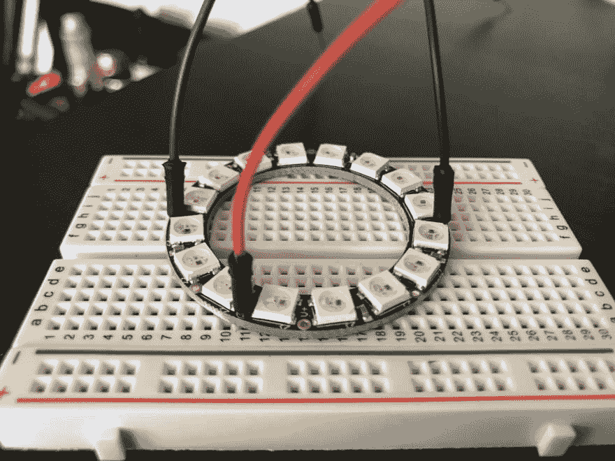
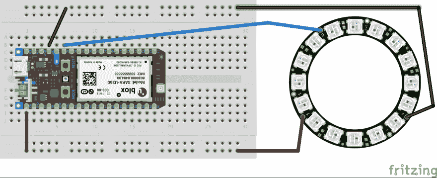
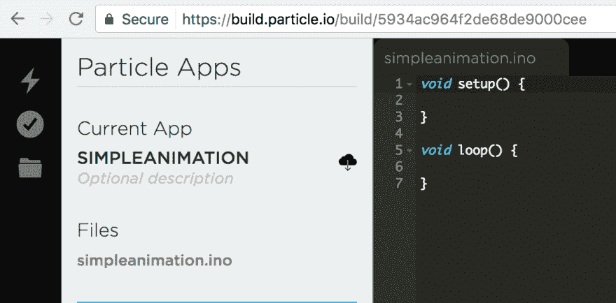
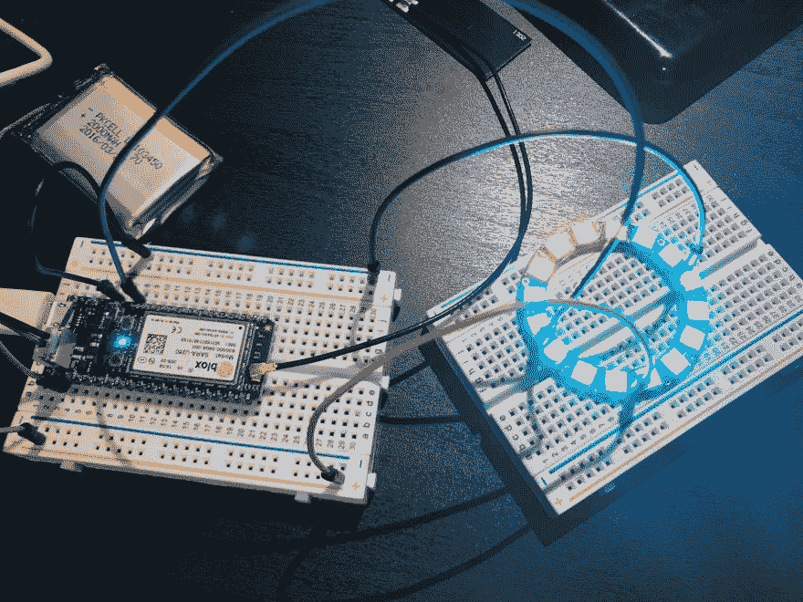

# 连接新像素环和粒子电子的最简单方法

> 原文：<https://dev.to/charlyn/the-easiest-way-to-connect-a-neopixel-ring-to-the-particle-electron>

我一直想玩玩电路，今年的 [Twilio Hackpack](https://hackpack.cc/) 让我想到也许我真的应该开始玩了。

所以，我得到了一个[粒子电子](https://www.particle.io/products/hardware/electron-cellular-dev-kit)——它是一个内置 3G 模块*和*自己的数据计划的微控制器。快看，这真的很棒。

> 你好，内在发明家。
> 再见，睡吧。[@粒子](https://twitter.com/particle)[pic.twitter.com/VarTuqPsqM](https://t.co/VarTuqPsqM)
> 
> — charlyn gonda (@chardane) [May 31, 2017](https://twitter.com/chardane/status/870009536219721728)

然后我想玩一些有趣的东西，所以我买了一个 16 像素的 neo pixel 戒指。有一个[新像素库](https://github.com/technobly/Particle-NeoPixel)，你可以直接使用粒子板，所以我认为这将是*容易*。(剧透:这并不简单，但我学到了很多！也许这个指南会让其他人更容易理解。)

我应该提到的是，我对一般的电路或硬件几乎一无所知。我最大的硬件成就是我曾经让灯泡在*并联电路*中点亮。激动人心。

在安装好电子元件后，我发现没有简单的方法来指导 Neopixel 与电子元件的连接。人们谈到了逻辑电平转换器和升压转换器(这是一回事吗？).因此，本指南诞生了。

# 如果你只懂软件，不知道如何焊接东西，并且喜欢漂亮的灯，那么你来对地方了。

我将向你展示如何设置你的全新电子设备，以及如何将它连接到你的 Neopixel 戒指上，这样你就可以运行一个简单的灯光动画。本指南假设您熟悉命令行，主要面向 Mac OS X 用户。

这就是我们要做的！

[ ](https://res.cloudinary.com/practicaldev/image/fetch/s--OAfrijMT--/c_limit%2Cf_auto%2Cfl_progressive%2Cq_66%2Cw_880/http://chardane.github.io/codeloimg/posts/neopixel-electron/pretty-lights.gif) *好漂亮。*

## 你需要什么

1.  [粒子电子](https://store.particle.io/collections/electron)(带天线和电池的套件)
2.  两个半实验板(电子附带一个，但你需要另一个。)
3.  [跳线](https://www.amazon.com/gp/product/B01EV70C78/ref=as_li_tl?ie=UTF8&camp=1789&creative=9325&creativeASIN=B01EV70C78&linkCode=as2&tag=chardane-20&linkId=9bc81e4b9270d9f96e11971822a915f9)，最少 4 根。我觉得有很多这样的东西在身边很好。
4.  [Adafruit 新像素戒指](https://www.adafruit.com/product/1463)，16 像素。

我拿到了[粒子制造工具包](https://store.particle.io/products/particle-maker-kit)，其中包含另一半试验板和跳线(带有两个公头的电线)。这些是扭结在一起的电线，*不是*粘在一起的彩色电线，你必须把它们分开(这些电线有一个公头和一个母头。idk 他们叫什么。).

## 第一步:去 particle.io/start

选择大的电子图像。你会看到这一页，但你实际上想去的是“简介”页，而不是这本“入门”指南。

[](https://res.cloudinary.com/practicaldev/image/fetch/s--1SeSVgr9--/c_limit%2Cf_auto%2Cfl_progressive%2Cq_auto%2Cw_880/http://chardane.github.io/codeloimg/posts/getting-started-nah.png) 
*Protip:点击介绍链接(上面绿色箭头)*

在“简介”页面中，找到[“设置我的电子设备”](https://setup.particle.io/)链接，然后按照步骤操作。或者你可以点击那个链接。这需要信用卡，所以也准备好。

在某些时候，他们会告诉你将 SIM 卡插入电子设备。要插入 SIM 卡，您必须将电子元件从试验板中拔出。

[](https://res.cloudinary.com/practicaldev/image/fetch/s--XfDagzQu--/c_limit%2Cf_auto%2Cfl_progressive%2Cq_auto%2Cw_880/http://chardane.github.io/codeloimg/posts/electron-sim.png) 
*假装你是亚瑟，这是插在岩石上的剑。*

你还需要连接天线。

[T2】](https://res.cloudinary.com/practicaldev/image/fetch/s--KsW6xjAq--/c_limit%2Cf_auto%2Cfl_progressive%2Cq_auto%2Cw_880/http://chardane.github.io/codeloimg/posts/its-gonna-be-ok-antenna.png)

我有点害怕强行推进这块看起来很精致的金属，但没关系。我希望有人告诉我这些事情。

您可以继续阅读他们的其他指南，这对您更好地了解事物非常有帮助(例如引脚的功能以及如何闪烁 LED)。当你准备好连接你的 Neopixel 到电子的时候回来。

## 第二步:安装粒子 CLI

你将需要它来通过 USB 把你的代码直接刷新到你的设备上。因为您必须为这些数据付费，所以您会希望直接闪存，这样就不会浪费这些数据。你可以遵循[粒子的指南](https://docs.particle.io/guide/tools-and-features/cli/electron/)，或者现在只运行这两个命令。

如果您还没有安装`npm`，请务必安装。

```
$ npm install -g particle-cli
$ particle login 
```

Enter fullscreen mode Exit fullscreen mode

使用您的粒子帐户登录，让我们继续前进！

## 第三步:连接你的 Neopixel！

好吧，这就是重点。我从 Core Electronics 的[使用带有粒子](https://core-electronics.com.au/tutorials/using-neopixels-with-particle.html)的 Neopixel 中学到了很多，但在该指南中，他们描述了如何使用光子连接到 neo pixel 环*套件*。他们描述了如何在试验板上使用逻辑电平转换器，我稍后会介绍，但现在我真的只想看到我的第一个像素点亮。他们确实有一个很酷的部分，可以放大新像素，以及他们如何产生不同的颜色，所以一定要去看看。

我不知道如何焊接，我发现你可以简单地使用试验板连接到 Neopixel 引脚！ðŸ˜

[](https://res.cloudinary.com/practicaldev/image/fetch/s--vtYqffpA--/c_limit%2Cf_auto%2Cfl_progressive%2Cq_auto%2Cw_880/http://chardane.github.io/codeloimg/posts/breadboard-yay.JPG) 
*耶！我最终会焊接这些，但多么伟大的想法。*

也有一些电线颜色惯例，你可以遵循，以建立一个良好的习惯。

1.  红色->力量
2.  黑色/蓝色->地面
3.  任何其他颜色->数据

这是线路图！我在我的朋友阿比纳夫(又名双关大师)的帮助下把这个图拼在一起。

[](https://res.cloudinary.com/practicaldev/image/fetch/s--SrNSRM-d--/c_limit%2Cf_auto%2Cfl_progressive%2Cq_auto%2Cw_880/http://chardane.github.io/codeloimg/posts/neopixel-and-electron.jpg) 
*我一直在找这张藏宝图*

1.  粒子`GND`到新像素`Power Signal Ground`
2.  粒子`D6`到新像素`Data Input`
3.  粒子`VIN`到新像素`Power 5V DC`

当用电子电源进行接线时，*总是先接地(GND)*。连接时，Pun Master 推荐此顺序:

1.  地面(GND)
2.  数据(D6)
3.  功率(VIN)

断开时遵循相反的顺序。

现在，我们应该注意到这个设置有几个注意事项:

1.  Neopixels 只有在您将电源连接到 USB 时才会亮起。
2.  在这种配置下，您可能不应该将所有像素都设置为全白亮度。

由于我们将通过 USB 直接刷新我们的代码，这将让我们立刻看到一些东西亮了起来。这里有一张这种设置的照片:

[](https://res.cloudinary.com/practicaldev/image/fetch/s--m16SYh-g--/c_limit%2Cf_auto%2Cfl_progressive%2Cq_auto%2Cw_880/http://chardane.github.io/codeloimg/posts/setup.JPG) 
*我花了很多时间搜索和询问。希望你能快点明白。*

## 第四步:代码！

现在我们回到了熟悉的领域。确保您已经从步骤 2 安装了 Particle CLI。

我们可以使用[粒子开发](https://www.particle.io/products/development-tools/particle-desktop-ide)(他们的桌面 IDE)或者直接去[构建网络 IDE](https://build.particle.io/build/new) 。我们将为这个 tut 完成构建 Web IDE 的步骤。

### 构建(Web IDE)

转到[构建 Web IDE](https://build.particle.io/build/new) 创建一个新的应用程序。我之前提到过有一个 Neopixel 库是移植过来的，所以让我们把它添加到项目中。

命名您的新应用程序，并单击“保存”按钮。您必须保存才能添加库。这里我们将其命名为“简单动画”

*保存前* | *保存后*|
|[|](https://res.cloudinary.com/practicaldev/image/fetch/s--MXr7bel3--/c_limit%2Cf_auto%2Cfl_progressive%2Cq_auto%2Cw_880/http://chardane.github.io/codeloimg/posts/neopixel-electron/step1.png)|[||](https://res.cloudinary.com/practicaldev/image/fetch/s--RCUJeUwM--/c_limit%2Cf_auto%2Cfl_progressive%2Cq_auto%2Cw_880/http://chardane.github.io/codeloimg/posts/neopixel-electron/step1half.png)|
|*保存前* | *保存后* | |

找到“库”图标并点击它。在搜索框中搜索`neopixel`。点击“Neopixel”库，点击“包含在项目中”选择“simple animation”app，点击“确认”。*唷。*

请注意，它在顶部添加了这一行:

```
// This #include statement was automatically added by the Particle IDE.
#include <neopixel.h> 
```

Enter fullscreen mode Exit fullscreen mode

这段代码点亮了戒指上的第一个(第 0 个)像素。它还把亮度调得很低，这样我们就不会爆炸。(开玩笑，我们不会爆炸的。希望如此。)

```
// This #include statement was automatically added by the Particle IDE.
#include <neopixel.h> 
// IMPORTANT: Set pixel COUNT, PIN and TYPE
#define PIXEL_COUNT 16
#define PIXEL_PIN D6
#define PIXEL_TYPE WS2812 
Adafruit_NeoPixel strip = Adafruit_NeoPixel(PIXEL_COUNT, PIXEL_PIN, PIXEL_TYPE);

void setup() {
  strip.begin();
  strip.setBrightness(70);
  strip.show();
}

void loop() {
  // Light up the first pixel
  strip.setPixelColor(0, 50,50,50);
  strip.show();
  delay(500);
} 
```

Enter fullscreen mode Exit fullscreen mode

再次点击“保存”按钮。然后，单击“验证”按钮编译应用程序。如果一切顺利，我们应该会看到“代码验证！伟大的作品。”在底部。

现在，点击“代码”按钮，点击你的应用程序名称旁边的图标“编译并下载固件二进制文件”。

您的下载文件夹应该包含一个名为`firmware.bin`的文件。通过 USB 连接您的电子+ Neopixel，进入您终端中的下载文件夹并运行:

```
$ particle flash --serial firmware.bin 
```

Enter fullscreen mode Exit fullscreen mode

按住电子设备上的`MODE`按钮，直到它闪烁蓝色，然后按回车键闪烁。

如果一切顺利，您应该会看到一个像素亮起！呜！🎉

## 第五步:让一些灯光动起来！

现在你知道如何打开一盏灯，最后一步是做我们简单的动画！用以下代码替换您的代码:

```
// This #include statement was automatically added by the Particle IDE.
#include <neopixel.h> 
// IMPORTANT: Set pixel COUNT, PIN and TYPE
#define PIXEL_COUNT 16
#define PIXEL_PIN D6
#define PIXEL_TYPE WS2812 
#define PEACH 200,50,5
#define CYAN 10,150,70
#define PURPLE 180,3,180
#define BLUE 5,5,190
#define WHITE 150,150,150
#define GREEN 10,180,10 
Adafruit_NeoPixel strip = Adafruit_NeoPixel(PIXEL_COUNT, PIXEL_PIN, PIXEL_TYPE);

int waitTime = 25;
int i;
void spin(int R, int G, int B);

void setup() {
  strip.begin();
  strip.setBrightness(70);
  strip.show();
}

void loop() {
  // spin forever rotating through colors!
  spin (PEACH);
  spin (CYAN);
  spin (PURPLE);
  spin (BLUE);
  spin (WHITE);
  spin (GREEN);
}

void spin(int R, int G, int B) {
    for(i=0; i < PIXEL_COUNT; i++) {
        strip.setPixelColor(i, R,G,B);
        strip.show();
        delay(waitTime);
    }
} 
```

Enter fullscreen mode Exit fullscreen mode

然后下载固件，像上面那样刷新你的电子设备。就是这样！您刚刚激活了您的新像素！

[](https://res.cloudinary.com/practicaldev/image/fetch/s--KuWeRUhE--/c_limit%2Cf_auto%2Cfl_progressive%2Cq_auto%2Cw_880/http://chardane.github.io/codeloimg/posts/too-much-fun.jpg) 
*太好玩了。*

请记住，这种设置只适用于原型，如果你想把亮度一直调高，你应该研究如何正确地做到这一点。如果我很快到达那里，我会写另一篇关于它的指南。

## 接下来呢？

嗯，有很多东西要学！这里有几个链接供你阅读:

1.  [使用 Neopixels 和来自 Core Electronics](https://core-electronics.com.au/tutorials/using-neopixels-with-particle.html) 的粒子。他们似乎有很多关于电子/光子的指南。
2.  [Neopixels berguide](https://learn.adafruit.com/adafruit-neopixel-uberguide/overview)-您需要了解的关于 neo pixels 的一切！

谢谢，我希望这能帮助像我这样刚开始学习电路的人。ðŸ'ŒðŸ

*最初发布在我的博客中， [Codelove](http://chardane.github.io/codeloimg/) 。分享给一个可能困在软件人身体里的硬件人。你可以在推特上找到我。*

*特别感谢 Abhinav S 和 [@_eeclaire](https://twitter.com/_eeclaire) 帮助我理解，以及 [@cassidoo](http://cassidoo.co/) 给我展示 Twilio Hackpack！*安